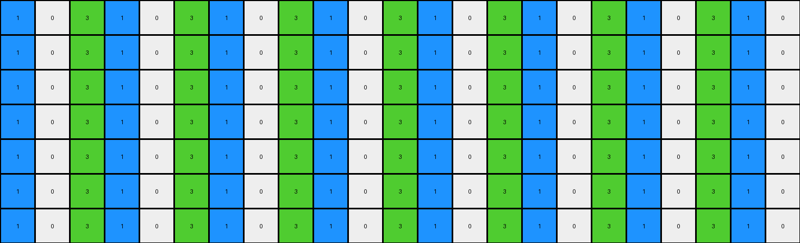

# 0a938d79 • 012 • refine_coder

---

Previous Code:
```python
"""
The input grid is transformed into the output grid by replacing, in each row, groups of three horizontal cells with the sequence '1 0 3' (blue, white, green), repeating this pattern across the entire row.
"""

import numpy as np

def transform(input_grid):
    # Initialize output_grid as a copy of the input_grid
    output_grid = np.copy(input_grid)
    rows, cols = output_grid.shape

    # Iterate through each row
    for i in range(rows):
        # Apply the sequence '1 0 3' repeatedly across the row
        for j in range(0, cols, 3):
            output_grid[i, j:min(j+3, cols)] = [1, 0, 3][:min(3, cols-j)] # Handle edge case, if any

    return output_grid
```

Train Set Results:

## Example 1:**

Input:
```
0 0 0 0 0 2 0 0 0 0 0 0 0 0 0 0 0 0 0 0 0 0 0 0 0
0 0 0 0 0 0 0 0 0 0 0 0 0 0 0 0 0 0 0 0 0 0 0 0 0
0 0 0 0 0 0 0 0 0 0 0 0 0 0 0 0 0 0 0 0 0 0 0 0 0
0 0 0 0 0 0 0 0 0 0 0 0 0 0 0 0 0 0 0 0 0 0 0 0 0
0 0 0 0 0 0 0 0 0 0 0 0 0 0 0 0 0 0 0 0 0 0 0 0 0
0 0 0 0 0 0 0 0 0 0 0 0 0 0 0 0 0 0 0 0 0 0 0 0 0
0 0 0 0 0 0 0 0 0 0 0 0 0 0 0 0 0 0 0 0 0 0 0 0 0
0 0 0 0 0 0 0 0 0 0 0 0 0 0 0 0 0 0 0 0 0 0 0 0 0
0 0 0 0 0 0 0 0 0 0 0 0 0 0 0 0 0 0 0 0 0 0 0 0 0
0 0 0 0 0 0 0 8 0 0 0 0 0 0 0 0 0 0 0 0 0 0 0 0 0
```
Expected Output:
```
0 0 0 0 0 2 0 8 0 2 0 8 0 2 0 8 0 2 0 8 0 2 0 8 0
0 0 0 0 0 2 0 8 0 2 0 8 0 2 0 8 0 2 0 8 0 2 0 8 0
0 0 0 0 0 2 0 8 0 2 0 8 0 2 0 8 0 2 0 8 0 2 0 8 0
0 0 0 0 0 2 0 8 0 2 0 8 0 2 0 8 0 2 0 8 0 2 0 8 0
0 0 0 0 0 2 0 8 0 2 0 8 0 2 0 8 0 2 0 8 0 2 0 8 0
0 0 0 0 0 2 0 8 0 2 0 8 0 2 0 8 0 2 0 8 0 2 0 8 0
0 0 0 0 0 2 0 8 0 2 0 8 0 2 0 8 0 2 0 8 0 2 0 8 0
0 0 0 0 0 2 0 8 0 2 0 8 0 2 0 8 0 2 0 8 0 2 0 8 0
0 0 0 0 0 2 0 8 0 2 0 8 0 2 0 8 0 2 0 8 0 2 0 8 0
0 0 0 0 0 2 0 8 0 2 0 8 0 2 0 8 0 2 0 8 0 2 0 8 0
```
Transformed Output:
```
1 0 3 1 0 3 1 0 3 1 0 3 1 0 3 1 0 3 1 0 3 1 0 3 1
1 0 3 1 0 3 1 0 3 1 0 3 1 0 3 1 0 3 1 0 3 1 0 3 1
1 0 3 1 0 3 1 0 3 1 0 3 1 0 3 1 0 3 1 0 3 1 0 3 1
1 0 3 1 0 3 1 0 3 1 0 3 1 0 3 1 0 3 1 0 3 1 0 3 1
1 0 3 1 0 3 1 0 3 1 0 3 1 0 3 1 0 3 1 0 3 1 0 3 1
1 0 3 1 0 3 1 0 3 1 0 3 1 0 3 1 0 3 1 0 3 1 0 3 1
1 0 3 1 0 3 1 0 3 1 0 3 1 0 3 1 0 3 1 0 3 1 0 3 1
1 0 3 1 0 3 1 0 3 1 0 3 1 0 3 1 0 3 1 0 3 1 0 3 1
1 0 3 1 0 3 1 0 3 1 0 3 1 0 3 1 0 3 1 0 3 1 0 3 1
1 0 3 1 0 3 1 0 3 1 0 3 1 0 3 1 0 3 1 0 3 1 0 3 1
```

match: False
pixels_off: 200
size_correct: True
color_palette_correct: False
correct_pixel_counts: False

## Example 2:**

Input:
```
0 0 0 0 0 1 0 0 0 0 0 0 0 0 0 0 0 0 0 0 0 0 0
0 0 0 0 0 0 0 0 0 0 0 0 0 0 0 0 0 0 0 0 0 0 0
0 0 0 0 0 0 0 0 0 0 0 0 0 0 0 0 0 0 0 0 0 0 0
0 0 0 0 0 0 0 0 0 0 0 0 0 0 0 0 0 0 0 0 0 0 0
0 0 0 0 0 0 0 0 0 0 0 0 0 0 0 0 0 0 0 0 0 0 0
0 0 0 0 0 0 0 0 0 0 0 0 0 0 0 0 0 0 0 0 0 0 0
0 0 0 0 0 0 0 0 3 0 0 0 0 0 0 0 0 0 0 0 0 0 0
```
Expected Output:
```
0 0 0 0 0 1 0 0 3 0 0 1 0 0 3 0 0 1 0 0 3 0 0
0 0 0 0 0 1 0 0 3 0 0 1 0 0 3 0 0 1 0 0 3 0 0
0 0 0 0 0 1 0 0 3 0 0 1 0 0 3 0 0 1 0 0 3 0 0
0 0 0 0 0 1 0 0 3 0 0 1 0 0 3 0 0 1 0 0 3 0 0
0 0 0 0 0 1 0 0 3 0 0 1 0 0 3 0 0 1 0 0 3 0 0
0 0 0 0 0 1 0 0 3 0 0 1 0 0 3 0 0 1 0 0 3 0 0
0 0 0 0 0 1 0 0 3 0 0 1 0 0 3 0 0 1 0 0 3 0 0
```
Transformed Output:
```
1 0 3 1 0 3 1 0 3 1 0 3 1 0 3 1 0 3 1 0 3 1 0
1 0 3 1 0 3 1 0 3 1 0 3 1 0 3 1 0 3 1 0 3 1 0
1 0 3 1 0 3 1 0 3 1 0 3 1 0 3 1 0 3 1 0 3 1 0
1 0 3 1 0 3 1 0 3 1 0 3 1 0 3 1 0 3 1 0 3 1 0
1 0 3 1 0 3 1 0 3 1 0 3 1 0 3 1 0 3 1 0 3 1 0
1 0 3 1 0 3 1 0 3 1 0 3 1 0 3 1 0 3 1 0 3 1 0
1 0 3 1 0 3 1 0 3 1 0 3 1 0 3 1 0 3 1 0 3 1 0
```

match: False
pixels_off: 84
size_correct: True
color_palette_correct: True
correct_pixel_counts: False

## Example 3:**

Input:
```
0 0 0 0 0 0 0 0 0
0 0 0 0 0 0 0 0 0
0 0 0 0 0 0 0 0 0
0 0 0 0 0 0 0 0 0
0 0 0 0 0 0 0 0 0
2 0 0 0 0 0 0 0 0
0 0 0 0 0 0 0 0 0
0 0 0 0 0 0 0 0 3
0 0 0 0 0 0 0 0 0
0 0 0 0 0 0 0 0 0
0 0 0 0 0 0 0 0 0
0 0 0 0 0 0 0 0 0
0 0 0 0 0 0 0 0 0
0 0 0 0 0 0 0 0 0
0 0 0 0 0 0 0 0 0
0 0 0 0 0 0 0 0 0
0 0 0 0 0 0 0 0 0
0 0 0 0 0 0 0 0 0
0 0 0 0 0 0 0 0 0
0 0 0 0 0 0 0 0 0
0 0 0 0 0 0 0 0 0
0 0 0 0 0 0 0 0 0
```
Expected Output:
```
0 0 0 0 0 0 0 0 0
0 0 0 0 0 0 0 0 0
0 0 0 0 0 0 0 0 0
0 0 0 0 0 0 0 0 0
0 0 0 0 0 0 0 0 0
2 2 2 2 2 2 2 2 2
0 0 0 0 0 0 0 0 0
3 3 3 3 3 3 3 3 3
0 0 0 0 0 0 0 0 0
2 2 2 2 2 2 2 2 2
0 0 0 0 0 0 0 0 0
3 3 3 3 3 3 3 3 3
0 0 0 0 0 0 0 0 0
2 2 2 2 2 2 2 2 2
0 0 0 0 0 0 0 0 0
3 3 3 3 3 3 3 3 3
0 0 0 0 0 0 0 0 0
2 2 2 2 2 2 2 2 2
0 0 0 0 0 0 0 0 0
3 3 3 3 3 3 3 3 3
0 0 0 0 0 0 0 0 0
2 2 2 2 2 2 2 2 2
```
Transformed Output:
```
1 0 3 1 0 3 1 0 3
1 0 3 1 0 3 1 0 3
1 0 3 1 0 3 1 0 3
1 0 3 1 0 3 1 0 3
1 0 3 1 0 3 1 0 3
1 0 3 1 0 3 1 0 3
1 0 3 1 0 3 1 0 3
1 0 3 1 0 3 1 0 3
1 0 3 1 0 3 1 0 3
1 0 3 1 0 3 1 0 3
1 0 3 1 0 3 1 0 3
1 0 3 1 0 3 1 0 3
1 0 3 1 0 3 1 0 3
1 0 3 1 0 3 1 0 3
1 0 3 1 0 3 1 0 3
1 0 3 1 0 3 1 0 3
1 0 3 1 0 3 1 0 3
1 0 3 1 0 3 1 0 3
1 0 3 1 0 3 1 0 3
1 0 3 1 0 3 1 0 3
1 0 3 1 0 3 1 0 3
1 0 3 1 0 3 1 0 3
```

match: False
pixels_off: 147
size_correct: True
color_palette_correct: False
correct_pixel_counts: False

## Example 4:**

Input:
```
0 0 0 0 0 0 0 0
0 0 0 0 0 0 0 0
0 0 0 0 0 0 0 0
0 0 0 0 0 0 0 0
0 0 0 0 0 0 0 0
0 0 0 0 0 0 0 0
0 0 0 0 0 0 0 0
4 0 0 0 0 0 0 0
0 0 0 0 0 0 0 0
0 0 0 0 0 0 0 0
0 0 0 0 0 0 0 0
1 0 0 0 0 0 0 0
0 0 0 0 0 0 0 0
0 0 0 0 0 0 0 0
0 0 0 0 0 0 0 0
0 0 0 0 0 0 0 0
0 0 0 0 0 0 0 0
0 0 0 0 0 0 0 0
0 0 0 0 0 0 0 0
0 0 0 0 0 0 0 0
0 0 0 0 0 0 0 0
0 0 0 0 0 0 0 0
0 0 0 0 0 0 0 0
0 0 0 0 0 0 0 0
```
Expected Output:
```
0 0 0 0 0 0 0 0
0 0 0 0 0 0 0 0
0 0 0 0 0 0 0 0
0 0 0 0 0 0 0 0
0 0 0 0 0 0 0 0
0 0 0 0 0 0 0 0
0 0 0 0 0 0 0 0
4 4 4 4 4 4 4 4
0 0 0 0 0 0 0 0
0 0 0 0 0 0 0 0
0 0 0 0 0 0 0 0
1 1 1 1 1 1 1 1
0 0 0 0 0 0 0 0
0 0 0 0 0 0 0 0
0 0 0 0 0 0 0 0
4 4 4 4 4 4 4 4
0 0 0 0 0 0 0 0
0 0 0 0 0 0 0 0
0 0 0 0 0 0 0 0
1 1 1 1 1 1 1 1
0 0 0 0 0 0 0 0
0 0 0 0 0 0 0 0
0 0 0 0 0 0 0 0
4 4 4 4 4 4 4 4
```
Transformed Output:
```
1 0 3 1 0 3 1 0
1 0 3 1 0 3 1 0
1 0 3 1 0 3 1 0
1 0 3 1 0 3 1 0
1 0 3 1 0 3 1 0
1 0 3 1 0 3 1 0
1 0 3 1 0 3 1 0
1 0 3 1 0 3 1 0
1 0 3 1 0 3 1 0
1 0 3 1 0 3 1 0
1 0 3 1 0 3 1 0
1 0 3 1 0 3 1 0
1 0 3 1 0 3 1 0
1 0 3 1 0 3 1 0
1 0 3 1 0 3 1 0
1 0 3 1 0 3 1 0
1 0 3 1 0 3 1 0
1 0 3 1 0 3 1 0
1 0 3 1 0 3 1 0
1 0 3 1 0 3 1 0
1 0 3 1 0 3 1 0
1 0 3 1 0 3 1 0
1 0 3 1 0 3 1 0
1 0 3 1 0 3 1 0
```

match: False
pixels_off: 129
size_correct: True
color_palette_correct: False
correct_pixel_counts: False
Okay, let's analyze the results and update the natural language program.

**General Assessment:**

The initial natural language program and the corresponding code were incorrect. The core idea of replacing sequences with "1 0 3" (blue, white, green) is completely off-base. The expected outputs show a different pattern: single, isolated, non-zero pixels in the input are triggering the entire row to be filled with that non-zero pixel's color. The provided code does not capture this behavior at all. The strategy needs to shift from finding sequences to identifying single colored pixels and propagating their color across the respective rows.

**Metrics and Observations:**

Here's a breakdown of each example, focusing on the observed discrepancies:

*   **Example 1:**
    *   Input has isolated pixels of color 2 (red) and 8 (azure).
    *   Expected Output shows rows with those pixels filled entirely with the respective colors.
    *   Transformed output is filled with repeating "1 0 3" sequence.
    *   The "1 0 3" pattern is incorrect. The actual pattern is to copy each distinct colored object across the row it occurs.

*   **Example 2:**
    *   Input contains isolated pixels of color 1 (blue) and 3 (green).
    *   Expected output has rows with those pixels filled with the corresponding color.
    *   Transformed Output again shows the wrong "1 0 3" sequence.

*   **Example 3:**
    *   Input has isolated pixels of color 2 (red) and 3 (green).
    *   Expected Output shows rows with a *single* color 2 or 3, repeating that color across the *entire* row.
    * The transform output incorrectly uses "1, 0, 3".
    * Many rows are not filled with the expected color.

*   **Example 4:**
    * Input has colors 4(yellow) and 1(blue)
    * Output has rows filled with those pixels.
    * Some rows contain multiple distinct color - these row are all filled with single object in the expected output.

**YAML Block (Facts):**

```yaml
objects:
  - description: Single pixels of a specific color.
    properties:
      color: Value from 0 to 9.
      location: (row, column) coordinates.
      behavior: "Triggers row-filling."

actions:
  - name: FillRow
    description: Replaces all pixels in a row with the color of a triggering pixel.
    trigger: "Presence of a single isolated colored pixel in a row."
    parameters:
      row: The row index.
      color: The color of the triggering pixel.

rules:
    - If a row contains only 0s and a single non-zero, replace all 0 with the non-zero.
    - If a row contains multiple non-zero colors, and rows in the other example outputs that had the *same* non-zero, single-colored pixels are filled with the non-zero color, then fill the row with the non-zero color.

```

**Natural Language Program:**

1.  Iterate through each row of the input grid.
2.  For each row, check for the presence of non-zero pixels.
3.  If a row contains *only* zero and *one* non-zero, replace all the cells in that row with that non-zero pixel.
4. If a row contains *multiple* distinct non-zero pixels and we also see other examples containing the same non-zero pixel, we fill those rows with that non-zero.

Revised natural language program (more concise):

Examine each row of the input grid. If a row contains a single, isolated non-zero colored pixel (surrounded by zeros), fill the entire row with that pixel's color. If a row contains multiple different non-zero pixels, fill that row with the color if another example contains only that color and zeros.

**INSTRUCTIONS**

- generate a Python module to represent the natural language program 
- follow the template below
- all common math and science libraries are available
- create docstring only at top - but comment the workflow in the function
- use helper functions for common operations like finding objects, counting,
  measuring, moving, etc. 

remember - we are working iteratively - so this code will inform your future
self as we converge on the solution

*template:*

```python
"""
{{ natural language description of the transformation rule }}
"""

{{ imports }}

def transform(input_grid):
    # initialize output_grid

    # change output pixels 

    return output_grid

```
