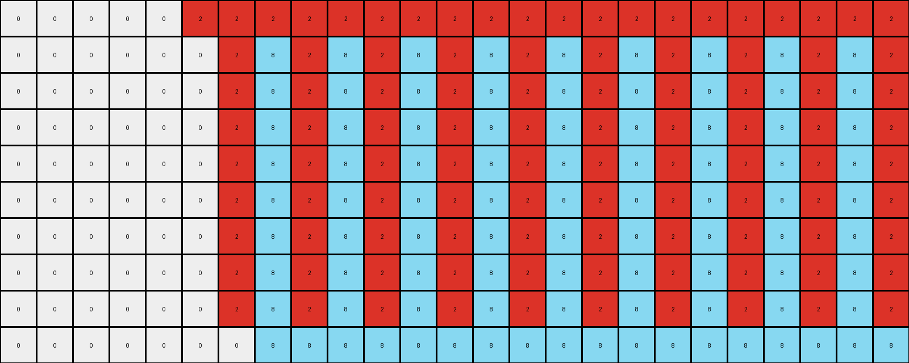
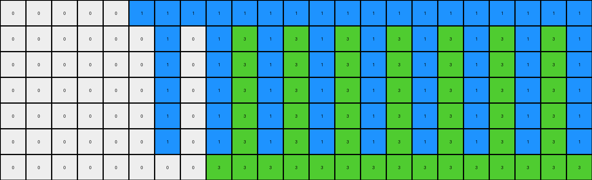
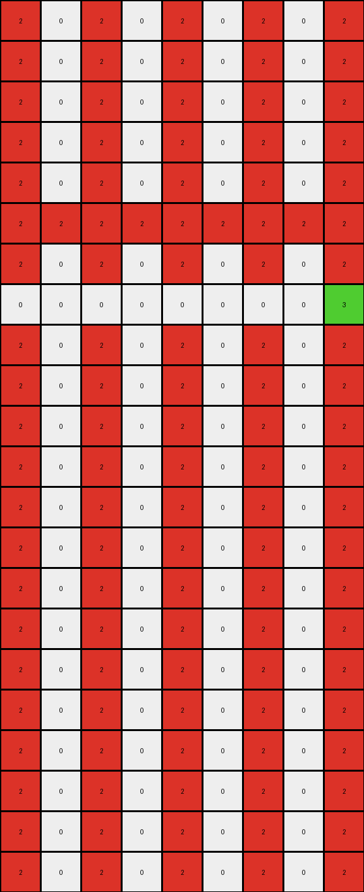
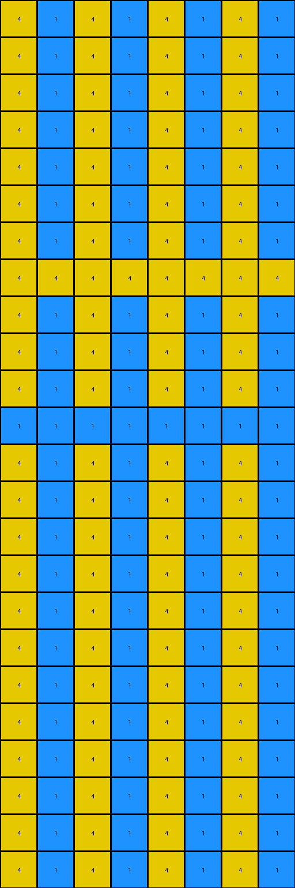

# 0a938d79 • 015 • refine_dreamer

---

Previous Code:
```python
"""
1. Identify Seed Rows: Iterate through each row of the input grid. A row is considered a "seed row" if it contains exactly one non-zero (colored) pixel.

2. Store Seed Information: For each seed row, store the row index, the color of the single pixel, and the column index of that pixel.

3. Construct Output: Create a new output grid of the same dimensions as the input grid. Fill the output grid as follows:
    *   Iterate through the rows of the output grid.
    *   Maintain relative column positions of colored pixels from seed rows.
        *   For each seed row, in the output, from the stored seed color's column position to the end of the row, fill the cells with the seed row's color.
        *   Fill the regions between colored pixels by repeating the sequence of colored pixels in the seed rows.

4. If there are rows that are not "filled" after processing all seed rows (like blank rows), maintain those as zero.
"""

import numpy as np

def find_seed_rows(grid):
    """
    Identifies rows with exactly one non-zero pixel and returns their information.
    """
    seed_rows = []
    for i, row in enumerate(grid):
        non_zero_indices = np.nonzero(row)[0]
        if len(non_zero_indices) == 1:
            seed_rows.append({
                "row_index": i,
                "color": row[non_zero_indices[0]],
                "column_index": non_zero_indices[0]
            })
    return seed_rows

def transform(input_grid):
    """
    Transforms the input grid based on seed rows (rows with a single colored pixel).
    """
    input_grid = np.array(input_grid)  # Ensure input is a NumPy array
    output_grid = np.zeros_like(input_grid)
    seed_rows = find_seed_rows(input_grid)

    # Construct output based on seed row information
    for seed_info in seed_rows:
        row_index = seed_info["row_index"]
        color = seed_info["color"]
        column_index = seed_info["column_index"]
        output_grid[row_index, column_index:] = color

    # fill the regions between the colored pixels
    if (len(seed_rows) > 1):
        num_rows, num_cols = output_grid.shape

        # create the alternating pattern of seed colors
        seed_colors = [sr['color'] for sr in seed_rows]
        seed_cols = [sr['column_index'] for sr in seed_rows]

        for r_idx in range(num_rows):
            if any(output_grid[r_idx]): # if any color in the row
                continue

            # cycle through the color/column pairs from seed_rows
            c_idx = 0
            while c_idx < num_cols:
                for sr_idx in range(len(seed_rows)):
                    start = seed_cols[sr_idx]
                    if c_idx >= start and c_idx < num_cols:
                      output_grid[r_idx, c_idx] = seed_colors[sr_idx]
                    c_idx += 1


    return output_grid
```

Train Set Results:

## Example 1:**

Input:
```
0 0 0 0 0 2 0 0 0 0 0 0 0 0 0 0 0 0 0 0 0 0 0 0 0
0 0 0 0 0 0 0 0 0 0 0 0 0 0 0 0 0 0 0 0 0 0 0 0 0
0 0 0 0 0 0 0 0 0 0 0 0 0 0 0 0 0 0 0 0 0 0 0 0 0
0 0 0 0 0 0 0 0 0 0 0 0 0 0 0 0 0 0 0 0 0 0 0 0 0
0 0 0 0 0 0 0 0 0 0 0 0 0 0 0 0 0 0 0 0 0 0 0 0 0
0 0 0 0 0 0 0 0 0 0 0 0 0 0 0 0 0 0 0 0 0 0 0 0 0
0 0 0 0 0 0 0 0 0 0 0 0 0 0 0 0 0 0 0 0 0 0 0 0 0
0 0 0 0 0 0 0 0 0 0 0 0 0 0 0 0 0 0 0 0 0 0 0 0 0
0 0 0 0 0 0 0 0 0 0 0 0 0 0 0 0 0 0 0 0 0 0 0 0 0
0 0 0 0 0 0 0 8 0 0 0 0 0 0 0 0 0 0 0 0 0 0 0 0 0
```
Expected Output:
```
0 0 0 0 0 2 0 8 0 2 0 8 0 2 0 8 0 2 0 8 0 2 0 8 0
0 0 0 0 0 2 0 8 0 2 0 8 0 2 0 8 0 2 0 8 0 2 0 8 0
0 0 0 0 0 2 0 8 0 2 0 8 0 2 0 8 0 2 0 8 0 2 0 8 0
0 0 0 0 0 2 0 8 0 2 0 8 0 2 0 8 0 2 0 8 0 2 0 8 0
0 0 0 0 0 2 0 8 0 2 0 8 0 2 0 8 0 2 0 8 0 2 0 8 0
0 0 0 0 0 2 0 8 0 2 0 8 0 2 0 8 0 2 0 8 0 2 0 8 0
0 0 0 0 0 2 0 8 0 2 0 8 0 2 0 8 0 2 0 8 0 2 0 8 0
0 0 0 0 0 2 0 8 0 2 0 8 0 2 0 8 0 2 0 8 0 2 0 8 0
0 0 0 0 0 2 0 8 0 2 0 8 0 2 0 8 0 2 0 8 0 2 0 8 0
0 0 0 0 0 2 0 8 0 2 0 8 0 2 0 8 0 2 0 8 0 2 0 8 0
```
Transformed Output:
```
0 0 0 0 0 2 2 2 2 2 2 2 2 2 2 2 2 2 2 2 2 2 2 2 2
0 0 0 0 0 0 2 8 2 8 2 8 2 8 2 8 2 8 2 8 2 8 2 8 2
0 0 0 0 0 0 2 8 2 8 2 8 2 8 2 8 2 8 2 8 2 8 2 8 2
0 0 0 0 0 0 2 8 2 8 2 8 2 8 2 8 2 8 2 8 2 8 2 8 2
0 0 0 0 0 0 2 8 2 8 2 8 2 8 2 8 2 8 2 8 2 8 2 8 2
0 0 0 0 0 0 2 8 2 8 2 8 2 8 2 8 2 8 2 8 2 8 2 8 2
0 0 0 0 0 0 2 8 2 8 2 8 2 8 2 8 2 8 2 8 2 8 2 8 2
0 0 0 0 0 0 2 8 2 8 2 8 2 8 2 8 2 8 2 8 2 8 2 8 2
0 0 0 0 0 0 2 8 2 8 2 8 2 8 2 8 2 8 2 8 2 8 2 8 2
0 0 0 0 0 0 0 8 8 8 8 8 8 8 8 8 8 8 8 8 8 8 8 8 8
```

match: False
pixels_off: 149
size_correct: True
color_palette_correct: True
correct_pixel_counts: False

## Example 2:**

Input:
```
0 0 0 0 0 1 0 0 0 0 0 0 0 0 0 0 0 0 0 0 0 0 0
0 0 0 0 0 0 0 0 0 0 0 0 0 0 0 0 0 0 0 0 0 0 0
0 0 0 0 0 0 0 0 0 0 0 0 0 0 0 0 0 0 0 0 0 0 0
0 0 0 0 0 0 0 0 0 0 0 0 0 0 0 0 0 0 0 0 0 0 0
0 0 0 0 0 0 0 0 0 0 0 0 0 0 0 0 0 0 0 0 0 0 0
0 0 0 0 0 0 0 0 0 0 0 0 0 0 0 0 0 0 0 0 0 0 0
0 0 0 0 0 0 0 0 3 0 0 0 0 0 0 0 0 0 0 0 0 0 0
```
Expected Output:
```
0 0 0 0 0 1 0 0 3 0 0 1 0 0 3 0 0 1 0 0 3 0 0
0 0 0 0 0 1 0 0 3 0 0 1 0 0 3 0 0 1 0 0 3 0 0
0 0 0 0 0 1 0 0 3 0 0 1 0 0 3 0 0 1 0 0 3 0 0
0 0 0 0 0 1 0 0 3 0 0 1 0 0 3 0 0 1 0 0 3 0 0
0 0 0 0 0 1 0 0 3 0 0 1 0 0 3 0 0 1 0 0 3 0 0
0 0 0 0 0 1 0 0 3 0 0 1 0 0 3 0 0 1 0 0 3 0 0
0 0 0 0 0 1 0 0 3 0 0 1 0 0 3 0 0 1 0 0 3 0 0
```
Transformed Output:
```
0 0 0 0 0 1 1 1 1 1 1 1 1 1 1 1 1 1 1 1 1 1 1
0 0 0 0 0 0 1 0 1 3 1 3 1 3 1 3 1 3 1 3 1 3 1
0 0 0 0 0 0 1 0 1 3 1 3 1 3 1 3 1 3 1 3 1 3 1
0 0 0 0 0 0 1 0 1 3 1 3 1 3 1 3 1 3 1 3 1 3 1
0 0 0 0 0 0 1 0 1 3 1 3 1 3 1 3 1 3 1 3 1 3 1
0 0 0 0 0 0 1 0 1 3 1 3 1 3 1 3 1 3 1 3 1 3 1
0 0 0 0 0 0 0 0 3 3 3 3 3 3 3 3 3 3 3 3 3 3 3
```

match: False
pixels_off: 113
size_correct: True
color_palette_correct: True
correct_pixel_counts: False

## Example 3:**

Input:
```
0 0 0 0 0 0 0 0 0
0 0 0 0 0 0 0 0 0
0 0 0 0 0 0 0 0 0
0 0 0 0 0 0 0 0 0
0 0 0 0 0 0 0 0 0
2 0 0 0 0 0 0 0 0
0 0 0 0 0 0 0 0 0
0 0 0 0 0 0 0 0 3
0 0 0 0 0 0 0 0 0
0 0 0 0 0 0 0 0 0
0 0 0 0 0 0 0 0 0
0 0 0 0 0 0 0 0 0
0 0 0 0 0 0 0 0 0
0 0 0 0 0 0 0 0 0
0 0 0 0 0 0 0 0 0
0 0 0 0 0 0 0 0 0
0 0 0 0 0 0 0 0 0
0 0 0 0 0 0 0 0 0
0 0 0 0 0 0 0 0 0
0 0 0 0 0 0 0 0 0
0 0 0 0 0 0 0 0 0
0 0 0 0 0 0 0 0 0
```
Expected Output:
```
0 0 0 0 0 0 0 0 0
0 0 0 0 0 0 0 0 0
0 0 0 0 0 0 0 0 0
0 0 0 0 0 0 0 0 0
0 0 0 0 0 0 0 0 0
2 2 2 2 2 2 2 2 2
0 0 0 0 0 0 0 0 0
3 3 3 3 3 3 3 3 3
0 0 0 0 0 0 0 0 0
2 2 2 2 2 2 2 2 2
0 0 0 0 0 0 0 0 0
3 3 3 3 3 3 3 3 3
0 0 0 0 0 0 0 0 0
2 2 2 2 2 2 2 2 2
0 0 0 0 0 0 0 0 0
3 3 3 3 3 3 3 3 3
0 0 0 0 0 0 0 0 0
2 2 2 2 2 2 2 2 2
0 0 0 0 0 0 0 0 0
3 3 3 3 3 3 3 3 3
0 0 0 0 0 0 0 0 0
2 2 2 2 2 2 2 2 2
```
Transformed Output:
```
2 0 2 0 2 0 2 0 2
2 0 2 0 2 0 2 0 2
2 0 2 0 2 0 2 0 2
2 0 2 0 2 0 2 0 2
2 0 2 0 2 0 2 0 2
2 2 2 2 2 2 2 2 2
2 0 2 0 2 0 2 0 2
0 0 0 0 0 0 0 0 3
2 0 2 0 2 0 2 0 2
2 0 2 0 2 0 2 0 2
2 0 2 0 2 0 2 0 2
2 0 2 0 2 0 2 0 2
2 0 2 0 2 0 2 0 2
2 0 2 0 2 0 2 0 2
2 0 2 0 2 0 2 0 2
2 0 2 0 2 0 2 0 2
2 0 2 0 2 0 2 0 2
2 0 2 0 2 0 2 0 2
2 0 2 0 2 0 2 0 2
2 0 2 0 2 0 2 0 2
2 0 2 0 2 0 2 0 2
2 0 2 0 2 0 2 0 2
```

match: False
pixels_off: 116
size_correct: True
color_palette_correct: True
correct_pixel_counts: False

## Example 4:**

Input:
```
0 0 0 0 0 0 0 0
0 0 0 0 0 0 0 0
0 0 0 0 0 0 0 0
0 0 0 0 0 0 0 0
0 0 0 0 0 0 0 0
0 0 0 0 0 0 0 0
0 0 0 0 0 0 0 0
4 0 0 0 0 0 0 0
0 0 0 0 0 0 0 0
0 0 0 0 0 0 0 0
0 0 0 0 0 0 0 0
1 0 0 0 0 0 0 0
0 0 0 0 0 0 0 0
0 0 0 0 0 0 0 0
0 0 0 0 0 0 0 0
0 0 0 0 0 0 0 0
0 0 0 0 0 0 0 0
0 0 0 0 0 0 0 0
0 0 0 0 0 0 0 0
0 0 0 0 0 0 0 0
0 0 0 0 0 0 0 0
0 0 0 0 0 0 0 0
0 0 0 0 0 0 0 0
0 0 0 0 0 0 0 0
```
Expected Output:
```
0 0 0 0 0 0 0 0
0 0 0 0 0 0 0 0
0 0 0 0 0 0 0 0
0 0 0 0 0 0 0 0
0 0 0 0 0 0 0 0
0 0 0 0 0 0 0 0
0 0 0 0 0 0 0 0
4 4 4 4 4 4 4 4
0 0 0 0 0 0 0 0
0 0 0 0 0 0 0 0
0 0 0 0 0 0 0 0
1 1 1 1 1 1 1 1
0 0 0 0 0 0 0 0
0 0 0 0 0 0 0 0
0 0 0 0 0 0 0 0
4 4 4 4 4 4 4 4
0 0 0 0 0 0 0 0
0 0 0 0 0 0 0 0
0 0 0 0 0 0 0 0
1 1 1 1 1 1 1 1
0 0 0 0 0 0 0 0
0 0 0 0 0 0 0 0
0 0 0 0 0 0 0 0
4 4 4 4 4 4 4 4
```
Transformed Output:
```
4 1 4 1 4 1 4 1
4 1 4 1 4 1 4 1
4 1 4 1 4 1 4 1
4 1 4 1 4 1 4 1
4 1 4 1 4 1 4 1
4 1 4 1 4 1 4 1
4 1 4 1 4 1 4 1
4 4 4 4 4 4 4 4
4 1 4 1 4 1 4 1
4 1 4 1 4 1 4 1
4 1 4 1 4 1 4 1
1 1 1 1 1 1 1 1
4 1 4 1 4 1 4 1
4 1 4 1 4 1 4 1
4 1 4 1 4 1 4 1
4 1 4 1 4 1 4 1
4 1 4 1 4 1 4 1
4 1 4 1 4 1 4 1
4 1 4 1 4 1 4 1
4 1 4 1 4 1 4 1
4 1 4 1 4 1 4 1
4 1 4 1 4 1 4 1
4 1 4 1 4 1 4 1
4 1 4 1 4 1 4 1
```

match: False
pixels_off: 164
size_correct: True
color_palette_correct: True
correct_pixel_counts: False
**INSTRUCTIONS**

The code above was generated based on observations from the first training
example

we have tested the transform function on each of the task example inputs and
compared with the expected output

review each of the examples provided and the results and consider how the
natural language program should be updated to accommodate this new knowledge

respond with the following deliverables:

- general assessment of the information provided and strategy for resolving the
  errors
- gather metrics about each of the examples and results - use code_execution to
  develop accurate reports on your assumptions
- a YAML block documenting facts - Focus on identifying objects, their properties, and the actions performed on them.
- a natural language program - Be as clear and concise as possible, providing a complete description of the transformation rule.


your responses should be considered as information in a report - not a
conversation
