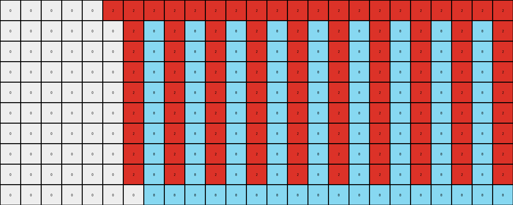
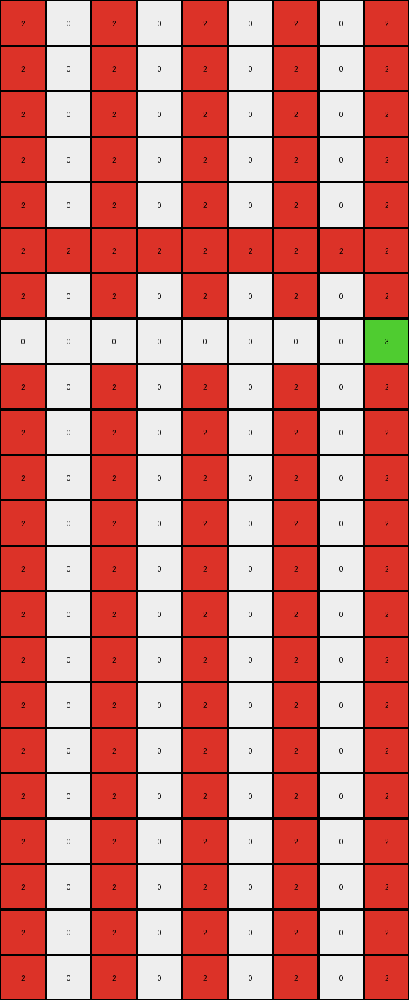
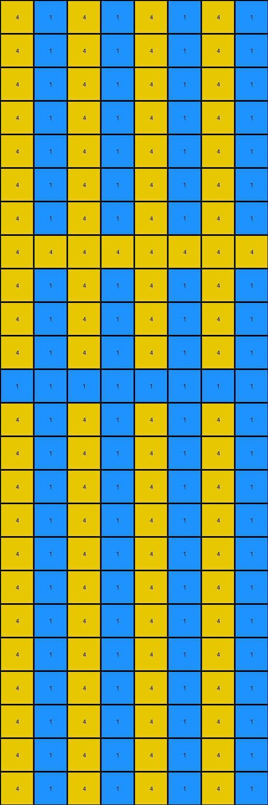

# 0a938d79 • 016 • refine_coder

---

Previous Code:
```python
"""
1. Identify Seed Rows: Iterate through each row of the input grid. A row is considered a "seed row" if it contains exactly one non-zero (colored) pixel.

2. Store Seed Information: For each seed row, store the row index, the color of the single pixel, and the column index of that pixel.

3. Construct Output: Create a new output grid of the same dimensions as the input grid. Fill the output grid as follows:
    *   Iterate through the rows of the output grid.
    *   Maintain relative column positions of colored pixels from seed rows.
        *   For each seed row, in the output, from the stored seed color's column position to the end of the row, fill the cells with the seed row's color.
        *   Fill the regions between colored pixels by repeating the sequence of colored pixels in the seed rows.

4. If there are rows that are not "filled" after processing all seed rows (like blank rows), maintain those as zero.
"""

import numpy as np

def find_seed_rows(grid):
    """
    Identifies rows with exactly one non-zero pixel and returns their information.
    """
    seed_rows = []
    for i, row in enumerate(grid):
        non_zero_indices = np.nonzero(row)[0]
        if len(non_zero_indices) == 1:
            seed_rows.append({
                "row_index": i,
                "color": row[non_zero_indices[0]],
                "column_index": non_zero_indices[0]
            })
    return seed_rows

def transform(input_grid):
    """
    Transforms the input grid based on seed rows (rows with a single colored pixel).
    """
    input_grid = np.array(input_grid)  # Ensure input is a NumPy array
    output_grid = np.zeros_like(input_grid)
    seed_rows = find_seed_rows(input_grid)

    # Construct output based on seed row information
    for seed_info in seed_rows:
        row_index = seed_info["row_index"]
        color = seed_info["color"]
        column_index = seed_info["column_index"]
        output_grid[row_index, column_index:] = color

    # fill the regions between the colored pixels
    if (len(seed_rows) > 1):
        num_rows, num_cols = output_grid.shape

        # create the alternating pattern of seed colors
        seed_colors = [sr['color'] for sr in seed_rows]
        seed_cols = [sr['column_index'] for sr in seed_rows]

        for r_idx in range(num_rows):
            if any(output_grid[r_idx]): # if any color in the row
                continue

            # cycle through the color/column pairs from seed_rows
            c_idx = 0
            while c_idx < num_cols:
                for sr_idx in range(len(seed_rows)):
                    start = seed_cols[sr_idx]
                    if c_idx >= start and c_idx < num_cols:
                      output_grid[r_idx, c_idx] = seed_colors[sr_idx]
                    c_idx += 1


    return output_grid
```

Train Set Results:

## Example 1:**

Input:
```
0 0 0 0 0 2 0 0 0 0 0 0 0 0 0 0 0 0 0 0 0 0 0 0 0
0 0 0 0 0 0 0 0 0 0 0 0 0 0 0 0 0 0 0 0 0 0 0 0 0
0 0 0 0 0 0 0 0 0 0 0 0 0 0 0 0 0 0 0 0 0 0 0 0 0
0 0 0 0 0 0 0 0 0 0 0 0 0 0 0 0 0 0 0 0 0 0 0 0 0
0 0 0 0 0 0 0 0 0 0 0 0 0 0 0 0 0 0 0 0 0 0 0 0 0
0 0 0 0 0 0 0 0 0 0 0 0 0 0 0 0 0 0 0 0 0 0 0 0 0
0 0 0 0 0 0 0 0 0 0 0 0 0 0 0 0 0 0 0 0 0 0 0 0 0
0 0 0 0 0 0 0 0 0 0 0 0 0 0 0 0 0 0 0 0 0 0 0 0 0
0 0 0 0 0 0 0 0 0 0 0 0 0 0 0 0 0 0 0 0 0 0 0 0 0
0 0 0 0 0 0 0 8 0 0 0 0 0 0 0 0 0 0 0 0 0 0 0 0 0
```
Expected Output:
```
0 0 0 0 0 2 0 8 0 2 0 8 0 2 0 8 0 2 0 8 0 2 0 8 0
0 0 0 0 0 2 0 8 0 2 0 8 0 2 0 8 0 2 0 8 0 2 0 8 0
0 0 0 0 0 2 0 8 0 2 0 8 0 2 0 8 0 2 0 8 0 2 0 8 0
0 0 0 0 0 2 0 8 0 2 0 8 0 2 0 8 0 2 0 8 0 2 0 8 0
0 0 0 0 0 2 0 8 0 2 0 8 0 2 0 8 0 2 0 8 0 2 0 8 0
0 0 0 0 0 2 0 8 0 2 0 8 0 2 0 8 0 2 0 8 0 2 0 8 0
0 0 0 0 0 2 0 8 0 2 0 8 0 2 0 8 0 2 0 8 0 2 0 8 0
0 0 0 0 0 2 0 8 0 2 0 8 0 2 0 8 0 2 0 8 0 2 0 8 0
0 0 0 0 0 2 0 8 0 2 0 8 0 2 0 8 0 2 0 8 0 2 0 8 0
0 0 0 0 0 2 0 8 0 2 0 8 0 2 0 8 0 2 0 8 0 2 0 8 0
```
Transformed Output:
```
0 0 0 0 0 2 2 2 2 2 2 2 2 2 2 2 2 2 2 2 2 2 2 2 2
0 0 0 0 0 0 2 8 2 8 2 8 2 8 2 8 2 8 2 8 2 8 2 8 2
0 0 0 0 0 0 2 8 2 8 2 8 2 8 2 8 2 8 2 8 2 8 2 8 2
0 0 0 0 0 0 2 8 2 8 2 8 2 8 2 8 2 8 2 8 2 8 2 8 2
0 0 0 0 0 0 2 8 2 8 2 8 2 8 2 8 2 8 2 8 2 8 2 8 2
0 0 0 0 0 0 2 8 2 8 2 8 2 8 2 8 2 8 2 8 2 8 2 8 2
0 0 0 0 0 0 2 8 2 8 2 8 2 8 2 8 2 8 2 8 2 8 2 8 2
0 0 0 0 0 0 2 8 2 8 2 8 2 8 2 8 2 8 2 8 2 8 2 8 2
0 0 0 0 0 0 2 8 2 8 2 8 2 8 2 8 2 8 2 8 2 8 2 8 2
0 0 0 0 0 0 0 8 8 8 8 8 8 8 8 8 8 8 8 8 8 8 8 8 8
```

match: False
pixels_off: 149
size_correct: True
color_palette_correct: True
correct_pixel_counts: False

## Example 2:**

Input:
```
0 0 0 0 0 1 0 0 0 0 0 0 0 0 0 0 0 0 0 0 0 0 0
0 0 0 0 0 0 0 0 0 0 0 0 0 0 0 0 0 0 0 0 0 0 0
0 0 0 0 0 0 0 0 0 0 0 0 0 0 0 0 0 0 0 0 0 0 0
0 0 0 0 0 0 0 0 0 0 0 0 0 0 0 0 0 0 0 0 0 0 0
0 0 0 0 0 0 0 0 0 0 0 0 0 0 0 0 0 0 0 0 0 0 0
0 0 0 0 0 0 0 0 0 0 0 0 0 0 0 0 0 0 0 0 0 0 0
0 0 0 0 0 0 0 0 3 0 0 0 0 0 0 0 0 0 0 0 0 0 0
```
Expected Output:
```
0 0 0 0 0 1 0 0 3 0 0 1 0 0 3 0 0 1 0 0 3 0 0
0 0 0 0 0 1 0 0 3 0 0 1 0 0 3 0 0 1 0 0 3 0 0
0 0 0 0 0 1 0 0 3 0 0 1 0 0 3 0 0 1 0 0 3 0 0
0 0 0 0 0 1 0 0 3 0 0 1 0 0 3 0 0 1 0 0 3 0 0
0 0 0 0 0 1 0 0 3 0 0 1 0 0 3 0 0 1 0 0 3 0 0
0 0 0 0 0 1 0 0 3 0 0 1 0 0 3 0 0 1 0 0 3 0 0
0 0 0 0 0 1 0 0 3 0 0 1 0 0 3 0 0 1 0 0 3 0 0
```
Transformed Output:
```
0 0 0 0 0 1 1 1 1 1 1 1 1 1 1 1 1 1 1 1 1 1 1
0 0 0 0 0 0 1 0 1 3 1 3 1 3 1 3 1 3 1 3 1 3 1
0 0 0 0 0 0 1 0 1 3 1 3 1 3 1 3 1 3 1 3 1 3 1
0 0 0 0 0 0 1 0 1 3 1 3 1 3 1 3 1 3 1 3 1 3 1
0 0 0 0 0 0 1 0 1 3 1 3 1 3 1 3 1 3 1 3 1 3 1
0 0 0 0 0 0 1 0 1 3 1 3 1 3 1 3 1 3 1 3 1 3 1
0 0 0 0 0 0 0 0 3 3 3 3 3 3 3 3 3 3 3 3 3 3 3
```

match: False
pixels_off: 113
size_correct: True
color_palette_correct: True
correct_pixel_counts: False

## Example 3:**

Input:
```
0 0 0 0 0 0 0 0 0
0 0 0 0 0 0 0 0 0
0 0 0 0 0 0 0 0 0
0 0 0 0 0 0 0 0 0
0 0 0 0 0 0 0 0 0
2 0 0 0 0 0 0 0 0
0 0 0 0 0 0 0 0 0
0 0 0 0 0 0 0 0 3
0 0 0 0 0 0 0 0 0
0 0 0 0 0 0 0 0 0
0 0 0 0 0 0 0 0 0
0 0 0 0 0 0 0 0 0
0 0 0 0 0 0 0 0 0
0 0 0 0 0 0 0 0 0
0 0 0 0 0 0 0 0 0
0 0 0 0 0 0 0 0 0
0 0 0 0 0 0 0 0 0
0 0 0 0 0 0 0 0 0
0 0 0 0 0 0 0 0 0
0 0 0 0 0 0 0 0 0
0 0 0 0 0 0 0 0 0
0 0 0 0 0 0 0 0 0
```
Expected Output:
```
0 0 0 0 0 0 0 0 0
0 0 0 0 0 0 0 0 0
0 0 0 0 0 0 0 0 0
0 0 0 0 0 0 0 0 0
0 0 0 0 0 0 0 0 0
2 2 2 2 2 2 2 2 2
0 0 0 0 0 0 0 0 0
3 3 3 3 3 3 3 3 3
0 0 0 0 0 0 0 0 0
2 2 2 2 2 2 2 2 2
0 0 0 0 0 0 0 0 0
3 3 3 3 3 3 3 3 3
0 0 0 0 0 0 0 0 0
2 2 2 2 2 2 2 2 2
0 0 0 0 0 0 0 0 0
3 3 3 3 3 3 3 3 3
0 0 0 0 0 0 0 0 0
2 2 2 2 2 2 2 2 2
0 0 0 0 0 0 0 0 0
3 3 3 3 3 3 3 3 3
0 0 0 0 0 0 0 0 0
2 2 2 2 2 2 2 2 2
```
Transformed Output:
```
2 0 2 0 2 0 2 0 2
2 0 2 0 2 0 2 0 2
2 0 2 0 2 0 2 0 2
2 0 2 0 2 0 2 0 2
2 0 2 0 2 0 2 0 2
2 2 2 2 2 2 2 2 2
2 0 2 0 2 0 2 0 2
0 0 0 0 0 0 0 0 3
2 0 2 0 2 0 2 0 2
2 0 2 0 2 0 2 0 2
2 0 2 0 2 0 2 0 2
2 0 2 0 2 0 2 0 2
2 0 2 0 2 0 2 0 2
2 0 2 0 2 0 2 0 2
2 0 2 0 2 0 2 0 2
2 0 2 0 2 0 2 0 2
2 0 2 0 2 0 2 0 2
2 0 2 0 2 0 2 0 2
2 0 2 0 2 0 2 0 2
2 0 2 0 2 0 2 0 2
2 0 2 0 2 0 2 0 2
2 0 2 0 2 0 2 0 2
```

match: False
pixels_off: 116
size_correct: True
color_palette_correct: True
correct_pixel_counts: False

## Example 4:**

Input:
```
0 0 0 0 0 0 0 0
0 0 0 0 0 0 0 0
0 0 0 0 0 0 0 0
0 0 0 0 0 0 0 0
0 0 0 0 0 0 0 0
0 0 0 0 0 0 0 0
0 0 0 0 0 0 0 0
4 0 0 0 0 0 0 0
0 0 0 0 0 0 0 0
0 0 0 0 0 0 0 0
0 0 0 0 0 0 0 0
1 0 0 0 0 0 0 0
0 0 0 0 0 0 0 0
0 0 0 0 0 0 0 0
0 0 0 0 0 0 0 0
0 0 0 0 0 0 0 0
0 0 0 0 0 0 0 0
0 0 0 0 0 0 0 0
0 0 0 0 0 0 0 0
0 0 0 0 0 0 0 0
0 0 0 0 0 0 0 0
0 0 0 0 0 0 0 0
0 0 0 0 0 0 0 0
0 0 0 0 0 0 0 0
```
Expected Output:
```
0 0 0 0 0 0 0 0
0 0 0 0 0 0 0 0
0 0 0 0 0 0 0 0
0 0 0 0 0 0 0 0
0 0 0 0 0 0 0 0
0 0 0 0 0 0 0 0
0 0 0 0 0 0 0 0
4 4 4 4 4 4 4 4
0 0 0 0 0 0 0 0
0 0 0 0 0 0 0 0
0 0 0 0 0 0 0 0
1 1 1 1 1 1 1 1
0 0 0 0 0 0 0 0
0 0 0 0 0 0 0 0
0 0 0 0 0 0 0 0
4 4 4 4 4 4 4 4
0 0 0 0 0 0 0 0
0 0 0 0 0 0 0 0
0 0 0 0 0 0 0 0
1 1 1 1 1 1 1 1
0 0 0 0 0 0 0 0
0 0 0 0 0 0 0 0
0 0 0 0 0 0 0 0
4 4 4 4 4 4 4 4
```
Transformed Output:
```
4 1 4 1 4 1 4 1
4 1 4 1 4 1 4 1
4 1 4 1 4 1 4 1
4 1 4 1 4 1 4 1
4 1 4 1 4 1 4 1
4 1 4 1 4 1 4 1
4 1 4 1 4 1 4 1
4 4 4 4 4 4 4 4
4 1 4 1 4 1 4 1
4 1 4 1 4 1 4 1
4 1 4 1 4 1 4 1
1 1 1 1 1 1 1 1
4 1 4 1 4 1 4 1
4 1 4 1 4 1 4 1
4 1 4 1 4 1 4 1
4 1 4 1 4 1 4 1
4 1 4 1 4 1 4 1
4 1 4 1 4 1 4 1
4 1 4 1 4 1 4 1
4 1 4 1 4 1 4 1
4 1 4 1 4 1 4 1
4 1 4 1 4 1 4 1
4 1 4 1 4 1 4 1
4 1 4 1 4 1 4 1
```

match: False
pixels_off: 164
size_correct: True
color_palette_correct: True
correct_pixel_counts: False
Okay, let's analyze the results of the previous code execution and refine the natural language program and overall strategy.

**General Assessment and Strategy**

The initial strategy of identifying "seed rows" (rows with a single colored pixel) and extending their color to the right was a good starting point. However, the results show significant discrepancies, especially in how the spaces *between* seed rows (or the areas to the left of the initial colored pixel) are handled. The current implementation has flaws in two main areas:

1.  **Filling between seed rows:** The logic for repeating the seed colors in rows between filled rows isn't working correctly. It seems to only partially fill, and often in ways that are not consistent with the expected outputs.
2.  **Left-side filling:** The original concept didn't account for how to fill the area to the *left* of the seed pixel. The examples show that an alternating pattern is used to the left, similar to the pattern used between seed rows.

The strategy needs to address these issues. A better approach would be:

1.  **Correctly identify Seed Rows and their properties.**
2.  **Extend seed colors to the right:** This part of the current code seems correct.
3.  **Fill to the left and between rows:** Create a more robust algorithm that repeats the *entire* sequence of seed row colors, starting from the leftmost column, and wrapping around as necessary. This should handle both the areas to the left of the initial seed pixels and the regions between the expanded seed rows.
4.  Rows with *no* seed colors should remain all black (all 0s). This is already handled correctly, but is worth stating.

**Metrics and Observations**

Here's a breakdown of each example, noting key issues and observations:

*   **Example 1:**
    *   **Seed Rows:** Correctly identified row 0 (color 2) and row 9 (color 8).
    *   **Right Extension:** Works correctly.
    *   **Between/Left Filling:** Incorrect. Should be an alternating "2 0 8 0" pattern.

*   **Example 2:**
    *   **Seed Rows:** Correctly identified row 0 (color 1) and row 6 (color 3).
    *   **Right Extension:** Works correctly.
    *   **Between/Left Filling:** Incorrect. Should be alternating "1 0 0 3 0 0" pattern.

*   **Example 3:**
    *   **Seed Rows:** Correctly identified row 5 (color 2) and row 7 (color 3).
    *   **Right Extension:** Works.
    *   **Between/Left Filling:** Very incorrect. The blank rows at the top should have remained blank. The repeating pattern on other blank rows is not starting from the beginning.

*   **Example 4:**
    *   **Seed Rows:** Correctly identified rows 7 (color 4) and row 11 (color 1).
    *    **Right Extension**: correct
    *   **Between/Left Filling:** Very incorrect. Many blank lines that should have been filled.

**YAML Fact Block**

```yaml
facts:
  - description: "Each input grid contains 'seed rows'."
    properties:
      seed_row: "A row with exactly one non-zero pixel."
      seed_color: "The color (non-zero value) of the single pixel in a seed row."
      seed_column: "The column index of the single pixel in a seed row."

  - description: "The output grid is constructed based on the seed rows."
    properties:
      output_dimensions: "Same as the input grid."
      row_filling:
        - type: "seed_row_extension"
          description: "For each seed row, the seed color extends from its initial column to the end of the row."
        - type: "alternating_pattern"
          description: "Empty rows are filled with an alternating pattern of the seed colors from all seed rows."
          details: "The pattern starts from column 0, repeats colors in the same order as the seed rows, and wraps around as needed. This fills spaces to the left of a seed pixel, and between any 'seed_row_extension' rows"
        - type: "empty_row_preservation"
          description: "Rows that are completely empty (all zeros) in the input remain empty (all zeros) in the output."
```

**Natural Language Program**

1.  **Identify Seed Rows:** Scan the input grid to find rows containing only one non-zero pixel. These are the "seed rows". Record the row index, the color of the pixel, and the column index of the pixel for each seed row.

2.  **Extend Seed Colors:** In the output grid, for each seed row, fill the cells from the seed pixel's column to the end of the row with the seed color.

3.  **Fill Remaining Cells:** For all rows in the output grid:
    * If the row already contains colored cells (from step 2): Do not modify this row.
    * Otherwise, fill the row by creating a repeating sequence of the seed row colors.
    * If a row has no colored cells, the entire row is filled by the repeating sequence of seed colors.

4.  **Preserve empty rows**: If after completing these steps, a cell remains 0, and was also 0 in the input, keep it at 0.

**INSTRUCTIONS**

- generate a Python module to represent the natural language program 
- follow the template below
- all common math and science libraries are available
- create docstring only at top - but comment the workflow in the function
- use helper functions for common operations like finding objects, counting,
  measuring, moving, etc. 

remember - we are working iteratively - so this code will inform your future
self as we converge on the solution

*template:*

```python
"""
{{ natural language description of the transformation rule }}
"""

{{ imports }}

def transform(input_grid):
    # initialize output_grid

    # change output pixels 

    return output_grid

```
