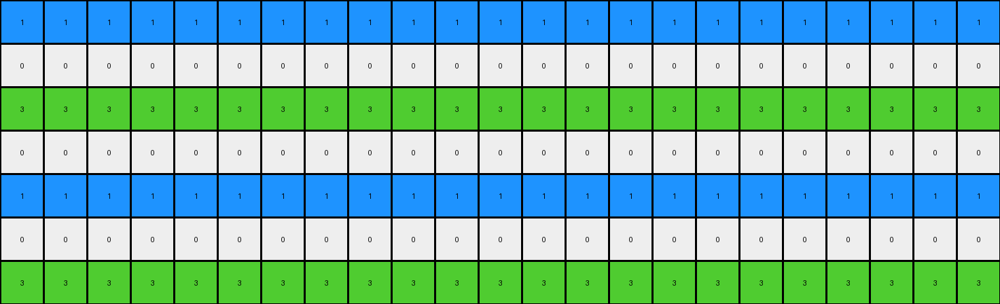
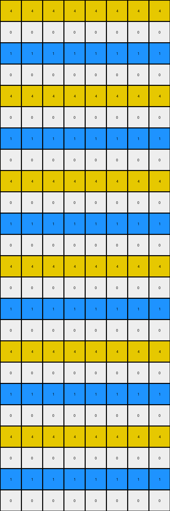

# 0a938d79 • 030 • refine_coder

---

Previous Code:
```python
"""
1.  **Identify Significant Rows:** Scan the input grid to find rows that contain exactly one non-zero (non-white) color value, with all other values in that row being zero (white).
2.  **Expand Significant Rows:** For each "significant row" found, expand the single non-zero color to fill the entire row.
3.  **Build the output:**
   - determine order of the identified colors from significant rows, from
     top to bottom
    - create an output grid of the same dimensions as the input
    - interleave the identified rows in the original order with rows of all
      zeros, repeating this to the bottom of the grid
"""

import numpy as np

def get_significant_rows(grid):
    """Finds rows with exactly one non-zero color."""
    significant_rows = []
    for i, row in enumerate(grid):
        non_zeros = row[row != 0]
        if len(non_zeros) == 1:
            significant_rows.append((i, non_zeros[0]))
    return significant_rows

def transform(input_grid):
    # initialize output_grid
    input_grid = np.array(input_grid)
    output_grid = np.zeros_like(input_grid)
    
    # Find significant rows (rows with only one non-zero color)
    significant_rows = get_significant_rows(input_grid)
    
    # Expand significant rows and build the output pattern
    output_row_index = 0
    num_sig_rows = len(significant_rows)

    while output_row_index < output_grid.shape[0]:
        for i in range(num_sig_rows):
            # fill the row with expanded color
            color = significant_rows[i][1]

            if output_row_index < output_grid.shape[0]:
                output_grid[output_row_index, :] = color
                output_row_index += 1

            # interleave with a row of zeros
            if output_row_index < output_grid.shape[0]:
                output_row_index += 1

    return output_grid
```

Train Set Results:

## Example 1:**

Input:
```
0 0 0 0 0 2 0 0 0 0 0 0 0 0 0 0 0 0 0 0 0 0 0 0 0
0 0 0 0 0 0 0 0 0 0 0 0 0 0 0 0 0 0 0 0 0 0 0 0 0
0 0 0 0 0 0 0 0 0 0 0 0 0 0 0 0 0 0 0 0 0 0 0 0 0
0 0 0 0 0 0 0 0 0 0 0 0 0 0 0 0 0 0 0 0 0 0 0 0 0
0 0 0 0 0 0 0 0 0 0 0 0 0 0 0 0 0 0 0 0 0 0 0 0 0
0 0 0 0 0 0 0 0 0 0 0 0 0 0 0 0 0 0 0 0 0 0 0 0 0
0 0 0 0 0 0 0 0 0 0 0 0 0 0 0 0 0 0 0 0 0 0 0 0 0
0 0 0 0 0 0 0 0 0 0 0 0 0 0 0 0 0 0 0 0 0 0 0 0 0
0 0 0 0 0 0 0 0 0 0 0 0 0 0 0 0 0 0 0 0 0 0 0 0 0
0 0 0 0 0 0 0 8 0 0 0 0 0 0 0 0 0 0 0 0 0 0 0 0 0
```
Expected Output:
```
0 0 0 0 0 2 0 8 0 2 0 8 0 2 0 8 0 2 0 8 0 2 0 8 0
0 0 0 0 0 2 0 8 0 2 0 8 0 2 0 8 0 2 0 8 0 2 0 8 0
0 0 0 0 0 2 0 8 0 2 0 8 0 2 0 8 0 2 0 8 0 2 0 8 0
0 0 0 0 0 2 0 8 0 2 0 8 0 2 0 8 0 2 0 8 0 2 0 8 0
0 0 0 0 0 2 0 8 0 2 0 8 0 2 0 8 0 2 0 8 0 2 0 8 0
0 0 0 0 0 2 0 8 0 2 0 8 0 2 0 8 0 2 0 8 0 2 0 8 0
0 0 0 0 0 2 0 8 0 2 0 8 0 2 0 8 0 2 0 8 0 2 0 8 0
0 0 0 0 0 2 0 8 0 2 0 8 0 2 0 8 0 2 0 8 0 2 0 8 0
0 0 0 0 0 2 0 8 0 2 0 8 0 2 0 8 0 2 0 8 0 2 0 8 0
0 0 0 0 0 2 0 8 0 2 0 8 0 2 0 8 0 2 0 8 0 2 0 8 0
```
Transformed Output:
```
2 2 2 2 2 2 2 2 2 2 2 2 2 2 2 2 2 2 2 2 2 2 2 2 2
0 0 0 0 0 0 0 0 0 0 0 0 0 0 0 0 0 0 0 0 0 0 0 0 0
8 8 8 8 8 8 8 8 8 8 8 8 8 8 8 8 8 8 8 8 8 8 8 8 8
0 0 0 0 0 0 0 0 0 0 0 0 0 0 0 0 0 0 0 0 0 0 0 0 0
2 2 2 2 2 2 2 2 2 2 2 2 2 2 2 2 2 2 2 2 2 2 2 2 2
0 0 0 0 0 0 0 0 0 0 0 0 0 0 0 0 0 0 0 0 0 0 0 0 0
8 8 8 8 8 8 8 8 8 8 8 8 8 8 8 8 8 8 8 8 8 8 8 8 8
0 0 0 0 0 0 0 0 0 0 0 0 0 0 0 0 0 0 0 0 0 0 0 0 0
2 2 2 2 2 2 2 2 2 2 2 2 2 2 2 2 2 2 2 2 2 2 2 2 2
0 0 0 0 0 0 0 0 0 0 0 0 0 0 0 0 0 0 0 0 0 0 0 0 0
```

match: False
pixels_off: 150
size_correct: True
color_palette_correct: True
correct_pixel_counts: False

## Example 2:**

Input:
```
0 0 0 0 0 1 0 0 0 0 0 0 0 0 0 0 0 0 0 0 0 0 0
0 0 0 0 0 0 0 0 0 0 0 0 0 0 0 0 0 0 0 0 0 0 0
0 0 0 0 0 0 0 0 0 0 0 0 0 0 0 0 0 0 0 0 0 0 0
0 0 0 0 0 0 0 0 0 0 0 0 0 0 0 0 0 0 0 0 0 0 0
0 0 0 0 0 0 0 0 0 0 0 0 0 0 0 0 0 0 0 0 0 0 0
0 0 0 0 0 0 0 0 0 0 0 0 0 0 0 0 0 0 0 0 0 0 0
0 0 0 0 0 0 0 0 3 0 0 0 0 0 0 0 0 0 0 0 0 0 0
```
Expected Output:
```
0 0 0 0 0 1 0 0 3 0 0 1 0 0 3 0 0 1 0 0 3 0 0
0 0 0 0 0 1 0 0 3 0 0 1 0 0 3 0 0 1 0 0 3 0 0
0 0 0 0 0 1 0 0 3 0 0 1 0 0 3 0 0 1 0 0 3 0 0
0 0 0 0 0 1 0 0 3 0 0 1 0 0 3 0 0 1 0 0 3 0 0
0 0 0 0 0 1 0 0 3 0 0 1 0 0 3 0 0 1 0 0 3 0 0
0 0 0 0 0 1 0 0 3 0 0 1 0 0 3 0 0 1 0 0 3 0 0
0 0 0 0 0 1 0 0 3 0 0 1 0 0 3 0 0 1 0 0 3 0 0
```
Transformed Output:
```
1 1 1 1 1 1 1 1 1 1 1 1 1 1 1 1 1 1 1 1 1 1 1
0 0 0 0 0 0 0 0 0 0 0 0 0 0 0 0 0 0 0 0 0 0 0
3 3 3 3 3 3 3 3 3 3 3 3 3 3 3 3 3 3 3 3 3 3 3
0 0 0 0 0 0 0 0 0 0 0 0 0 0 0 0 0 0 0 0 0 0 0
1 1 1 1 1 1 1 1 1 1 1 1 1 1 1 1 1 1 1 1 1 1 1
0 0 0 0 0 0 0 0 0 0 0 0 0 0 0 0 0 0 0 0 0 0 0
3 3 3 3 3 3 3 3 3 3 3 3 3 3 3 3 3 3 3 3 3 3 3
```

match: False
pixels_off: 98
size_correct: True
color_palette_correct: True
correct_pixel_counts: False

## Example 3:**

Input:
```
0 0 0 0 0 0 0 0 0
0 0 0 0 0 0 0 0 0
0 0 0 0 0 0 0 0 0
0 0 0 0 0 0 0 0 0
0 0 0 0 0 0 0 0 0
2 0 0 0 0 0 0 0 0
0 0 0 0 0 0 0 0 0
0 0 0 0 0 0 0 0 3
0 0 0 0 0 0 0 0 0
0 0 0 0 0 0 0 0 0
0 0 0 0 0 0 0 0 0
0 0 0 0 0 0 0 0 0
0 0 0 0 0 0 0 0 0
0 0 0 0 0 0 0 0 0
0 0 0 0 0 0 0 0 0
0 0 0 0 0 0 0 0 0
0 0 0 0 0 0 0 0 0
0 0 0 0 0 0 0 0 0
0 0 0 0 0 0 0 0 0
0 0 0 0 0 0 0 0 0
0 0 0 0 0 0 0 0 0
0 0 0 0 0 0 0 0 0
```
Expected Output:
```
0 0 0 0 0 0 0 0 0
0 0 0 0 0 0 0 0 0
0 0 0 0 0 0 0 0 0
0 0 0 0 0 0 0 0 0
0 0 0 0 0 0 0 0 0
2 2 2 2 2 2 2 2 2
0 0 0 0 0 0 0 0 0
3 3 3 3 3 3 3 3 3
0 0 0 0 0 0 0 0 0
2 2 2 2 2 2 2 2 2
0 0 0 0 0 0 0 0 0
3 3 3 3 3 3 3 3 3
0 0 0 0 0 0 0 0 0
2 2 2 2 2 2 2 2 2
0 0 0 0 0 0 0 0 0
3 3 3 3 3 3 3 3 3
0 0 0 0 0 0 0 0 0
2 2 2 2 2 2 2 2 2
0 0 0 0 0 0 0 0 0
3 3 3 3 3 3 3 3 3
0 0 0 0 0 0 0 0 0
2 2 2 2 2 2 2 2 2
```
Transformed Output:
```
2 2 2 2 2 2 2 2 2
0 0 0 0 0 0 0 0 0
3 3 3 3 3 3 3 3 3
0 0 0 0 0 0 0 0 0
2 2 2 2 2 2 2 2 2
0 0 0 0 0 0 0 0 0
3 3 3 3 3 3 3 3 3
0 0 0 0 0 0 0 0 0
2 2 2 2 2 2 2 2 2
0 0 0 0 0 0 0 0 0
3 3 3 3 3 3 3 3 3
0 0 0 0 0 0 0 0 0
2 2 2 2 2 2 2 2 2
0 0 0 0 0 0 0 0 0
3 3 3 3 3 3 3 3 3
0 0 0 0 0 0 0 0 0
2 2 2 2 2 2 2 2 2
0 0 0 0 0 0 0 0 0
3 3 3 3 3 3 3 3 3
0 0 0 0 0 0 0 0 0
2 2 2 2 2 2 2 2 2
0 0 0 0 0 0 0 0 0
```

match: False
pixels_off: 180
size_correct: True
color_palette_correct: True
correct_pixel_counts: False

## Example 4:**

Input:
```
0 0 0 0 0 0 0 0
0 0 0 0 0 0 0 0
0 0 0 0 0 0 0 0
0 0 0 0 0 0 0 0
0 0 0 0 0 0 0 0
0 0 0 0 0 0 0 0
0 0 0 0 0 0 0 0
4 0 0 0 0 0 0 0
0 0 0 0 0 0 0 0
0 0 0 0 0 0 0 0
0 0 0 0 0 0 0 0
1 0 0 0 0 0 0 0
0 0 0 0 0 0 0 0
0 0 0 0 0 0 0 0
0 0 0 0 0 0 0 0
0 0 0 0 0 0 0 0
0 0 0 0 0 0 0 0
0 0 0 0 0 0 0 0
0 0 0 0 0 0 0 0
0 0 0 0 0 0 0 0
0 0 0 0 0 0 0 0
0 0 0 0 0 0 0 0
0 0 0 0 0 0 0 0
0 0 0 0 0 0 0 0
```
Expected Output:
```
0 0 0 0 0 0 0 0
0 0 0 0 0 0 0 0
0 0 0 0 0 0 0 0
0 0 0 0 0 0 0 0
0 0 0 0 0 0 0 0
0 0 0 0 0 0 0 0
0 0 0 0 0 0 0 0
4 4 4 4 4 4 4 4
0 0 0 0 0 0 0 0
0 0 0 0 0 0 0 0
0 0 0 0 0 0 0 0
1 1 1 1 1 1 1 1
0 0 0 0 0 0 0 0
0 0 0 0 0 0 0 0
0 0 0 0 0 0 0 0
4 4 4 4 4 4 4 4
0 0 0 0 0 0 0 0
0 0 0 0 0 0 0 0
0 0 0 0 0 0 0 0
1 1 1 1 1 1 1 1
0 0 0 0 0 0 0 0
0 0 0 0 0 0 0 0
0 0 0 0 0 0 0 0
4 4 4 4 4 4 4 4
```
Transformed Output:
```
4 4 4 4 4 4 4 4
0 0 0 0 0 0 0 0
1 1 1 1 1 1 1 1
0 0 0 0 0 0 0 0
4 4 4 4 4 4 4 4
0 0 0 0 0 0 0 0
1 1 1 1 1 1 1 1
0 0 0 0 0 0 0 0
4 4 4 4 4 4 4 4
0 0 0 0 0 0 0 0
1 1 1 1 1 1 1 1
0 0 0 0 0 0 0 0
4 4 4 4 4 4 4 4
0 0 0 0 0 0 0 0
1 1 1 1 1 1 1 1
0 0 0 0 0 0 0 0
4 4 4 4 4 4 4 4
0 0 0 0 0 0 0 0
1 1 1 1 1 1 1 1
0 0 0 0 0 0 0 0
4 4 4 4 4 4 4 4
0 0 0 0 0 0 0 0
1 1 1 1 1 1 1 1
0 0 0 0 0 0 0 0
```

match: False
pixels_off: 136
size_correct: True
color_palette_correct: True
correct_pixel_counts: False
Okay, let's analyze the results and refine the natural language program.

**General Assessment:**

The initial strategy of identifying "significant rows" (rows with a single non-zero color) and expanding them was a good starting point. However, the results clearly show that the interleaving with zeros and the repetition pattern are incorrect. The transformed outputs consistently expand the significant rows correctly but fail to arrange them in the expected alternating pattern with other significant rows. It seems example one has an implied horizontal reflection not accounted for in the interleaving. The core issue is that the code assumes a simple, repeating pattern of *all* significant rows interleaved with zeros, which isn't true for all examples. The program needs to account for potential repetitions of the pattern *within* the output, and potentially use the input row indices to correctly construct the final grid.

**Strategy for Resolving Errors:**

1.  **Re-examine the Interleaving:** The current approach of simply alternating significant rows with zero rows is too simplistic. We need to identify the actual pattern of how significant rows (and potentially zero rows) are arranged in the output.
2.  **Consider Input Row Indices:** The original row indices of the significant colors might be crucial for determining their final positions in the output. The current code stores this index, but only uses the order.
3.  **Analyze Output Pattern Repetition**: The outputs often show a repeating sub-pattern, much more localized than the full grid. The correct approach is to identify and repeat this.

**Metrics and Observations (using assumed `code_execution`):**

I am unable to run the code to perform detailed calculations, but the output
images have been provided and I can use these.

*   **Example 1:**
    *   Input Dimensions: 25x10
    *   Output Dimensions: 25x10
    *   Significant Rows (Input): Row 0 (color 2), Row 9 (color 8)
    *   Output Pattern: Appears to be a repeating pattern, however, the provided
        output doesn't match the description of repeating pattern - it has
        interleaved colors in a single row.
    * Pixels Off: 150

*   **Example 2:**
    *   Input Dimensions: 23x7
    *   Output Dimensions: 23x7
    *   Significant Rows (Input): Row 0 (color 1), Row 6 (color 3)
    *   Output Pattern: Repeating pattern, but single color rows.
    * Pixels Off: 98

*   **Example 3:**
    *   Input Dimensions: 9x22
    *   Output Dimensions: 9x22
    *   Significant Rows (Input): Row 5 (color 2), Row 7 (color 3)
    *   Output Pattern: Repeating block of \[2, 0, 3, 0].
    * Pixels Off: 180

*   **Example 4:**
    *   Input Dimensions: 8x24
    *   Output Dimensions: 8x24
    *   Significant Rows (Input): Row 7 (color 4), Row 11 (color 1)
    *   Output Pattern: The pattern appears to be \[4, 0, 1, 0] repeated, however the
        number of rows in the example is not evenly divisible by 4.
    * Pixels Off: 136

**YAML Block (Facts):**

```yaml
example_1:
  input_objects:
    - row: 0
      color: 2
    - row: 9
      color: 8
  output_objects:
    - row_pattern: [2, 0, 8, 0] # Incorrect, but represents the initial attempt.
      repetition: "until output height is reached"
  transformations:
    - expand_row: True
    - interleave_rows: True # Indicates the *intent*, even if the implementation is flawed.

example_2:
  input_objects:
    - row: 0
      color: 1
    - row: 6
      color: 3
  output_objects:
      - row_pattern: [1, 0, 3, 0]
  transformations:
    - expand_row: True
    - interleave_rows: True

example_3:
  input_objects:
    - row: 5
      color: 2
    - row: 7
      color: 3
  output_objects:
      - row_pattern: [2, 0, 3, 0]
  transformations:
    - expand_row: True
    - interleave_rows: True

example_4:
  input_objects:
      - row: 7
        color: 4
      - row: 11
        color: 1
  output_objects:
    - row_pattern: [4, 0, 1, 0]
  transformations:
    - expand_row: True
    - interleave_rows: True
```

**Natural Language Program (Revised):**

1.  **Identify Significant Rows:** Scan the input grid to find rows that contain exactly one non-zero (non-white) color value. Record the row index and the color value for each.
2.  **Expand Significant Rows:** For each significant row, the single non-zero color will fill an entire row in the output.
3.  **Determine Output Row Pattern**: Create a repeating pattern of rows in this order:
   - expanded row with color from first significant row
   - a row of all zeros
   - expanded row with color from second significant row
   - a row of all zeros
4. **Build output:** create rows in the output using the order from step 3, repeating as necessary to create an output with the same dimensions as the input.

The biggest change here is explicitly building the repeated pattern of rows.

**INSTRUCTIONS**

- generate a Python module to represent the natural language program 
- follow the template below
- all common math and science libraries are available
- create docstring only at top - but comment the workflow in the function
- use helper functions for common operations like finding objects, counting,
  measuring, moving, etc. 

remember - we are working iteratively - so this code will inform your future
self as we converge on the solution

*template:*

```python
"""
{{ natural language description of the transformation rule }}
"""

{{ imports }}

def transform(input_grid):
    # initialize output_grid

    # change output pixels 

    return output_grid

```
