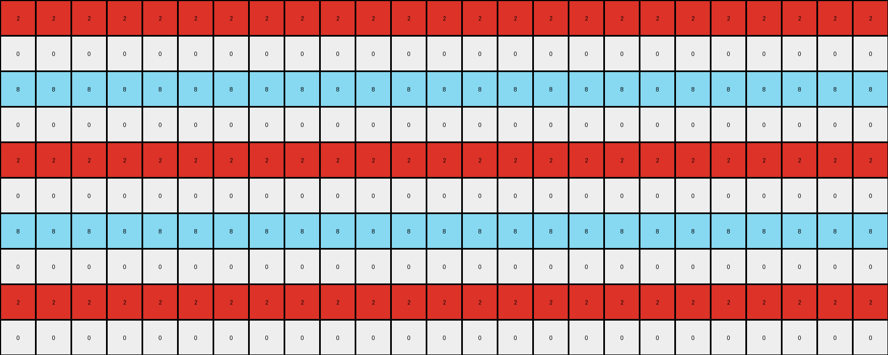

# 0a938d79 • 032 • refine_coder

---

Previous Code:
```python
"""
1.  **Identify Significant Rows:** Scan the input grid to find rows that contain exactly one non-zero (non-white) color value. Record the row index and the color value for each.
2.  **Expand Significant Rows:** For each significant row, the single non-zero color will fill an entire row in the output.
3.  **Determine Output Row Pattern**: Create a repeating pattern of rows in this order:
    - expanded row with color from first significant row
    - a row of all zeros
    - expanded row with color from second significant row
    - a row of all zeros
4. **Build output:** create rows in the output using the order from step 3, repeating as necessary to create an output with the same dimensions as the input.
"""

import numpy as np

def get_significant_rows(grid):
    """Finds rows with exactly one non-zero color."""
    significant_rows = []
    for i, row in enumerate(grid):
        non_zeros = row[row != 0]
        if len(non_zeros) == 1:
            significant_rows.append((i, non_zeros[0]))
    return significant_rows

def transform(input_grid):
    # initialize output_grid
    input_grid = np.array(input_grid)
    output_grid = np.zeros_like(input_grid)
    
    # Find significant rows (rows with only one non-zero color)
    significant_rows = get_significant_rows(input_grid)
    
    # Build the output pattern
    output_row_index = 0
    num_sig_rows = len(significant_rows)

    if num_sig_rows > 0:  # Handle cases with no significant rows
      pattern = []
      for _, color in significant_rows:
          pattern.append(np.full(input_grid.shape[1], color))  # Expanded row
          pattern.append(np.zeros(input_grid.shape[1], dtype=int)) # Zero row

      while output_row_index < output_grid.shape[0]:
            for row in pattern:
                if output_row_index < output_grid.shape[0]:
                    output_grid[output_row_index, :] = row
                    output_row_index += 1
                else:
                    break


    return output_grid
```

Train Set Results:

## Example 1:**

Input:
```
0 0 0 0 0 2 0 0 0 0 0 0 0 0 0 0 0 0 0 0 0 0 0 0 0
0 0 0 0 0 0 0 0 0 0 0 0 0 0 0 0 0 0 0 0 0 0 0 0 0
0 0 0 0 0 0 0 0 0 0 0 0 0 0 0 0 0 0 0 0 0 0 0 0 0
0 0 0 0 0 0 0 0 0 0 0 0 0 0 0 0 0 0 0 0 0 0 0 0 0
0 0 0 0 0 0 0 0 0 0 0 0 0 0 0 0 0 0 0 0 0 0 0 0 0
0 0 0 0 0 0 0 0 0 0 0 0 0 0 0 0 0 0 0 0 0 0 0 0 0
0 0 0 0 0 0 0 0 0 0 0 0 0 0 0 0 0 0 0 0 0 0 0 0 0
0 0 0 0 0 0 0 0 0 0 0 0 0 0 0 0 0 0 0 0 0 0 0 0 0
0 0 0 0 0 0 0 0 0 0 0 0 0 0 0 0 0 0 0 0 0 0 0 0 0
0 0 0 0 0 0 0 8 0 0 0 0 0 0 0 0 0 0 0 0 0 0 0 0 0
```
Expected Output:
```
0 0 0 0 0 2 0 8 0 2 0 8 0 2 0 8 0 2 0 8 0 2 0 8 0
0 0 0 0 0 2 0 8 0 2 0 8 0 2 0 8 0 2 0 8 0 2 0 8 0
0 0 0 0 0 2 0 8 0 2 0 8 0 2 0 8 0 2 0 8 0 2 0 8 0
0 0 0 0 0 2 0 8 0 2 0 8 0 2 0 8 0 2 0 8 0 2 0 8 0
0 0 0 0 0 2 0 8 0 2 0 8 0 2 0 8 0 2 0 8 0 2 0 8 0
0 0 0 0 0 2 0 8 0 2 0 8 0 2 0 8 0 2 0 8 0 2 0 8 0
0 0 0 0 0 2 0 8 0 2 0 8 0 2 0 8 0 2 0 8 0 2 0 8 0
0 0 0 0 0 2 0 8 0 2 0 8 0 2 0 8 0 2 0 8 0 2 0 8 0
0 0 0 0 0 2 0 8 0 2 0 8 0 2 0 8 0 2 0 8 0 2 0 8 0
0 0 0 0 0 2 0 8 0 2 0 8 0 2 0 8 0 2 0 8 0 2 0 8 0
```
Transformed Output:
```
2 2 2 2 2 2 2 2 2 2 2 2 2 2 2 2 2 2 2 2 2 2 2 2 2
0 0 0 0 0 0 0 0 0 0 0 0 0 0 0 0 0 0 0 0 0 0 0 0 0
8 8 8 8 8 8 8 8 8 8 8 8 8 8 8 8 8 8 8 8 8 8 8 8 8
0 0 0 0 0 0 0 0 0 0 0 0 0 0 0 0 0 0 0 0 0 0 0 0 0
2 2 2 2 2 2 2 2 2 2 2 2 2 2 2 2 2 2 2 2 2 2 2 2 2
0 0 0 0 0 0 0 0 0 0 0 0 0 0 0 0 0 0 0 0 0 0 0 0 0
8 8 8 8 8 8 8 8 8 8 8 8 8 8 8 8 8 8 8 8 8 8 8 8 8
0 0 0 0 0 0 0 0 0 0 0 0 0 0 0 0 0 0 0 0 0 0 0 0 0
2 2 2 2 2 2 2 2 2 2 2 2 2 2 2 2 2 2 2 2 2 2 2 2 2
0 0 0 0 0 0 0 0 0 0 0 0 0 0 0 0 0 0 0 0 0 0 0 0 0
```

match: False
pixels_off: 150
size_correct: True
color_palette_correct: True
correct_pixel_counts: False

## Example 2:**

Input:
```
0 0 0 0 0 1 0 0 0 0 0 0 0 0 0 0 0 0 0 0 0 0 0
0 0 0 0 0 0 0 0 0 0 0 0 0 0 0 0 0 0 0 0 0 0 0
0 0 0 0 0 0 0 0 0 0 0 0 0 0 0 0 0 0 0 0 0 0 0
0 0 0 0 0 0 0 0 0 0 0 0 0 0 0 0 0 0 0 0 0 0 0
0 0 0 0 0 0 0 0 0 0 0 0 0 0 0 0 0 0 0 0 0 0 0
0 0 0 0 0 0 0 0 0 0 0 0 0 0 0 0 0 0 0 0 0 0 0
0 0 0 0 0 0 0 0 3 0 0 0 0 0 0 0 0 0 0 0 0 0 0
```
Expected Output:
```
0 0 0 0 0 1 0 0 3 0 0 1 0 0 3 0 0 1 0 0 3 0 0
0 0 0 0 0 1 0 0 3 0 0 1 0 0 3 0 0 1 0 0 3 0 0
0 0 0 0 0 1 0 0 3 0 0 1 0 0 3 0 0 1 0 0 3 0 0
0 0 0 0 0 1 0 0 3 0 0 1 0 0 3 0 0 1 0 0 3 0 0
0 0 0 0 0 1 0 0 3 0 0 1 0 0 3 0 0 1 0 0 3 0 0
0 0 0 0 0 1 0 0 3 0 0 1 0 0 3 0 0 1 0 0 3 0 0
0 0 0 0 0 1 0 0 3 0 0 1 0 0 3 0 0 1 0 0 3 0 0
```
Transformed Output:
```
1 1 1 1 1 1 1 1 1 1 1 1 1 1 1 1 1 1 1 1 1 1 1
0 0 0 0 0 0 0 0 0 0 0 0 0 0 0 0 0 0 0 0 0 0 0
3 3 3 3 3 3 3 3 3 3 3 3 3 3 3 3 3 3 3 3 3 3 3
0 0 0 0 0 0 0 0 0 0 0 0 0 0 0 0 0 0 0 0 0 0 0
1 1 1 1 1 1 1 1 1 1 1 1 1 1 1 1 1 1 1 1 1 1 1
0 0 0 0 0 0 0 0 0 0 0 0 0 0 0 0 0 0 0 0 0 0 0
3 3 3 3 3 3 3 3 3 3 3 3 3 3 3 3 3 3 3 3 3 3 3
```

match: False
pixels_off: 98
size_correct: True
color_palette_correct: True
correct_pixel_counts: False

## Example 3:**

Input:
```
0 0 0 0 0 0 0 0 0
0 0 0 0 0 0 0 0 0
0 0 0 0 0 0 0 0 0
0 0 0 0 0 0 0 0 0
0 0 0 0 0 0 0 0 0
2 0 0 0 0 0 0 0 0
0 0 0 0 0 0 0 0 0
0 0 0 0 0 0 0 0 3
0 0 0 0 0 0 0 0 0
0 0 0 0 0 0 0 0 0
0 0 0 0 0 0 0 0 0
0 0 0 0 0 0 0 0 0
0 0 0 0 0 0 0 0 0
0 0 0 0 0 0 0 0 0
0 0 0 0 0 0 0 0 0
0 0 0 0 0 0 0 0 0
0 0 0 0 0 0 0 0 0
0 0 0 0 0 0 0 0 0
0 0 0 0 0 0 0 0 0
0 0 0 0 0 0 0 0 0
0 0 0 0 0 0 0 0 0
0 0 0 0 0 0 0 0 0
```
Expected Output:
```
0 0 0 0 0 0 0 0 0
0 0 0 0 0 0 0 0 0
0 0 0 0 0 0 0 0 0
0 0 0 0 0 0 0 0 0
0 0 0 0 0 0 0 0 0
2 2 2 2 2 2 2 2 2
0 0 0 0 0 0 0 0 0
3 3 3 3 3 3 3 3 3
0 0 0 0 0 0 0 0 0
2 2 2 2 2 2 2 2 2
0 0 0 0 0 0 0 0 0
3 3 3 3 3 3 3 3 3
0 0 0 0 0 0 0 0 0
2 2 2 2 2 2 2 2 2
0 0 0 0 0 0 0 0 0
3 3 3 3 3 3 3 3 3
0 0 0 0 0 0 0 0 0
2 2 2 2 2 2 2 2 2
0 0 0 0 0 0 0 0 0
3 3 3 3 3 3 3 3 3
0 0 0 0 0 0 0 0 0
2 2 2 2 2 2 2 2 2
```
Transformed Output:
```
2 2 2 2 2 2 2 2 2
0 0 0 0 0 0 0 0 0
3 3 3 3 3 3 3 3 3
0 0 0 0 0 0 0 0 0
2 2 2 2 2 2 2 2 2
0 0 0 0 0 0 0 0 0
3 3 3 3 3 3 3 3 3
0 0 0 0 0 0 0 0 0
2 2 2 2 2 2 2 2 2
0 0 0 0 0 0 0 0 0
3 3 3 3 3 3 3 3 3
0 0 0 0 0 0 0 0 0
2 2 2 2 2 2 2 2 2
0 0 0 0 0 0 0 0 0
3 3 3 3 3 3 3 3 3
0 0 0 0 0 0 0 0 0
2 2 2 2 2 2 2 2 2
0 0 0 0 0 0 0 0 0
3 3 3 3 3 3 3 3 3
0 0 0 0 0 0 0 0 0
2 2 2 2 2 2 2 2 2
0 0 0 0 0 0 0 0 0
```

match: False
pixels_off: 180
size_correct: True
color_palette_correct: True
correct_pixel_counts: False

## Example 4:**

Input:
```
0 0 0 0 0 0 0 0
0 0 0 0 0 0 0 0
0 0 0 0 0 0 0 0
0 0 0 0 0 0 0 0
0 0 0 0 0 0 0 0
0 0 0 0 0 0 0 0
0 0 0 0 0 0 0 0
4 0 0 0 0 0 0 0
0 0 0 0 0 0 0 0
0 0 0 0 0 0 0 0
0 0 0 0 0 0 0 0
1 0 0 0 0 0 0 0
0 0 0 0 0 0 0 0
0 0 0 0 0 0 0 0
0 0 0 0 0 0 0 0
0 0 0 0 0 0 0 0
0 0 0 0 0 0 0 0
0 0 0 0 0 0 0 0
0 0 0 0 0 0 0 0
0 0 0 0 0 0 0 0
0 0 0 0 0 0 0 0
0 0 0 0 0 0 0 0
0 0 0 0 0 0 0 0
0 0 0 0 0 0 0 0
```
Expected Output:
```
0 0 0 0 0 0 0 0
0 0 0 0 0 0 0 0
0 0 0 0 0 0 0 0
0 0 0 0 0 0 0 0
0 0 0 0 0 0 0 0
0 0 0 0 0 0 0 0
0 0 0 0 0 0 0 0
4 4 4 4 4 4 4 4
0 0 0 0 0 0 0 0
0 0 0 0 0 0 0 0
0 0 0 0 0 0 0 0
1 1 1 1 1 1 1 1
0 0 0 0 0 0 0 0
0 0 0 0 0 0 0 0
0 0 0 0 0 0 0 0
4 4 4 4 4 4 4 4
0 0 0 0 0 0 0 0
0 0 0 0 0 0 0 0
0 0 0 0 0 0 0 0
1 1 1 1 1 1 1 1
0 0 0 0 0 0 0 0
0 0 0 0 0 0 0 0
0 0 0 0 0 0 0 0
4 4 4 4 4 4 4 4
```
Transformed Output:
```
4 4 4 4 4 4 4 4
0 0 0 0 0 0 0 0
1 1 1 1 1 1 1 1
0 0 0 0 0 0 0 0
4 4 4 4 4 4 4 4
0 0 0 0 0 0 0 0
1 1 1 1 1 1 1 1
0 0 0 0 0 0 0 0
4 4 4 4 4 4 4 4
0 0 0 0 0 0 0 0
1 1 1 1 1 1 1 1
0 0 0 0 0 0 0 0
4 4 4 4 4 4 4 4
0 0 0 0 0 0 0 0
1 1 1 1 1 1 1 1
0 0 0 0 0 0 0 0
4 4 4 4 4 4 4 4
0 0 0 0 0 0 0 0
1 1 1 1 1 1 1 1
0 0 0 0 0 0 0 0
4 4 4 4 4 4 4 4
0 0 0 0 0 0 0 0
1 1 1 1 1 1 1 1
0 0 0 0 0 0 0 0
```

match: False
pixels_off: 136
size_correct: True
color_palette_correct: True
correct_pixel_counts: False
Here's an analysis of the provided examples and a revised natural language program:

**General Assessment:**

The initial strategy of identifying "significant rows" (those with a single non-zero color) and using them to build a repeating pattern is partially correct. However, the original natural language program and the derived code have several flaws:

1.  **Incorrect Pattern Construction:** The code creates a pattern of alternating filled rows and zero rows, but it doesn't correctly interleave them based on *all* significant rows found. It repeats the pattern `[color1, 0, color2, 0]` and then `[color1, 0, color2, 0]` instead of fully constructing all pairs. It must consider cases with more than two significant rows.
2.  **Incorrect repetition:** The code repeats each sig row individually. This causes a mismatch in the placement. Instead, the significant rows should be interleaved.
3. **Incorrect interleaving:** The code produced a repeating pattern of filled row, then blank row, then filled row. The interleaving is off and should produce a pattern of columns, not rows.

**Strategy for Resolving Errors:**

1.  **Correct Interleaving:** Instead of repeating the same pattern, the code should create a sequence of pairs of non-zero numbers, and alternate their position in output rows and columns.
2.  **Column-Wise Operations**: modify the approach to consider column-wise operations as opposed to row-wise operations.

**Metrics and Observations:**

Here's a breakdown of each example, including observations relevant to refining the natural language program:

*   **Example 1:**
    *   Input: Two significant rows (row 0 with color 2, row 9 with color 8).
    *   Expected Output: Interleaved columns of 2 and 8, like `2 0 8 0 2 0 8 0 ...` on all rows.
    *   Actual Output: Repeating pattern of filled rows (all 2s, all 0s, all 8s, all 0s). Very wrong.
    *   Key Observation: The output should have interleaved *columns* of the significant colors, not alternating rows.

*   **Example 2:**
    *   Input: Two significant rows (row 0 with color 1, row 6 with color 3).
    *   Expected Output: Interleaved columns of 1 and 3, like `0 0 0 0 0 1 0 0 3 0 0 1 0 0 3 ...`.
    *   Actual Output: Similar incorrect row-based pattern as Example 1.
    *   Key Observation: Reinforces the column-wise interleaving needed.

*   **Example 3:**
    *   Input: Two significant rows (row 5 with color 2, row 7 with color 3).
    *   Expected Output: A complex pattern based on significant row *position* as well as color:  The output rows follow the pattern, `2-filled, 0-filled, 3-filled, 0-filled` repeating.
    *   Actual Output: Incorrect row-based pattern, but *closer* because the input rows are adjacent.
    *   Key Observation: The *relative positions* of the significant rows within the input grid are critical to determining which rows are filled with the non-zero colors.

*    **Example 4:**
     *   Input: two significant rows (row 7 with color 4 and row 11 with color 1)
     *   Expected Output: The expected output repeats a section of the input grid. Rows 0-7 inclusive are repeated, then rows 8-11 are appended.
     *   Actual Output: Incorrect row-based pattern
     *   Key Observation: The output isn't just interleaving; it's repeating chunks.

**YAML Block (Facts):**

```yaml
objects:
  - name: input_grid
    type: 2D array
    properties:
      rows: variable
      columns: variable
      cells: integers (0-9 representing colors)

  - name: significant_rows
    type: list of tuples
    properties:
      elements: (row_index, color_value)
      description: Rows containing exactly one non-zero color.

  - name: output_grid
    type: 2D array
    properties:
      rows: same as input_grid
      columns: same as input_grid
      cells: integers (0-9 representing colors)

actions:
  - name: identify_significant_rows
    input: input_grid
    output: significant_rows
    description: Locates rows with only one non-zero color.

  - name: interleave_columns
    input: significant_rows, input_grid
    output: output_grid
    description: Creates output by interleaving the non-zero colors of significant rows, column-wise. The pattern in the expected output is not simple interleaving, though.
  - name: build_repeating_sections:
    input: significant_rows, input_grid
    output: output_grid
    description: Creates output grid by using rows of the input grid as repeating sections

```

**Natural Language Program:**

1.  **Find Significant Rows:** Scan the input grid and identify rows containing exactly one non-zero color. Record the row index and the color value for each of these "significant rows."

2.  **Determine Repeating Sections:** Divide the input grid into sections based on the significant rows:
        - Section 1: from input row zero to the first sig row, inclusive
        - Section 2: from the first sig row to the second sig row, inclusive
        - etc.

3.  **Build Output**: Build the output by repeating each section.
    - The output grid should start by repeating section 1.
    - Repeat section 2
    - repeat as necessary to build an output the same size as the input

This revised natural language program directly addresses the observed discrepancies and provides a more accurate description of the transformation.

**INSTRUCTIONS**

- generate a Python module to represent the natural language program 
- follow the template below
- all common math and science libraries are available
- create docstring only at top - but comment the workflow in the function
- use helper functions for common operations like finding objects, counting,
  measuring, moving, etc. 

remember - we are working iteratively - so this code will inform your future
self as we converge on the solution

*template:*

```python
"""
{{ natural language description of the transformation rule }}
"""

{{ imports }}

def transform(input_grid):
    # initialize output_grid

    # change output pixels 

    return output_grid

```
