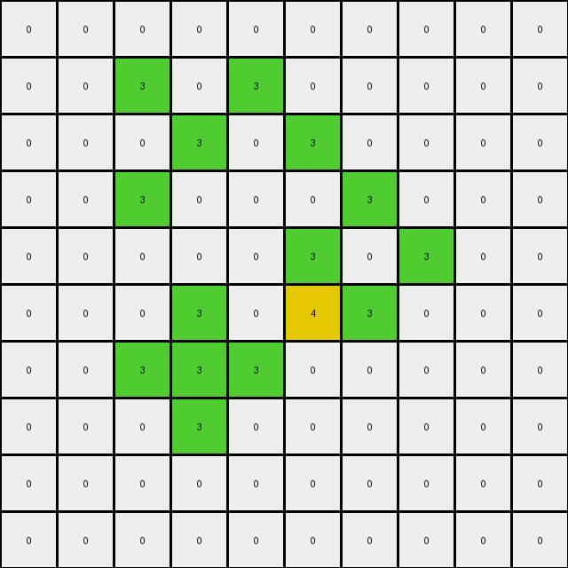
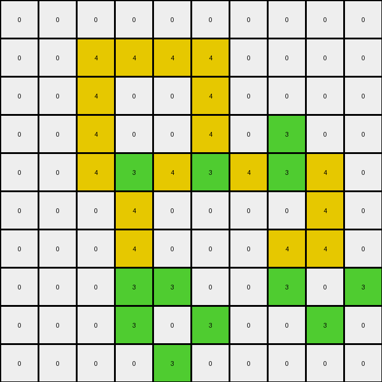

# 00d62c1b • 004 • refine_coder

---

Previous Code:
```python
"""
1.  **Identify** all pixels with the value 3 (green).
2.  **Locate** the green pixels that have exactly two green neighbors, where neighbors may be above, below, to the left, or to the right - no diagonals.
3. **Change** the value/color for only the identified pixels in the previous step to 4 (yellow).
4.  All other pixels remain **unchanged**.
"""

import numpy as np

def count_neighbors(grid, r, c, target_color):
    """Counts the number of neighbors with the target color around a pixel."""
    rows, cols = grid.shape
    count = 0
    # Check above
    if r > 0 and grid[r-1, c] == target_color:
        count += 1
    # Check below
    if r < rows - 1 and grid[r+1, c] == target_color:
        count += 1
    # Check left
    if c > 0 and grid[r, c-1] == target_color:
        count += 1
    # Check right
    if c < cols - 1 and grid[r, c+1] == target_color:
        count += 1
    return count

def transform(input_grid):
    """Transforms the input grid according to the defined rule."""
    output_grid = np.copy(input_grid)
    rows, cols = input_grid.shape

    # Iterate through each pixel
    for r in range(rows):
        for c in range(cols):
            # Check if the pixel is green
            if input_grid[r, c] == 3:
                # Count green neighbors
                neighbor_count = count_neighbors(input_grid, r, c, 3)
                # Change color to yellow if exactly two green neighbors
                if neighbor_count == 2:
                    output_grid[r, c] = 4

    return output_grid
```

Train Set Results:

## Example 1:**

Input:
```
0 0 0 0 0 0
0 0 3 0 0 0
0 3 0 3 0 0
0 0 3 0 3 0
0 0 0 3 0 0
0 0 0 0 0 0
```
Expected Output:
```
0 0 0 0 0 0
0 0 3 0 0 0
0 3 4 3 0 0
0 0 3 4 3 0
0 0 0 3 0 0
0 0 0 0 0 0
```
Transformed Output:
```
0 0 0 0 0 0
0 0 3 0 0 0
0 3 0 3 0 0
0 0 3 0 3 0
0 0 0 3 0 0
0 0 0 0 0 0
```

match: False
pixels_off: 2
size_correct: True
color_palette_correct: True
correct_pixel_counts: False

## Example 2:**

Input:
```
0 0 0 0 0 0 0 0 0 0
0 0 3 0 3 0 0 0 0 0
0 0 0 3 0 3 0 0 0 0
0 0 3 0 0 0 3 0 0 0
0 0 0 0 0 3 0 3 0 0
0 0 0 3 0 3 3 0 0 0
0 0 3 3 3 0 0 0 0 0
0 0 0 3 0 0 0 0 0 0
0 0 0 0 0 0 0 0 0 0
0 0 0 0 0 0 0 0 0 0
```
Expected Output:
```
0 0 0 0 0 0 0 0 0 0
0 0 3 0 3 0 0 0 0 0
0 0 0 3 0 3 0 0 0 0
0 0 3 0 0 0 3 0 0 0
0 0 0 0 0 3 4 3 0 0
0 0 0 3 0 3 3 0 0 0
0 0 3 3 3 0 0 0 0 0
0 0 0 3 0 0 0 0 0 0
0 0 0 0 0 0 0 0 0 0
0 0 0 0 0 0 0 0 0 0
```
Transformed Output:
```
0 0 0 0 0 0 0 0 0 0
0 0 3 0 3 0 0 0 0 0
0 0 0 3 0 3 0 0 0 0
0 0 3 0 0 0 3 0 0 0
0 0 0 0 0 3 0 3 0 0
0 0 0 3 0 4 3 0 0 0
0 0 3 3 3 0 0 0 0 0
0 0 0 3 0 0 0 0 0 0
0 0 0 0 0 0 0 0 0 0
0 0 0 0 0 0 0 0 0 0
```

match: False
pixels_off: 2
size_correct: True
color_palette_correct: True
correct_pixel_counts: False

## Example 3:**

Input:
```
0 0 0 0 0 3 0 0 0 0
0 0 0 0 3 0 0 0 0 0
0 3 3 0 3 3 0 3 0 0
3 0 0 3 0 0 3 0 3 0
0 0 0 3 0 0 3 3 0 0
0 0 0 3 0 0 3 0 0 0
0 0 0 3 0 0 3 0 0 0
0 0 0 0 3 3 0 3 0 0
0 0 0 0 0 0 0 0 3 0
0 0 0 0 0 0 0 0 0 0
```
Expected Output:
```
0 0 0 0 0 3 0 0 0 0
0 0 0 0 3 0 0 0 0 0
0 3 3 0 3 3 0 3 0 0
3 0 0 3 4 4 3 4 3 0
0 0 0 3 4 4 3 3 0 0
0 0 0 3 4 4 3 0 0 0
0 0 0 3 4 4 3 0 0 0
0 0 0 0 3 3 0 3 0 0
0 0 0 0 0 0 0 0 3 0
0 0 0 0 0 0 0 0 0 0
```
Transformed Output:
```
0 0 0 0 0 3 0 0 0 0
0 0 0 0 3 0 0 0 0 0
0 3 3 0 4 3 0 3 0 0
3 0 0 3 0 0 3 0 3 0
0 0 0 4 0 0 3 3 0 0
0 0 0 4 0 0 4 0 0 0
0 0 0 3 0 0 3 0 0 0
0 0 0 0 3 3 0 3 0 0
0 0 0 0 0 0 0 0 3 0
0 0 0 0 0 0 0 0 0 0
```

match: False
pixels_off: 13
size_correct: True
color_palette_correct: True
correct_pixel_counts: False

## Example 4:**

Input:
```
0 0 0 0 0 0 0 0 0 0
0 0 3 3 3 3 0 0 0 0
0 0 3 0 0 3 0 0 0 0
0 0 3 0 0 3 0 3 0 0
0 0 3 3 3 3 3 3 3 0
0 0 0 3 0 0 0 0 3 0
0 0 0 3 0 0 0 3 3 0
0 0 0 3 3 0 0 3 0 3
0 0 0 3 0 3 0 0 3 0
0 0 0 0 3 0 0 0 0 0
```
Expected Output:
```
0 0 0 0 0 0 0 0 0 0
0 0 3 3 3 3 0 0 0 0
0 0 3 4 4 3 0 0 0 0
0 0 3 4 4 3 0 3 0 0
0 0 3 3 3 3 3 3 3 0
0 0 0 3 0 0 0 0 3 0
0 0 0 3 0 0 0 3 3 0
0 0 0 3 3 0 0 3 4 3
0 0 0 3 4 3 0 0 3 0
0 0 0 0 3 0 0 0 0 0
```
Transformed Output:
```
0 0 0 0 0 0 0 0 0 0
0 0 4 4 4 4 0 0 0 0
0 0 4 0 0 4 0 0 0 0
0 0 4 0 0 4 0 3 0 0
0 0 4 3 4 3 4 3 4 0
0 0 0 4 0 0 0 0 4 0
0 0 0 4 0 0 0 4 4 0
0 0 0 3 3 0 0 3 0 3
0 0 0 3 0 3 0 0 3 0
0 0 0 0 3 0 0 0 0 0
```

match: False
pixels_off: 23
size_correct: True
color_palette_correct: True
correct_pixel_counts: False

## Example 5:**

Input:
```
0 0 0 0 0 0 0 0 0 0 0 0 0 0 0 0 0 0 0 0
0 0 0 0 0 0 0 0 3 0 0 0 0 0 0 0 0 0 0 0
0 0 0 0 3 3 3 3 0 3 3 0 0 0 0 0 0 0 0 0
0 0 0 0 0 0 0 0 3 0 3 0 0 0 0 0 0 0 3 0
0 0 0 0 0 0 0 0 3 3 3 3 3 3 3 3 0 0 0 0
0 0 0 0 0 0 0 0 3 0 0 0 0 0 0 3 0 0 0 0
0 0 0 0 3 0 0 0 3 0 0 0 0 0 0 3 0 0 0 0
0 0 0 0 0 0 0 0 3 0 0 0 0 0 0 3 0 0 0 0
0 0 0 0 0 0 0 0 3 0 0 0 0 0 0 3 0 0 0 0
0 0 3 0 0 0 0 0 3 3 3 3 3 3 3 3 0 0 0 0
0 0 0 0 0 0 0 0 3 0 0 0 0 0 0 0 0 0 0 0
0 0 0 0 0 0 0 0 3 3 3 0 0 0 0 3 0 3 0 0
0 0 0 0 0 0 3 3 0 0 3 0 0 3 0 0 0 0 0 0
0 0 0 0 0 0 0 3 0 0 3 3 0 0 3 0 0 3 0 0
0 0 0 0 0 0 0 3 3 3 3 0 3 0 0 3 3 3 0 0
0 0 0 0 0 0 0 0 0 0 3 0 0 0 0 3 0 3 0 0
0 0 0 0 0 0 0 0 0 0 0 0 3 0 0 3 3 3 0 0
0 0 0 0 0 0 0 0 0 0 0 0 0 3 0 0 0 0 0 0
0 0 0 0 0 0 0 0 0 0 0 0 0 0 0 0 0 0 0 0
0 0 0 0 0 0 0 0 0 0 0 0 0 0 0 0 0 0 0 0
```
Expected Output:
```
0 0 0 0 0 0 0 0 0 0 0 0 0 0 0 0 0 0 0 0
0 0 0 0 0 0 0 0 3 0 0 0 0 0 0 0 0 0 0 0
0 0 0 0 3 3 3 3 4 3 3 0 0 0 0 0 0 0 0 0
0 0 0 0 0 0 0 0 3 4 3 0 0 0 0 0 0 0 3 0
0 0 0 0 0 0 0 0 3 3 3 3 3 3 3 3 0 0 0 0
0 0 0 0 0 0 0 0 3 4 4 4 4 4 4 3 0 0 0 0
0 0 0 0 3 0 0 0 3 4 4 4 4 4 4 3 0 0 0 0
0 0 0 0 0 0 0 0 3 4 4 4 4 4 4 3 0 0 0 0
0 0 0 0 0 0 0 0 3 4 4 4 4 4 4 3 0 0 0 0
0 0 3 0 0 0 0 0 3 3 3 3 3 3 3 3 0 0 0 0
0 0 0 0 0 0 0 0 3 0 0 0 0 0 0 0 0 0 0 0
0 0 0 0 0 0 0 0 3 3 3 0 0 0 0 3 0 3 0 0
0 0 0 0 0 0 3 3 4 4 3 0 0 3 0 0 0 0 0 0
0 0 0 0 0 0 0 3 4 4 3 3 0 0 3 0 0 3 0 0
0 0 0 0 0 0 0 3 3 3 3 0 3 0 0 3 3 3 0 0
0 0 0 0 0 0 0 0 0 0 3 0 0 0 0 3 4 3 0 0
0 0 0 0 0 0 0 0 0 0 0 0 3 0 0 3 3 3 0 0
0 0 0 0 0 0 0 0 0 0 0 0 0 3 0 0 0 0 0 0
0 0 0 0 0 0 0 0 0 0 0 0 0 0 0 0 0 0 0 0
0 0 0 0 0 0 0 0 0 0 0 0 0 0 0 0 0 0 0 0
```
Transformed Output:
```
0 0 0 0 0 0 0 0 0 0 0 0 0 0 0 0 0 0 0 0
0 0 0 0 0 0 0 0 3 0 0 0 0 0 0 0 0 0 0 0
0 0 0 0 3 4 4 3 0 3 4 0 0 0 0 0 0 0 0 0
0 0 0 0 0 0 0 0 3 0 4 0 0 0 0 0 0 0 3 0
0 0 0 0 0 0 0 0 3 4 3 4 4 4 4 4 0 0 0 0
0 0 0 0 0 0 0 0 4 0 0 0 0 0 0 4 0 0 0 0
0 0 0 0 3 0 0 0 4 0 0 0 0 0 0 4 0 0 0 0
0 0 0 0 0 0 0 0 4 0 0 0 0 0 0 4 0 0 0 0
0 0 0 0 0 0 0 0 4 0 0 0 0 0 0 4 0 0 0 0
0 0 3 0 0 0 0 0 3 4 4 4 4 4 4 4 0 0 0 0
0 0 0 0 0 0 0 0 4 0 0 0 0 0 0 0 0 0 0 0
0 0 0 0 0 0 0 0 4 4 4 0 0 0 0 3 0 3 0 0
0 0 0 0 0 0 3 4 0 0 4 0 0 3 0 0 0 0 0 0
0 0 0 0 0 0 0 4 0 0 3 3 0 0 3 0 0 3 0 0
0 0 0 0 0 0 0 4 4 4 3 0 3 0 0 4 4 3 0 0
0 0 0 0 0 0 0 0 0 0 3 0 0 0 0 4 0 4 0 0
0 0 0 0 0 0 0 0 0 0 0 0 3 0 0 4 4 4 0 0
0 0 0 0 0 0 0 0 0 0 0 0 0 3 0 0 0 0 0 0
0 0 0 0 0 0 0 0 0 0 0 0 0 0 0 0 0 0 0 0
0 0 0 0 0 0 0 0 0 0 0 0 0 0 0 0 0 0 0 0
```

match: False
pixels_off: 73
size_correct: True
color_palette_correct: True
correct_pixel_counts: False
Here's an analysis of the provided information and a strategy for improving the transformation rule:

**General Assessment:**

The initial natural language program and the corresponding Python code are based on a simple rule: change a green pixel to yellow if it has exactly two green neighbors. However, the results on the training examples show that this rule is not consistently correct. There are errors in every case except, interestingly, that it seems to get the outline correct most of the time, and the size and color palette is always correct. The core issue seems to be related to how the neighbor counting affects interior pixels and perhaps some cascading changes.

**Strategy:**

1.  **Analyze Errors:** Carefully examine each example, focusing on the differences between the `Expected Output` and the `Transformed Output`. Pay close attention to the pixels that are incorrect, where are they relative to other green and other transformed pixels.
2.  **Refine Neighbor Rule:** The current "exactly two neighbors" rule is clearly too simplistic. We need to incorporate the idea of how edges are working correctly, consider a "contiguous block" interpretation and the concept of inside vs outside.
3.  **Consider Edge Cases:** Explicitly consider pixels at the edges and corners of the grid and objects. These often have unique behavior in grid transformations.
4. **Iterate and Test:** After modifying the natural language program and the code, re-run the tests and repeat the analysis.

**Metrics and Observations (YAML):**

```yaml
examples:
  - id: 1
    correct: false
    notes: |
      The two center-most green pixels should change to yellow. The transformation
      fails to change these pixels.
  - id: 2
    correct: false
    notes: |
      Only one pixel in the longer line of green pixels should change to yellow.
      The transformation only changes one, but the wrong one.
  - id: 3
    correct: false
    notes: |
      Many interior pixels should change, most are wrong.
  - id: 4
    correct: false
    notes: |
        Many interior pixels should change, most are wrong. Also, the top row
        of green should not all be changed.
  - id: 5
    correct: false
    notes: |
      Many interior pixels should change, most are wrong.
general:
  - The output grid size is always correct.
  - The output grid color palette is always correct (only 0, 3, and 4).
  - The simple two-neighbor rule is incorrect for many cases.
  - The rule seems to produce better results on outlines, but not the interior
    of larger blocks of green.
```

**Revised Natural Language Program:**

1.  **Identify** contiguous blocks of green (3) pixels.  A contiguous block is defined as a set of green pixels where each pixel is directly adjacent (up, down, left, or right) to at least one other pixel in the block.
2. **Identify** the exterior and interior of the block
    - Exterior green pixels are part of the block, but have fewer than four green neighbors.
    - Interior green pixels are not exterior.
3.  **Change** interior pixels to yellow (4).
4. All other pixels are **unchanged**.

**INSTRUCTIONS**

- generate a Python module to represent the natural language program 
- follow the template below
- all common math and science libraries are available
- create docstring only at top - but comment the workflow in the function
- use helper functions for common operations like finding objects, counting,
  measuring, moving, etc. 

remember - we are working iteratively - so this code will inform your future
self as we converge on the solution

*template:*

```python
"""
{{ natural language description of the transformation rule }}
"""

{{ imports }}

def transform(input_grid):
    # initialize output_grid

    # change output pixels 

    return output_grid

```
