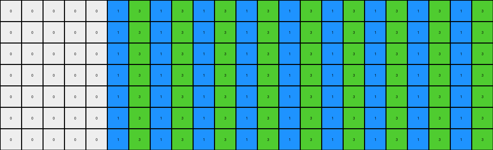

# 0a938d79 • 005 • refine_dreamer

---


Previous Code:
```python
"""
Transforms an input grid based on the presence and arrangement of non-white "seed" pixels. If seed pixels appear in different columns, the output grid is filled with alternating columns of the first two seed colors. If seed pixels are only in the same column or stacked in multiple rows, the output grid is created by copying rows containing seed pixels.
"""

import numpy as np

def find_seed_pixels(grid):
    """Finds non-white pixels in the grid and returns their coordinates and color."""
    seeds = []
    for r, row in enumerate(grid):
        for c, pixel in enumerate(row):
            if pixel != 0:
                seeds.append((r, c, pixel))
    return seeds

def transform(input_grid):
    """Transforms the input grid according to the rules described above."""
    input_grid = np.array(input_grid)
    rows, cols = input_grid.shape
    output_grid = np.zeros((rows, cols), dtype=int)

    # Find seed pixels.
    seed_pixels = find_seed_pixels(input_grid)

    if not seed_pixels:  # Handle empty input.
        return output_grid.tolist()

    # Determine transformation type.
    first_seed_col = seed_pixels[0][1]
    different_columns = any(pixel[1] != first_seed_col for pixel in seed_pixels)

    if different_columns:
        # Alternating Column Fill.
        colors = [seed_pixels[0][2], seed_pixels[1][2]]
        if len(colors) < 2:
            if colors[0] == 2:
              colors.append(8)
            else:
              colors.append(2)
          
        start_col = first_seed_col
        color_index = 0
        for c in range(start_col, cols):
            for r in range(rows):
                output_grid[r, c] = colors[color_index % 2]
            color_index += 1

    else:
        # Row Copy.
        last_seed_row = None
        for r in range(rows):
            row_has_seed = any(pixel[0] == r for pixel in seed_pixels)
            if row_has_seed:
                for c in range(cols):
                    output_grid[r, c] = input_grid[r, c]
                last_seed_row = r
            elif last_seed_row is not None:
                for c in range(cols):
                    output_grid[r,c] = output_grid[last_seed_row,c]
                

    return output_grid.tolist()
```

Train Set Results:

## Example 1:**

Input:
```
0 0 0 0 0 2 0 0 0 0 0 0 0 0 0 0 0 0 0 0 0 0 0 0 0
0 0 0 0 0 0 0 0 0 0 0 0 0 0 0 0 0 0 0 0 0 0 0 0 0
0 0 0 0 0 0 0 0 0 0 0 0 0 0 0 0 0 0 0 0 0 0 0 0 0
0 0 0 0 0 0 0 0 0 0 0 0 0 0 0 0 0 0 0 0 0 0 0 0 0
0 0 0 0 0 0 0 0 0 0 0 0 0 0 0 0 0 0 0 0 0 0 0 0 0
0 0 0 0 0 0 0 0 0 0 0 0 0 0 0 0 0 0 0 0 0 0 0 0 0
0 0 0 0 0 0 0 0 0 0 0 0 0 0 0 0 0 0 0 0 0 0 0 0 0
0 0 0 0 0 0 0 0 0 0 0 0 0 0 0 0 0 0 0 0 0 0 0 0 0
0 0 0 0 0 0 0 0 0 0 0 0 0 0 0 0 0 0 0 0 0 0 0 0 0
0 0 0 0 0 0 0 8 0 0 0 0 0 0 0 0 0 0 0 0 0 0 0 0 0
```
Expected Output:
```
0 0 0 0 0 2 0 8 0 2 0 8 0 2 0 8 0 2 0 8 0 2 0 8 0
0 0 0 0 0 2 0 8 0 2 0 8 0 2 0 8 0 2 0 8 0 2 0 8 0
0 0 0 0 0 2 0 8 0 2 0 8 0 2 0 8 0 2 0 8 0 2 0 8 0
0 0 0 0 0 2 0 8 0 2 0 8 0 2 0 8 0 2 0 8 0 2 0 8 0
0 0 0 0 0 2 0 8 0 2 0 8 0 2 0 8 0 2 0 8 0 2 0 8 0
0 0 0 0 0 2 0 8 0 2 0 8 0 2 0 8 0 2 0 8 0 2 0 8 0
0 0 0 0 0 2 0 8 0 2 0 8 0 2 0 8 0 2 0 8 0 2 0 8 0
0 0 0 0 0 2 0 8 0 2 0 8 0 2 0 8 0 2 0 8 0 2 0 8 0
0 0 0 0 0 2 0 8 0 2 0 8 0 2 0 8 0 2 0 8 0 2 0 8 0
0 0 0 0 0 2 0 8 0 2 0 8 0 2 0 8 0 2 0 8 0 2 0 8 0
```
Transformed Output:
```
0 0 0 0 0 2 8 2 8 2 8 2 8 2 8 2 8 2 8 2 8 2 8 2 8
0 0 0 0 0 2 8 2 8 2 8 2 8 2 8 2 8 2 8 2 8 2 8 2 8
0 0 0 0 0 2 8 2 8 2 8 2 8 2 8 2 8 2 8 2 8 2 8 2 8
0 0 0 0 0 2 8 2 8 2 8 2 8 2 8 2 8 2 8 2 8 2 8 2 8
0 0 0 0 0 2 8 2 8 2 8 2 8 2 8 2 8 2 8 2 8 2 8 2 8
0 0 0 0 0 2 8 2 8 2 8 2 8 2 8 2 8 2 8 2 8 2 8 2 8
0 0 0 0 0 2 8 2 8 2 8 2 8 2 8 2 8 2 8 2 8 2 8 2 8
0 0 0 0 0 2 8 2 8 2 8 2 8 2 8 2 8 2 8 2 8 2 8 2 8
0 0 0 0 0 2 8 2 8 2 8 2 8 2 8 2 8 2 8 2 8 2 8 2 8
0 0 0 0 0 2 8 2 8 2 8 2 8 2 8 2 8 2 8 2 8 2 8 2 8
```

match: False
pixels_off: 150
size_correct: True
color_palette_correct: True
correct_pixel_counts: False

## Example 2:**

Input:
```
0 0 0 0 0 1 0 0 0 0 0 0 0 0 0 0 0 0 0 0 0 0 0
0 0 0 0 0 0 0 0 0 0 0 0 0 0 0 0 0 0 0 0 0 0 0
0 0 0 0 0 0 0 0 0 0 0 0 0 0 0 0 0 0 0 0 0 0 0
0 0 0 0 0 0 0 0 0 0 0 0 0 0 0 0 0 0 0 0 0 0 0
0 0 0 0 0 0 0 0 0 0 0 0 0 0 0 0 0 0 0 0 0 0 0
0 0 0 0 0 0 0 0 0 0 0 0 0 0 0 0 0 0 0 0 0 0 0
0 0 0 0 0 0 0 0 3 0 0 0 0 0 0 0 0 0 0 0 0 0 0
```
Expected Output:
```
0 0 0 0 0 1 0 0 3 0 0 1 0 0 3 0 0 1 0 0 3 0 0
0 0 0 0 0 1 0 0 3 0 0 1 0 0 3 0 0 1 0 0 3 0 0
0 0 0 0 0 1 0 0 3 0 0 1 0 0 3 0 0 1 0 0 3 0 0
0 0 0 0 0 1 0 0 3 0 0 1 0 0 3 0 0 1 0 0 3 0 0
0 0 0 0 0 1 0 0 3 0 0 1 0 0 3 0 0 1 0 0 3 0 0
0 0 0 0 0 1 0 0 3 0 0 1 0 0 3 0 0 1 0 0 3 0 0
0 0 0 0 0 1 0 0 3 0 0 1 0 0 3 0 0 1 0 0 3 0 0
```
Transformed Output:
```
0 0 0 0 0 1 3 1 3 1 3 1 3 1 3 1 3 1 3 1 3 1 3
0 0 0 0 0 1 3 1 3 1 3 1 3 1 3 1 3 1 3 1 3 1 3
0 0 0 0 0 1 3 1 3 1 3 1 3 1 3 1 3 1 3 1 3 1 3
0 0 0 0 0 1 3 1 3 1 3 1 3 1 3 1 3 1 3 1 3 1 3
0 0 0 0 0 1 3 1 3 1 3 1 3 1 3 1 3 1 3 1 3 1 3
0 0 0 0 0 1 3 1 3 1 3 1 3 1 3 1 3 1 3 1 3 1 3
0 0 0 0 0 1 3 1 3 1 3 1 3 1 3 1 3 1 3 1 3 1 3
```

match: False
pixels_off: 84
size_correct: True
color_palette_correct: True
correct_pixel_counts: False

## Example 3:**

Input:
```
0 0 0 0 0 0 0 0 0
0 0 0 0 0 0 0 0 0
0 0 0 0 0 0 0 0 0
0 0 0 0 0 0 0 0 0
0 0 0 0 0 0 0 0 0
2 0 0 0 0 0 0 0 0
0 0 0 0 0 0 0 0 0
0 0 0 0 0 0 0 0 3
0 0 0 0 0 0 0 0 0
0 0 0 0 0 0 0 0 0
0 0 0 0 0 0 0 0 0
0 0 0 0 0 0 0 0 0
0 0 0 0 0 0 0 0 0
0 0 0 0 0 0 0 0 0
0 0 0 0 0 0 0 0 0
0 0 0 0 0 0 0 0 0
0 0 0 0 0 0 0 0 0
0 0 0 0 0 0 0 0 0
0 0 0 0 0 0 0 0 0
0 0 0 0 0 0 0 0 0
0 0 0 0 0 0 0 0 0
0 0 0 0 0 0 0 0 0
```
Expected Output:
```
0 0 0 0 0 0 0 0 0
0 0 0 0 0 0 0 0 0
0 0 0 0 0 0 0 0 0
0 0 0 0 0 0 0 0 0
0 0 0 0 0 0 0 0 0
2 2 2 2 2 2 2 2 2
0 0 0 0 0 0 0 0 0
3 3 3 3 3 3 3 3 3
0 0 0 0 0 0 0 0 0
2 2 2 2 2 2 2 2 2
0 0 0 0 0 0 0 0 0
3 3 3 3 3 3 3 3 3
0 0 0 0 0 0 0 0 0
2 2 2 2 2 2 2 2 2
0 0 0 0 0 0 0 0 0
3 3 3 3 3 3 3 3 3
0 0 0 0 0 0 0 0 0
2 2 2 2 2 2 2 2 2
0 0 0 0 0 0 0 0 0
3 3 3 3 3 3 3 3 3
0 0 0 0 0 0 0 0 0
2 2 2 2 2 2 2 2 2
```
Transformed Output:
```
2 3 2 3 2 3 2 3 2
2 3 2 3 2 3 2 3 2
2 3 2 3 2 3 2 3 2
2 3 2 3 2 3 2 3 2
2 3 2 3 2 3 2 3 2
2 3 2 3 2 3 2 3 2
2 3 2 3 2 3 2 3 2
2 3 2 3 2 3 2 3 2
2 3 2 3 2 3 2 3 2
2 3 2 3 2 3 2 3 2
2 3 2 3 2 3 2 3 2
2 3 2 3 2 3 2 3 2
2 3 2 3 2 3 2 3 2
2 3 2 3 2 3 2 3 2
2 3 2 3 2 3 2 3 2
2 3 2 3 2 3 2 3 2
2 3 2 3 2 3 2 3 2
2 3 2 3 2 3 2 3 2
2 3 2 3 2 3 2 3 2
2 3 2 3 2 3 2 3 2
2 3 2 3 2 3 2 3 2
2 3 2 3 2 3 2 3 2
```

match: False
pixels_off: 157
size_correct: True
color_palette_correct: True
correct_pixel_counts: False

## Example 4:**

Input:
```
0 0 0 0 0 0 0 0
0 0 0 0 0 0 0 0
0 0 0 0 0 0 0 0
0 0 0 0 0 0 0 0
0 0 0 0 0 0 0 0
0 0 0 0 0 0 0 0
0 0 0 0 0 0 0 0
4 0 0 0 0 0 0 0
0 0 0 0 0 0 0 0
0 0 0 0 0 0 0 0
0 0 0 0 0 0 0 0
1 0 0 0 0 0 0 0
0 0 0 0 0 0 0 0
0 0 0 0 0 0 0 0
0 0 0 0 0 0 0 0
0 0 0 0 0 0 0 0
0 0 0 0 0 0 0 0
0 0 0 0 0 0 0 0
0 0 0 0 0 0 0 0
0 0 0 0 0 0 0 0
0 0 0 0 0 0 0 0
0 0 0 0 0 0 0 0
0 0 0 0 0 0 0 0
0 0 0 0 0 0 0 0
```
Expected Output:
```
0 0 0 0 0 0 0 0
0 0 0 0 0 0 0 0
0 0 0 0 0 0 0 0
0 0 0 0 0 0 0 0
0 0 0 0 0 0 0 0
0 0 0 0 0 0 0 0
0 0 0 0 0 0 0 0
4 4 4 4 4 4 4 4
0 0 0 0 0 0 0 0
0 0 0 0 0 0 0 0
0 0 0 0 0 0 0 0
1 1 1 1 1 1 1 1
0 0 0 0 0 0 0 0
0 0 0 0 0 0 0 0
0 0 0 0 0 0 0 0
4 4 4 4 4 4 4 4
0 0 0 0 0 0 0 0
0 0 0 0 0 0 0 0
0 0 0 0 0 0 0 0
1 1 1 1 1 1 1 1
0 0 0 0 0 0 0 0
0 0 0 0 0 0 0 0
0 0 0 0 0 0 0 0
4 4 4 4 4 4 4 4
```
Transformed Output:
```
0 0 0 0 0 0 0 0
0 0 0 0 0 0 0 0
0 0 0 0 0 0 0 0
0 0 0 0 0 0 0 0
0 0 0 0 0 0 0 0
0 0 0 0 0 0 0 0
0 0 0 0 0 0 0 0
4 0 0 0 0 0 0 0
4 0 0 0 0 0 0 0
4 0 0 0 0 0 0 0
4 0 0 0 0 0 0 0
1 0 0 0 0 0 0 0
1 0 0 0 0 0 0 0
1 0 0 0 0 0 0 0
1 0 0 0 0 0 0 0
1 0 0 0 0 0 0 0
1 0 0 0 0 0 0 0
1 0 0 0 0 0 0 0
1 0 0 0 0 0 0 0
1 0 0 0 0 0 0 0
1 0 0 0 0 0 0 0
1 0 0 0 0 0 0 0
1 0 0 0 0 0 0 0
1 0 0 0 0 0 0 0
```

match: False
pixels_off: 49
size_correct: True
color_palette_correct: True
correct_pixel_counts: False

**INSTRUCTIONS**

The code above was generated based on observations from the first training
example

we have tested the transform function on each of the task example inputs and
compared with the expected output

review each of the examples provided and the results and consider how the
natural language program should be updated to accommodate this new knowledge

respond with the following deliverables:

- general assessment of the information provided and strategy for resolving the
  errors
- gather metrics about each of the examples and results - use code_execution to
  develop accurate reports on your assumptions
- a YAML block documenting facts - Focus on identifying objects, their properties, and the actions performed on them.
- a natural language program - Be as clear and concise as possible, providing a complete description of the transformation rule.


your responses should be considered as information in a report - not a
conversation
