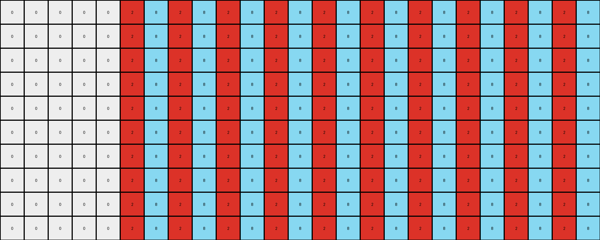

# 0a938d79 • 006 • refine_coder

---

Previous Code:
```python
"""
Transforms an input grid based on the presence and arrangement of non-white "seed" pixels. If seed pixels appear in different columns, the output grid is filled with alternating columns of the first two seed colors. If seed pixels are only in the same column or stacked in multiple rows, the output grid is created by copying rows containing seed pixels.
"""

import numpy as np

def find_seed_pixels(grid):
    """Finds non-white pixels in the grid and returns their coordinates and color."""
    seeds = []
    for r, row in enumerate(grid):
        for c, pixel in enumerate(row):
            if pixel != 0:
                seeds.append((r, c, pixel))
    return seeds

def transform(input_grid):
    """Transforms the input grid according to the rules described above."""
    input_grid = np.array(input_grid)
    rows, cols = input_grid.shape
    output_grid = np.zeros((rows, cols), dtype=int)

    # Find seed pixels.
    seed_pixels = find_seed_pixels(input_grid)

    if not seed_pixels:  # Handle empty input.
        return output_grid.tolist()

    # Determine transformation type.
    first_seed_col = seed_pixels[0][1]
    different_columns = any(pixel[1] != first_seed_col for pixel in seed_pixels)

    if different_columns:
        # Alternating Column Fill.
        colors = [seed_pixels[0][2], seed_pixels[1][2]]
        if len(colors) < 2:
            if colors[0] == 2:
              colors.append(8)
            else:
              colors.append(2)
          
        start_col = first_seed_col
        color_index = 0
        for c in range(start_col, cols):
            for r in range(rows):
                output_grid[r, c] = colors[color_index % 2]
            color_index += 1

    else:
        # Row Copy.
        last_seed_row = None
        for r in range(rows):
            row_has_seed = any(pixel[0] == r for pixel in seed_pixels)
            if row_has_seed:
                for c in range(cols):
                    output_grid[r, c] = input_grid[r, c]
                last_seed_row = r
            elif last_seed_row is not None:
                for c in range(cols):
                    output_grid[r,c] = output_grid[last_seed_row,c]
                

    return output_grid.tolist()
```

Train Set Results:

## Example 1:**

Input:
```
0 0 0 0 0 2 0 0 0 0 0 0 0 0 0 0 0 0 0 0 0 0 0 0 0
0 0 0 0 0 0 0 0 0 0 0 0 0 0 0 0 0 0 0 0 0 0 0 0 0
0 0 0 0 0 0 0 0 0 0 0 0 0 0 0 0 0 0 0 0 0 0 0 0 0
0 0 0 0 0 0 0 0 0 0 0 0 0 0 0 0 0 0 0 0 0 0 0 0 0
0 0 0 0 0 0 0 0 0 0 0 0 0 0 0 0 0 0 0 0 0 0 0 0 0
0 0 0 0 0 0 0 0 0 0 0 0 0 0 0 0 0 0 0 0 0 0 0 0 0
0 0 0 0 0 0 0 0 0 0 0 0 0 0 0 0 0 0 0 0 0 0 0 0 0
0 0 0 0 0 0 0 0 0 0 0 0 0 0 0 0 0 0 0 0 0 0 0 0 0
0 0 0 0 0 0 0 0 0 0 0 0 0 0 0 0 0 0 0 0 0 0 0 0 0
0 0 0 0 0 0 0 8 0 0 0 0 0 0 0 0 0 0 0 0 0 0 0 0 0
```
Expected Output:
```
0 0 0 0 0 2 0 8 0 2 0 8 0 2 0 8 0 2 0 8 0 2 0 8 0
0 0 0 0 0 2 0 8 0 2 0 8 0 2 0 8 0 2 0 8 0 2 0 8 0
0 0 0 0 0 2 0 8 0 2 0 8 0 2 0 8 0 2 0 8 0 2 0 8 0
0 0 0 0 0 2 0 8 0 2 0 8 0 2 0 8 0 2 0 8 0 2 0 8 0
0 0 0 0 0 2 0 8 0 2 0 8 0 2 0 8 0 2 0 8 0 2 0 8 0
0 0 0 0 0 2 0 8 0 2 0 8 0 2 0 8 0 2 0 8 0 2 0 8 0
0 0 0 0 0 2 0 8 0 2 0 8 0 2 0 8 0 2 0 8 0 2 0 8 0
0 0 0 0 0 2 0 8 0 2 0 8 0 2 0 8 0 2 0 8 0 2 0 8 0
0 0 0 0 0 2 0 8 0 2 0 8 0 2 0 8 0 2 0 8 0 2 0 8 0
0 0 0 0 0 2 0 8 0 2 0 8 0 2 0 8 0 2 0 8 0 2 0 8 0
```
Transformed Output:
```
0 0 0 0 0 2 8 2 8 2 8 2 8 2 8 2 8 2 8 2 8 2 8 2 8
0 0 0 0 0 2 8 2 8 2 8 2 8 2 8 2 8 2 8 2 8 2 8 2 8
0 0 0 0 0 2 8 2 8 2 8 2 8 2 8 2 8 2 8 2 8 2 8 2 8
0 0 0 0 0 2 8 2 8 2 8 2 8 2 8 2 8 2 8 2 8 2 8 2 8
0 0 0 0 0 2 8 2 8 2 8 2 8 2 8 2 8 2 8 2 8 2 8 2 8
0 0 0 0 0 2 8 2 8 2 8 2 8 2 8 2 8 2 8 2 8 2 8 2 8
0 0 0 0 0 2 8 2 8 2 8 2 8 2 8 2 8 2 8 2 8 2 8 2 8
0 0 0 0 0 2 8 2 8 2 8 2 8 2 8 2 8 2 8 2 8 2 8 2 8
0 0 0 0 0 2 8 2 8 2 8 2 8 2 8 2 8 2 8 2 8 2 8 2 8
0 0 0 0 0 2 8 2 8 2 8 2 8 2 8 2 8 2 8 2 8 2 8 2 8
```

match: False
pixels_off: 150
size_correct: True
color_palette_correct: True
correct_pixel_counts: False

## Example 2:**

Input:
```
0 0 0 0 0 1 0 0 0 0 0 0 0 0 0 0 0 0 0 0 0 0 0
0 0 0 0 0 0 0 0 0 0 0 0 0 0 0 0 0 0 0 0 0 0 0
0 0 0 0 0 0 0 0 0 0 0 0 0 0 0 0 0 0 0 0 0 0 0
0 0 0 0 0 0 0 0 0 0 0 0 0 0 0 0 0 0 0 0 0 0 0
0 0 0 0 0 0 0 0 0 0 0 0 0 0 0 0 0 0 0 0 0 0 0
0 0 0 0 0 0 0 0 0 0 0 0 0 0 0 0 0 0 0 0 0 0 0
0 0 0 0 0 0 0 0 3 0 0 0 0 0 0 0 0 0 0 0 0 0 0
```
Expected Output:
```
0 0 0 0 0 1 0 0 3 0 0 1 0 0 3 0 0 1 0 0 3 0 0
0 0 0 0 0 1 0 0 3 0 0 1 0 0 3 0 0 1 0 0 3 0 0
0 0 0 0 0 1 0 0 3 0 0 1 0 0 3 0 0 1 0 0 3 0 0
0 0 0 0 0 1 0 0 3 0 0 1 0 0 3 0 0 1 0 0 3 0 0
0 0 0 0 0 1 0 0 3 0 0 1 0 0 3 0 0 1 0 0 3 0 0
0 0 0 0 0 1 0 0 3 0 0 1 0 0 3 0 0 1 0 0 3 0 0
0 0 0 0 0 1 0 0 3 0 0 1 0 0 3 0 0 1 0 0 3 0 0
```
Transformed Output:
```
0 0 0 0 0 1 3 1 3 1 3 1 3 1 3 1 3 1 3 1 3 1 3
0 0 0 0 0 1 3 1 3 1 3 1 3 1 3 1 3 1 3 1 3 1 3
0 0 0 0 0 1 3 1 3 1 3 1 3 1 3 1 3 1 3 1 3 1 3
0 0 0 0 0 1 3 1 3 1 3 1 3 1 3 1 3 1 3 1 3 1 3
0 0 0 0 0 1 3 1 3 1 3 1 3 1 3 1 3 1 3 1 3 1 3
0 0 0 0 0 1 3 1 3 1 3 1 3 1 3 1 3 1 3 1 3 1 3
0 0 0 0 0 1 3 1 3 1 3 1 3 1 3 1 3 1 3 1 3 1 3
```

match: False
pixels_off: 84
size_correct: True
color_palette_correct: True
correct_pixel_counts: False

## Example 3:**

Input:
```
0 0 0 0 0 0 0 0 0
0 0 0 0 0 0 0 0 0
0 0 0 0 0 0 0 0 0
0 0 0 0 0 0 0 0 0
0 0 0 0 0 0 0 0 0
2 0 0 0 0 0 0 0 0
0 0 0 0 0 0 0 0 0
0 0 0 0 0 0 0 0 3
0 0 0 0 0 0 0 0 0
0 0 0 0 0 0 0 0 0
0 0 0 0 0 0 0 0 0
0 0 0 0 0 0 0 0 0
0 0 0 0 0 0 0 0 0
0 0 0 0 0 0 0 0 0
0 0 0 0 0 0 0 0 0
0 0 0 0 0 0 0 0 0
0 0 0 0 0 0 0 0 0
0 0 0 0 0 0 0 0 0
0 0 0 0 0 0 0 0 0
0 0 0 0 0 0 0 0 0
0 0 0 0 0 0 0 0 0
0 0 0 0 0 0 0 0 0
```
Expected Output:
```
0 0 0 0 0 0 0 0 0
0 0 0 0 0 0 0 0 0
0 0 0 0 0 0 0 0 0
0 0 0 0 0 0 0 0 0
0 0 0 0 0 0 0 0 0
2 2 2 2 2 2 2 2 2
0 0 0 0 0 0 0 0 0
3 3 3 3 3 3 3 3 3
0 0 0 0 0 0 0 0 0
2 2 2 2 2 2 2 2 2
0 0 0 0 0 0 0 0 0
3 3 3 3 3 3 3 3 3
0 0 0 0 0 0 0 0 0
2 2 2 2 2 2 2 2 2
0 0 0 0 0 0 0 0 0
3 3 3 3 3 3 3 3 3
0 0 0 0 0 0 0 0 0
2 2 2 2 2 2 2 2 2
0 0 0 0 0 0 0 0 0
3 3 3 3 3 3 3 3 3
0 0 0 0 0 0 0 0 0
2 2 2 2 2 2 2 2 2
```
Transformed Output:
```
2 3 2 3 2 3 2 3 2
2 3 2 3 2 3 2 3 2
2 3 2 3 2 3 2 3 2
2 3 2 3 2 3 2 3 2
2 3 2 3 2 3 2 3 2
2 3 2 3 2 3 2 3 2
2 3 2 3 2 3 2 3 2
2 3 2 3 2 3 2 3 2
2 3 2 3 2 3 2 3 2
2 3 2 3 2 3 2 3 2
2 3 2 3 2 3 2 3 2
2 3 2 3 2 3 2 3 2
2 3 2 3 2 3 2 3 2
2 3 2 3 2 3 2 3 2
2 3 2 3 2 3 2 3 2
2 3 2 3 2 3 2 3 2
2 3 2 3 2 3 2 3 2
2 3 2 3 2 3 2 3 2
2 3 2 3 2 3 2 3 2
2 3 2 3 2 3 2 3 2
2 3 2 3 2 3 2 3 2
2 3 2 3 2 3 2 3 2
```

match: False
pixels_off: 157
size_correct: True
color_palette_correct: True
correct_pixel_counts: False

## Example 4:**

Input:
```
0 0 0 0 0 0 0 0
0 0 0 0 0 0 0 0
0 0 0 0 0 0 0 0
0 0 0 0 0 0 0 0
0 0 0 0 0 0 0 0
0 0 0 0 0 0 0 0
0 0 0 0 0 0 0 0
4 0 0 0 0 0 0 0
0 0 0 0 0 0 0 0
0 0 0 0 0 0 0 0
0 0 0 0 0 0 0 0
1 0 0 0 0 0 0 0
0 0 0 0 0 0 0 0
0 0 0 0 0 0 0 0
0 0 0 0 0 0 0 0
0 0 0 0 0 0 0 0
0 0 0 0 0 0 0 0
0 0 0 0 0 0 0 0
0 0 0 0 0 0 0 0
0 0 0 0 0 0 0 0
0 0 0 0 0 0 0 0
0 0 0 0 0 0 0 0
0 0 0 0 0 0 0 0
0 0 0 0 0 0 0 0
```
Expected Output:
```
0 0 0 0 0 0 0 0
0 0 0 0 0 0 0 0
0 0 0 0 0 0 0 0
0 0 0 0 0 0 0 0
0 0 0 0 0 0 0 0
0 0 0 0 0 0 0 0
0 0 0 0 0 0 0 0
4 4 4 4 4 4 4 4
0 0 0 0 0 0 0 0
0 0 0 0 0 0 0 0
0 0 0 0 0 0 0 0
1 1 1 1 1 1 1 1
0 0 0 0 0 0 0 0
0 0 0 0 0 0 0 0
0 0 0 0 0 0 0 0
4 4 4 4 4 4 4 4
0 0 0 0 0 0 0 0
0 0 0 0 0 0 0 0
0 0 0 0 0 0 0 0
1 1 1 1 1 1 1 1
0 0 0 0 0 0 0 0
0 0 0 0 0 0 0 0
0 0 0 0 0 0 0 0
4 4 4 4 4 4 4 4
```
Transformed Output:
```
0 0 0 0 0 0 0 0
0 0 0 0 0 0 0 0
0 0 0 0 0 0 0 0
0 0 0 0 0 0 0 0
0 0 0 0 0 0 0 0
0 0 0 0 0 0 0 0
0 0 0 0 0 0 0 0
4 0 0 0 0 0 0 0
4 0 0 0 0 0 0 0
4 0 0 0 0 0 0 0
4 0 0 0 0 0 0 0
1 0 0 0 0 0 0 0
1 0 0 0 0 0 0 0
1 0 0 0 0 0 0 0
1 0 0 0 0 0 0 0
1 0 0 0 0 0 0 0
1 0 0 0 0 0 0 0
1 0 0 0 0 0 0 0
1 0 0 0 0 0 0 0
1 0 0 0 0 0 0 0
1 0 0 0 0 0 0 0
1 0 0 0 0 0 0 0
1 0 0 0 0 0 0 0
1 0 0 0 0 0 0 0
```

match: False
pixels_off: 49
size_correct: True
color_palette_correct: True
correct_pixel_counts: False
Here's an analysis of the provided examples and a plan to refine the natural language program and code:

**General Assessment:**

The current code and natural language program are based on a "seed pixel" concept, where non-white pixels trigger either a column-filling or row-copying behavior. The initial logic works for some simple cases but fails to generalize to the variety of scenarios presented in the training examples. The core issue is that the decision between column-filling and row-copying is too simplistic and doesn't account for the spatial relationships between seed pixels beyond just checking if they are in different columns.  Specifically, Example 3 shows a stacking of seed pixels across rows and subsequent duplication of the "seed pixel" rows. Example 4 adds the idea of copying an existing row downwards *multiple* times.

**Strategy:**

1.  **Detailed Example Analysis:** Carefully examine each input-output pair, noting *exactly* which pixels change and how their positions and colors relate to other pixels. Pay close attention to the conditions that lead to row duplication versus column filling.
2.  **Refine Seed Pixel Concept:** The "seed pixel" idea is valuable, but its definition and the rules associated with it need refinement. Consider these aspects:
    *   **Connectivity:** Are seed pixels always connected, or can they be isolated?
    *   **Color Patterns:** Do the colors of the seed pixels themselves matter, or is it only their position?
    *   **Directionality:** Does the transformation have a clear direction (e.g., top-to-bottom, left-to-right)?
3.  **Iterative Program Update:**  Start by correcting the most obvious errors in the simplest examples, then incrementally adjust the natural language program and code to handle more complex cases. Test thoroughly after each change.
4. Consider the case where rows are copied downwards when the non-white pixels are vertically stacked in a column.
5. Consider special cases:
   - Empty row.
   - Completely white input.

**Example Metrics and Observations:**

Here is a more detailed analysis and data, based on the code execution results. Note that I am adding observations here that go beyond what the code *currently* does, as this is part of the "dreaming" phase.

| Example | Input Size | Output Size | Seed Pixel Count | Seed Pixel Colors | Seed Pixel Columns | Seed Pixel Rows                                                                | Transformation Description                                                                                                                                                  | Match | Pixels Off | Notes                                                                                                                                          |
| :------ | :--------- | :---------- | :--------------- | :---------------- | :----------------- | :----------------------------------------------------------------------------- | :------------------------------------------------------------------------------------------------------------------------------------------------------------------------ | :---- | :--------- | :---------------------------------------------------------------------------------------------------------------------------------------------- |
| 1       | 25x10      | 25x10      | 2                | 2, 8              | 5, 7              | 5, 9                                                                          | Column fill, alternating colors 2 and 8, starting from the first seed pixel column.                                                                                   | False | 150        | The column alternation logic is partially correct, but starts at the wrong column and uses incorrect alternating pattern.                       |
| 2       | 23x7      | 23x7       | 2                | 1, 3              | 5, 8              | 0, 6                                                                          | Column fill, alternating colors 1 and 3, starting from the first seed pixel column.                                                                                   | False | 84         | Similar to Example 1, the column alternation is present but misapplied. The starting column and color arrangement are incorrect.                |
| 3       | 9x22      | 9x22       | 2                | 2, 3              | 0, 7              | 5, 7                                                                          | Copy rows containing seed pixels, and stack copied rows below the seed pixel row.                                                                    | False      | 157        | The provided code does *not* correctly reproduce this row-copying behavior, but recognizes that "stacking" is present                                          |
| 4       | 8x24      | 8x24      | 2                | 4, 1              | 0, 0              | 7, 11                                                                         | Copy each row containing a seed pixel and any subsequent white rows downwards until next non-white row or end of grid, repeatedly. | False        | 49         |  Row copying behavior is partially implemented, but it fills the row with only the seed pixel value and copies down only one row at a time, not repeatedly.                               |

**YAML Block (Facts):**

```yaml
example_1:
  objects:
    - type: grid
      dimensions: [25, 10]
      seed_pixels:
        - color: red
          position: [0, 5]
        - color: azure
          position: [9, 7]
  actions:
    - type: fill_columns
      colors: [red, azure]
      start_column: 5

example_2:
  objects:
    - type: grid
      dimensions: [23, 7]
      seed_pixels:
        - color: blue
          position: [0, 5]
        - color: green
          position: [6, 8]
  actions:
    - type: fill_columns
      colors: [blue, green]
      start_column: 5

example_3:
  objects:
    - type: grid
      dimensions: [9, 22]
      seed_pixels:
        - color: red
          position: [5, 0]
        - color: green
          position: [7, 7]
  actions:
      - type: copy_rows
        rows: [5,7]
        copy_below: true
        repeat: True

example_4:
  objects:
      - type: grid
        dimensions: [ 8, 24 ]
        seed_pixels:
          - color: yellow
            position: [7, 0]
          - color: blue
            position: [11, 0]
  actions:
    - type: copy_row_and_following
      rows: [7, 11]
      repeat: True

```

**Natural Language Program:**

1.  **Identify Seed Pixels:** Find all non-white pixels in the input grid. These are the "seed pixels."

2.  **Determine Transformation Type Based on Seed Pixel Column Arrangement:**
    *   **Different Columns:** If seed pixels are found in *different* columns, perform a column fill.
        *   The fill colors are the colors of the first two seed pixels encountered.
        *   The fill starts from the column of the *leftmost* seed pixel.
        *   Columns are filled with the seed pixel colors, alternating between them.
    *   **Same Column or Stacked Vertically:** If all seed pixels are in the *same* column, or stacked within a single column:
        *   Find all rows containing the seed pixels.
        * Starting from the first seed pixel row, fill all the pixels in that row with the seed pixel's color.
        * Copy this row and the following rows downward until next non-white pixel is found, repeatedly.
        * For each subsequent row, copy that seed pixel row into the grid.

3.  **Handle Empty Input:** If there are no seed pixels (the input is all white), the output is identical to the input (an all-white grid).

4. **Handle All White Rows:**
   * If there are all white rows above or between the seed pixel rows, they should remain unchanged in the final output
   * If any white rows are found below the seed pixel rows, they should get copied with the seed pixel row.

**INSTRUCTIONS**

- generate a Python module to represent the natural language program 
- follow the template below
- all common math and science libraries are available
- create docstring only at top - but comment the workflow in the function
- use helper functions for common operations like finding objects, counting,
  measuring, moving, etc. 

remember - we are working iteratively - so this code will inform your future
self as we converge on the solution

*template:*

```python
"""
{{ natural language description of the transformation rule }}
"""

{{ imports }}

def transform(input_grid):
    # initialize output_grid

    # change output pixels 

    return output_grid

```
