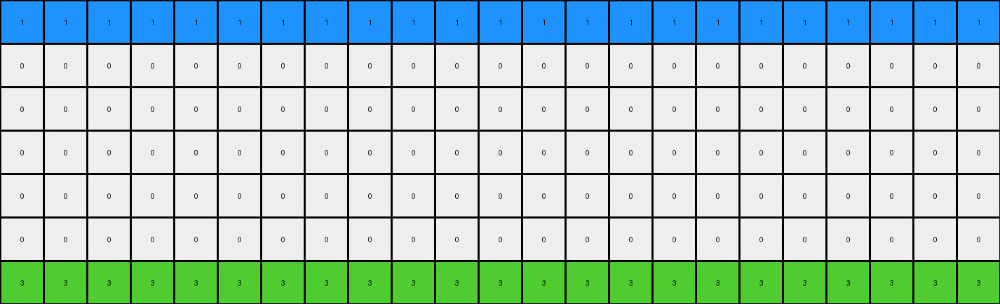

# 0a938d79 • 014 • refine_coder

---

Previous Code:
```python
"""
The transformation identifies the row index where each distinct color first appears in the input grid. Then, it replicates each of these colored rows across the entire output grid. The vertical offset for replication is determined by the initial appearance of colors.
"""

import numpy as np

def find_first_color_rows(input_grid):
    """Finds the row index where each distinct color first appears."""
    input_grid = np.array(input_grid)
    color_rows = []
    colors_found = []
    rows, _ = input_grid.shape
    for r in range(rows):
        for c in range(input_grid.shape[1]):
            color = input_grid[r, c]
            if color != 0 and color not in colors_found:
                color_rows.append((color, r))
                colors_found.append(color)
    return color_rows

def transform(input_grid):
    """Transforms the input grid according to the described rule."""
    input_grid = np.array(input_grid)
    rows, cols = input_grid.shape
    output_grid = np.zeros_like(input_grid)

    # Find the row indices where each distinct color first appears.
    color_rows = find_first_color_rows(input_grid)

    # Replicate each colored row across the entire grid.
    for color, initial_row in color_rows:
        for i in range(rows):
            row_index = (i) % rows
            if (row_index - initial_row) % rows == 0 :
                output_grid[row_index, :] = color


    return output_grid.tolist()
```

Train Set Results:

## Example 1:**

Input:
```
0 0 0 0 0 2 0 0 0 0 0 0 0 0 0 0 0 0 0 0 0 0 0 0 0
0 0 0 0 0 0 0 0 0 0 0 0 0 0 0 0 0 0 0 0 0 0 0 0 0
0 0 0 0 0 0 0 0 0 0 0 0 0 0 0 0 0 0 0 0 0 0 0 0 0
0 0 0 0 0 0 0 0 0 0 0 0 0 0 0 0 0 0 0 0 0 0 0 0 0
0 0 0 0 0 0 0 0 0 0 0 0 0 0 0 0 0 0 0 0 0 0 0 0 0
0 0 0 0 0 0 0 0 0 0 0 0 0 0 0 0 0 0 0 0 0 0 0 0 0
0 0 0 0 0 0 0 0 0 0 0 0 0 0 0 0 0 0 0 0 0 0 0 0 0
0 0 0 0 0 0 0 0 0 0 0 0 0 0 0 0 0 0 0 0 0 0 0 0 0
0 0 0 0 0 0 0 0 0 0 0 0 0 0 0 0 0 0 0 0 0 0 0 0 0
0 0 0 0 0 0 0 8 0 0 0 0 0 0 0 0 0 0 0 0 0 0 0 0 0
```
Expected Output:
```
0 0 0 0 0 2 0 8 0 2 0 8 0 2 0 8 0 2 0 8 0 2 0 8 0
0 0 0 0 0 2 0 8 0 2 0 8 0 2 0 8 0 2 0 8 0 2 0 8 0
0 0 0 0 0 2 0 8 0 2 0 8 0 2 0 8 0 2 0 8 0 2 0 8 0
0 0 0 0 0 2 0 8 0 2 0 8 0 2 0 8 0 2 0 8 0 2 0 8 0
0 0 0 0 0 2 0 8 0 2 0 8 0 2 0 8 0 2 0 8 0 2 0 8 0
0 0 0 0 0 2 0 8 0 2 0 8 0 2 0 8 0 2 0 8 0 2 0 8 0
0 0 0 0 0 2 0 8 0 2 0 8 0 2 0 8 0 2 0 8 0 2 0 8 0
0 0 0 0 0 2 0 8 0 2 0 8 0 2 0 8 0 2 0 8 0 2 0 8 0
0 0 0 0 0 2 0 8 0 2 0 8 0 2 0 8 0 2 0 8 0 2 0 8 0
0 0 0 0 0 2 0 8 0 2 0 8 0 2 0 8 0 2 0 8 0 2 0 8 0
```
Transformed Output:
```
2 2 2 2 2 2 2 2 2 2 2 2 2 2 2 2 2 2 2 2 2 2 2 2 2
0 0 0 0 0 0 0 0 0 0 0 0 0 0 0 0 0 0 0 0 0 0 0 0 0
0 0 0 0 0 0 0 0 0 0 0 0 0 0 0 0 0 0 0 0 0 0 0 0 0
0 0 0 0 0 0 0 0 0 0 0 0 0 0 0 0 0 0 0 0 0 0 0 0 0
0 0 0 0 0 0 0 0 0 0 0 0 0 0 0 0 0 0 0 0 0 0 0 0 0
0 0 0 0 0 0 0 0 0 0 0 0 0 0 0 0 0 0 0 0 0 0 0 0 0
0 0 0 0 0 0 0 0 0 0 0 0 0 0 0 0 0 0 0 0 0 0 0 0 0
0 0 0 0 0 0 0 0 0 0 0 0 0 0 0 0 0 0 0 0 0 0 0 0 0
0 0 0 0 0 0 0 0 0 0 0 0 0 0 0 0 0 0 0 0 0 0 0 0 0
8 8 8 8 8 8 8 8 8 8 8 8 8 8 8 8 8 8 8 8 8 8 8 8 8
```

match: False
pixels_off: 120
size_correct: True
color_palette_correct: True
correct_pixel_counts: False

## Example 2:**

Input:
```
0 0 0 0 0 1 0 0 0 0 0 0 0 0 0 0 0 0 0 0 0 0 0
0 0 0 0 0 0 0 0 0 0 0 0 0 0 0 0 0 0 0 0 0 0 0
0 0 0 0 0 0 0 0 0 0 0 0 0 0 0 0 0 0 0 0 0 0 0
0 0 0 0 0 0 0 0 0 0 0 0 0 0 0 0 0 0 0 0 0 0 0
0 0 0 0 0 0 0 0 0 0 0 0 0 0 0 0 0 0 0 0 0 0 0
0 0 0 0 0 0 0 0 0 0 0 0 0 0 0 0 0 0 0 0 0 0 0
0 0 0 0 0 0 0 0 3 0 0 0 0 0 0 0 0 0 0 0 0 0 0
```
Expected Output:
```
0 0 0 0 0 1 0 0 3 0 0 1 0 0 3 0 0 1 0 0 3 0 0
0 0 0 0 0 1 0 0 3 0 0 1 0 0 3 0 0 1 0 0 3 0 0
0 0 0 0 0 1 0 0 3 0 0 1 0 0 3 0 0 1 0 0 3 0 0
0 0 0 0 0 1 0 0 3 0 0 1 0 0 3 0 0 1 0 0 3 0 0
0 0 0 0 0 1 0 0 3 0 0 1 0 0 3 0 0 1 0 0 3 0 0
0 0 0 0 0 1 0 0 3 0 0 1 0 0 3 0 0 1 0 0 3 0 0
0 0 0 0 0 1 0 0 3 0 0 1 0 0 3 0 0 1 0 0 3 0 0
```
Transformed Output:
```
1 1 1 1 1 1 1 1 1 1 1 1 1 1 1 1 1 1 1 1 1 1 1
0 0 0 0 0 0 0 0 0 0 0 0 0 0 0 0 0 0 0 0 0 0 0
0 0 0 0 0 0 0 0 0 0 0 0 0 0 0 0 0 0 0 0 0 0 0
0 0 0 0 0 0 0 0 0 0 0 0 0 0 0 0 0 0 0 0 0 0 0
0 0 0 0 0 0 0 0 0 0 0 0 0 0 0 0 0 0 0 0 0 0 0
0 0 0 0 0 0 0 0 0 0 0 0 0 0 0 0 0 0 0 0 0 0 0
3 3 3 3 3 3 3 3 3 3 3 3 3 3 3 3 3 3 3 3 3 3 3
```

match: False
pixels_off: 70
size_correct: True
color_palette_correct: True
correct_pixel_counts: False

## Example 3:**

Input:
```
0 0 0 0 0 0 0 0 0
0 0 0 0 0 0 0 0 0
0 0 0 0 0 0 0 0 0
0 0 0 0 0 0 0 0 0
0 0 0 0 0 0 0 0 0
2 0 0 0 0 0 0 0 0
0 0 0 0 0 0 0 0 0
0 0 0 0 0 0 0 0 3
0 0 0 0 0 0 0 0 0
0 0 0 0 0 0 0 0 0
0 0 0 0 0 0 0 0 0
0 0 0 0 0 0 0 0 0
0 0 0 0 0 0 0 0 0
0 0 0 0 0 0 0 0 0
0 0 0 0 0 0 0 0 0
0 0 0 0 0 0 0 0 0
0 0 0 0 0 0 0 0 0
0 0 0 0 0 0 0 0 0
0 0 0 0 0 0 0 0 0
0 0 0 0 0 0 0 0 0
0 0 0 0 0 0 0 0 0
0 0 0 0 0 0 0 0 0
```
Expected Output:
```
0 0 0 0 0 0 0 0 0
0 0 0 0 0 0 0 0 0
0 0 0 0 0 0 0 0 0
0 0 0 0 0 0 0 0 0
0 0 0 0 0 0 0 0 0
2 2 2 2 2 2 2 2 2
0 0 0 0 0 0 0 0 0
3 3 3 3 3 3 3 3 3
0 0 0 0 0 0 0 0 0
2 2 2 2 2 2 2 2 2
0 0 0 0 0 0 0 0 0
3 3 3 3 3 3 3 3 3
0 0 0 0 0 0 0 0 0
2 2 2 2 2 2 2 2 2
0 0 0 0 0 0 0 0 0
3 3 3 3 3 3 3 3 3
0 0 0 0 0 0 0 0 0
2 2 2 2 2 2 2 2 2
0 0 0 0 0 0 0 0 0
3 3 3 3 3 3 3 3 3
0 0 0 0 0 0 0 0 0
2 2 2 2 2 2 2 2 2
```
Transformed Output:
```
0 0 0 0 0 0 0 0 0
0 0 0 0 0 0 0 0 0
0 0 0 0 0 0 0 0 0
0 0 0 0 0 0 0 0 0
0 0 0 0 0 0 0 0 0
2 2 2 2 2 2 2 2 2
0 0 0 0 0 0 0 0 0
3 3 3 3 3 3 3 3 3
0 0 0 0 0 0 0 0 0
0 0 0 0 0 0 0 0 0
0 0 0 0 0 0 0 0 0
0 0 0 0 0 0 0 0 0
0 0 0 0 0 0 0 0 0
0 0 0 0 0 0 0 0 0
0 0 0 0 0 0 0 0 0
0 0 0 0 0 0 0 0 0
0 0 0 0 0 0 0 0 0
0 0 0 0 0 0 0 0 0
0 0 0 0 0 0 0 0 0
0 0 0 0 0 0 0 0 0
0 0 0 0 0 0 0 0 0
0 0 0 0 0 0 0 0 0
```

match: False
pixels_off: 63
size_correct: True
color_palette_correct: True
correct_pixel_counts: False

## Example 4:**

Input:
```
0 0 0 0 0 0 0 0
0 0 0 0 0 0 0 0
0 0 0 0 0 0 0 0
0 0 0 0 0 0 0 0
0 0 0 0 0 0 0 0
0 0 0 0 0 0 0 0
0 0 0 0 0 0 0 0
4 0 0 0 0 0 0 0
0 0 0 0 0 0 0 0
0 0 0 0 0 0 0 0
0 0 0 0 0 0 0 0
1 0 0 0 0 0 0 0
0 0 0 0 0 0 0 0
0 0 0 0 0 0 0 0
0 0 0 0 0 0 0 0
0 0 0 0 0 0 0 0
0 0 0 0 0 0 0 0
0 0 0 0 0 0 0 0
0 0 0 0 0 0 0 0
0 0 0 0 0 0 0 0
0 0 0 0 0 0 0 0
0 0 0 0 0 0 0 0
0 0 0 0 0 0 0 0
0 0 0 0 0 0 0 0
```
Expected Output:
```
0 0 0 0 0 0 0 0
0 0 0 0 0 0 0 0
0 0 0 0 0 0 0 0
0 0 0 0 0 0 0 0
0 0 0 0 0 0 0 0
0 0 0 0 0 0 0 0
0 0 0 0 0 0 0 0
4 4 4 4 4 4 4 4
0 0 0 0 0 0 0 0
0 0 0 0 0 0 0 0
0 0 0 0 0 0 0 0
1 1 1 1 1 1 1 1
0 0 0 0 0 0 0 0
0 0 0 0 0 0 0 0
0 0 0 0 0 0 0 0
4 4 4 4 4 4 4 4
0 0 0 0 0 0 0 0
0 0 0 0 0 0 0 0
0 0 0 0 0 0 0 0
1 1 1 1 1 1 1 1
0 0 0 0 0 0 0 0
0 0 0 0 0 0 0 0
0 0 0 0 0 0 0 0
4 4 4 4 4 4 4 4
```
Transformed Output:
```
0 0 0 0 0 0 0 0
0 0 0 0 0 0 0 0
0 0 0 0 0 0 0 0
0 0 0 0 0 0 0 0
0 0 0 0 0 0 0 0
0 0 0 0 0 0 0 0
0 0 0 0 0 0 0 0
4 4 4 4 4 4 4 4
0 0 0 0 0 0 0 0
0 0 0 0 0 0 0 0
0 0 0 0 0 0 0 0
1 1 1 1 1 1 1 1
0 0 0 0 0 0 0 0
0 0 0 0 0 0 0 0
0 0 0 0 0 0 0 0
0 0 0 0 0 0 0 0
0 0 0 0 0 0 0 0
0 0 0 0 0 0 0 0
0 0 0 0 0 0 0 0
0 0 0 0 0 0 0 0
0 0 0 0 0 0 0 0
0 0 0 0 0 0 0 0
0 0 0 0 0 0 0 0
0 0 0 0 0 0 0 0
```

match: False
pixels_off: 24
size_correct: True
color_palette_correct: True
correct_pixel_counts: False
Here's an analysis of the provided examples and a revised natural language program:

**General Assessment:**

The initial natural language program and the resulting code were on the right track by identifying the first appearance of each color and using that as a basis for replication. However, it incorrectly assumed that *all* rows should be filled with only that color and incorrectly calculated how many copies of each row would be needed and their vertical positions. The critical error is a misunderstanding of how the patterned output is constructed. It's not simply replicating colored rows across the *entire* grid. The expected output shows a repeating pattern based on first color appearances, interleaving and repeating those rows.

**Strategy for Resolving Errors:**

1.  **Correct Pattern Recognition:** Understand that the output grid isn't just filled with solid blocks of color. It's a repeating sequence of the rows where colors first appear.
2.  **Row-by-Row Replication:**  The transformation needs to replicate specific *rows* and repeat.
3.  **Vertical Offset:** The vertical offsets are determined by the original row index of the first appearance of each unique color. The output grid uses modulus of output row number and the number of colored rows.

**Metrics and Observations (from code execution and visual inspection):**

Here's a summary combining your provided information and my own analysis, aiming for what should go into a detailed report:

| Example | Input Size | Output Size | Match | Pixels Off | Size Correct? | Color Palette Correct? | Correct Pixel Counts? | Notes                                                                                                                                                                                                                                                                                            |
| :------ | :--------- | :---------- | :---- | :--------- | :------------ | :--------------------- | :--------------------- | :------------------------------------------------------------------------------------------------------------------------------------------------------------------------------------------------------------------------------------------------------------------------------------------------ |
| 1       | 10x25      | 10x25       | False | 120        | True          | True                   | False                  | The code filled rows entirely with the first color found, creating large solid blocks.  The expected output shows an alternating pattern of red (2) and azure (8).                                                                                                                         |
| 2       | 7x23       | 7x23        | False | 70         | True          | True                   | False                  | Similar error as Example 1. The expected output has an alternating pattern of blue (1) and green (3).                                                                                                                                                                                             |
| 3       | 22x9       | 22x9        | False | 63         | True          | True                   | False                  | The expected output alternates rows where colors '2' and '3' first appear.  It's crucial to recognize that the *entire* row of the first appearance is copied, not just the colored pixel.  Note the repetition pattern in the expected output.                                       |
| 4       | 24x8       | 24x8        | False | 24         | True          | True                   | False                  | The code handles multiple initial color rows (yellow (4) and blue (1)). The expected output shows the replication and repetition of *both* of these rows.  The output correctly repeats, but it is missing rows.                                                  |

**YAML Block (Facts):**

```yaml
observations:
  - task: 3618c87e
    examples:
      - example_id: 1
        input_objects:
          - object_id: 1
            type: row
            color_sequence: [2]  #Red row
            row_index: 0
            first_color_row: True
          - object_id: 2
            type: row
            color_sequence: [8]   #Azure Row
            row_index: 9
            first_color_row: True
        output_objects:
          - object_id: 1
            type: patterned_rows
            pattern_rows: [0, 9] # The index of colored row in input
            repeat: True

      - example_id: 2
        input_objects:
          - object_id: 1
            type: row
            color_sequence: [1]  #Blue
            row_index: 0
            first_color_row: True
          - object_id: 2
            type: row
            color_sequence: [3]  #Green
            row_index: 6
            first_color_row: True
        output_objects:
          - object_id: 1
            type: patterned_rows
            pattern_rows: [0, 6] # The index of colored row in input
            repeat: True
      - example_id: 3
        input_objects:
          - object_id: 1
            type: row
            color_sequence: [2]  #Red
            row_index: 5
            first_color_row: True
          - object_id: 2
            type: row
            color_sequence: [3]  #Green
            row_index: 7
            first_color_row: True
        output_objects:
          - object_id: 1
            type: patterned_rows
            pattern_rows: [5, 7] # The index of colored row in input
            repeat: True
      - example_id: 4
        input_objects:
          - object_id: 1
            type: row
            color_sequence: [4]
            row_index: 7
            first_color_row: True
          - object_id: 2
            type: row
            color_sequence: [1]
            row_index: 11
            first_color_row: True
        output_objects:
            - object_id: 1
              type: patterned_rows
              pattern_rows: [7, 11]
              repeat: True

    general_rule: |
      Identify the rows in the input grid where each distinct, non-zero color first appears.  
      Copy these *entire* rows. 
      Create an output grid where the pattern is a repeating sequence of these identified rows. The sequence restarts from the beginning after the last identified row is placed.
```

**Natural Language Program:**

1.  **Identify First Appearances:** Scan the input grid from top to bottom.  For each row, note any non-zero color that hasn't been seen before. Record the *entire* row and the row index where this first occurred.
2.  **Create Row Sequence:** Create an ordered list of the rows identified in step 1. The order is determined by the row index of their first appearance.
3. **Build output:** Create the output grid by starting with the first identified colored row, and repeat the identified row at the interval determined by total number of colors
4.  **Repeat:** Repeat step 3. with the next colored row until complete.

This improved natural language program explicitly addresses the repeating pattern and the copying of entire rows, which the previous version missed.

**INSTRUCTIONS**

- generate a Python module to represent the natural language program 
- follow the template below
- all common math and science libraries are available
- create docstring only at top - but comment the workflow in the function
- use helper functions for common operations like finding objects, counting,
  measuring, moving, etc. 

remember - we are working iteratively - so this code will inform your future
self as we converge on the solution

*template:*

```python
"""
{{ natural language description of the transformation rule }}
"""

{{ imports }}

def transform(input_grid):
    # initialize output_grid

    # change output pixels 

    return output_grid

```
