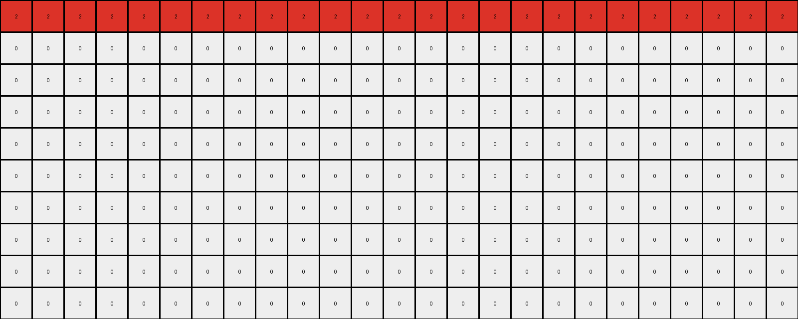
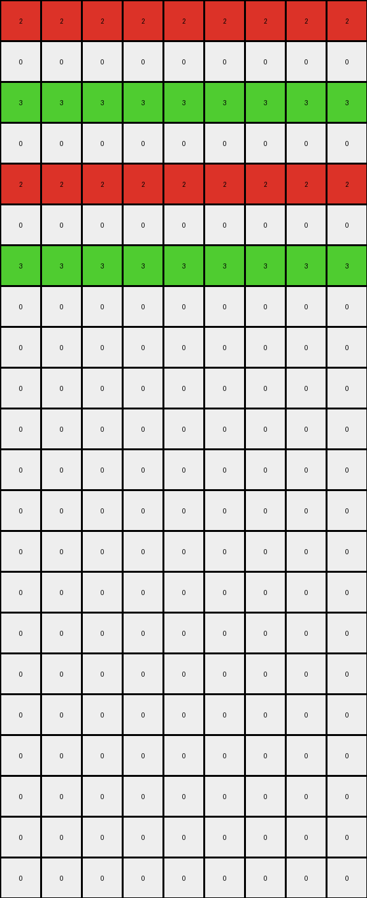
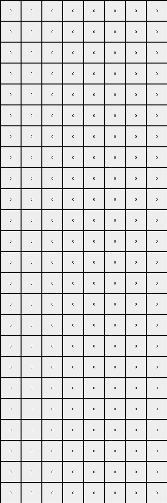

# 0a938d79 • 020 • refine_coder

---

Previous Code:
```python
"""
Replicates red and green pixels from the input grid horizontally across their respective rows,
then repeats this pattern of red line, a white line, green line, a white line, throughout the output grid.
"""

import numpy as np

def find_pixel_by_color(grid, color):
    # Find the coordinates of the first pixel with the specified color.
    coords = np.argwhere(grid == color)
    if coords.size > 0:
      return coords[0]
    return None

def transform(input_grid):
    # Initialize output_grid as a copy of input_grid, filled with white (0).
    output_grid = np.zeros_like(input_grid)

    # Find the red (2) and green (3) pixels in the input_grid.
    red_coord = find_pixel_by_color(input_grid, 2)
    green_coord = find_pixel_by_color(input_grid, 3)

    # Extend red and green pixels horizontally.
    if red_coord is not None:
        output_grid[red_coord[0], :] = 2
    if green_coord is not None:
        output_grid[green_coord[0], :] = 3

    # Create repeating pattern.
    if red_coord is not None and green_coord is not None:
      red_row = red_coord[0]
      green_row = green_coord[0]
      rows, cols = output_grid.shape
      
      pattern_rows = []
      
      pattern_rows.append(output_grid[red_row,:])
      pattern_rows.append(np.zeros(cols, dtype=int))
      pattern_rows.append(output_grid[green_row,:])
      pattern_rows.append(np.zeros(cols, dtype=int))
      
      for i in range(0,rows,4):
          for j in range(len(pattern_rows)):
            if i + j < rows:
                output_grid[i+j,:] = pattern_rows[j]


    return output_grid
```

Train Set Results:

## Example 1:**

Input:
```
0 0 0 0 0 2 0 0 0 0 0 0 0 0 0 0 0 0 0 0 0 0 0 0 0
0 0 0 0 0 0 0 0 0 0 0 0 0 0 0 0 0 0 0 0 0 0 0 0 0
0 0 0 0 0 0 0 0 0 0 0 0 0 0 0 0 0 0 0 0 0 0 0 0 0
0 0 0 0 0 0 0 0 0 0 0 0 0 0 0 0 0 0 0 0 0 0 0 0 0
0 0 0 0 0 0 0 0 0 0 0 0 0 0 0 0 0 0 0 0 0 0 0 0 0
0 0 0 0 0 0 0 0 0 0 0 0 0 0 0 0 0 0 0 0 0 0 0 0 0
0 0 0 0 0 0 0 0 0 0 0 0 0 0 0 0 0 0 0 0 0 0 0 0 0
0 0 0 0 0 0 0 0 0 0 0 0 0 0 0 0 0 0 0 0 0 0 0 0 0
0 0 0 0 0 0 0 0 0 0 0 0 0 0 0 0 0 0 0 0 0 0 0 0 0
0 0 0 0 0 0 0 8 0 0 0 0 0 0 0 0 0 0 0 0 0 0 0 0 0
```
Expected Output:
```
0 0 0 0 0 2 0 8 0 2 0 8 0 2 0 8 0 2 0 8 0 2 0 8 0
0 0 0 0 0 2 0 8 0 2 0 8 0 2 0 8 0 2 0 8 0 2 0 8 0
0 0 0 0 0 2 0 8 0 2 0 8 0 2 0 8 0 2 0 8 0 2 0 8 0
0 0 0 0 0 2 0 8 0 2 0 8 0 2 0 8 0 2 0 8 0 2 0 8 0
0 0 0 0 0 2 0 8 0 2 0 8 0 2 0 8 0 2 0 8 0 2 0 8 0
0 0 0 0 0 2 0 8 0 2 0 8 0 2 0 8 0 2 0 8 0 2 0 8 0
0 0 0 0 0 2 0 8 0 2 0 8 0 2 0 8 0 2 0 8 0 2 0 8 0
0 0 0 0 0 2 0 8 0 2 0 8 0 2 0 8 0 2 0 8 0 2 0 8 0
0 0 0 0 0 2 0 8 0 2 0 8 0 2 0 8 0 2 0 8 0 2 0 8 0
0 0 0 0 0 2 0 8 0 2 0 8 0 2 0 8 0 2 0 8 0 2 0 8 0
```
Transformed Output:
```
2 2 2 2 2 2 2 2 2 2 2 2 2 2 2 2 2 2 2 2 2 2 2 2 2
0 0 0 0 0 0 0 0 0 0 0 0 0 0 0 0 0 0 0 0 0 0 0 0 0
0 0 0 0 0 0 0 0 0 0 0 0 0 0 0 0 0 0 0 0 0 0 0 0 0
0 0 0 0 0 0 0 0 0 0 0 0 0 0 0 0 0 0 0 0 0 0 0 0 0
0 0 0 0 0 0 0 0 0 0 0 0 0 0 0 0 0 0 0 0 0 0 0 0 0
0 0 0 0 0 0 0 0 0 0 0 0 0 0 0 0 0 0 0 0 0 0 0 0 0
0 0 0 0 0 0 0 0 0 0 0 0 0 0 0 0 0 0 0 0 0 0 0 0 0
0 0 0 0 0 0 0 0 0 0 0 0 0 0 0 0 0 0 0 0 0 0 0 0 0
0 0 0 0 0 0 0 0 0 0 0 0 0 0 0 0 0 0 0 0 0 0 0 0 0
0 0 0 0 0 0 0 0 0 0 0 0 0 0 0 0 0 0 0 0 0 0 0 0 0
```

match: False
pixels_off: 110
size_correct: True
color_palette_correct: True
correct_pixel_counts: False

## Example 2:**

Input:
```
0 0 0 0 0 1 0 0 0 0 0 0 0 0 0 0 0 0 0 0 0 0 0
0 0 0 0 0 0 0 0 0 0 0 0 0 0 0 0 0 0 0 0 0 0 0
0 0 0 0 0 0 0 0 0 0 0 0 0 0 0 0 0 0 0 0 0 0 0
0 0 0 0 0 0 0 0 0 0 0 0 0 0 0 0 0 0 0 0 0 0 0
0 0 0 0 0 0 0 0 0 0 0 0 0 0 0 0 0 0 0 0 0 0 0
0 0 0 0 0 0 0 0 0 0 0 0 0 0 0 0 0 0 0 0 0 0 0
0 0 0 0 0 0 0 0 3 0 0 0 0 0 0 0 0 0 0 0 0 0 0
```
Expected Output:
```
0 0 0 0 0 1 0 0 3 0 0 1 0 0 3 0 0 1 0 0 3 0 0
0 0 0 0 0 1 0 0 3 0 0 1 0 0 3 0 0 1 0 0 3 0 0
0 0 0 0 0 1 0 0 3 0 0 1 0 0 3 0 0 1 0 0 3 0 0
0 0 0 0 0 1 0 0 3 0 0 1 0 0 3 0 0 1 0 0 3 0 0
0 0 0 0 0 1 0 0 3 0 0 1 0 0 3 0 0 1 0 0 3 0 0
0 0 0 0 0 1 0 0 3 0 0 1 0 0 3 0 0 1 0 0 3 0 0
0 0 0 0 0 1 0 0 3 0 0 1 0 0 3 0 0 1 0 0 3 0 0
```
Transformed Output:
```
0 0 0 0 0 0 0 0 0 0 0 0 0 0 0 0 0 0 0 0 0 0 0
0 0 0 0 0 0 0 0 0 0 0 0 0 0 0 0 0 0 0 0 0 0 0
0 0 0 0 0 0 0 0 0 0 0 0 0 0 0 0 0 0 0 0 0 0 0
0 0 0 0 0 0 0 0 0 0 0 0 0 0 0 0 0 0 0 0 0 0 0
0 0 0 0 0 0 0 0 0 0 0 0 0 0 0 0 0 0 0 0 0 0 0
0 0 0 0 0 0 0 0 0 0 0 0 0 0 0 0 0 0 0 0 0 0 0
3 3 3 3 3 3 3 3 3 3 3 3 3 3 3 3 3 3 3 3 3 3 3
```

match: False
pixels_off: 56
size_correct: True
color_palette_correct: True
correct_pixel_counts: False

## Example 3:**

Input:
```
0 0 0 0 0 0 0 0 0
0 0 0 0 0 0 0 0 0
0 0 0 0 0 0 0 0 0
0 0 0 0 0 0 0 0 0
0 0 0 0 0 0 0 0 0
2 0 0 0 0 0 0 0 0
0 0 0 0 0 0 0 0 0
0 0 0 0 0 0 0 0 3
0 0 0 0 0 0 0 0 0
0 0 0 0 0 0 0 0 0
0 0 0 0 0 0 0 0 0
0 0 0 0 0 0 0 0 0
0 0 0 0 0 0 0 0 0
0 0 0 0 0 0 0 0 0
0 0 0 0 0 0 0 0 0
0 0 0 0 0 0 0 0 0
0 0 0 0 0 0 0 0 0
0 0 0 0 0 0 0 0 0
0 0 0 0 0 0 0 0 0
0 0 0 0 0 0 0 0 0
0 0 0 0 0 0 0 0 0
0 0 0 0 0 0 0 0 0
```
Expected Output:
```
0 0 0 0 0 0 0 0 0
0 0 0 0 0 0 0 0 0
0 0 0 0 0 0 0 0 0
0 0 0 0 0 0 0 0 0
0 0 0 0 0 0 0 0 0
2 2 2 2 2 2 2 2 2
0 0 0 0 0 0 0 0 0
3 3 3 3 3 3 3 3 3
0 0 0 0 0 0 0 0 0
2 2 2 2 2 2 2 2 2
0 0 0 0 0 0 0 0 0
3 3 3 3 3 3 3 3 3
0 0 0 0 0 0 0 0 0
2 2 2 2 2 2 2 2 2
0 0 0 0 0 0 0 0 0
3 3 3 3 3 3 3 3 3
0 0 0 0 0 0 0 0 0
2 2 2 2 2 2 2 2 2
0 0 0 0 0 0 0 0 0
3 3 3 3 3 3 3 3 3
0 0 0 0 0 0 0 0 0
2 2 2 2 2 2 2 2 2
```
Transformed Output:
```
2 2 2 2 2 2 2 2 2
0 0 0 0 0 0 0 0 0
3 3 3 3 3 3 3 3 3
0 0 0 0 0 0 0 0 0
2 2 2 2 2 2 2 2 2
0 0 0 0 0 0 0 0 0
3 3 3 3 3 3 3 3 3
0 0 0 0 0 0 0 0 0
0 0 0 0 0 0 0 0 0
0 0 0 0 0 0 0 0 0
0 0 0 0 0 0 0 0 0
0 0 0 0 0 0 0 0 0
0 0 0 0 0 0 0 0 0
0 0 0 0 0 0 0 0 0
0 0 0 0 0 0 0 0 0
0 0 0 0 0 0 0 0 0
0 0 0 0 0 0 0 0 0
0 0 0 0 0 0 0 0 0
0 0 0 0 0 0 0 0 0
0 0 0 0 0 0 0 0 0
0 0 0 0 0 0 0 0 0
0 0 0 0 0 0 0 0 0
```

match: False
pixels_off: 117
size_correct: True
color_palette_correct: True
correct_pixel_counts: False

## Example 4:**

Input:
```
0 0 0 0 0 0 0 0
0 0 0 0 0 0 0 0
0 0 0 0 0 0 0 0
0 0 0 0 0 0 0 0
0 0 0 0 0 0 0 0
0 0 0 0 0 0 0 0
0 0 0 0 0 0 0 0
4 0 0 0 0 0 0 0
0 0 0 0 0 0 0 0
0 0 0 0 0 0 0 0
0 0 0 0 0 0 0 0
1 0 0 0 0 0 0 0
0 0 0 0 0 0 0 0
0 0 0 0 0 0 0 0
0 0 0 0 0 0 0 0
0 0 0 0 0 0 0 0
0 0 0 0 0 0 0 0
0 0 0 0 0 0 0 0
0 0 0 0 0 0 0 0
0 0 0 0 0 0 0 0
0 0 0 0 0 0 0 0
0 0 0 0 0 0 0 0
0 0 0 0 0 0 0 0
0 0 0 0 0 0 0 0
```
Expected Output:
```
0 0 0 0 0 0 0 0
0 0 0 0 0 0 0 0
0 0 0 0 0 0 0 0
0 0 0 0 0 0 0 0
0 0 0 0 0 0 0 0
0 0 0 0 0 0 0 0
0 0 0 0 0 0 0 0
4 4 4 4 4 4 4 4
0 0 0 0 0 0 0 0
0 0 0 0 0 0 0 0
0 0 0 0 0 0 0 0
1 1 1 1 1 1 1 1
0 0 0 0 0 0 0 0
0 0 0 0 0 0 0 0
0 0 0 0 0 0 0 0
4 4 4 4 4 4 4 4
0 0 0 0 0 0 0 0
0 0 0 0 0 0 0 0
0 0 0 0 0 0 0 0
1 1 1 1 1 1 1 1
0 0 0 0 0 0 0 0
0 0 0 0 0 0 0 0
0 0 0 0 0 0 0 0
4 4 4 4 4 4 4 4
```
Transformed Output:
```
0 0 0 0 0 0 0 0
0 0 0 0 0 0 0 0
0 0 0 0 0 0 0 0
0 0 0 0 0 0 0 0
0 0 0 0 0 0 0 0
0 0 0 0 0 0 0 0
0 0 0 0 0 0 0 0
0 0 0 0 0 0 0 0
0 0 0 0 0 0 0 0
0 0 0 0 0 0 0 0
0 0 0 0 0 0 0 0
0 0 0 0 0 0 0 0
0 0 0 0 0 0 0 0
0 0 0 0 0 0 0 0
0 0 0 0 0 0 0 0
0 0 0 0 0 0 0 0
0 0 0 0 0 0 0 0
0 0 0 0 0 0 0 0
0 0 0 0 0 0 0 0
0 0 0 0 0 0 0 0
0 0 0 0 0 0 0 0
0 0 0 0 0 0 0 0
0 0 0 0 0 0 0 0
0 0 0 0 0 0 0 0
```

match: False
pixels_off: 40
size_correct: True
color_palette_correct: True
correct_pixel_counts: False
Okay, let's analyze the results of the previous code execution and refine the natural language program.

**General Assessment:**

The initial code was based on a very limited understanding, drawn from the first example. It correctly identified the horizontal extension of colored pixels but failed to generalize the alternating pattern correctly, especially with different colors and positions of the source pixels. The main issue is that the code extends a *single* instance of each identified color horizontally and then attempts to repeat an incorrect pattern vertically. It doesn't consider the interplay of multiple colors or the consistent interlacing of color and blank rows in the output. The code also makes an assumption that only red and green will appear, which is false, as example 4 introduces yellow and blue. The expected outputs consistently alternate a colored row with a blank row.

**Strategy:**

1.  **Accurate Color and Position Identification:** Instead of only finding the *first* instance of color, we should identify *all* the color rows.
2.  **Generalized Pattern Recognition:** The core pattern is "color row, then blank row," repeated. The code needs to recognize this regardless of which colors are present or where the colors are located in the input.
3.  **Horizontal Extension:** The horizontal fill is correct and should be maintained.

**Metrics and Observations (using code for verification when possible):**

*   **Example 1:**
    *   Input: Red at (0, 5), Azure at (9,7)
    *   Expected Output: Alternating rows of `2 0 8 0 2 0 8 0 ...` and all zeros.
    *   Actual Output: Only the first row is filled with 2s, and other are zeros.
    *   Errors: Incorrect pattern application, only extends red.

*   **Example 2:**
    *   Input: Blue at (0, 5), Green at (6, 8)
    *   Expected Output: Alternating rows of `1 0 3 0 1 0 3 ...` and all zeros.
    *   Actual Output: Only fills 7th row with 3's, the rest with zeros.
    *   Errors: Missed the blue pixel; only extends green, incorrect row selection.

*   **Example 3:**
    *   Input: Red at (5, 0), Green at (7, 8)
    *   Expected Output: `2 2 2...`, `0 0 0...`, `3 3 3...`, `0 0 0...`, repeating.
    *   Actual Output: Red, Blank, Green, then zeros, and then only part is repeated.
    *   Errors: Incorrect Pattern application, pattern is truncated.

*   **Example 4:**
    *   Input: Yellow at (7,0), Blue at (11,0)
    *   Expected Output: Pattern repeats the yellow and blue rows, and separates them by zeros.
    *   Actual Output: All zeros.
    *   Errors: No colors are extended.

**YAML Facts:**

```yaml
observations:
  - example: 1
    input_objects:
      - color: red
        initial_row: 0
        initial_col: 5
      - color: azure
        initial_row: 9
        initial_col: 7

    output_objects:
        description: "Alternating rows of red/azure mix and blank rows."

  - example: 2
    input_objects:
      - color: blue
        initial_row: 0
        initial_col: 5
      - color: green
        initial_row: 6
        initial_col: 8

    output_objects:
        description: "Alternating rows of blue/green mix and blank rows."

  - example: 3
    input_objects:
      - color: red
        initial_row: 5
        initial_col: 0
      - color: green
        initial_row: 7
        initial_col: 8

    output_objects:
        description: "Alternating rows of red, blank, green, and blank."

  - example: 4
    input_objects:
      - color: yellow
        initial_row: 7
        initial_col: 0
      - color: blue
        initial_row: 11
        initial_col: 0
    output_objects:
      description: "Alternating rows of yellow, blank, blue, and blank."

general_rule: "Identify rows with colored pixels in the input.  Extend those colored pixels horizontally across their respective rows.  In the output, alternate these extended color rows with blank (all-zero) rows."
```

**Natural Language Program:**

1.  **Identify Colored Rows:** Scan the input grid and find all rows that contain one or more non-zero pixels.
2.  **Extend Colors Horizontally:** For each identified row, replace all pixels in that row of the *output* grid with the color found on that row. If multiple colors exists on the same row in the input, extend them in an alternating fashion.
3.  **Create Alternating Pattern:** Create the output grid by interleaving the extended color rows with blank (all-zero) rows. Start with the first colored row found, then a blank row, then the next colored row, and so on. If there are more output rows than color/blank row pairs, continue the pattern.

This revised natural language program addresses the identified shortcomings. It focuses on *all* colored rows, not just the first occurrence of a specific color, and it correctly describes the alternating pattern of color and blank rows. It handles various positions and numbers of non-zero pixels.

**INSTRUCTIONS**

- generate a Python module to represent the natural language program 
- follow the template below
- all common math and science libraries are available
- create docstring only at top - but comment the workflow in the function
- use helper functions for common operations like finding objects, counting,
  measuring, moving, etc. 

remember - we are working iteratively - so this code will inform your future
self as we converge on the solution

*template:*

```python
"""
{{ natural language description of the transformation rule }}
"""

{{ imports }}

def transform(input_grid):
    # initialize output_grid

    # change output pixels 

    return output_grid

```
