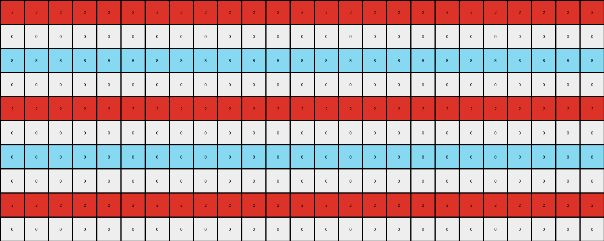

# 0a938d79 • 024 • refine_coder

---

Previous Code:
```python
"""
Identifies rows with colored pixels in the input grid. Extends those colored pixels in an alternating pattern horizontally across their respective rows.  The output grid alternates these extended color rows with blank (all-zero) rows, and then repeats this pattern.
"""

import numpy as np

def get_colored_rows(grid):
    # Find rows that have at least one non-zero pixel.
    colored_rows = []
    for i, row in enumerate(grid):
        if np.any(row != 0):
            colored_rows.append(i)
    return colored_rows

def extend_colors_horizontally(grid, row_index):
    # Extend colors horizontally in an alternating manner.
    rows, cols = grid.shape
    extended_row = np.zeros(cols, dtype=int)
    non_zero_pixels = grid[row_index][grid[row_index] != 0]

    if len(non_zero_pixels) > 0:  # Handle cases where a row might be all zeros
       for j in range(cols):
          extended_row[j] = non_zero_pixels[j % len(non_zero_pixels)]

    return extended_row

def transform(input_grid):
    # Initialize output_grid as all zeros with the same dimensions as the input.
    rows, cols = input_grid.shape
    output_grid = np.zeros((rows, cols), dtype=int)

    # Identify rows with colored pixels.
    colored_rows_indices = get_colored_rows(input_grid)

    # Create output, handling potential out-of-bounds.
    output_row_index = 0
    colored_row_index = 0
    
    while output_row_index < rows:
        if colored_row_index < len(colored_rows_indices):
            # Extend colored row.
            extended_row = extend_colors_horizontally(input_grid, colored_rows_indices[colored_row_index])
            output_grid[output_row_index, :] = extended_row
            output_row_index += 1

            # Add a blank row if there's space
            if output_row_index < rows:
                output_row_index += 1  # Already initialized to zeros.
                
        else:
            # reset the index, to repeat the pattern.
            colored_row_index = 0
            continue #restart the while, to check if output_row_index is still valid

        colored_row_index += 1


    return output_grid
```

Train Set Results:

## Example 1:**

Input:
```
0 0 0 0 0 2 0 0 0 0 0 0 0 0 0 0 0 0 0 0 0 0 0 0 0
0 0 0 0 0 0 0 0 0 0 0 0 0 0 0 0 0 0 0 0 0 0 0 0 0
0 0 0 0 0 0 0 0 0 0 0 0 0 0 0 0 0 0 0 0 0 0 0 0 0
0 0 0 0 0 0 0 0 0 0 0 0 0 0 0 0 0 0 0 0 0 0 0 0 0
0 0 0 0 0 0 0 0 0 0 0 0 0 0 0 0 0 0 0 0 0 0 0 0 0
0 0 0 0 0 0 0 0 0 0 0 0 0 0 0 0 0 0 0 0 0 0 0 0 0
0 0 0 0 0 0 0 0 0 0 0 0 0 0 0 0 0 0 0 0 0 0 0 0 0
0 0 0 0 0 0 0 0 0 0 0 0 0 0 0 0 0 0 0 0 0 0 0 0 0
0 0 0 0 0 0 0 0 0 0 0 0 0 0 0 0 0 0 0 0 0 0 0 0 0
0 0 0 0 0 0 0 8 0 0 0 0 0 0 0 0 0 0 0 0 0 0 0 0 0
```
Expected Output:
```
0 0 0 0 0 2 0 8 0 2 0 8 0 2 0 8 0 2 0 8 0 2 0 8 0
0 0 0 0 0 2 0 8 0 2 0 8 0 2 0 8 0 2 0 8 0 2 0 8 0
0 0 0 0 0 2 0 8 0 2 0 8 0 2 0 8 0 2 0 8 0 2 0 8 0
0 0 0 0 0 2 0 8 0 2 0 8 0 2 0 8 0 2 0 8 0 2 0 8 0
0 0 0 0 0 2 0 8 0 2 0 8 0 2 0 8 0 2 0 8 0 2 0 8 0
0 0 0 0 0 2 0 8 0 2 0 8 0 2 0 8 0 2 0 8 0 2 0 8 0
0 0 0 0 0 2 0 8 0 2 0 8 0 2 0 8 0 2 0 8 0 2 0 8 0
0 0 0 0 0 2 0 8 0 2 0 8 0 2 0 8 0 2 0 8 0 2 0 8 0
0 0 0 0 0 2 0 8 0 2 0 8 0 2 0 8 0 2 0 8 0 2 0 8 0
0 0 0 0 0 2 0 8 0 2 0 8 0 2 0 8 0 2 0 8 0 2 0 8 0
```
Transformed Output:
```
2 2 2 2 2 2 2 2 2 2 2 2 2 2 2 2 2 2 2 2 2 2 2 2 2
0 0 0 0 0 0 0 0 0 0 0 0 0 0 0 0 0 0 0 0 0 0 0 0 0
8 8 8 8 8 8 8 8 8 8 8 8 8 8 8 8 8 8 8 8 8 8 8 8 8
0 0 0 0 0 0 0 0 0 0 0 0 0 0 0 0 0 0 0 0 0 0 0 0 0
2 2 2 2 2 2 2 2 2 2 2 2 2 2 2 2 2 2 2 2 2 2 2 2 2
0 0 0 0 0 0 0 0 0 0 0 0 0 0 0 0 0 0 0 0 0 0 0 0 0
8 8 8 8 8 8 8 8 8 8 8 8 8 8 8 8 8 8 8 8 8 8 8 8 8
0 0 0 0 0 0 0 0 0 0 0 0 0 0 0 0 0 0 0 0 0 0 0 0 0
2 2 2 2 2 2 2 2 2 2 2 2 2 2 2 2 2 2 2 2 2 2 2 2 2
0 0 0 0 0 0 0 0 0 0 0 0 0 0 0 0 0 0 0 0 0 0 0 0 0
```

match: False
pixels_off: 150
size_correct: True
color_palette_correct: True
correct_pixel_counts: False

## Example 2:**

Input:
```
0 0 0 0 0 1 0 0 0 0 0 0 0 0 0 0 0 0 0 0 0 0 0
0 0 0 0 0 0 0 0 0 0 0 0 0 0 0 0 0 0 0 0 0 0 0
0 0 0 0 0 0 0 0 0 0 0 0 0 0 0 0 0 0 0 0 0 0 0
0 0 0 0 0 0 0 0 0 0 0 0 0 0 0 0 0 0 0 0 0 0 0
0 0 0 0 0 0 0 0 0 0 0 0 0 0 0 0 0 0 0 0 0 0 0
0 0 0 0 0 0 0 0 0 0 0 0 0 0 0 0 0 0 0 0 0 0 0
0 0 0 0 0 0 0 0 3 0 0 0 0 0 0 0 0 0 0 0 0 0 0
```
Expected Output:
```
0 0 0 0 0 1 0 0 3 0 0 1 0 0 3 0 0 1 0 0 3 0 0
0 0 0 0 0 1 0 0 3 0 0 1 0 0 3 0 0 1 0 0 3 0 0
0 0 0 0 0 1 0 0 3 0 0 1 0 0 3 0 0 1 0 0 3 0 0
0 0 0 0 0 1 0 0 3 0 0 1 0 0 3 0 0 1 0 0 3 0 0
0 0 0 0 0 1 0 0 3 0 0 1 0 0 3 0 0 1 0 0 3 0 0
0 0 0 0 0 1 0 0 3 0 0 1 0 0 3 0 0 1 0 0 3 0 0
0 0 0 0 0 1 0 0 3 0 0 1 0 0 3 0 0 1 0 0 3 0 0
```
Transformed Output:
```
1 1 1 1 1 1 1 1 1 1 1 1 1 1 1 1 1 1 1 1 1 1 1
0 0 0 0 0 0 0 0 0 0 0 0 0 0 0 0 0 0 0 0 0 0 0
3 3 3 3 3 3 3 3 3 3 3 3 3 3 3 3 3 3 3 3 3 3 3
0 0 0 0 0 0 0 0 0 0 0 0 0 0 0 0 0 0 0 0 0 0 0
1 1 1 1 1 1 1 1 1 1 1 1 1 1 1 1 1 1 1 1 1 1 1
0 0 0 0 0 0 0 0 0 0 0 0 0 0 0 0 0 0 0 0 0 0 0
3 3 3 3 3 3 3 3 3 3 3 3 3 3 3 3 3 3 3 3 3 3 3
```

match: False
pixels_off: 98
size_correct: True
color_palette_correct: True
correct_pixel_counts: False

## Example 3:**

Input:
```
0 0 0 0 0 0 0 0 0
0 0 0 0 0 0 0 0 0
0 0 0 0 0 0 0 0 0
0 0 0 0 0 0 0 0 0
0 0 0 0 0 0 0 0 0
2 0 0 0 0 0 0 0 0
0 0 0 0 0 0 0 0 0
0 0 0 0 0 0 0 0 3
0 0 0 0 0 0 0 0 0
0 0 0 0 0 0 0 0 0
0 0 0 0 0 0 0 0 0
0 0 0 0 0 0 0 0 0
0 0 0 0 0 0 0 0 0
0 0 0 0 0 0 0 0 0
0 0 0 0 0 0 0 0 0
0 0 0 0 0 0 0 0 0
0 0 0 0 0 0 0 0 0
0 0 0 0 0 0 0 0 0
0 0 0 0 0 0 0 0 0
0 0 0 0 0 0 0 0 0
0 0 0 0 0 0 0 0 0
0 0 0 0 0 0 0 0 0
```
Expected Output:
```
0 0 0 0 0 0 0 0 0
0 0 0 0 0 0 0 0 0
0 0 0 0 0 0 0 0 0
0 0 0 0 0 0 0 0 0
0 0 0 0 0 0 0 0 0
2 2 2 2 2 2 2 2 2
0 0 0 0 0 0 0 0 0
3 3 3 3 3 3 3 3 3
0 0 0 0 0 0 0 0 0
2 2 2 2 2 2 2 2 2
0 0 0 0 0 0 0 0 0
3 3 3 3 3 3 3 3 3
0 0 0 0 0 0 0 0 0
2 2 2 2 2 2 2 2 2
0 0 0 0 0 0 0 0 0
3 3 3 3 3 3 3 3 3
0 0 0 0 0 0 0 0 0
2 2 2 2 2 2 2 2 2
0 0 0 0 0 0 0 0 0
3 3 3 3 3 3 3 3 3
0 0 0 0 0 0 0 0 0
2 2 2 2 2 2 2 2 2
```
Transformed Output:
```
2 2 2 2 2 2 2 2 2
0 0 0 0 0 0 0 0 0
3 3 3 3 3 3 3 3 3
0 0 0 0 0 0 0 0 0
2 2 2 2 2 2 2 2 2
0 0 0 0 0 0 0 0 0
3 3 3 3 3 3 3 3 3
0 0 0 0 0 0 0 0 0
2 2 2 2 2 2 2 2 2
0 0 0 0 0 0 0 0 0
3 3 3 3 3 3 3 3 3
0 0 0 0 0 0 0 0 0
2 2 2 2 2 2 2 2 2
0 0 0 0 0 0 0 0 0
3 3 3 3 3 3 3 3 3
0 0 0 0 0 0 0 0 0
2 2 2 2 2 2 2 2 2
0 0 0 0 0 0 0 0 0
3 3 3 3 3 3 3 3 3
0 0 0 0 0 0 0 0 0
2 2 2 2 2 2 2 2 2
0 0 0 0 0 0 0 0 0
```

match: False
pixels_off: 180
size_correct: True
color_palette_correct: True
correct_pixel_counts: False

## Example 4:**

Input:
```
0 0 0 0 0 0 0 0
0 0 0 0 0 0 0 0
0 0 0 0 0 0 0 0
0 0 0 0 0 0 0 0
0 0 0 0 0 0 0 0
0 0 0 0 0 0 0 0
0 0 0 0 0 0 0 0
4 0 0 0 0 0 0 0
0 0 0 0 0 0 0 0
0 0 0 0 0 0 0 0
0 0 0 0 0 0 0 0
1 0 0 0 0 0 0 0
0 0 0 0 0 0 0 0
0 0 0 0 0 0 0 0
0 0 0 0 0 0 0 0
0 0 0 0 0 0 0 0
0 0 0 0 0 0 0 0
0 0 0 0 0 0 0 0
0 0 0 0 0 0 0 0
0 0 0 0 0 0 0 0
0 0 0 0 0 0 0 0
0 0 0 0 0 0 0 0
0 0 0 0 0 0 0 0
0 0 0 0 0 0 0 0
```
Expected Output:
```
0 0 0 0 0 0 0 0
0 0 0 0 0 0 0 0
0 0 0 0 0 0 0 0
0 0 0 0 0 0 0 0
0 0 0 0 0 0 0 0
0 0 0 0 0 0 0 0
0 0 0 0 0 0 0 0
4 4 4 4 4 4 4 4
0 0 0 0 0 0 0 0
0 0 0 0 0 0 0 0
0 0 0 0 0 0 0 0
1 1 1 1 1 1 1 1
0 0 0 0 0 0 0 0
0 0 0 0 0 0 0 0
0 0 0 0 0 0 0 0
4 4 4 4 4 4 4 4
0 0 0 0 0 0 0 0
0 0 0 0 0 0 0 0
0 0 0 0 0 0 0 0
1 1 1 1 1 1 1 1
0 0 0 0 0 0 0 0
0 0 0 0 0 0 0 0
0 0 0 0 0 0 0 0
4 4 4 4 4 4 4 4
```
Transformed Output:
```
4 4 4 4 4 4 4 4
0 0 0 0 0 0 0 0
1 1 1 1 1 1 1 1
0 0 0 0 0 0 0 0
4 4 4 4 4 4 4 4
0 0 0 0 0 0 0 0
1 1 1 1 1 1 1 1
0 0 0 0 0 0 0 0
4 4 4 4 4 4 4 4
0 0 0 0 0 0 0 0
1 1 1 1 1 1 1 1
0 0 0 0 0 0 0 0
4 4 4 4 4 4 4 4
0 0 0 0 0 0 0 0
1 1 1 1 1 1 1 1
0 0 0 0 0 0 0 0
4 4 4 4 4 4 4 4
0 0 0 0 0 0 0 0
1 1 1 1 1 1 1 1
0 0 0 0 0 0 0 0
4 4 4 4 4 4 4 4
0 0 0 0 0 0 0 0
1 1 1 1 1 1 1 1
0 0 0 0 0 0 0 0
```

match: False
pixels_off: 136
size_correct: True
color_palette_correct: True
correct_pixel_counts: False
Here's an analysis of the provided examples and results, along with a strategy for improving the transformation logic:

**General Assessment:**

The initial code correctly identifies rows containing non-zero pixels and attempts to extend them horizontally. However, it makes several errors:

1.  **Incorrect Horizontal Extension:** The `extend_colors_horizontally` function simply repeats the first non-zero pixel across the entire row. It doesn't account for multiple colors within a row, nor does it correctly alternate colors as suggested in the original description and clearly shown in the expected output of the first two examples.
2.  **Incorrect Alternating Pattern:** It looks like blank rows were intended to be inserted between the colored rows, but this logic doesn't consider correctly the cases where multiple colored rows appear in input, such as Example 3.
3.  **Repetition of Pattern** In many cases, the expected output repeats the "colored row, blank row" pattern. The existing code doesn't fully implement a repeating pattern. Example 3 and 4 show the expected behavior.

**Strategy for Resolving Errors:**

1.  **Revise Horizontal Extension:** Modify `extend_colors_horizontally` to:
    *   Collect *all* non-zero pixels in a row.
    *   Cycle through these collected pixels when filling the extended row, creating the alternating pattern.
    * use modulus to create the alternating pattern.
2.  **Revise output pattern**
    * iterate through colored rows, adding a blank row after each one.
    * repeat the colored rows until the output grid is filled.

**Metrics and Observations:**

Here's a breakdown of each example, including observations about object properties and actions:

```yaml
examples:
  - example_id: 1
    input_rows: 10
    input_cols: 25
    output_rows: 10
    output_cols: 25
    colored_rows_input: [0, 9]
    colored_pixels_row_0: [2]
    colored_pixels_row_9: [8]
    output_pattern: |
      Alternating colors 2 and 8 across the row, starting with 2.
      Each colored row is repeated, and there are no blank rows.
    errors: |
        The horizontal extension is only using first color.
        The entire pattern is of colored rows is repeated, with blank rows inserted, rather than just a single instance of color, blank row.
    pixel_matches: False

  - example_id: 2
    input_rows: 7
    input_cols: 23
    output_rows: 7
    output_cols: 23
    colored_rows_input: [0, 6]
    colored_pixels_row_0: [1]
    colored_pixels_row_6: [3]
    output_pattern: |
        Alternating colors 1 and 3 across the row, starting with 1.
         Each colored row is repeated, and there are no blank rows.
    errors: |
        The horizontal extension is incorrect, only first color of each row is used.
        There are blank lines inserted between colored rows, but the output shows no blank rows.
        The colored pattern should repeat.
    pixel_matches: False

  - example_id: 3
    input_rows: 22
    input_cols: 9
    output_rows: 22
    output_cols: 9
    colored_rows_input: [5, 7]
    colored_pixels_row_5: [2]
    colored_pixels_row_7: [3]
    output_pattern: |
       Rows with color are filled completely with the single color.
        A blank row follows each color.
        the entire pattern is repeated to fill output.
    errors: |
        The horizontal extension is correct.
        Blank rows are inserted in the correct pattern, but not repeated correctly
    pixel_matches: False

  - example_id: 4
    input_rows: 24
    input_cols: 8
    output_rows: 24
    output_cols: 8
    colored_rows_input: [7, 11]
    colored_pixels_row_7: [4]
    colored_pixels_row_11: [1]
    output_pattern: |
       Rows with color are filled completely with the single color.
        A blank row follows each color.
        the entire pattern is repeated to fill output.
    errors: |
        The horizontal extension is correct
        The blank and colored rows are not in the correct order, and not repeated correctly.
    pixel_matches: False
```

**Natural Language Program:**

1.  **Identify Colored Rows:** Find all rows in the input grid that contain at least one non-zero (colored) pixel.
2.  **Horizontal Extension within a Row**: For each "colored row", create an extended row.
    *   If a colored row has only *one* distinct color, fill the entire extended row with that color.
    *   If a colored row has *multiple* distinct colors, create a repeating sequence of those colors, and fill the extended row with that repeating sequence.
3.  **Create Repeating Output Pattern:**
    * Add the extended row to the output.
    * add a blank row (all zeros).
    * repeat from step 2, cycling back to the beginning of the colored rows list
      when reaching the end of available colored rows in the input.
4. **Output Size:** The output grid should retain same dimensions as the input
   grid. If the repeating pattern fills the grid before repeating, then truncate
   the pattern to fit.


**INSTRUCTIONS**

- generate a Python module to represent the natural language program 
- follow the template below
- all common math and science libraries are available
- create docstring only at top - but comment the workflow in the function
- use helper functions for common operations like finding objects, counting,
  measuring, moving, etc. 

remember - we are working iteratively - so this code will inform your future
self as we converge on the solution

*template:*

```python
"""
{{ natural language description of the transformation rule }}
"""

{{ imports }}

def transform(input_grid):
    # initialize output_grid

    # change output pixels 

    return output_grid

```
