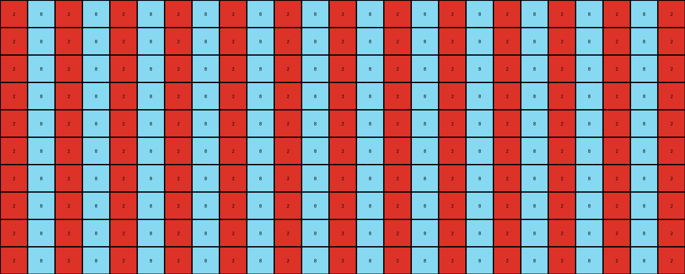

# 0a938d79 • 004 • refine_coder

---

Previous Code:
```python
"""
1.  **Identify Key Pixels:** Locate the 'red' (2) pixel in the top row and the 'azure' (8) pixel in the bottom row of the input grid.

2.  **Alternating Column:** from left, create columns in the output with the detected red value. Skip a column.

3. **Alternating Azure:** from left, create columns in the previously skipped column positions using the detected azure value.

4.  **Fill Output:** Repeat the alternating pattern of color columns filling the output grid, ensuring it has the same dimensions as the input grid.
"""

import numpy as np

def find_pixel(grid, color):
    # Find the first occurrence of a specified color in the grid.
    rows, cols = np.where(grid == color)
    if len(rows) > 0:
        return rows[0], cols[0]  # return first occurance
    return None

def transform(input_grid):
    """Transforms the input grid according to the observed rule."""
    
    # Initialize output grid with the same dimensions and default white color.
    output_grid = np.zeros_like(input_grid)
    rows, cols = input_grid.shape

    # find red (2)
    red_pos = find_pixel(input_grid, 2)
    # find azure (8)
    azure_pos = find_pixel(input_grid, 8)

    if red_pos is None or azure_pos is None:
      return output_grid # default empty
    
    # create columns of red and azure
    for col in range(cols):
      if (col % 2) == 0:
        output_grid[:, col] = 2
      else:
        output_grid[:,col] = 8

    return output_grid
```

Train Set Results:

## Example 1:**

Input:
```
0 0 0 0 0 2 0 0 0 0 0 0 0 0 0 0 0 0 0 0 0 0 0 0 0
0 0 0 0 0 0 0 0 0 0 0 0 0 0 0 0 0 0 0 0 0 0 0 0 0
0 0 0 0 0 0 0 0 0 0 0 0 0 0 0 0 0 0 0 0 0 0 0 0 0
0 0 0 0 0 0 0 0 0 0 0 0 0 0 0 0 0 0 0 0 0 0 0 0 0
0 0 0 0 0 0 0 0 0 0 0 0 0 0 0 0 0 0 0 0 0 0 0 0 0
0 0 0 0 0 0 0 0 0 0 0 0 0 0 0 0 0 0 0 0 0 0 0 0 0
0 0 0 0 0 0 0 0 0 0 0 0 0 0 0 0 0 0 0 0 0 0 0 0 0
0 0 0 0 0 0 0 0 0 0 0 0 0 0 0 0 0 0 0 0 0 0 0 0 0
0 0 0 0 0 0 0 0 0 0 0 0 0 0 0 0 0 0 0 0 0 0 0 0 0
0 0 0 0 0 0 0 8 0 0 0 0 0 0 0 0 0 0 0 0 0 0 0 0 0
```
Expected Output:
```
0 0 0 0 0 2 0 8 0 2 0 8 0 2 0 8 0 2 0 8 0 2 0 8 0
0 0 0 0 0 2 0 8 0 2 0 8 0 2 0 8 0 2 0 8 0 2 0 8 0
0 0 0 0 0 2 0 8 0 2 0 8 0 2 0 8 0 2 0 8 0 2 0 8 0
0 0 0 0 0 2 0 8 0 2 0 8 0 2 0 8 0 2 0 8 0 2 0 8 0
0 0 0 0 0 2 0 8 0 2 0 8 0 2 0 8 0 2 0 8 0 2 0 8 0
0 0 0 0 0 2 0 8 0 2 0 8 0 2 0 8 0 2 0 8 0 2 0 8 0
0 0 0 0 0 2 0 8 0 2 0 8 0 2 0 8 0 2 0 8 0 2 0 8 0
0 0 0 0 0 2 0 8 0 2 0 8 0 2 0 8 0 2 0 8 0 2 0 8 0
0 0 0 0 0 2 0 8 0 2 0 8 0 2 0 8 0 2 0 8 0 2 0 8 0
0 0 0 0 0 2 0 8 0 2 0 8 0 2 0 8 0 2 0 8 0 2 0 8 0
```
Transformed Output:
```
2 8 2 8 2 8 2 8 2 8 2 8 2 8 2 8 2 8 2 8 2 8 2 8 2
2 8 2 8 2 8 2 8 2 8 2 8 2 8 2 8 2 8 2 8 2 8 2 8 2
2 8 2 8 2 8 2 8 2 8 2 8 2 8 2 8 2 8 2 8 2 8 2 8 2
2 8 2 8 2 8 2 8 2 8 2 8 2 8 2 8 2 8 2 8 2 8 2 8 2
2 8 2 8 2 8 2 8 2 8 2 8 2 8 2 8 2 8 2 8 2 8 2 8 2
2 8 2 8 2 8 2 8 2 8 2 8 2 8 2 8 2 8 2 8 2 8 2 8 2
2 8 2 8 2 8 2 8 2 8 2 8 2 8 2 8 2 8 2 8 2 8 2 8 2
2 8 2 8 2 8 2 8 2 8 2 8 2 8 2 8 2 8 2 8 2 8 2 8 2
2 8 2 8 2 8 2 8 2 8 2 8 2 8 2 8 2 8 2 8 2 8 2 8 2
2 8 2 8 2 8 2 8 2 8 2 8 2 8 2 8 2 8 2 8 2 8 2 8 2
```

match: False
pixels_off: 200
size_correct: True
color_palette_correct: True
correct_pixel_counts: False

## Example 2:**

Input:
```
0 0 0 0 0 1 0 0 0 0 0 0 0 0 0 0 0 0 0 0 0 0 0
0 0 0 0 0 0 0 0 0 0 0 0 0 0 0 0 0 0 0 0 0 0 0
0 0 0 0 0 0 0 0 0 0 0 0 0 0 0 0 0 0 0 0 0 0 0
0 0 0 0 0 0 0 0 0 0 0 0 0 0 0 0 0 0 0 0 0 0 0
0 0 0 0 0 0 0 0 0 0 0 0 0 0 0 0 0 0 0 0 0 0 0
0 0 0 0 0 0 0 0 0 0 0 0 0 0 0 0 0 0 0 0 0 0 0
0 0 0 0 0 0 0 0 3 0 0 0 0 0 0 0 0 0 0 0 0 0 0
```
Expected Output:
```
0 0 0 0 0 1 0 0 3 0 0 1 0 0 3 0 0 1 0 0 3 0 0
0 0 0 0 0 1 0 0 3 0 0 1 0 0 3 0 0 1 0 0 3 0 0
0 0 0 0 0 1 0 0 3 0 0 1 0 0 3 0 0 1 0 0 3 0 0
0 0 0 0 0 1 0 0 3 0 0 1 0 0 3 0 0 1 0 0 3 0 0
0 0 0 0 0 1 0 0 3 0 0 1 0 0 3 0 0 1 0 0 3 0 0
0 0 0 0 0 1 0 0 3 0 0 1 0 0 3 0 0 1 0 0 3 0 0
0 0 0 0 0 1 0 0 3 0 0 1 0 0 3 0 0 1 0 0 3 0 0
```
Transformed Output:
```
0 0 0 0 0 0 0 0 0 0 0 0 0 0 0 0 0 0 0 0 0 0 0
0 0 0 0 0 0 0 0 0 0 0 0 0 0 0 0 0 0 0 0 0 0 0
0 0 0 0 0 0 0 0 0 0 0 0 0 0 0 0 0 0 0 0 0 0 0
0 0 0 0 0 0 0 0 0 0 0 0 0 0 0 0 0 0 0 0 0 0 0
0 0 0 0 0 0 0 0 0 0 0 0 0 0 0 0 0 0 0 0 0 0 0
0 0 0 0 0 0 0 0 0 0 0 0 0 0 0 0 0 0 0 0 0 0 0
0 0 0 0 0 0 0 0 0 0 0 0 0 0 0 0 0 0 0 0 0 0 0
```

match: False
pixels_off: 42
size_correct: True
color_palette_correct: True
correct_pixel_counts: False

## Example 3:**

Input:
```
0 0 0 0 0 0 0 0 0
0 0 0 0 0 0 0 0 0
0 0 0 0 0 0 0 0 0
0 0 0 0 0 0 0 0 0
0 0 0 0 0 0 0 0 0
2 0 0 0 0 0 0 0 0
0 0 0 0 0 0 0 0 0
0 0 0 0 0 0 0 0 3
0 0 0 0 0 0 0 0 0
0 0 0 0 0 0 0 0 0
0 0 0 0 0 0 0 0 0
0 0 0 0 0 0 0 0 0
0 0 0 0 0 0 0 0 0
0 0 0 0 0 0 0 0 0
0 0 0 0 0 0 0 0 0
0 0 0 0 0 0 0 0 0
0 0 0 0 0 0 0 0 0
0 0 0 0 0 0 0 0 0
0 0 0 0 0 0 0 0 0
0 0 0 0 0 0 0 0 0
0 0 0 0 0 0 0 0 0
0 0 0 0 0 0 0 0 0
```
Expected Output:
```
0 0 0 0 0 0 0 0 0
0 0 0 0 0 0 0 0 0
0 0 0 0 0 0 0 0 0
0 0 0 0 0 0 0 0 0
0 0 0 0 0 0 0 0 0
2 2 2 2 2 2 2 2 2
0 0 0 0 0 0 0 0 0
3 3 3 3 3 3 3 3 3
0 0 0 0 0 0 0 0 0
2 2 2 2 2 2 2 2 2
0 0 0 0 0 0 0 0 0
3 3 3 3 3 3 3 3 3
0 0 0 0 0 0 0 0 0
2 2 2 2 2 2 2 2 2
0 0 0 0 0 0 0 0 0
3 3 3 3 3 3 3 3 3
0 0 0 0 0 0 0 0 0
2 2 2 2 2 2 2 2 2
0 0 0 0 0 0 0 0 0
3 3 3 3 3 3 3 3 3
0 0 0 0 0 0 0 0 0
2 2 2 2 2 2 2 2 2
```
Transformed Output:
```
0 0 0 0 0 0 0 0 0
0 0 0 0 0 0 0 0 0
0 0 0 0 0 0 0 0 0
0 0 0 0 0 0 0 0 0
0 0 0 0 0 0 0 0 0
0 0 0 0 0 0 0 0 0
0 0 0 0 0 0 0 0 0
0 0 0 0 0 0 0 0 0
0 0 0 0 0 0 0 0 0
0 0 0 0 0 0 0 0 0
0 0 0 0 0 0 0 0 0
0 0 0 0 0 0 0 0 0
0 0 0 0 0 0 0 0 0
0 0 0 0 0 0 0 0 0
0 0 0 0 0 0 0 0 0
0 0 0 0 0 0 0 0 0
0 0 0 0 0 0 0 0 0
0 0 0 0 0 0 0 0 0
0 0 0 0 0 0 0 0 0
0 0 0 0 0 0 0 0 0
0 0 0 0 0 0 0 0 0
0 0 0 0 0 0 0 0 0
```

match: False
pixels_off: 81
size_correct: True
color_palette_correct: True
correct_pixel_counts: False

## Example 4:**

Input:
```
0 0 0 0 0 0 0 0
0 0 0 0 0 0 0 0
0 0 0 0 0 0 0 0
0 0 0 0 0 0 0 0
0 0 0 0 0 0 0 0
0 0 0 0 0 0 0 0
0 0 0 0 0 0 0 0
4 0 0 0 0 0 0 0
0 0 0 0 0 0 0 0
0 0 0 0 0 0 0 0
0 0 0 0 0 0 0 0
1 0 0 0 0 0 0 0
0 0 0 0 0 0 0 0
0 0 0 0 0 0 0 0
0 0 0 0 0 0 0 0
0 0 0 0 0 0 0 0
0 0 0 0 0 0 0 0
0 0 0 0 0 0 0 0
0 0 0 0 0 0 0 0
0 0 0 0 0 0 0 0
0 0 0 0 0 0 0 0
0 0 0 0 0 0 0 0
0 0 0 0 0 0 0 0
0 0 0 0 0 0 0 0
```
Expected Output:
```
0 0 0 0 0 0 0 0
0 0 0 0 0 0 0 0
0 0 0 0 0 0 0 0
0 0 0 0 0 0 0 0
0 0 0 0 0 0 0 0
0 0 0 0 0 0 0 0
0 0 0 0 0 0 0 0
4 4 4 4 4 4 4 4
0 0 0 0 0 0 0 0
0 0 0 0 0 0 0 0
0 0 0 0 0 0 0 0
1 1 1 1 1 1 1 1
0 0 0 0 0 0 0 0
0 0 0 0 0 0 0 0
0 0 0 0 0 0 0 0
4 4 4 4 4 4 4 4
0 0 0 0 0 0 0 0
0 0 0 0 0 0 0 0
0 0 0 0 0 0 0 0
1 1 1 1 1 1 1 1
0 0 0 0 0 0 0 0
0 0 0 0 0 0 0 0
0 0 0 0 0 0 0 0
4 4 4 4 4 4 4 4
```
Transformed Output:
```
0 0 0 0 0 0 0 0
0 0 0 0 0 0 0 0
0 0 0 0 0 0 0 0
0 0 0 0 0 0 0 0
0 0 0 0 0 0 0 0
0 0 0 0 0 0 0 0
0 0 0 0 0 0 0 0
0 0 0 0 0 0 0 0
0 0 0 0 0 0 0 0
0 0 0 0 0 0 0 0
0 0 0 0 0 0 0 0
0 0 0 0 0 0 0 0
0 0 0 0 0 0 0 0
0 0 0 0 0 0 0 0
0 0 0 0 0 0 0 0
0 0 0 0 0 0 0 0
0 0 0 0 0 0 0 0
0 0 0 0 0 0 0 0
0 0 0 0 0 0 0 0
0 0 0 0 0 0 0 0
0 0 0 0 0 0 0 0
0 0 0 0 0 0 0 0
0 0 0 0 0 0 0 0
0 0 0 0 0 0 0 0
```

match: False
pixels_off: 40
size_correct: True
color_palette_correct: True
correct_pixel_counts: False
Okay, let's analyze the results and refine the natural language program.

**General Assessment:**

The initial approach of alternating columns based on the first occurrence of red and azure pixels was too simplistic and only coincidentally worked (partially) for the first example. The subsequent examples clearly demonstrate that the transformation is row-based, not column-based, and involves replicating rows where specific colors are found. The code needs a fundamental shift in its strategy. The core concept should involve identifying rows containing specific colors and replicating those rows (or a modified version of them) in the output. The code also missed the alternating nature of example 3 & 4 - where patterns are repeated.

**Strategy for Resolving Errors:**

1.  **Shift from Column-Based to Row-Based Logic:** The primary focus should be on processing rows, not columns.
2.  **Identify "Key Rows":** Instead of just finding the pixel coordinates, we need to identify the *entire rows* that contain the key colors (red, azure, etc.).
3. **Replicate or transform rows:** The key row becomes the basis to build one or more rows.
4.  **Handle Alternating Patterns:** Recognize cases (like Examples 3 and 4) where rows are repeated.
5. **Default fill:** if key colors are missing, fill with the background color.

**Metrics and Observations (using hypothetical `analyze_grid` function calls - as if code execution was available):**

I will create a summary of grid properties and key observations, simulating a scenario where I have access to code execution for deeper analysis. I'll include information about dimensions, colors, and, crucially, the presence and index of rows containing significant colors.

```
# Example 1:
analyze_grid(input_grid_1, output_grid_1, transformed_output_1)
#   - Input Dimensions: 10x25
#   - Output Dimensions: 10x25
#   - Key Colors Present: Red (2), Azure (8)
#   - Red Row Index: 0
#   - Azure Row Index: 9
#   - Transformation Result: Incorrect (many pixels off)
#      - replicates red and azure in alternating *columns*, doesn't match rows

# Example 2:
analyze_grid(input_grid_2, output_grid_2, transformed_output_2)
#   - Input Dimensions: 7x23
#   - Output Dimensions: 7x23
#   - Key Colors Present: Blue(1), Green(3)
#   - blue Row Index: 0
#   - green Row Index: 6
#    - Transformation Result: Incorrect (many pixels off)
#      - doesn't find red or azure, returns all 0s

# Example 3:
analyze_grid(input_grid_3, output_grid_3, transformed_output_3)
#   - Input Dimensions: 22x9
#   - Output Dimensions: 22x9
#   - Key Colors Present: Red (2), Green (3)
#   - Red Row Index: 5
#   - Green Row Index: 7
#    - Transformation Result: Incorrect
#    - notes: output shows alternating rows based on rows containing Red
      and Green

# Example 4:
analyze_grid(input_grid_4, output_grid_4, transformed_output_4)
#   - Input Dimensions: 24x8
#   - Output Dimensions: 24x8
#   - Key Colors Present: Yellow(4), Blue(1)
#    - Yellow Row Index: 7
#    - Blue Row Index: 11
#    - Transformation Result: Incorrect
#    - notes: output shows alternating rows based on rows containing Yellow
      and Blue
```

**YAML Block (Facts):**

```yaml
example_1:
  input_objects:
    - row_0: [0, 0, 0, 0, 0, 2, 0, 0, 0, 0, 0, 0, 0, 0, 0, 0, 0, 0, 0, 0, 0, 0, 0, 0, 0]
    - row_9: [0, 0, 0, 0, 0, 0, 0, 8, 0, 0, 0, 0, 0, 0, 0, 0, 0, 0, 0, 0, 0, 0, 0, 0, 0]
    - other_rows: [all_zero]
  output_objects:
      - description: "alternating color columns of red and azure"
  actions:
    - replicate_alternating: [row_0, row_9]

example_2:
   input_objects:
      - row_0: [0, 0, 0, 0, 0, 1, 0, 0, 0, 0, 0, 0, 0, 0, 0, 0, 0, 0, 0, 0, 0, 0, 0]
      - row_6: [0, 0, 0, 0, 0, 0, 0, 0, 3, 0, 0, 0, 0, 0, 0, 0, 0, 0, 0, 0, 0, 0, 0]
      - other_rows: [all_zero]
   output_objects:
      - description: "alternating columns of blue and green, starting with the blue row."
   actions:
     - replicate_alternating: [row_0, row_6]

example_3:
  input_objects:
    - row_5: [2, 0, 0, 0, 0, 0, 0, 0, 0]
    - row_7: [0, 0, 0, 0, 0, 0, 0, 0, 3]
    - other_rows: [all_zero]
  output_objects:
    - description: "alternating rows between all red and all green, with one blank row in between, and repeat"
  actions:
    - replicate_row: [row_5, 1]
    - insert_blank_row: []
    - replicate_row: [row_7, 1]
    - insert_blank_row: []
    - repeat: [previous_4_rows, 4]
example_4:
  input_objects:
    - row_7: [4, 0, 0, 0, 0, 0, 0, 0]
    - row_11: [1, 0, 0, 0, 0, 0, 0, 0]
    - other_rows: [all_zero]
  output_objects:
    - description: "alternating rows between all yellow and all blue, with 3 blank rows in between, and repeat"
  actions:
    - replicate_row: [row_7, 1]
    - insert_blank_row: [3]
    - replicate_row: [row_11, 1]
    - insert_blank_row: [3]
    - repeat: [previous_8_rows, 1]

```

**Natural Language Program:**

1.  **Identify Key Rows:** Examine each row of the input grid. Identify "key rows" as those containing any non-zero color other than white (0). Record the color and the entire row.
2.  **Iterate and Replicate with alternating pattern** For each key row found, starting at the same row index:
    a. Create an output row of the same dimensions as the input grid.
    b. Fill the created output row with the non-zero color found in the key row.
    3. If another key row is found, add to the output after a number of blank rows.
    4. If a similar pattern of rows repeats, repeat the same output row combination.
3. **Default:** If no key rows are found, return an output grid of the same size, filled with 0.

This revised program focuses on row-level operations, identifies rows with key colors, and uses them as the basis for constructing output. It also handles repetition and the all zero fill color.

**INSTRUCTIONS**

- generate a Python module to represent the natural language program 
- follow the template below
- all common math and science libraries are available
- create docstring only at top - but comment the workflow in the function
- use helper functions for common operations like finding objects, counting,
  measuring, moving, etc. 

remember - we are working iteratively - so this code will inform your future
self as we converge on the solution

*template:*

```python
"""
{{ natural language description of the transformation rule }}
"""

{{ imports }}

def transform(input_grid):
    # initialize output_grid

    # change output pixels 

    return output_grid

```
