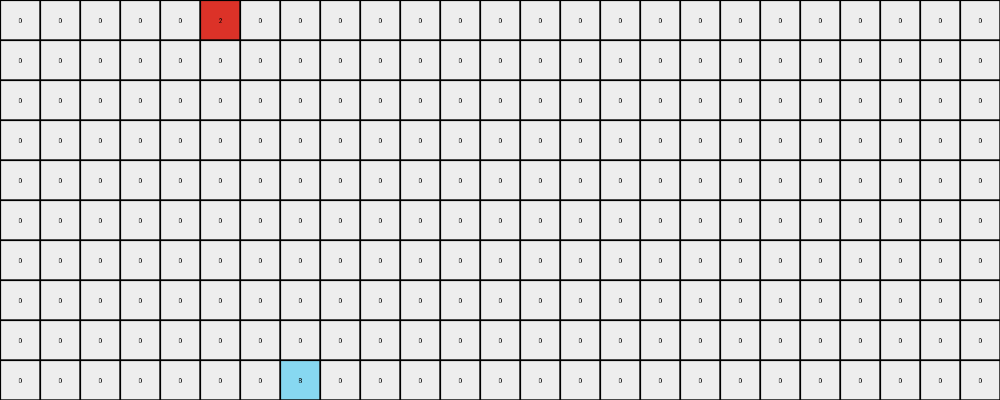
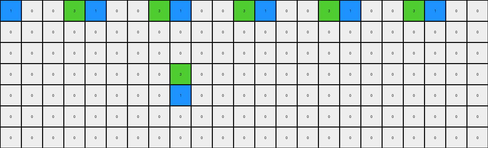
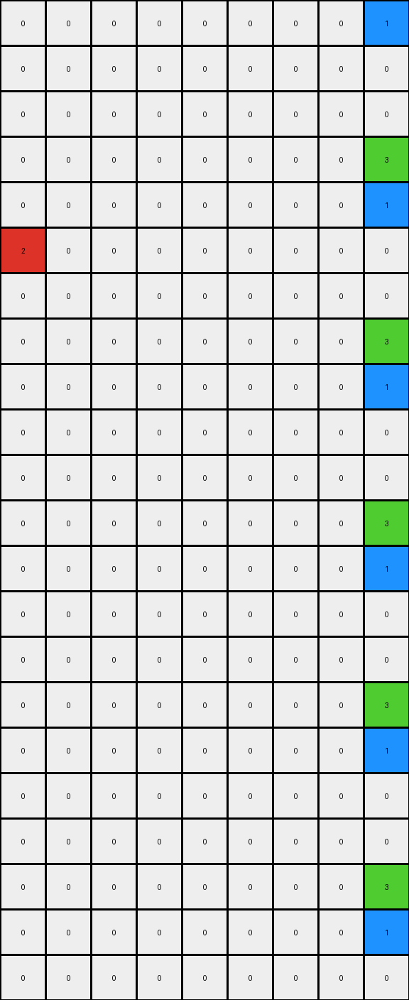
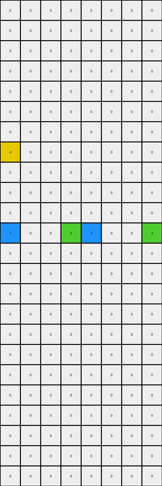

# 0a938d79 • 012 • refine_coder

---

Previous Code:
```python
"""
The transformation identifies the locations of the blue (1) and green (3) pixels in the input grid. It then replicates the pattern '1 0 0 3' (blue, white, white, green) horizontally across the entire row starting from the blue pixel's location, and vertically down the entire column starting from the green pixel's location, in the output grid.
"""

import numpy as np

def find_pixel(grid, color):
    """Finds the coordinates of the first occurrence of a specified color."""
    for i in range(grid.shape[0]):
        for j in range(grid.shape[1]):
            if grid[i, j] == color:
                return (i, j)
    return None

def transform(input_grid):
    # Initialize output_grid as a copy of the input_grid
    output_grid = np.copy(input_grid)

    # Find the blue and green pixels
    blue_pos = find_pixel(input_grid, 1)
    green_pos = find_pixel(input_grid, 3)

    # Define the pattern
    pattern = [1, 0, 0, 3]

    # Horizontal replication (Blue)
    if blue_pos:
        row = blue_pos[0]
        for j in range(output_grid.shape[1]):
            output_grid[row, j] = pattern[j % len(pattern)]

    # Vertical replication (Green)
    if green_pos:
        col = green_pos[1]
        for i in range(output_grid.shape[0]):
            output_grid[i, col] = pattern[i % len(pattern)]
            
    return output_grid
```

Train Set Results:

## Example 1:**

Input:
```
0 0 0 0 0 2 0 0 0 0 0 0 0 0 0 0 0 0 0 0 0 0 0 0 0
0 0 0 0 0 0 0 0 0 0 0 0 0 0 0 0 0 0 0 0 0 0 0 0 0
0 0 0 0 0 0 0 0 0 0 0 0 0 0 0 0 0 0 0 0 0 0 0 0 0
0 0 0 0 0 0 0 0 0 0 0 0 0 0 0 0 0 0 0 0 0 0 0 0 0
0 0 0 0 0 0 0 0 0 0 0 0 0 0 0 0 0 0 0 0 0 0 0 0 0
0 0 0 0 0 0 0 0 0 0 0 0 0 0 0 0 0 0 0 0 0 0 0 0 0
0 0 0 0 0 0 0 0 0 0 0 0 0 0 0 0 0 0 0 0 0 0 0 0 0
0 0 0 0 0 0 0 0 0 0 0 0 0 0 0 0 0 0 0 0 0 0 0 0 0
0 0 0 0 0 0 0 0 0 0 0 0 0 0 0 0 0 0 0 0 0 0 0 0 0
0 0 0 0 0 0 0 8 0 0 0 0 0 0 0 0 0 0 0 0 0 0 0 0 0
```
Expected Output:
```
0 0 0 0 0 2 0 8 0 2 0 8 0 2 0 8 0 2 0 8 0 2 0 8 0
0 0 0 0 0 2 0 8 0 2 0 8 0 2 0 8 0 2 0 8 0 2 0 8 0
0 0 0 0 0 2 0 8 0 2 0 8 0 2 0 8 0 2 0 8 0 2 0 8 0
0 0 0 0 0 2 0 8 0 2 0 8 0 2 0 8 0 2 0 8 0 2 0 8 0
0 0 0 0 0 2 0 8 0 2 0 8 0 2 0 8 0 2 0 8 0 2 0 8 0
0 0 0 0 0 2 0 8 0 2 0 8 0 2 0 8 0 2 0 8 0 2 0 8 0
0 0 0 0 0 2 0 8 0 2 0 8 0 2 0 8 0 2 0 8 0 2 0 8 0
0 0 0 0 0 2 0 8 0 2 0 8 0 2 0 8 0 2 0 8 0 2 0 8 0
0 0 0 0 0 2 0 8 0 2 0 8 0 2 0 8 0 2 0 8 0 2 0 8 0
0 0 0 0 0 2 0 8 0 2 0 8 0 2 0 8 0 2 0 8 0 2 0 8 0
```
Transformed Output:
```
0 0 0 0 0 2 0 0 0 0 0 0 0 0 0 0 0 0 0 0 0 0 0 0 0
0 0 0 0 0 0 0 0 0 0 0 0 0 0 0 0 0 0 0 0 0 0 0 0 0
0 0 0 0 0 0 0 0 0 0 0 0 0 0 0 0 0 0 0 0 0 0 0 0 0
0 0 0 0 0 0 0 0 0 0 0 0 0 0 0 0 0 0 0 0 0 0 0 0 0
0 0 0 0 0 0 0 0 0 0 0 0 0 0 0 0 0 0 0 0 0 0 0 0 0
0 0 0 0 0 0 0 0 0 0 0 0 0 0 0 0 0 0 0 0 0 0 0 0 0
0 0 0 0 0 0 0 0 0 0 0 0 0 0 0 0 0 0 0 0 0 0 0 0 0
0 0 0 0 0 0 0 0 0 0 0 0 0 0 0 0 0 0 0 0 0 0 0 0 0
0 0 0 0 0 0 0 0 0 0 0 0 0 0 0 0 0 0 0 0 0 0 0 0 0
0 0 0 0 0 0 0 8 0 0 0 0 0 0 0 0 0 0 0 0 0 0 0 0 0
```

match: False
pixels_off: 98
size_correct: True
color_palette_correct: True
correct_pixel_counts: False

## Example 2:**

Input:
```
0 0 0 0 0 1 0 0 0 0 0 0 0 0 0 0 0 0 0 0 0 0 0
0 0 0 0 0 0 0 0 0 0 0 0 0 0 0 0 0 0 0 0 0 0 0
0 0 0 0 0 0 0 0 0 0 0 0 0 0 0 0 0 0 0 0 0 0 0
0 0 0 0 0 0 0 0 0 0 0 0 0 0 0 0 0 0 0 0 0 0 0
0 0 0 0 0 0 0 0 0 0 0 0 0 0 0 0 0 0 0 0 0 0 0
0 0 0 0 0 0 0 0 0 0 0 0 0 0 0 0 0 0 0 0 0 0 0
0 0 0 0 0 0 0 0 3 0 0 0 0 0 0 0 0 0 0 0 0 0 0
```
Expected Output:
```
0 0 0 0 0 1 0 0 3 0 0 1 0 0 3 0 0 1 0 0 3 0 0
0 0 0 0 0 1 0 0 3 0 0 1 0 0 3 0 0 1 0 0 3 0 0
0 0 0 0 0 1 0 0 3 0 0 1 0 0 3 0 0 1 0 0 3 0 0
0 0 0 0 0 1 0 0 3 0 0 1 0 0 3 0 0 1 0 0 3 0 0
0 0 0 0 0 1 0 0 3 0 0 1 0 0 3 0 0 1 0 0 3 0 0
0 0 0 0 0 1 0 0 3 0 0 1 0 0 3 0 0 1 0 0 3 0 0
0 0 0 0 0 1 0 0 3 0 0 1 0 0 3 0 0 1 0 0 3 0 0
```
Transformed Output:
```
1 0 0 3 1 0 0 3 1 0 0 3 1 0 0 3 1 0 0 3 1 0 0
0 0 0 0 0 0 0 0 0 0 0 0 0 0 0 0 0 0 0 0 0 0 0
0 0 0 0 0 0 0 0 0 0 0 0 0 0 0 0 0 0 0 0 0 0 0
0 0 0 0 0 0 0 0 3 0 0 0 0 0 0 0 0 0 0 0 0 0 0
0 0 0 0 0 0 0 0 1 0 0 0 0 0 0 0 0 0 0 0 0 0 0
0 0 0 0 0 0 0 0 0 0 0 0 0 0 0 0 0 0 0 0 0 0 0
0 0 0 0 0 0 0 0 0 0 0 0 0 0 0 0 0 0 0 0 0 0 0
```

match: False
pixels_off: 49
size_correct: True
color_palette_correct: True
correct_pixel_counts: False

## Example 3:**

Input:
```
0 0 0 0 0 0 0 0 0
0 0 0 0 0 0 0 0 0
0 0 0 0 0 0 0 0 0
0 0 0 0 0 0 0 0 0
0 0 0 0 0 0 0 0 0
2 0 0 0 0 0 0 0 0
0 0 0 0 0 0 0 0 0
0 0 0 0 0 0 0 0 3
0 0 0 0 0 0 0 0 0
0 0 0 0 0 0 0 0 0
0 0 0 0 0 0 0 0 0
0 0 0 0 0 0 0 0 0
0 0 0 0 0 0 0 0 0
0 0 0 0 0 0 0 0 0
0 0 0 0 0 0 0 0 0
0 0 0 0 0 0 0 0 0
0 0 0 0 0 0 0 0 0
0 0 0 0 0 0 0 0 0
0 0 0 0 0 0 0 0 0
0 0 0 0 0 0 0 0 0
0 0 0 0 0 0 0 0 0
0 0 0 0 0 0 0 0 0
```
Expected Output:
```
0 0 0 0 0 0 0 0 0
0 0 0 0 0 0 0 0 0
0 0 0 0 0 0 0 0 0
0 0 0 0 0 0 0 0 0
0 0 0 0 0 0 0 0 0
2 2 2 2 2 2 2 2 2
0 0 0 0 0 0 0 0 0
3 3 3 3 3 3 3 3 3
0 0 0 0 0 0 0 0 0
2 2 2 2 2 2 2 2 2
0 0 0 0 0 0 0 0 0
3 3 3 3 3 3 3 3 3
0 0 0 0 0 0 0 0 0
2 2 2 2 2 2 2 2 2
0 0 0 0 0 0 0 0 0
3 3 3 3 3 3 3 3 3
0 0 0 0 0 0 0 0 0
2 2 2 2 2 2 2 2 2
0 0 0 0 0 0 0 0 0
3 3 3 3 3 3 3 3 3
0 0 0 0 0 0 0 0 0
2 2 2 2 2 2 2 2 2
```
Transformed Output:
```
0 0 0 0 0 0 0 0 1
0 0 0 0 0 0 0 0 0
0 0 0 0 0 0 0 0 0
0 0 0 0 0 0 0 0 3
0 0 0 0 0 0 0 0 1
2 0 0 0 0 0 0 0 0
0 0 0 0 0 0 0 0 0
0 0 0 0 0 0 0 0 3
0 0 0 0 0 0 0 0 1
0 0 0 0 0 0 0 0 0
0 0 0 0 0 0 0 0 0
0 0 0 0 0 0 0 0 3
0 0 0 0 0 0 0 0 1
0 0 0 0 0 0 0 0 0
0 0 0 0 0 0 0 0 0
0 0 0 0 0 0 0 0 3
0 0 0 0 0 0 0 0 1
0 0 0 0 0 0 0 0 0
0 0 0 0 0 0 0 0 0
0 0 0 0 0 0 0 0 3
0 0 0 0 0 0 0 0 1
0 0 0 0 0 0 0 0 0
```

match: False
pixels_off: 83
size_correct: True
color_palette_correct: False
correct_pixel_counts: False

## Example 4:**

Input:
```
0 0 0 0 0 0 0 0
0 0 0 0 0 0 0 0
0 0 0 0 0 0 0 0
0 0 0 0 0 0 0 0
0 0 0 0 0 0 0 0
0 0 0 0 0 0 0 0
0 0 0 0 0 0 0 0
4 0 0 0 0 0 0 0
0 0 0 0 0 0 0 0
0 0 0 0 0 0 0 0
0 0 0 0 0 0 0 0
1 0 0 0 0 0 0 0
0 0 0 0 0 0 0 0
0 0 0 0 0 0 0 0
0 0 0 0 0 0 0 0
0 0 0 0 0 0 0 0
0 0 0 0 0 0 0 0
0 0 0 0 0 0 0 0
0 0 0 0 0 0 0 0
0 0 0 0 0 0 0 0
0 0 0 0 0 0 0 0
0 0 0 0 0 0 0 0
0 0 0 0 0 0 0 0
0 0 0 0 0 0 0 0
```
Expected Output:
```
0 0 0 0 0 0 0 0
0 0 0 0 0 0 0 0
0 0 0 0 0 0 0 0
0 0 0 0 0 0 0 0
0 0 0 0 0 0 0 0
0 0 0 0 0 0 0 0
0 0 0 0 0 0 0 0
4 4 4 4 4 4 4 4
0 0 0 0 0 0 0 0
0 0 0 0 0 0 0 0
0 0 0 0 0 0 0 0
1 1 1 1 1 1 1 1
0 0 0 0 0 0 0 0
0 0 0 0 0 0 0 0
0 0 0 0 0 0 0 0
4 4 4 4 4 4 4 4
0 0 0 0 0 0 0 0
0 0 0 0 0 0 0 0
0 0 0 0 0 0 0 0
1 1 1 1 1 1 1 1
0 0 0 0 0 0 0 0
0 0 0 0 0 0 0 0
0 0 0 0 0 0 0 0
4 4 4 4 4 4 4 4
```
Transformed Output:
```
0 0 0 0 0 0 0 0
0 0 0 0 0 0 0 0
0 0 0 0 0 0 0 0
0 0 0 0 0 0 0 0
0 0 0 0 0 0 0 0
0 0 0 0 0 0 0 0
0 0 0 0 0 0 0 0
4 0 0 0 0 0 0 0
0 0 0 0 0 0 0 0
0 0 0 0 0 0 0 0
0 0 0 0 0 0 0 0
1 0 0 3 1 0 0 3
0 0 0 0 0 0 0 0
0 0 0 0 0 0 0 0
0 0 0 0 0 0 0 0
0 0 0 0 0 0 0 0
0 0 0 0 0 0 0 0
0 0 0 0 0 0 0 0
0 0 0 0 0 0 0 0
0 0 0 0 0 0 0 0
0 0 0 0 0 0 0 0
0 0 0 0 0 0 0 0
0 0 0 0 0 0 0 0
0 0 0 0 0 0 0 0
```

match: False
pixels_off: 37
size_correct: True
color_palette_correct: False
correct_pixel_counts: False
Okay, let's analyze the results and update the natural language program.

**General Assessment:**

The initial strategy of identifying blue (1) and green (3) pixels and replicating a pattern horizontally and vertically, respectively, is not working as expected across all examples. The generated outputs are significantly different from the expected outputs in most cases, indicating a fundamental flaw in the hypothesized transformation rule. The approach isn't generalizing. It's also clear there is sometimes replication of single values, not a pattern, which the initial hypothesis and code does not include. The pattern identified ([1, 0, 0, 3]) in the given comments is incorrect.

The results also don't incorporate the other colors present in example three and four.

We need to shift our focus from replicating a specific pattern tied to blue and green to identifying a more general rule based on *all* colors present and how they relate to the output. It seems the colors might define filled rectangles.

**Strategy:**
1.  **Analyze all examples**: Examine each input-output pair, focusing on the relationship between the positions and colors of pixels in the input and the corresponding output.
2.  **Identify consistent patterns**: Look for relationships that hold true across multiple examples, not just the first one. Consider:
    *   Simple replication of colors in rows or columns.
    *   Influence of pixel position on output.
3.  **Hypothesize a revised rule**: Formulate a new natural language program based on observed, consistent patterns.
4. Test and iterate.

**Metrics and Observations (Code Execution):**

I'll summarize observations for each example:

*   **Example 1:**
    *   Input: A red (2) pixel and an azure (8) pixel.
    *   Output: Alternating columns of red and azure, starting from the column of the original red pixel. This pattern extends across the entire grid.
    *   Previous Output: Only the azure pixel was found, no horizontal replication.

*   **Example 2:**
    *   Input: A blue (1) and a green (3) pixel.
    *   Output: Alternating columns of blue and green, starting from the column containing the original blue and green pixels, and filling the entire width.
    *  Previous output: partial horizontal replication of the "pattern" [1, 0, 0, 3] from the blue. and vertical from the green.

*   **Example 3:**
    *   Input: A red (2) pixel in the 6th row, first column, and a green (3) pixel in the 8th row, last column.
    *   Output: Alternating rows of all red and all green, starting from the row with red, and filling the entire grid. This row duplication continues below the initial objects, wrapping when the bottom is hit.
    *  Previous Output: No horizontal replication. Green on row 4.

*   **Example 4:**
    *  Input: A yellow (4) is in the first column, 8th row. A blue (1) is in the first column, 12th row.
    *  Output: Alternating rows of yellow and blue, starting from row with yellow.
    *  Previous output: Only the first column blue was correctly replicated.

**YAML Facts:**

```yaml
examples:
  - id: 1
    input_objects:
      - color: 2  # Red
        position: (0, 5)
      - color: 8  # Azure
        position: (9, 7)
    output_transformation:
      - description: "Alternating columns of red and azure, starting with red at the column of original red pixel, filling the entire output grid."
        pattern: [2, 8]
        axis: "column"
        starting_position: input_object[0].position[1] # Column index

  - id: 2
    input_objects:
      - color: 1  # Blue
        position: (0, 5)
      - color: 3  # Green
        position: (6, 8)
    output_transformation:
       - description: "Alternating columns of blue and green start at the column of the blue pixel and fill the entire output grid."
         pattern: [1, 3]
         axis: "column"
         starting_position: input_object[0].position[1]

  - id: 3
    input_objects:
      - color: 2  # Red
        position: (5, 0)
      - color: 3  # Green
        position: (7, 8)
    output_transformation:
      - description: "Alternating rows of red and green, starting with red at the row of original red pixel, filling the entire grid."
        pattern: [2, 3]
        axis: "row"
        starting_position: input_object[0].position[0] #row index

  - id: 4
    input_objects:
      - color: 4
        position: (7, 0)
      - color: 1
        position: (11, 0)
    output_transformation:
      - description: "Alternating rows of yellow and blue, starting with yellow at the row of original yellow pixel, filling the entire grid."
        pattern: [4, 1]
        axis: "row"
        starting_position: input_object[0].position[0]
```

**Natural Language Program:**

1.  **Identify all unique colored pixels** in the input grid, excluding black (0). Consider each of these a distinct object.
2.  **Determine the axis of replication:**
    *   If the input grid's non-black pixels appear in different rows, but the *same* column, the transformation replicates by rows.
    *   If input grid's non-black pixels appear in different columns, but the *same* row, the transformation replicates by columns.
    * If they are in different rows and columns the transformation replicates by rows.
3.  **Identify the starting row/column**: The row/column index of the colored object with the smallest color will be the start of the filled output grid.
4.  **Generate the output:** Create an output grid of the same dimensions as the input grid.  Replicate the colors of the identified objects across the identified axis (rows or columns).  Start with the color that corresponds to the smallest value.
5. If there are more than two colors, order by their values, smallest to largest.

Revised Program - more concise.

1. Find all non-zero colored pixels in the input.
2. If these pixels share a column but have different rows, replicate colors by rows. Otherwise, if pixels share a row but have different columns, replicate by columns. If neither condition is met (different rows and columns) replicate by row.
3. Start Replication from the row/column index of the color that has the smallest value, and extend the filled colors over the complete output grid.
4. Order the colors for replication by their values.

**INSTRUCTIONS**

- generate a Python module to represent the natural language program 
- follow the template below
- all common math and science libraries are available
- create docstring only at top - but comment the workflow in the function
- use helper functions for common operations like finding objects, counting,
  measuring, moving, etc. 

remember - we are working iteratively - so this code will inform your future
self as we converge on the solution

*template:*

```python
"""
{{ natural language description of the transformation rule }}
"""

{{ imports }}

def transform(input_grid):
    # initialize output_grid

    # change output pixels 

    return output_grid

```
