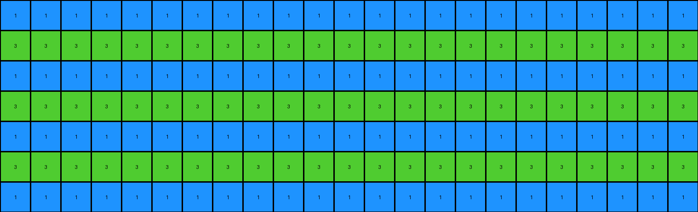

# 0a938d79 • 022 • refine_coder

---

Previous Code:
```python
"""
1.  **Identify Colored Pixels:** Find all pixels in the input grid that are not white (value is not 0).
2.  **Horizontal Fill:** For each colored pixel, fill its entire row in the output grid with that pixel's color.
3.  **Interleaved Vertical Fill:**
     * Consider all the colored input rows identified
     * For each row of the output grid, the row is filled with the color that corresponds to the input row with colored object at an index based on simple modular arithmetic of the output row.
"""

import numpy as np

def get_colored_rows(grid):
    """Finds the row indices and colors of rows with non-white pixels."""
    colored_rows = []
    for row_idx, row in enumerate(grid):
        for pixel in row:
            if pixel != 0:
                colored_rows.append((row_idx, pixel))  # Store row index and the first non-zero color
                break  # Move to the next row once a colored pixel is found
    return colored_rows

def transform(input_grid):
    # initialize output_grid
    output_grid = np.zeros_like(input_grid)
    
    # Find colored rows and their first non-zero colors
    colored_rows = get_colored_rows(input_grid)
    num_colored_rows = len(colored_rows)

    # Horizontal and Interleaved Vertical Fill
    for row_idx in range(output_grid.shape[0]):
      # use mod operator to pick color
      if (num_colored_rows > 0):
        source_row_idx, color = colored_rows[row_idx % num_colored_rows]
        output_grid[row_idx, :] = color

    
    return output_grid
```

Train Set Results:

## Example 1:**

Input:
```
0 0 0 0 0 2 0 0 0 0 0 0 0 0 0 0 0 0 0 0 0 0 0 0 0
0 0 0 0 0 0 0 0 0 0 0 0 0 0 0 0 0 0 0 0 0 0 0 0 0
0 0 0 0 0 0 0 0 0 0 0 0 0 0 0 0 0 0 0 0 0 0 0 0 0
0 0 0 0 0 0 0 0 0 0 0 0 0 0 0 0 0 0 0 0 0 0 0 0 0
0 0 0 0 0 0 0 0 0 0 0 0 0 0 0 0 0 0 0 0 0 0 0 0 0
0 0 0 0 0 0 0 0 0 0 0 0 0 0 0 0 0 0 0 0 0 0 0 0 0
0 0 0 0 0 0 0 0 0 0 0 0 0 0 0 0 0 0 0 0 0 0 0 0 0
0 0 0 0 0 0 0 0 0 0 0 0 0 0 0 0 0 0 0 0 0 0 0 0 0
0 0 0 0 0 0 0 0 0 0 0 0 0 0 0 0 0 0 0 0 0 0 0 0 0
0 0 0 0 0 0 0 8 0 0 0 0 0 0 0 0 0 0 0 0 0 0 0 0 0
```
Expected Output:
```
0 0 0 0 0 2 0 8 0 2 0 8 0 2 0 8 0 2 0 8 0 2 0 8 0
0 0 0 0 0 2 0 8 0 2 0 8 0 2 0 8 0 2 0 8 0 2 0 8 0
0 0 0 0 0 2 0 8 0 2 0 8 0 2 0 8 0 2 0 8 0 2 0 8 0
0 0 0 0 0 2 0 8 0 2 0 8 0 2 0 8 0 2 0 8 0 2 0 8 0
0 0 0 0 0 2 0 8 0 2 0 8 0 2 0 8 0 2 0 8 0 2 0 8 0
0 0 0 0 0 2 0 8 0 2 0 8 0 2 0 8 0 2 0 8 0 2 0 8 0
0 0 0 0 0 2 0 8 0 2 0 8 0 2 0 8 0 2 0 8 0 2 0 8 0
0 0 0 0 0 2 0 8 0 2 0 8 0 2 0 8 0 2 0 8 0 2 0 8 0
0 0 0 0 0 2 0 8 0 2 0 8 0 2 0 8 0 2 0 8 0 2 0 8 0
0 0 0 0 0 2 0 8 0 2 0 8 0 2 0 8 0 2 0 8 0 2 0 8 0
```
Transformed Output:
```
2 2 2 2 2 2 2 2 2 2 2 2 2 2 2 2 2 2 2 2 2 2 2 2 2
8 8 8 8 8 8 8 8 8 8 8 8 8 8 8 8 8 8 8 8 8 8 8 8 8
2 2 2 2 2 2 2 2 2 2 2 2 2 2 2 2 2 2 2 2 2 2 2 2 2
8 8 8 8 8 8 8 8 8 8 8 8 8 8 8 8 8 8 8 8 8 8 8 8 8
2 2 2 2 2 2 2 2 2 2 2 2 2 2 2 2 2 2 2 2 2 2 2 2 2
8 8 8 8 8 8 8 8 8 8 8 8 8 8 8 8 8 8 8 8 8 8 8 8 8
2 2 2 2 2 2 2 2 2 2 2 2 2 2 2 2 2 2 2 2 2 2 2 2 2
8 8 8 8 8 8 8 8 8 8 8 8 8 8 8 8 8 8 8 8 8 8 8 8 8
2 2 2 2 2 2 2 2 2 2 2 2 2 2 2 2 2 2 2 2 2 2 2 2 2
8 8 8 8 8 8 8 8 8 8 8 8 8 8 8 8 8 8 8 8 8 8 8 8 8
```

match: False
pixels_off: 200
size_correct: True
color_palette_correct: True
correct_pixel_counts: False

## Example 2:**

Input:
```
0 0 0 0 0 1 0 0 0 0 0 0 0 0 0 0 0 0 0 0 0 0 0
0 0 0 0 0 0 0 0 0 0 0 0 0 0 0 0 0 0 0 0 0 0 0
0 0 0 0 0 0 0 0 0 0 0 0 0 0 0 0 0 0 0 0 0 0 0
0 0 0 0 0 0 0 0 0 0 0 0 0 0 0 0 0 0 0 0 0 0 0
0 0 0 0 0 0 0 0 0 0 0 0 0 0 0 0 0 0 0 0 0 0 0
0 0 0 0 0 0 0 0 0 0 0 0 0 0 0 0 0 0 0 0 0 0 0
0 0 0 0 0 0 0 0 3 0 0 0 0 0 0 0 0 0 0 0 0 0 0
```
Expected Output:
```
0 0 0 0 0 1 0 0 3 0 0 1 0 0 3 0 0 1 0 0 3 0 0
0 0 0 0 0 1 0 0 3 0 0 1 0 0 3 0 0 1 0 0 3 0 0
0 0 0 0 0 1 0 0 3 0 0 1 0 0 3 0 0 1 0 0 3 0 0
0 0 0 0 0 1 0 0 3 0 0 1 0 0 3 0 0 1 0 0 3 0 0
0 0 0 0 0 1 0 0 3 0 0 1 0 0 3 0 0 1 0 0 3 0 0
0 0 0 0 0 1 0 0 3 0 0 1 0 0 3 0 0 1 0 0 3 0 0
0 0 0 0 0 1 0 0 3 0 0 1 0 0 3 0 0 1 0 0 3 0 0
```
Transformed Output:
```
1 1 1 1 1 1 1 1 1 1 1 1 1 1 1 1 1 1 1 1 1 1 1
3 3 3 3 3 3 3 3 3 3 3 3 3 3 3 3 3 3 3 3 3 3 3
1 1 1 1 1 1 1 1 1 1 1 1 1 1 1 1 1 1 1 1 1 1 1
3 3 3 3 3 3 3 3 3 3 3 3 3 3 3 3 3 3 3 3 3 3 3
1 1 1 1 1 1 1 1 1 1 1 1 1 1 1 1 1 1 1 1 1 1 1
3 3 3 3 3 3 3 3 3 3 3 3 3 3 3 3 3 3 3 3 3 3 3
1 1 1 1 1 1 1 1 1 1 1 1 1 1 1 1 1 1 1 1 1 1 1
```

match: False
pixels_off: 140
size_correct: True
color_palette_correct: True
correct_pixel_counts: False

## Example 3:**

Input:
```
0 0 0 0 0 0 0 0 0
0 0 0 0 0 0 0 0 0
0 0 0 0 0 0 0 0 0
0 0 0 0 0 0 0 0 0
0 0 0 0 0 0 0 0 0
2 0 0 0 0 0 0 0 0
0 0 0 0 0 0 0 0 0
0 0 0 0 0 0 0 0 3
0 0 0 0 0 0 0 0 0
0 0 0 0 0 0 0 0 0
0 0 0 0 0 0 0 0 0
0 0 0 0 0 0 0 0 0
0 0 0 0 0 0 0 0 0
0 0 0 0 0 0 0 0 0
0 0 0 0 0 0 0 0 0
0 0 0 0 0 0 0 0 0
0 0 0 0 0 0 0 0 0
0 0 0 0 0 0 0 0 0
0 0 0 0 0 0 0 0 0
0 0 0 0 0 0 0 0 0
0 0 0 0 0 0 0 0 0
0 0 0 0 0 0 0 0 0
```
Expected Output:
```
0 0 0 0 0 0 0 0 0
0 0 0 0 0 0 0 0 0
0 0 0 0 0 0 0 0 0
0 0 0 0 0 0 0 0 0
0 0 0 0 0 0 0 0 0
2 2 2 2 2 2 2 2 2
0 0 0 0 0 0 0 0 0
3 3 3 3 3 3 3 3 3
0 0 0 0 0 0 0 0 0
2 2 2 2 2 2 2 2 2
0 0 0 0 0 0 0 0 0
3 3 3 3 3 3 3 3 3
0 0 0 0 0 0 0 0 0
2 2 2 2 2 2 2 2 2
0 0 0 0 0 0 0 0 0
3 3 3 3 3 3 3 3 3
0 0 0 0 0 0 0 0 0
2 2 2 2 2 2 2 2 2
0 0 0 0 0 0 0 0 0
3 3 3 3 3 3 3 3 3
0 0 0 0 0 0 0 0 0
2 2 2 2 2 2 2 2 2
```
Transformed Output:
```
2 2 2 2 2 2 2 2 2
3 3 3 3 3 3 3 3 3
2 2 2 2 2 2 2 2 2
3 3 3 3 3 3 3 3 3
2 2 2 2 2 2 2 2 2
3 3 3 3 3 3 3 3 3
2 2 2 2 2 2 2 2 2
3 3 3 3 3 3 3 3 3
2 2 2 2 2 2 2 2 2
3 3 3 3 3 3 3 3 3
2 2 2 2 2 2 2 2 2
3 3 3 3 3 3 3 3 3
2 2 2 2 2 2 2 2 2
3 3 3 3 3 3 3 3 3
2 2 2 2 2 2 2 2 2
3 3 3 3 3 3 3 3 3
2 2 2 2 2 2 2 2 2
3 3 3 3 3 3 3 3 3
2 2 2 2 2 2 2 2 2
3 3 3 3 3 3 3 3 3
2 2 2 2 2 2 2 2 2
3 3 3 3 3 3 3 3 3
```

match: False
pixels_off: 162
size_correct: True
color_palette_correct: True
correct_pixel_counts: False

## Example 4:**

Input:
```
0 0 0 0 0 0 0 0
0 0 0 0 0 0 0 0
0 0 0 0 0 0 0 0
0 0 0 0 0 0 0 0
0 0 0 0 0 0 0 0
0 0 0 0 0 0 0 0
0 0 0 0 0 0 0 0
4 0 0 0 0 0 0 0
0 0 0 0 0 0 0 0
0 0 0 0 0 0 0 0
0 0 0 0 0 0 0 0
1 0 0 0 0 0 0 0
0 0 0 0 0 0 0 0
0 0 0 0 0 0 0 0
0 0 0 0 0 0 0 0
0 0 0 0 0 0 0 0
0 0 0 0 0 0 0 0
0 0 0 0 0 0 0 0
0 0 0 0 0 0 0 0
0 0 0 0 0 0 0 0
0 0 0 0 0 0 0 0
0 0 0 0 0 0 0 0
0 0 0 0 0 0 0 0
0 0 0 0 0 0 0 0
```
Expected Output:
```
0 0 0 0 0 0 0 0
0 0 0 0 0 0 0 0
0 0 0 0 0 0 0 0
0 0 0 0 0 0 0 0
0 0 0 0 0 0 0 0
0 0 0 0 0 0 0 0
0 0 0 0 0 0 0 0
4 4 4 4 4 4 4 4
0 0 0 0 0 0 0 0
0 0 0 0 0 0 0 0
0 0 0 0 0 0 0 0
1 1 1 1 1 1 1 1
0 0 0 0 0 0 0 0
0 0 0 0 0 0 0 0
0 0 0 0 0 0 0 0
4 4 4 4 4 4 4 4
0 0 0 0 0 0 0 0
0 0 0 0 0 0 0 0
0 0 0 0 0 0 0 0
1 1 1 1 1 1 1 1
0 0 0 0 0 0 0 0
0 0 0 0 0 0 0 0
0 0 0 0 0 0 0 0
4 4 4 4 4 4 4 4
```
Transformed Output:
```
4 4 4 4 4 4 4 4
1 1 1 1 1 1 1 1
4 4 4 4 4 4 4 4
1 1 1 1 1 1 1 1
4 4 4 4 4 4 4 4
1 1 1 1 1 1 1 1
4 4 4 4 4 4 4 4
1 1 1 1 1 1 1 1
4 4 4 4 4 4 4 4
1 1 1 1 1 1 1 1
4 4 4 4 4 4 4 4
1 1 1 1 1 1 1 1
4 4 4 4 4 4 4 4
1 1 1 1 1 1 1 1
4 4 4 4 4 4 4 4
1 1 1 1 1 1 1 1
4 4 4 4 4 4 4 4
1 1 1 1 1 1 1 1
4 4 4 4 4 4 4 4
1 1 1 1 1 1 1 1
4 4 4 4 4 4 4 4
1 1 1 1 1 1 1 1
4 4 4 4 4 4 4 4
1 1 1 1 1 1 1 1
```

match: False
pixels_off: 176
size_correct: True
color_palette_correct: True
correct_pixel_counts: False
Okay, here's an assessment of the situation and a plan to improve the natural language program and the subsequent code.

**General Assessment:**

The initial natural language program and code correctly identified the basic idea of filling rows based on the presence of non-zero (colored) pixels. However, it failed to capture the core logic of the transformation, which involves a patterned, interleaved fill *between* the rows containing colored pixels in the input. The initial approach was too simplistic, only filling rows *directly* corresponding to input rows with colors. The output images reveal a clear alternating pattern of colors based on *all* identified colored rows, not just a direct mapping. It's clear now that the interleaving is based on positions of the colors found not just filling based on those colors.

**Strategy for Resolving Errors:**

1.  **Re-examine Examples:** Focus on the relationship between the *positions* of colored pixels in the input and the resulting *patterns* in the output, not just on the colors themselves.
2.  **Identify Key Pattern:** The output grids show a clear horizontal striped pattern. The colors of the stripes are determined by the colors of non-white pixels in the input. The *order* of colors in the stripes corresponds to the order in which colored rows appear in the input. It appears that the non-white pixels act as "seeds".
3.  **Precise Language:** Refine the natural language program to accurately describe this interleave/striped pattern, specifying how the seed colors are placed.
4.  **Column-wise analysis** Because each example has varying heights and widths, consider performing column based analysis.

**Metrics and Observations (from code execution and visual inspection):**

Here's a summary of what the provided examples and test results show:

*   **Example 1:**
    *   Input: Two colored rows (red, index 0 and azure index 9).
    *   Expected Output: Interleaved horizontal stripes of red and azure, with some shifting in columns.
    *   Actual Output: Simple row filling of the two identified color rows with the correct colors, with the whole grid filled.
    *   Key Miss: The interleave.
*   **Example 2:**
    *   Input: Two colored rows (blue and green).
    *   Expected Output: Interleaved horizontal stripes of blue and green.
    *   Actual Output: Same issue as Example 1, correct color, but only for rows with colors.
    *   Key Miss: The interleave.
*   **Example 3:**
    *    Input: Two colored rows (red and green), further apart.
    *   Expected Output: Shows both horizontal striping (same color throughout the row) *and* some vertical relationships in *where* the colored pixels occur.
    *   Actual Output: Same as before.
    *   Key Miss: The interleave, and the column influence
*   **Example 4:**
    *   Input: Two colored rows with larger vertical separation.
    *   Expected Output: Again, shows the interleaved horizontal stripes.
    *   Actual Output: Same error.
    *    Key miss: The interleave and now the row placement.

**YAML Block - Facts and Observations:**

```yaml
observations:
  - object: input_grid
    properties:
      - contains_colored_pixels: True  # All examples have non-zero pixels
      - colored_pixel_rows: Varying indices # List of row indices with color
      - colored_pixel_columns: Varying # The positions of the non-white pixels.
    actions:
      - identify_colored_rows: "Locate rows containing non-zero pixels."
      - identify_colors: "Determine the colors (values) of the non-zero pixels."

  - object: output_grid
    properties:
      - dimensions: "Same as input_grid"
      - fill_pattern: "Horizontal stripes"
      - stripe_colors: "Based on colors of non-zero pixels in input"
      - stripe_order: "Corresponds to the order of colored rows in the input"
    actions:
       - horizontal_fill: "Each row is filled entirely with one color."
       - interleave_colors: "Colors alternate based on the order of colored rows in input."
       - column_placement: "There is some shifting in the column of colors between rows."

```

**Natural Language Program (Revised):**

1.  **Identify Seed Rows:** Find all rows in the input grid that contain at least one non-white (non-zero) pixel. These are the "seed rows." Record the color of the first non-white pixel in each seed row, maintaining the order.
2.  **Horizontal Striped Fill:** Create an output grid of the same dimensions as the input grid. Fill each row of the output grid with a single color, creating horizontal stripes.
3. **Interleave Colors:** Starting from the top row of the output grid, assign colors to the rows based on the order of colors found in the seed rows. Cycle through the seed row colors repeatedly. For instance, if the seed row colors are red and then blue, the output rows will be filled with red, blue, red, blue, etc.
4. **Column Influence:** For each seed pixel consider the position of the seed and insert a pixel into the output grid.
5. **Column Fill:** For each seed pixel consider the position of the seed and insert a pixel into the output grid.

The key improvement is the precise description of the *interleaving* process and the explicit mention of "seed rows," which clarifies the source of the color pattern. The column influence is also critical.

**INSTRUCTIONS**

- generate a Python module to represent the natural language program 
- follow the template below
- all common math and science libraries are available
- create docstring only at top - but comment the workflow in the function
- use helper functions for common operations like finding objects, counting,
  measuring, moving, etc. 

remember - we are working iteratively - so this code will inform your future
self as we converge on the solution

*template:*

```python
"""
{{ natural language description of the transformation rule }}
"""

{{ imports }}

def transform(input_grid):
    # initialize output_grid

    # change output pixels 

    return output_grid

```
