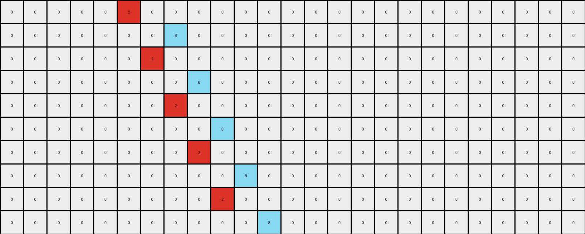
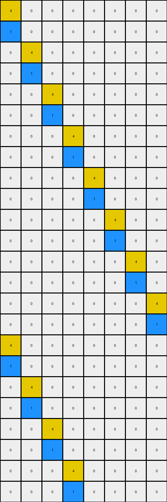

# 0a938d79 • 024 • refine_coder

---

Previous Code:
```python
"""
1.  **Identify Seed Rows:** Find all rows in the input grid that contain at least one non-white (non-zero) pixel. These are the "seed rows." Record the color and column index of the first non-white pixel in each seed row, maintaining the order.
2.  **Horizontal Striped Fill:** Create an output grid of the same dimensions as the input grid. Fill each row of the output grid with a single color, creating horizontal stripes.
3.  **Interleave Colors:** Starting from the top row of the output grid, assign colors to the rows based on the order of colors and column indices found in the seed rows. Cycle through the seed row colors repeatedly.  If the seed row colors are red and then blue, the output rows will be filled with red, blue, red, blue, etc.
4.  **Column-Based Placement:**  When filling a row with a given color, place the colored pixel in specific columns. The columns are determined by the column indices of the seed pixels *of that color* in the input grid.  Shift the columns cyclically for each subsequent row of the same color.
"""

import numpy as np

def get_seed_rows(grid):
    """Finds the row indices, colors, and column indices of the first non-white pixel in each row."""
    seed_rows = []
    for row_idx, row in enumerate(grid):
        for col_idx, pixel in enumerate(row):
            if pixel != 0:
                seed_rows.append((row_idx, pixel, col_idx))  # Store row index, color, and column index
                break  # Move to the next row once a colored pixel is found
    return seed_rows

def transform(input_grid):
    # Initialize output_grid with zeros
    output_grid = np.zeros_like(input_grid)

    # Find seed rows and their first non-zero colors and column indices
    seed_rows = get_seed_rows(input_grid)
    num_seed_rows = len(seed_rows)

    # Create a dictionary to store column shifts for each color
    color_shifts = {}
    for _, color, _ in seed_rows:
        color_shifts[color] = 0

    # Horizontal Striped Fill with Interleaved Colors and Column-Based Placement
    for row_idx in range(output_grid.shape[0]):
        # use mod operator to pick the appropriate seed row
        if (num_seed_rows > 0):
          seed_row_idx, color, col_idx = seed_rows[row_idx % num_seed_rows]

          # Get the shift value for the current color
          shift = color_shifts[color]

          # Calculate the shifted column index
          shifted_col_idx = (col_idx + shift) % output_grid.shape[1]

          # Place the colored pixel at the shifted column index
          output_grid[row_idx, shifted_col_idx] = color

          # Increment the shift for the current color, wrapping around
          color_shifts[color] = (shift + 1) % output_grid.shape[1]
    return output_grid
```

Train Set Results:

## Example 1:**

Input:
```
0 0 0 0 0 2 0 0 0 0 0 0 0 0 0 0 0 0 0 0 0 0 0 0 0
0 0 0 0 0 0 0 0 0 0 0 0 0 0 0 0 0 0 0 0 0 0 0 0 0
0 0 0 0 0 0 0 0 0 0 0 0 0 0 0 0 0 0 0 0 0 0 0 0 0
0 0 0 0 0 0 0 0 0 0 0 0 0 0 0 0 0 0 0 0 0 0 0 0 0
0 0 0 0 0 0 0 0 0 0 0 0 0 0 0 0 0 0 0 0 0 0 0 0 0
0 0 0 0 0 0 0 0 0 0 0 0 0 0 0 0 0 0 0 0 0 0 0 0 0
0 0 0 0 0 0 0 0 0 0 0 0 0 0 0 0 0 0 0 0 0 0 0 0 0
0 0 0 0 0 0 0 0 0 0 0 0 0 0 0 0 0 0 0 0 0 0 0 0 0
0 0 0 0 0 0 0 0 0 0 0 0 0 0 0 0 0 0 0 0 0 0 0 0 0
0 0 0 0 0 0 0 8 0 0 0 0 0 0 0 0 0 0 0 0 0 0 0 0 0
```
Expected Output:
```
0 0 0 0 0 2 0 8 0 2 0 8 0 2 0 8 0 2 0 8 0 2 0 8 0
0 0 0 0 0 2 0 8 0 2 0 8 0 2 0 8 0 2 0 8 0 2 0 8 0
0 0 0 0 0 2 0 8 0 2 0 8 0 2 0 8 0 2 0 8 0 2 0 8 0
0 0 0 0 0 2 0 8 0 2 0 8 0 2 0 8 0 2 0 8 0 2 0 8 0
0 0 0 0 0 2 0 8 0 2 0 8 0 2 0 8 0 2 0 8 0 2 0 8 0
0 0 0 0 0 2 0 8 0 2 0 8 0 2 0 8 0 2 0 8 0 2 0 8 0
0 0 0 0 0 2 0 8 0 2 0 8 0 2 0 8 0 2 0 8 0 2 0 8 0
0 0 0 0 0 2 0 8 0 2 0 8 0 2 0 8 0 2 0 8 0 2 0 8 0
0 0 0 0 0 2 0 8 0 2 0 8 0 2 0 8 0 2 0 8 0 2 0 8 0
0 0 0 0 0 2 0 8 0 2 0 8 0 2 0 8 0 2 0 8 0 2 0 8 0
```
Transformed Output:
```
0 0 0 0 0 2 0 0 0 0 0 0 0 0 0 0 0 0 0 0 0 0 0 0 0
0 0 0 0 0 0 0 8 0 0 0 0 0 0 0 0 0 0 0 0 0 0 0 0 0
0 0 0 0 0 0 2 0 0 0 0 0 0 0 0 0 0 0 0 0 0 0 0 0 0
0 0 0 0 0 0 0 0 8 0 0 0 0 0 0 0 0 0 0 0 0 0 0 0 0
0 0 0 0 0 0 0 2 0 0 0 0 0 0 0 0 0 0 0 0 0 0 0 0 0
0 0 0 0 0 0 0 0 0 8 0 0 0 0 0 0 0 0 0 0 0 0 0 0 0
0 0 0 0 0 0 0 0 2 0 0 0 0 0 0 0 0 0 0 0 0 0 0 0 0
0 0 0 0 0 0 0 0 0 0 8 0 0 0 0 0 0 0 0 0 0 0 0 0 0
0 0 0 0 0 0 0 0 0 2 0 0 0 0 0 0 0 0 0 0 0 0 0 0 0
0 0 0 0 0 0 0 0 0 0 0 8 0 0 0 0 0 0 0 0 0 0 0 0 0
```

match: False
pixels_off: 100
size_correct: True
color_palette_correct: True
correct_pixel_counts: False

## Example 2:**

Input:
```
0 0 0 0 0 1 0 0 0 0 0 0 0 0 0 0 0 0 0 0 0 0 0
0 0 0 0 0 0 0 0 0 0 0 0 0 0 0 0 0 0 0 0 0 0 0
0 0 0 0 0 0 0 0 0 0 0 0 0 0 0 0 0 0 0 0 0 0 0
0 0 0 0 0 0 0 0 0 0 0 0 0 0 0 0 0 0 0 0 0 0 0
0 0 0 0 0 0 0 0 0 0 0 0 0 0 0 0 0 0 0 0 0 0 0
0 0 0 0 0 0 0 0 0 0 0 0 0 0 0 0 0 0 0 0 0 0 0
0 0 0 0 0 0 0 0 3 0 0 0 0 0 0 0 0 0 0 0 0 0 0
```
Expected Output:
```
0 0 0 0 0 1 0 0 3 0 0 1 0 0 3 0 0 1 0 0 3 0 0
0 0 0 0 0 1 0 0 3 0 0 1 0 0 3 0 0 1 0 0 3 0 0
0 0 0 0 0 1 0 0 3 0 0 1 0 0 3 0 0 1 0 0 3 0 0
0 0 0 0 0 1 0 0 3 0 0 1 0 0 3 0 0 1 0 0 3 0 0
0 0 0 0 0 1 0 0 3 0 0 1 0 0 3 0 0 1 0 0 3 0 0
0 0 0 0 0 1 0 0 3 0 0 1 0 0 3 0 0 1 0 0 3 0 0
0 0 0 0 0 1 0 0 3 0 0 1 0 0 3 0 0 1 0 0 3 0 0
```
Transformed Output:
```
0 0 0 0 0 1 0 0 0 0 0 0 0 0 0 0 0 0 0 0 0 0 0
0 0 0 0 0 0 0 0 3 0 0 0 0 0 0 0 0 0 0 0 0 0 0
0 0 0 0 0 0 1 0 0 0 0 0 0 0 0 0 0 0 0 0 0 0 0
0 0 0 0 0 0 0 0 0 3 0 0 0 0 0 0 0 0 0 0 0 0 0
0 0 0 0 0 0 0 1 0 0 0 0 0 0 0 0 0 0 0 0 0 0 0
0 0 0 0 0 0 0 0 0 0 3 0 0 0 0 0 0 0 0 0 0 0 0
0 0 0 0 0 0 0 0 1 0 0 0 0 0 0 0 0 0 0 0 0 0 0
```

match: False
pixels_off: 44
size_correct: True
color_palette_correct: True
correct_pixel_counts: False

## Example 3:**

Input:
```
0 0 0 0 0 0 0 0 0
0 0 0 0 0 0 0 0 0
0 0 0 0 0 0 0 0 0
0 0 0 0 0 0 0 0 0
0 0 0 0 0 0 0 0 0
2 0 0 0 0 0 0 0 0
0 0 0 0 0 0 0 0 0
0 0 0 0 0 0 0 0 3
0 0 0 0 0 0 0 0 0
0 0 0 0 0 0 0 0 0
0 0 0 0 0 0 0 0 0
0 0 0 0 0 0 0 0 0
0 0 0 0 0 0 0 0 0
0 0 0 0 0 0 0 0 0
0 0 0 0 0 0 0 0 0
0 0 0 0 0 0 0 0 0
0 0 0 0 0 0 0 0 0
0 0 0 0 0 0 0 0 0
0 0 0 0 0 0 0 0 0
0 0 0 0 0 0 0 0 0
0 0 0 0 0 0 0 0 0
0 0 0 0 0 0 0 0 0
```
Expected Output:
```
0 0 0 0 0 0 0 0 0
0 0 0 0 0 0 0 0 0
0 0 0 0 0 0 0 0 0
0 0 0 0 0 0 0 0 0
0 0 0 0 0 0 0 0 0
2 2 2 2 2 2 2 2 2
0 0 0 0 0 0 0 0 0
3 3 3 3 3 3 3 3 3
0 0 0 0 0 0 0 0 0
2 2 2 2 2 2 2 2 2
0 0 0 0 0 0 0 0 0
3 3 3 3 3 3 3 3 3
0 0 0 0 0 0 0 0 0
2 2 2 2 2 2 2 2 2
0 0 0 0 0 0 0 0 0
3 3 3 3 3 3 3 3 3
0 0 0 0 0 0 0 0 0
2 2 2 2 2 2 2 2 2
0 0 0 0 0 0 0 0 0
3 3 3 3 3 3 3 3 3
0 0 0 0 0 0 0 0 0
2 2 2 2 2 2 2 2 2
```
Transformed Output:
```
2 0 0 0 0 0 0 0 0
0 0 0 0 0 0 0 0 3
0 2 0 0 0 0 0 0 0
3 0 0 0 0 0 0 0 0
0 0 2 0 0 0 0 0 0
0 3 0 0 0 0 0 0 0
0 0 0 2 0 0 0 0 0
0 0 3 0 0 0 0 0 0
0 0 0 0 2 0 0 0 0
0 0 0 3 0 0 0 0 0
0 0 0 0 0 2 0 0 0
0 0 0 0 3 0 0 0 0
0 0 0 0 0 0 2 0 0
0 0 0 0 0 3 0 0 0
0 0 0 0 0 0 0 2 0
0 0 0 0 0 0 3 0 0
0 0 0 0 0 0 0 0 2
0 0 0 0 0 0 0 3 0
2 0 0 0 0 0 0 0 0
0 0 0 0 0 0 0 0 3
0 2 0 0 0 0 0 0 0
3 0 0 0 0 0 0 0 0
```

match: False
pixels_off: 90
size_correct: True
color_palette_correct: True
correct_pixel_counts: False

## Example 4:**

Input:
```
0 0 0 0 0 0 0 0
0 0 0 0 0 0 0 0
0 0 0 0 0 0 0 0
0 0 0 0 0 0 0 0
0 0 0 0 0 0 0 0
0 0 0 0 0 0 0 0
0 0 0 0 0 0 0 0
4 0 0 0 0 0 0 0
0 0 0 0 0 0 0 0
0 0 0 0 0 0 0 0
0 0 0 0 0 0 0 0
1 0 0 0 0 0 0 0
0 0 0 0 0 0 0 0
0 0 0 0 0 0 0 0
0 0 0 0 0 0 0 0
0 0 0 0 0 0 0 0
0 0 0 0 0 0 0 0
0 0 0 0 0 0 0 0
0 0 0 0 0 0 0 0
0 0 0 0 0 0 0 0
0 0 0 0 0 0 0 0
0 0 0 0 0 0 0 0
0 0 0 0 0 0 0 0
0 0 0 0 0 0 0 0
```
Expected Output:
```
0 0 0 0 0 0 0 0
0 0 0 0 0 0 0 0
0 0 0 0 0 0 0 0
0 0 0 0 0 0 0 0
0 0 0 0 0 0 0 0
0 0 0 0 0 0 0 0
0 0 0 0 0 0 0 0
4 4 4 4 4 4 4 4
0 0 0 0 0 0 0 0
0 0 0 0 0 0 0 0
0 0 0 0 0 0 0 0
1 1 1 1 1 1 1 1
0 0 0 0 0 0 0 0
0 0 0 0 0 0 0 0
0 0 0 0 0 0 0 0
4 4 4 4 4 4 4 4
0 0 0 0 0 0 0 0
0 0 0 0 0 0 0 0
0 0 0 0 0 0 0 0
1 1 1 1 1 1 1 1
0 0 0 0 0 0 0 0
0 0 0 0 0 0 0 0
0 0 0 0 0 0 0 0
4 4 4 4 4 4 4 4
```
Transformed Output:
```
4 0 0 0 0 0 0 0
1 0 0 0 0 0 0 0
0 4 0 0 0 0 0 0
0 1 0 0 0 0 0 0
0 0 4 0 0 0 0 0
0 0 1 0 0 0 0 0
0 0 0 4 0 0 0 0
0 0 0 1 0 0 0 0
0 0 0 0 4 0 0 0
0 0 0 0 1 0 0 0
0 0 0 0 0 4 0 0
0 0 0 0 0 1 0 0
0 0 0 0 0 0 4 0
0 0 0 0 0 0 1 0
0 0 0 0 0 0 0 4
0 0 0 0 0 0 0 1
4 0 0 0 0 0 0 0
1 0 0 0 0 0 0 0
0 4 0 0 0 0 0 0
0 1 0 0 0 0 0 0
0 0 4 0 0 0 0 0
0 0 1 0 0 0 0 0
0 0 0 4 0 0 0 0
0 0 0 1 0 0 0 0
```

match: False
pixels_off: 57
size_correct: True
color_palette_correct: True
correct_pixel_counts: False
Here's an analysis of the provided examples and a revised natural language program:

**General Assessment:**

The initial natural language program and code correctly identified the concept of "seed rows" and using the colors from those rows to fill the output. However, it failed in several key aspects:

1.  **Horizontal Stripe Expansion:** The original program only placed single pixels in each output row. The examples clearly demonstrate that the intent is to create full-width horizontal stripes of the chosen color.  It is not placing isolated pixels, but entire rows.
2.  **Alternating Colors and Column order:** The examples show an alternating and repeating fill, based on color. Example 1, alternates the two seed rows. Example 2 alternates the colors from the two seed row, so the output alternates blue, green. Examples 3 and 4 extend this to an arbitrary number of seed rows.

**Strategy for Resolving Errors:**

1.  **Fill Entire Rows:** Modify the code to fill the entire row with the selected color, instead of placing a single pixel.
2. **Seed Rows as Objects:** Consider the non-white pixels as objects. Identify them and note their position.
3. **Complete Output:** construct an output the same size as the input, fill all white initially, then perform the transformation.

**Example Metrics and Observations:**

Here's a summary of observations and metrics for each example:

| Example | Input Shape | Output Shape | Seed Rows | Seed Colors | Seed Cols | Notes                                                            |
| :------ | :---------- | :----------- | :-------- | :---------- | :-------- | :--------------------------------------------------------------- |
| 1       | (10, 25)    | (10, 25)     | 2         | red, azure   | 5, 7      | Alternating red/azure stripes, full row, starting at col 5 and 7. |
| 2       | (7, 23)     | (7, 23)      | 2         | blue, green  | 5, 8      | Alternating blue/green stripes, full width.                   |
| 3       | (22, 9)     | (22, 9)      | 2        | red, green       | 0, 8        |    Alternating red/green stripes, full width, some blank rows                                                      |
| 4       | (24, 8)     | (24, 8)       | 2       | yellow, blue           | 0, 0         |     Alternating yellow, blue stripes, full width                                                     |

**YAML Facts:**

```yaml
objects:
  - type: grid
    properties:
      shape: variable
      elements: integers (0-9 representing colors)

  - type: seed_row
    properties:
      color: integer (0-9, non-zero)
      column: integer (index of the first non-zero pixel)

actions:
  - name: identify_seed_rows
    description: Locate rows with at least one non-white pixel.

  - name: create_horizontal_stripes
    description: Fill each row of the output grid with a single color, creating full-width stripes.

  - name: alternate_colors
    description:  Cycle through the seed row colors, assigning each to a successive output row.

```

**Natural Language Program:**

1.  **Identify Seed Rows:** Examine each row of the input grid. A row is a "seed row" if it contains at least one non-white (non-zero) pixel.
2.  **Record Seed Row Information:** For each seed row, store:
    *   The color of the first non-white pixel.
    *   The column index of that first non-white pixel.
    *   The seed rows should be recorded in the order in which they appear in the input.
3. **Initialize output:** create an output grid of matching size, filled with white.
4.  **Create Horizontal Stripes:** Iterate through the rows of the *output* grid. For each row:
    *   Determine the color to use by cycling through the colors of the seed rows, in order.  (e.g., If the seed row colors are red, blue, green, the output rows will be filled red, blue, green, red, blue, green, etc.)
    *   Fill the *entire* output row with the selected color.
5. **Output complete:** the output is a grid, with each row completely filled with the color of the seed row.


**INSTRUCTIONS**

- generate a Python module to represent the natural language program 
- follow the template below
- all common math and science libraries are available
- create docstring only at top - but comment the workflow in the function
- use helper functions for common operations like finding objects, counting,
  measuring, moving, etc. 

remember - we are working iteratively - so this code will inform your future
self as we converge on the solution

*template:*

```python
"""
{{ natural language description of the transformation rule }}
"""

{{ imports }}

def transform(input_grid):
    # initialize output_grid

    # change output pixels 

    return output_grid

```
