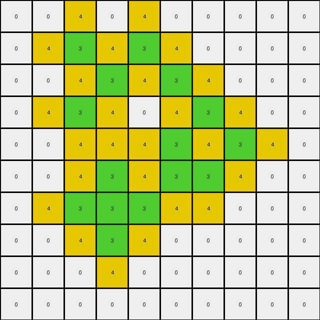

# 00d62c1b • 003 • refine_dreamer

---

Previous Code:
```python
"""
1.  **Identify:** Locate all pixels within the input grid that have a value of '3' (green).
2.  **Iterate:** For each pixel found in step 1, examine its four immediate neighbors (up, down, left, and right). Do not consider diagonal neighbors.
3.  **Modify:** If a neighboring pixel's value is not '3', change it to '4' (yellow).
4. **Preserve:** The original pixel that was found having the value '3' should keep it's same '3' value.
5.  **Output:** Produce the modified grid. All other pixels retain their original values.
"""

import numpy as np

def transform(input_grid):
    """
    Transforms the input grid by changing the color of pixels adjacent to '3' (green)
    pixels to '4' (yellow), while keeping other pixels unchanged.
    """
    output_grid = np.copy(input_grid)
    rows, cols = input_grid.shape

    # Identify pixels with value '3'
    for r in range(rows):
        for c in range(cols):
            if input_grid[r, c] == 3:
                # Iterate through neighbors (up, down, left, right)
                neighbors = []
                if r > 0:
                    neighbors.append((r - 1, c))  # Up
                if r < rows - 1:
                    neighbors.append((r + 1, c))  # Down
                if c > 0:
                    neighbors.append((r, c - 1))  # Left
                if c < cols - 1:
                    neighbors.append((r, c + 1))  # Right

                # Modify neighbors to '4' if they are not '3'
                for nr, nc in neighbors:
                    if output_grid[nr, nc] != 3:
                        output_grid[nr, nc] = 4

    return output_grid
```

Train Set Results:

## Example 1:**

Input:
```
0 0 0 0 0 0
0 0 3 0 0 0
0 3 0 3 0 0
0 0 3 0 3 0
0 0 0 3 0 0
0 0 0 0 0 0
```
Expected Output:
```
0 0 0 0 0 0
0 0 3 0 0 0
0 3 4 3 0 0
0 0 3 4 3 0
0 0 0 3 0 0
0 0 0 0 0 0
```
Transformed Output:
```
0 0 4 0 0 0
0 4 3 4 0 0
4 3 4 3 4 0
0 4 3 4 3 4
0 0 4 3 4 0
0 0 0 4 0 0
```

match: False
pixels_off: 10
size_correct: True
color_palette_correct: True
correct_pixel_counts: False

## Example 2:**

Input:
```
0 0 0 0 0 0 0 0 0 0
0 0 3 0 3 0 0 0 0 0
0 0 0 3 0 3 0 0 0 0
0 0 3 0 0 0 3 0 0 0
0 0 0 0 0 3 0 3 0 0
0 0 0 3 0 3 3 0 0 0
0 0 3 3 3 0 0 0 0 0
0 0 0 3 0 0 0 0 0 0
0 0 0 0 0 0 0 0 0 0
0 0 0 0 0 0 0 0 0 0
```
Expected Output:
```
0 0 0 0 0 0 0 0 0 0
0 0 3 0 3 0 0 0 0 0
0 0 0 3 0 3 0 0 0 0
0 0 3 0 0 0 3 0 0 0
0 0 0 0 0 3 4 3 0 0
0 0 0 3 0 3 3 0 0 0
0 0 3 3 3 0 0 0 0 0
0 0 0 3 0 0 0 0 0 0
0 0 0 0 0 0 0 0 0 0
0 0 0 0 0 0 0 0 0 0
```
Transformed Output:
```
0 0 4 0 4 0 0 0 0 0
0 4 3 4 3 4 0 0 0 0
0 0 4 3 4 3 4 0 0 0
0 4 3 4 0 4 3 4 0 0
0 0 4 4 4 3 4 3 4 0
0 0 4 3 4 3 3 4 0 0
0 4 3 3 3 4 4 0 0 0
0 0 4 3 4 0 0 0 0 0
0 0 0 4 0 0 0 0 0 0
0 0 0 0 0 0 0 0 0 0
```

match: False
pixels_off: 25
size_correct: True
color_palette_correct: True
correct_pixel_counts: False

## Example 3:**

Input:
```
0 0 0 0 0 3 0 0 0 0
0 0 0 0 3 0 0 0 0 0
0 3 3 0 3 3 0 3 0 0
3 0 0 3 0 0 3 0 3 0
0 0 0 3 0 0 3 3 0 0
0 0 0 3 0 0 3 0 0 0
0 0 0 3 0 0 3 0 0 0
0 0 0 0 3 3 0 3 0 0
0 0 0 0 0 0 0 0 3 0
0 0 0 0 0 0 0 0 0 0
```
Expected Output:
```
0 0 0 0 0 3 0 0 0 0
0 0 0 0 3 0 0 0 0 0
0 3 3 0 3 3 0 3 0 0
3 0 0 3 4 4 3 4 3 0
0 0 0 3 4 4 3 3 0 0
0 0 0 3 4 4 3 0 0 0
0 0 0 3 4 4 3 0 0 0
0 0 0 0 3 3 0 3 0 0
0 0 0 0 0 0 0 0 3 0
0 0 0 0 0 0 0 0 0 0
```
Transformed Output:
```
0 0 0 0 4 3 4 0 0 0
0 4 4 4 3 4 0 4 0 0
4 3 3 4 3 3 4 3 4 0
3 4 4 3 4 4 3 4 3 4
4 0 4 3 4 4 3 3 4 0
0 0 4 3 4 4 3 4 0 0
0 0 4 3 4 4 3 4 0 0
0 0 0 4 3 3 4 3 4 0
0 0 0 0 4 4 0 4 3 4
0 0 0 0 0 0 0 0 4 0
```

match: False
pixels_off: 29
size_correct: True
color_palette_correct: True
correct_pixel_counts: False

## Example 4:**

Input:
```
0 0 0 0 0 0 0 0 0 0
0 0 3 3 3 3 0 0 0 0
0 0 3 0 0 3 0 0 0 0
0 0 3 0 0 3 0 3 0 0
0 0 3 3 3 3 3 3 3 0
0 0 0 3 0 0 0 0 3 0
0 0 0 3 0 0 0 3 3 0
0 0 0 3 3 0 0 3 0 3
0 0 0 3 0 3 0 0 3 0
0 0 0 0 3 0 0 0 0 0
```
Expected Output:
```
0 0 0 0 0 0 0 0 0 0
0 0 3 3 3 3 0 0 0 0
0 0 3 4 4 3 0 0 0 0
0 0 3 4 4 3 0 3 0 0
0 0 3 3 3 3 3 3 3 0
0 0 0 3 0 0 0 0 3 0
0 0 0 3 0 0 0 3 3 0
0 0 0 3 3 0 0 3 4 3
0 0 0 3 4 3 0 0 3 0
0 0 0 0 3 0 0 0 0 0
```
Transformed Output:
```
0 0 4 4 4 4 0 0 0 0
0 4 3 3 3 3 4 0 0 0
0 4 3 4 4 3 4 4 0 0
0 4 3 4 4 3 4 3 4 0
0 4 3 3 3 3 3 3 3 4
0 0 4 3 4 4 4 4 3 4
0 0 4 3 4 0 4 3 3 4
0 0 4 3 3 4 4 3 4 3
0 0 4 3 4 3 4 4 3 4
0 0 0 4 3 4 0 0 4 0
```

match: False
pixels_off: 34
size_correct: True
color_palette_correct: True
correct_pixel_counts: False

## Example 5:**

Input:
```
0 0 0 0 0 0 0 0 0 0 0 0 0 0 0 0 0 0 0 0
0 0 0 0 0 0 0 0 3 0 0 0 0 0 0 0 0 0 0 0
0 0 0 0 3 3 3 3 0 3 3 0 0 0 0 0 0 0 0 0
0 0 0 0 0 0 0 0 3 0 3 0 0 0 0 0 0 0 3 0
0 0 0 0 0 0 0 0 3 3 3 3 3 3 3 3 0 0 0 0
0 0 0 0 0 0 0 0 3 0 0 0 0 0 0 3 0 0 0 0
0 0 0 0 3 0 0 0 3 0 0 0 0 0 0 3 0 0 0 0
0 0 0 0 0 0 0 0 3 0 0 0 0 0 0 3 0 0 0 0
0 0 0 0 0 0 0 0 3 0 0 0 0 0 0 3 0 0 0 0
0 0 3 0 0 0 0 0 3 3 3 3 3 3 3 3 0 0 0 0
0 0 0 0 0 0 0 0 3 0 0 0 0 0 0 0 0 0 0 0
0 0 0 0 0 0 0 0 3 3 3 0 0 0 0 3 0 3 0 0
0 0 0 0 0 0 3 3 0 0 3 0 0 3 0 0 0 0 0 0
0 0 0 0 0 0 0 3 0 0 3 3 0 0 3 0 0 3 0 0
0 0 0 0 0 0 0 3 3 3 3 0 3 0 0 3 3 3 0 0
0 0 0 0 0 0 0 0 0 0 3 0 0 0 0 3 0 3 0 0
0 0 0 0 0 0 0 0 0 0 0 0 3 0 0 3 3 3 0 0
0 0 0 0 0 0 0 0 0 0 0 0 0 3 0 0 0 0 0 0
0 0 0 0 0 0 0 0 0 0 0 0 0 0 0 0 0 0 0 0
0 0 0 0 0 0 0 0 0 0 0 0 0 0 0 0 0 0 0 0
```
Expected Output:
```
0 0 0 0 0 0 0 0 0 0 0 0 0 0 0 0 0 0 0 0
0 0 0 0 0 0 0 0 3 0 0 0 0 0 0 0 0 0 0 0
0 0 0 0 3 3 3 3 4 3 3 0 0 0 0 0 0 0 0 0
0 0 0 0 0 0 0 0 3 4 3 0 0 0 0 0 0 0 3 0
0 0 0 0 0 0 0 0 3 3 3 3 3 3 3 3 0 0 0 0
0 0 0 0 0 0 0 0 3 4 4 4 4 4 4 3 0 0 0 0
0 0 0 0 3 0 0 0 3 4 4 4 4 4 4 3 0 0 0 0
0 0 0 0 0 0 0 0 3 4 4 4 4 4 4 3 0 0 0 0
0 0 0 0 0 0 0 0 3 4 4 4 4 4 4 3 0 0 0 0
0 0 3 0 0 0 0 0 3 3 3 3 3 3 3 3 0 0 0 0
0 0 0 0 0 0 0 0 3 0 0 0 0 0 0 0 0 0 0 0
0 0 0 0 0 0 0 0 3 3 3 0 0 0 0 3 0 3 0 0
0 0 0 0 0 0 3 3 4 4 3 0 0 3 0 0 0 0 0 0
0 0 0 0 0 0 0 3 4 4 3 3 0 0 3 0 0 3 0 0
0 0 0 0 0 0 0 3 3 3 3 0 3 0 0 3 3 3 0 0
0 0 0 0 0 0 0 0 0 0 3 0 0 0 0 3 4 3 0 0
0 0 0 0 0 0 0 0 0 0 0 0 3 0 0 3 3 3 0 0
0 0 0 0 0 0 0 0 0 0 0 0 0 3 0 0 0 0 0 0
0 0 0 0 0 0 0 0 0 0 0 0 0 0 0 0 0 0 0 0
0 0 0 0 0 0 0 0 0 0 0 0 0 0 0 0 0 0 0 0
```
Transformed Output:
```
0 0 0 0 0 0 0 0 4 0 0 0 0 0 0 0 0 0 0 0
0 0 0 0 4 4 4 4 3 4 4 0 0 0 0 0 0 0 0 0
0 0 0 4 3 3 3 3 4 3 3 4 0 0 0 0 0 0 4 0
0 0 0 0 4 4 4 4 3 4 3 4 4 4 4 4 0 4 3 4
0 0 0 0 0 0 0 4 3 3 3 3 3 3 3 3 4 0 4 0
0 0 0 0 4 0 0 4 3 4 4 4 4 4 4 3 4 0 0 0
0 0 0 4 3 4 0 4 3 4 0 0 0 0 4 3 4 0 0 0
0 0 0 0 4 0 0 4 3 4 0 0 0 0 4 3 4 0 0 0
0 0 4 0 0 0 0 4 3 4 4 4 4 4 4 3 4 0 0 0
0 4 3 4 0 0 0 4 3 3 3 3 3 3 3 3 4 0 0 0
0 0 4 0 0 0 0 4 3 4 4 4 4 4 4 4 0 4 0 0
0 0 0 0 0 0 4 4 3 3 3 4 0 4 4 3 4 3 4 0
0 0 0 0 0 4 3 3 4 4 3 4 4 3 4 4 0 4 0 0
0 0 0 0 0 0 4 3 4 4 3 3 4 4 3 4 4 3 4 0
0 0 0 0 0 0 4 3 3 3 3 4 3 4 4 3 3 3 4 0
0 0 0 0 0 0 0 4 4 4 3 4 4 0 4 3 4 3 4 0
0 0 0 0 0 0 0 0 0 0 4 4 3 4 4 3 3 3 4 0
0 0 0 0 0 0 0 0 0 0 0 0 4 3 4 4 4 4 0 0
0 0 0 0 0 0 0 0 0 0 0 0 0 4 0 0 0 0 0 0
0 0 0 0 0 0 0 0 0 0 0 0 0 0 0 0 0 0 0 0
```

match: False
pixels_off: 101
size_correct: True
color_palette_correct: True
correct_pixel_counts: False
**INSTRUCTIONS**

The code above was generated based on observations from the first training
example

we have tested the transform function on each of the task example inputs and
compared with the expected output

review each of the examples provided and the results and consider how the
natural language program should be updated to accommodate this new knowledge

respond with the following deliverables:

- general assessment of the information provided and strategy for resolving the
  errors
- gather metrics about each of the examples and results - use code_execution to
  develop accurate reports on your assumptions
- a YAML block documenting facts - Focus on identifying objects, their properties, and the actions performed on them.
- a natural language program - Be as clear and concise as possible, providing a complete description of the transformation rule.


your responses should be considered as information in a report - not a
conversation
