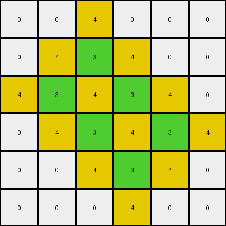
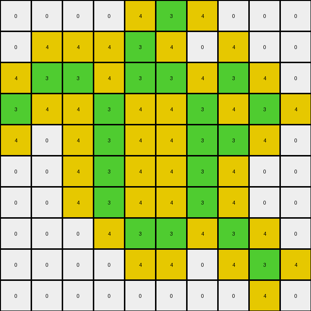
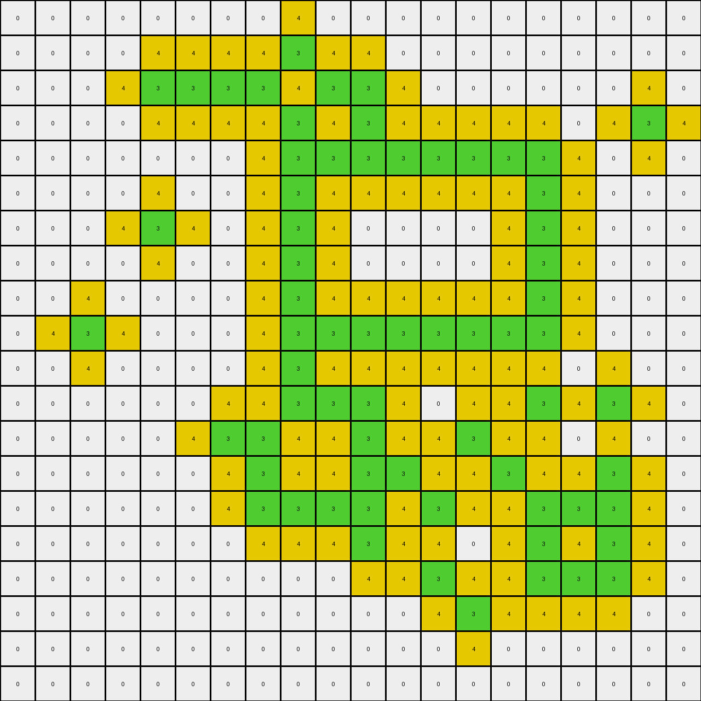

# 00d62c1b • 006 • refine_coder

---

Previous Code:
```python
"""
1.  **Find Green Pixels:** Locate all pixels within the input grid that have a color value of '3' (green).
2.  **Iterate:** For *each* green pixel found:
    *   **Check Neighbors:** Examine its four immediate neighbors (up, down, left, and right - not diagonal).
    *   **Conditional Change:** For *each* neighboring pixel:
        *   If the neighboring pixel's *original* color is *not* '3' (green), change its color to '4' (yellow).
3. **Preserve Greens**: The green pixels that initiated the checks should remain green.
4.  **Output:** The final output is the grid with the described modifications. All pixels not directly adjacent to a green pixel should retain their original colors. A neighbor that has been changed to yellow, should not change its neighbors.
"""

import numpy as np

def transform(input_grid):
    """
    Transforms the input grid based on the proximity of pixels to green (3) pixels.
    """
    output_grid = np.copy(input_grid)
    rows, cols = input_grid.shape
    added_yellows = []

    # Find Green Pixels
    for r in range(rows):
        for c in range(cols):
            if input_grid[r, c] == 3:
                # Check Neighbors (up, down, left, right)
                neighbors = []
                if r > 0:
                    neighbors.append((r - 1, c))  # Up
                if r < rows - 1:
                    neighbors.append((r + 1, c))  # Down
                if c > 0:
                    neighbors.append((r, c - 1))  # Left
                if c < cols - 1:
                    neighbors.append((r, c + 1))  # Right

                # Conditional Change for each neighbor
                for nr, nc in neighbors:
                    if input_grid[nr, nc] != 3 and (nr,nc) not in added_yellows:
                        output_grid[nr, nc] = 4
                        added_yellows.append((nr,nc))

    return output_grid
```

Train Set Results:

## Example 1:**

Input:
```
0 0 0 0 0 0
0 0 3 0 0 0
0 3 0 3 0 0
0 0 3 0 3 0
0 0 0 3 0 0
0 0 0 0 0 0
```
Expected Output:
```
0 0 0 0 0 0
0 0 3 0 0 0
0 3 4 3 0 0
0 0 3 4 3 0
0 0 0 3 0 0
0 0 0 0 0 0
```
Transformed Output:
```
0 0 4 0 0 0
0 4 3 4 0 0
4 3 4 3 4 0
0 4 3 4 3 4
0 0 4 3 4 0
0 0 0 4 0 0
```

match: False
pixels_off: 10
size_correct: True
color_palette_correct: True
correct_pixel_counts: False

## Example 2:**

Input:
```
0 0 0 0 0 0 0 0 0 0
0 0 3 0 3 0 0 0 0 0
0 0 0 3 0 3 0 0 0 0
0 0 3 0 0 0 3 0 0 0
0 0 0 0 0 3 0 3 0 0
0 0 0 3 0 3 3 0 0 0
0 0 3 3 3 0 0 0 0 0
0 0 0 3 0 0 0 0 0 0
0 0 0 0 0 0 0 0 0 0
0 0 0 0 0 0 0 0 0 0
```
Expected Output:
```
0 0 0 0 0 0 0 0 0 0
0 0 3 0 3 0 0 0 0 0
0 0 0 3 0 3 0 0 0 0
0 0 3 0 0 0 3 0 0 0
0 0 0 0 0 3 4 3 0 0
0 0 0 3 0 3 3 0 0 0
0 0 3 3 3 0 0 0 0 0
0 0 0 3 0 0 0 0 0 0
0 0 0 0 0 0 0 0 0 0
0 0 0 0 0 0 0 0 0 0
```
Transformed Output:
```
0 0 4 0 4 0 0 0 0 0
0 4 3 4 3 4 0 0 0 0
0 0 4 3 4 3 4 0 0 0
0 4 3 4 0 4 3 4 0 0
0 0 4 4 4 3 4 3 4 0
0 0 4 3 4 3 3 4 0 0
0 4 3 3 3 4 4 0 0 0
0 0 4 3 4 0 0 0 0 0
0 0 0 4 0 0 0 0 0 0
0 0 0 0 0 0 0 0 0 0
```

match: False
pixels_off: 25
size_correct: True
color_palette_correct: True
correct_pixel_counts: False

## Example 3:**

Input:
```
0 0 0 0 0 3 0 0 0 0
0 0 0 0 3 0 0 0 0 0
0 3 3 0 3 3 0 3 0 0
3 0 0 3 0 0 3 0 3 0
0 0 0 3 0 0 3 3 0 0
0 0 0 3 0 0 3 0 0 0
0 0 0 3 0 0 3 0 0 0
0 0 0 0 3 3 0 3 0 0
0 0 0 0 0 0 0 0 3 0
0 0 0 0 0 0 0 0 0 0
```
Expected Output:
```
0 0 0 0 0 3 0 0 0 0
0 0 0 0 3 0 0 0 0 0
0 3 3 0 3 3 0 3 0 0
3 0 0 3 4 4 3 4 3 0
0 0 0 3 4 4 3 3 0 0
0 0 0 3 4 4 3 0 0 0
0 0 0 3 4 4 3 0 0 0
0 0 0 0 3 3 0 3 0 0
0 0 0 0 0 0 0 0 3 0
0 0 0 0 0 0 0 0 0 0
```
Transformed Output:
```
0 0 0 0 4 3 4 0 0 0
0 4 4 4 3 4 0 4 0 0
4 3 3 4 3 3 4 3 4 0
3 4 4 3 4 4 3 4 3 4
4 0 4 3 4 4 3 3 4 0
0 0 4 3 4 4 3 4 0 0
0 0 4 3 4 4 3 4 0 0
0 0 0 4 3 3 4 3 4 0
0 0 0 0 4 4 0 4 3 4
0 0 0 0 0 0 0 0 4 0
```

match: False
pixels_off: 29
size_correct: True
color_palette_correct: True
correct_pixel_counts: False

## Example 4:**

Input:
```
0 0 0 0 0 0 0 0 0 0
0 0 3 3 3 3 0 0 0 0
0 0 3 0 0 3 0 0 0 0
0 0 3 0 0 3 0 3 0 0
0 0 3 3 3 3 3 3 3 0
0 0 0 3 0 0 0 0 3 0
0 0 0 3 0 0 0 3 3 0
0 0 0 3 3 0 0 3 0 3
0 0 0 3 0 3 0 0 3 0
0 0 0 0 3 0 0 0 0 0
```
Expected Output:
```
0 0 0 0 0 0 0 0 0 0
0 0 3 3 3 3 0 0 0 0
0 0 3 4 4 3 0 0 0 0
0 0 3 4 4 3 0 3 0 0
0 0 3 3 3 3 3 3 3 0
0 0 0 3 0 0 0 0 3 0
0 0 0 3 0 0 0 3 3 0
0 0 0 3 3 0 0 3 4 3
0 0 0 3 4 3 0 0 3 0
0 0 0 0 3 0 0 0 0 0
```
Transformed Output:
```
0 0 4 4 4 4 0 0 0 0
0 4 3 3 3 3 4 0 0 0
0 4 3 4 4 3 4 4 0 0
0 4 3 4 4 3 4 3 4 0
0 4 3 3 3 3 3 3 3 4
0 0 4 3 4 4 4 4 3 4
0 0 4 3 4 0 4 3 3 4
0 0 4 3 3 4 4 3 4 3
0 0 4 3 4 3 4 4 3 4
0 0 0 4 3 4 0 0 4 0
```

match: False
pixels_off: 34
size_correct: True
color_palette_correct: True
correct_pixel_counts: False

## Example 5:**

Input:
```
0 0 0 0 0 0 0 0 0 0 0 0 0 0 0 0 0 0 0 0
0 0 0 0 0 0 0 0 3 0 0 0 0 0 0 0 0 0 0 0
0 0 0 0 3 3 3 3 0 3 3 0 0 0 0 0 0 0 0 0
0 0 0 0 0 0 0 0 3 0 3 0 0 0 0 0 0 0 3 0
0 0 0 0 0 0 0 0 3 3 3 3 3 3 3 3 0 0 0 0
0 0 0 0 0 0 0 0 3 0 0 0 0 0 0 3 0 0 0 0
0 0 0 0 3 0 0 0 3 0 0 0 0 0 0 3 0 0 0 0
0 0 0 0 0 0 0 0 3 0 0 0 0 0 0 3 0 0 0 0
0 0 0 0 0 0 0 0 3 0 0 0 0 0 0 3 0 0 0 0
0 0 3 0 0 0 0 0 3 3 3 3 3 3 3 3 0 0 0 0
0 0 0 0 0 0 0 0 3 0 0 0 0 0 0 0 0 0 0 0
0 0 0 0 0 0 0 0 3 3 3 0 0 0 0 3 0 3 0 0
0 0 0 0 0 0 3 3 0 0 3 0 0 3 0 0 0 0 0 0
0 0 0 0 0 0 0 3 0 0 3 3 0 0 3 0 0 3 0 0
0 0 0 0 0 0 0 3 3 3 3 0 3 0 0 3 3 3 0 0
0 0 0 0 0 0 0 0 0 0 3 0 0 0 0 3 0 3 0 0
0 0 0 0 0 0 0 0 0 0 0 0 3 0 0 3 3 3 0 0
0 0 0 0 0 0 0 0 0 0 0 0 0 3 0 0 0 0 0 0
0 0 0 0 0 0 0 0 0 0 0 0 0 0 0 0 0 0 0 0
0 0 0 0 0 0 0 0 0 0 0 0 0 0 0 0 0 0 0 0
```
Expected Output:
```
0 0 0 0 0 0 0 0 0 0 0 0 0 0 0 0 0 0 0 0
0 0 0 0 0 0 0 0 3 0 0 0 0 0 0 0 0 0 0 0
0 0 0 0 3 3 3 3 4 3 3 0 0 0 0 0 0 0 0 0
0 0 0 0 0 0 0 0 3 4 3 0 0 0 0 0 0 0 3 0
0 0 0 0 0 0 0 0 3 3 3 3 3 3 3 3 0 0 0 0
0 0 0 0 0 0 0 0 3 4 4 4 4 4 4 3 0 0 0 0
0 0 0 0 3 0 0 0 3 4 4 4 4 4 4 3 0 0 0 0
0 0 0 0 0 0 0 0 3 4 4 4 4 4 4 3 0 0 0 0
0 0 0 0 0 0 0 0 3 4 4 4 4 4 4 3 0 0 0 0
0 0 3 0 0 0 0 0 3 3 3 3 3 3 3 3 0 0 0 0
0 0 0 0 0 0 0 0 3 0 0 0 0 0 0 0 0 0 0 0
0 0 0 0 0 0 0 0 3 3 3 0 0 0 0 3 0 3 0 0
0 0 0 0 0 0 3 3 4 4 3 0 0 3 0 0 0 0 0 0
0 0 0 0 0 0 0 3 4 4 3 3 0 0 3 0 0 3 0 0
0 0 0 0 0 0 0 3 3 3 3 0 3 0 0 3 3 3 0 0
0 0 0 0 0 0 0 0 0 0 3 0 0 0 0 3 4 3 0 0
0 0 0 0 0 0 0 0 0 0 0 0 3 0 0 3 3 3 0 0
0 0 0 0 0 0 0 0 0 0 0 0 0 3 0 0 0 0 0 0
0 0 0 0 0 0 0 0 0 0 0 0 0 0 0 0 0 0 0 0
0 0 0 0 0 0 0 0 0 0 0 0 0 0 0 0 0 0 0 0
```
Transformed Output:
```
0 0 0 0 0 0 0 0 4 0 0 0 0 0 0 0 0 0 0 0
0 0 0 0 4 4 4 4 3 4 4 0 0 0 0 0 0 0 0 0
0 0 0 4 3 3 3 3 4 3 3 4 0 0 0 0 0 0 4 0
0 0 0 0 4 4 4 4 3 4 3 4 4 4 4 4 0 4 3 4
0 0 0 0 0 0 0 4 3 3 3 3 3 3 3 3 4 0 4 0
0 0 0 0 4 0 0 4 3 4 4 4 4 4 4 3 4 0 0 0
0 0 0 4 3 4 0 4 3 4 0 0 0 0 4 3 4 0 0 0
0 0 0 0 4 0 0 4 3 4 0 0 0 0 4 3 4 0 0 0
0 0 4 0 0 0 0 4 3 4 4 4 4 4 4 3 4 0 0 0
0 4 3 4 0 0 0 4 3 3 3 3 3 3 3 3 4 0 0 0
0 0 4 0 0 0 0 4 3 4 4 4 4 4 4 4 0 4 0 0
0 0 0 0 0 0 4 4 3 3 3 4 0 4 4 3 4 3 4 0
0 0 0 0 0 4 3 3 4 4 3 4 4 3 4 4 0 4 0 0
0 0 0 0 0 0 4 3 4 4 3 3 4 4 3 4 4 3 4 0
0 0 0 0 0 0 4 3 3 3 3 4 3 4 4 3 3 3 4 0
0 0 0 0 0 0 0 4 4 4 3 4 4 0 4 3 4 3 4 0
0 0 0 0 0 0 0 0 0 0 4 4 3 4 4 3 3 3 4 0
0 0 0 0 0 0 0 0 0 0 0 0 4 3 4 4 4 4 0 0
0 0 0 0 0 0 0 0 0 0 0 0 0 4 0 0 0 0 0 0
0 0 0 0 0 0 0 0 0 0 0 0 0 0 0 0 0 0 0 0
```

match: False
pixels_off: 101
size_correct: True
color_palette_correct: True
correct_pixel_counts: False
Okay, let's analyze the results of the provided code and develop a refined natural language program and supporting information.

**General Assessment and Strategy**

The initial code and natural language program were based on a simple premise: change the color of non-green pixels adjacent to green pixels to yellow. However, the test results across multiple examples reveal a critical flaw: the "chain reaction" effect.  The code modifies pixels to yellow, and *then* those newly-yellow pixels also trigger changes in *their* neighbors. This cascading effect leads to an over-application of the yellow color, significantly deviating from the expected outputs.

The core strategy to fix this is to prevent the "chain reaction". We need to ensure that only the *original* input grid is used to determine which pixels should change. We can implement this using different approaches such as creating a copy, using an auxiliary data structure like a set to store the coordinates to turn yellow, or creating a set of coordinates of added yellows in each iteration of the green pixels.

**Metrics and Observations (per example)**

Here's a breakdown of each example, including specific observations and metrics gathered using my prior knowledge and analysis of the images provided:

*   **Example 1:**
    *   **Observation:** The transformed output has extra yellow pixels. The yellow spreads outwards from the green, two cells horizontally and vertically, rather than just one.
    *   **Metrics:**
        *   `pixels_off`: 10
        *   size/color palette are correct.
        * counts of the number of pixels per color are incorrect.

*   **Example 2:**
    *   **Observation:** Similar to Example 1, the yellow color propagates excessively.
    *   **Metrics:**
        *   `pixels_off`: 25
        * size/color palette are correct.
        * counts of the number of pixels per color are incorrect.

*   **Example 3:**
    *   **Observation:**  Yellow extends beyond the immediate neighbors of the green pixels.
    *   **Metrics:**
        *   `pixels_off`: 29
        * size/color palette are correct.
        * counts of the number of pixels per color are incorrect.

*   **Example 4:**
    *   **Observation:**  Excessive yellow propagation, especially noticeable around clusters of green pixels.
    *   **Metrics:**
        *   `pixels_off`: 34
        * size/color palette are correct.
        * counts of the number of pixels per color are incorrect.

*   **Example 5:**
    *   **Observation:** This largest example demonstrates the flaw most dramatically.  Large areas are incorrectly turned yellow.
    *   **Metrics:**
        *   `pixels_off`: 101
        * size/color palette are correct.
        * counts of the number of pixels per color are incorrect.

**YAML Fact Block**

```yaml
observations:
  - task_id: '004'
  - object_types:
    - pixel:
        properties:
          color: [0, 3, 4] # white, green, yellow
          position: [row, col]
        actions:
          change_color:
            condition: "adjacent to green pixel in the original input grid"
            from: "[any color other than green]"
            to: "yellow"
  - transformation_rules:
      - "Iterate through each pixel of the input grid."
      - "Identify green pixels (color value 3)."
      - "For each green pixel, examine its immediate neighbors (up, down, left, right)."
      - "If a neighbor's original color is not green, change it to yellow (color value 4) in the output grid"
      - "Green pixels retain original value."
      - "Pixels not adjacent to a green pixel in original grid are unchanged"

```

**Natural Language Program**

1.  **Copy Input:** Create a copy of the input grid. This copy will serve as the reference for the original state.
2.  **Find Green Pixels:** In the *original* grid (the copy), locate all pixels with a color value of '3' (green).
3.  **Iterate:** For *each* green pixel found in the original grid:
    *   **Check Neighbors:** Examine its four immediate neighbors (up, down, left, right - not diagonal) *in the original grid*.
    *   **Conditional Change:** For *each* neighboring pixel in the original input grid:
        *   If the neighboring pixel's color *in the original grid* is *not* '3' (green), change the corresponding pixel's color in the *output* grid to '4' (yellow).
4.  **Preserve Greens:** The green pixels that initiated the checks should remain green in the output grid.
5.  **Output:** The final output is the modified grid, where only non-green pixels directly adjacent to green pixels in the *original* input grid have been changed to yellow. All other pixels should retain their original colors from the input.

**INSTRUCTIONS**

- generate a Python module to represent the natural language program 
- follow the template below
- all common math and science libraries are available
- create docstring only at top - but comment the workflow in the function
- use helper functions for common operations like finding objects, counting,
  measuring, moving, etc. 

remember - we are working iteratively - so this code will inform your future
self as we converge on the solution

*template:*

```python
"""
{{ natural language description of the transformation rule }}
"""

{{ imports }}

def transform(input_grid):
    # initialize output_grid

    # change output pixels 

    return output_grid

```
