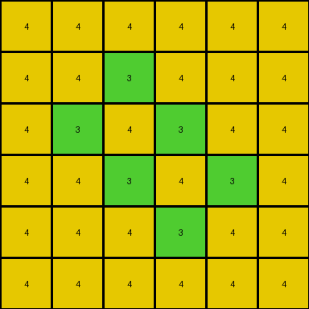
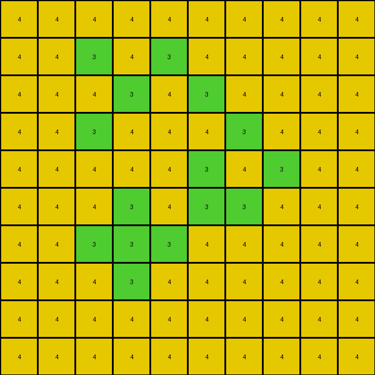
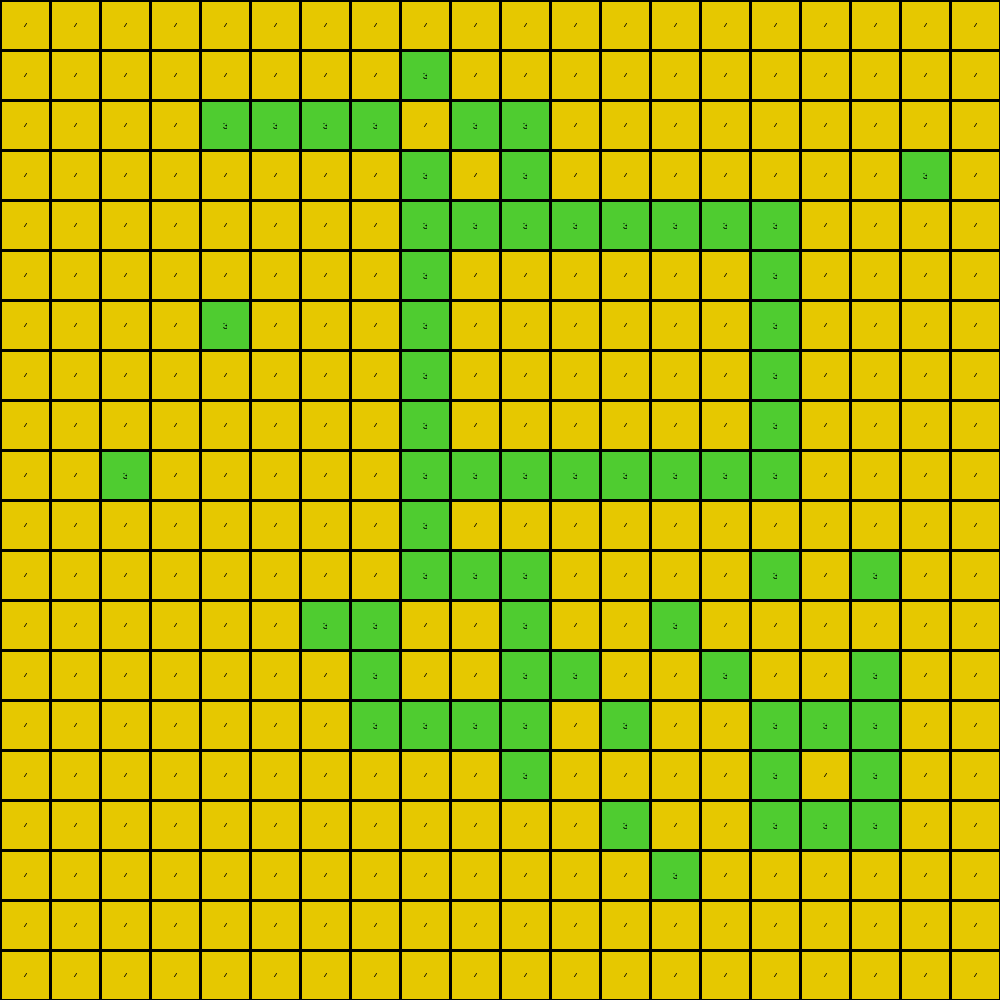

# 00d62c1b • 016 • refine_coder

---

Previous Code:
```python
"""
1.  **Identify the Target Shape:** Locate all pixels within the input grid that have a color value of '3' (green). Consider these pixels as forming a single, potentially irregular, shape.

2.  **Find Adjacent Pixels:** For each pixel that is part of the identified shape, determine its immediate neighbors. Neighbors are defined as pixels directly above, below, to the left, or to the right (not diagonal).

3.  **Conditional Color Change:**
    *   Check the neighbors of the shape identified in step one.
    *   If a neighboring pixel does *not* have the value '3' (green), and it exists within grid bounds, is now part of the identified shape.
    *   Change any pixels that have become part of the shape to color value '4' (yellow).

4.  **Output:** Produce the modified grid, where the identified shape's interior adjacent pixels have been changed to yellow, while all other pixels retain their original color.
"""

import numpy as np

def get_neighbors(grid, row, col):
    """Gets the valid neighbors of a cell in the grid."""
    rows, cols = grid.shape
    neighbors = []
    if row > 0:
        neighbors.append((row - 1, col))  # North
    if row < rows - 1:
        neighbors.append((row + 1, col))  # South
    if col > 0:
        neighbors.append((row, col - 1))  # West
    if col < cols - 1:
        neighbors.append((row, col + 1))  # East
    return neighbors

def transform(input_grid):
    # initialize output_grid as a copy of the input
    output_grid = np.copy(input_grid)
    rows, cols = input_grid.shape

    # Identify the target shape (green pixels)
    green_pixels = []
    for r in range(rows):
        for c in range(cols):
            if input_grid[r, c] == 3:
                green_pixels.append((r, c))

    # Find pixels inside the shape
    shape_pixels = set() # use a set for quick lookups and additions
    shape_pixels.update(green_pixels)

    new_pixels_added = True
    while new_pixels_added:
        new_pixels_added = False # assume done, unless we add some
        
        next_shape_pixels = set() # store new found pixels before adding to shape_pixels
        next_shape_pixels.update(shape_pixels) # prime it with existing
        
        for r, c in shape_pixels:  # Check neighbors of all current shape_pixels
            for neighbor_row, neighbor_col in get_neighbors(input_grid, r, c):
                if (neighbor_row, neighbor_col) not in shape_pixels: # if neighbor isnt already added
                        next_shape_pixels.add((neighbor_row,neighbor_col)) # add it
                        new_pixels_added = True

        shape_pixels.update(next_shape_pixels) # commit all the newly discovered shape pixels


    #change pixels inside the shape to color 4
    for r,c in shape_pixels:
        if (r,c) not in green_pixels:
            output_grid[r,c] = 4

    return output_grid
```

Train Set Results:

## Example 1:**

Input:
```
0 0 0 0 0 0
0 0 3 0 0 0
0 3 0 3 0 0
0 0 3 0 3 0
0 0 0 3 0 0
0 0 0 0 0 0
```
Expected Output:
```
0 0 0 0 0 0
0 0 3 0 0 0
0 3 4 3 0 0
0 0 3 4 3 0
0 0 0 3 0 0
0 0 0 0 0 0
```
Transformed Output:
```
4 4 4 4 4 4
4 4 3 4 4 4
4 3 4 3 4 4
4 4 3 4 3 4
4 4 4 3 4 4
4 4 4 4 4 4
```

match: False
pixels_off: 28
size_correct: True
color_palette_correct: True
correct_pixel_counts: False

## Example 2:**

Input:
```
0 0 0 0 0 0 0 0 0 0
0 0 3 0 3 0 0 0 0 0
0 0 0 3 0 3 0 0 0 0
0 0 3 0 0 0 3 0 0 0
0 0 0 0 0 3 0 3 0 0
0 0 0 3 0 3 3 0 0 0
0 0 3 3 3 0 0 0 0 0
0 0 0 3 0 0 0 0 0 0
0 0 0 0 0 0 0 0 0 0
0 0 0 0 0 0 0 0 0 0
```
Expected Output:
```
0 0 0 0 0 0 0 0 0 0
0 0 3 0 3 0 0 0 0 0
0 0 0 3 0 3 0 0 0 0
0 0 3 0 0 0 3 0 0 0
0 0 0 0 0 3 4 3 0 0
0 0 0 3 0 3 3 0 0 0
0 0 3 3 3 0 0 0 0 0
0 0 0 3 0 0 0 0 0 0
0 0 0 0 0 0 0 0 0 0
0 0 0 0 0 0 0 0 0 0
```
Transformed Output:
```
4 4 4 4 4 4 4 4 4 4
4 4 3 4 3 4 4 4 4 4
4 4 4 3 4 3 4 4 4 4
4 4 3 4 4 4 3 4 4 4
4 4 4 4 4 3 4 3 4 4
4 4 4 3 4 3 3 4 4 4
4 4 3 3 3 4 4 4 4 4
4 4 4 3 4 4 4 4 4 4
4 4 4 4 4 4 4 4 4 4
4 4 4 4 4 4 4 4 4 4
```

match: False
pixels_off: 84
size_correct: True
color_palette_correct: True
correct_pixel_counts: False

## Example 3:**

Input:
```
0 0 0 0 0 3 0 0 0 0
0 0 0 0 3 0 0 0 0 0
0 3 3 0 3 3 0 3 0 0
3 0 0 3 0 0 3 0 3 0
0 0 0 3 0 0 3 3 0 0
0 0 0 3 0 0 3 0 0 0
0 0 0 3 0 0 3 0 0 0
0 0 0 0 3 3 0 3 0 0
0 0 0 0 0 0 0 0 3 0
0 0 0 0 0 0 0 0 0 0
```
Expected Output:
```
0 0 0 0 0 3 0 0 0 0
0 0 0 0 3 0 0 0 0 0
0 3 3 0 3 3 0 3 0 0
3 0 0 3 4 4 3 4 3 0
0 0 0 3 4 4 3 3 0 0
0 0 0 3 4 4 3 0 0 0
0 0 0 3 4 4 3 0 0 0
0 0 0 0 3 3 0 3 0 0
0 0 0 0 0 0 0 0 3 0
0 0 0 0 0 0 0 0 0 0
```
Transformed Output:
```
4 4 4 4 4 3 4 4 4 4
4 4 4 4 3 4 4 4 4 4
4 3 3 4 3 3 4 3 4 4
3 4 4 3 4 4 3 4 3 4
4 4 4 3 4 4 3 3 4 4
4 4 4 3 4 4 3 4 4 4
4 4 4 3 4 4 3 4 4 4
4 4 4 4 3 3 4 3 4 4
4 4 4 4 4 4 4 4 3 4
4 4 4 4 4 4 4 4 4 4
```

match: False
pixels_off: 69
size_correct: True
color_palette_correct: True
correct_pixel_counts: False

## Example 4:**

Input:
```
0 0 0 0 0 0 0 0 0 0
0 0 3 3 3 3 0 0 0 0
0 0 3 0 0 3 0 0 0 0
0 0 3 0 0 3 0 3 0 0
0 0 3 3 3 3 3 3 3 0
0 0 0 3 0 0 0 0 3 0
0 0 0 3 0 0 0 3 3 0
0 0 0 3 3 0 0 3 0 3
0 0 0 3 0 3 0 0 3 0
0 0 0 0 3 0 0 0 0 0
```
Expected Output:
```
0 0 0 0 0 0 0 0 0 0
0 0 3 3 3 3 0 0 0 0
0 0 3 4 4 3 0 0 0 0
0 0 3 4 4 3 0 3 0 0
0 0 3 3 3 3 3 3 3 0
0 0 0 3 0 0 0 0 3 0
0 0 0 3 0 0 0 3 3 0
0 0 0 3 3 0 0 3 4 3
0 0 0 3 4 3 0 0 3 0
0 0 0 0 3 0 0 0 0 0
```
Transformed Output:
```
4 4 4 4 4 4 4 4 4 4
4 4 3 3 3 3 4 4 4 4
4 4 3 4 4 3 4 4 4 4
4 4 3 4 4 3 4 3 4 4
4 4 3 3 3 3 3 3 3 4
4 4 4 3 4 4 4 4 3 4
4 4 4 3 4 4 4 3 3 4
4 4 4 3 3 4 4 3 4 3
4 4 4 3 4 3 4 4 3 4
4 4 4 4 3 4 4 4 4 4
```

match: False
pixels_off: 65
size_correct: True
color_palette_correct: True
correct_pixel_counts: False

## Example 5:**

Input:
```
0 0 0 0 0 0 0 0 0 0 0 0 0 0 0 0 0 0 0 0
0 0 0 0 0 0 0 0 3 0 0 0 0 0 0 0 0 0 0 0
0 0 0 0 3 3 3 3 0 3 3 0 0 0 0 0 0 0 0 0
0 0 0 0 0 0 0 0 3 0 3 0 0 0 0 0 0 0 3 0
0 0 0 0 0 0 0 0 3 3 3 3 3 3 3 3 0 0 0 0
0 0 0 0 0 0 0 0 3 0 0 0 0 0 0 3 0 0 0 0
0 0 0 0 3 0 0 0 3 0 0 0 0 0 0 3 0 0 0 0
0 0 0 0 0 0 0 0 3 0 0 0 0 0 0 3 0 0 0 0
0 0 0 0 0 0 0 0 3 0 0 0 0 0 0 3 0 0 0 0
0 0 3 0 0 0 0 0 3 3 3 3 3 3 3 3 0 0 0 0
0 0 0 0 0 0 0 0 3 0 0 0 0 0 0 0 0 0 0 0
0 0 0 0 0 0 0 0 3 3 3 0 0 0 0 3 0 3 0 0
0 0 0 0 0 0 3 3 0 0 3 0 0 3 0 0 0 0 0 0
0 0 0 0 0 0 0 3 0 0 3 3 0 0 3 0 0 3 0 0
0 0 0 0 0 0 0 3 3 3 3 0 3 0 0 3 3 3 0 0
0 0 0 0 0 0 0 0 0 0 3 0 0 0 0 3 0 3 0 0
0 0 0 0 0 0 0 0 0 0 0 0 3 0 0 3 3 3 0 0
0 0 0 0 0 0 0 0 0 0 0 0 0 3 0 0 0 0 0 0
0 0 0 0 0 0 0 0 0 0 0 0 0 0 0 0 0 0 0 0
0 0 0 0 0 0 0 0 0 0 0 0 0 0 0 0 0 0 0 0
```
Expected Output:
```
0 0 0 0 0 0 0 0 0 0 0 0 0 0 0 0 0 0 0 0
0 0 0 0 0 0 0 0 3 0 0 0 0 0 0 0 0 0 0 0
0 0 0 0 3 3 3 3 4 3 3 0 0 0 0 0 0 0 0 0
0 0 0 0 0 0 0 0 3 4 3 0 0 0 0 0 0 0 3 0
0 0 0 0 0 0 0 0 3 3 3 3 3 3 3 3 0 0 0 0
0 0 0 0 0 0 0 0 3 4 4 4 4 4 4 3 0 0 0 0
0 0 0 0 3 0 0 0 3 4 4 4 4 4 4 3 0 0 0 0
0 0 0 0 0 0 0 0 3 4 4 4 4 4 4 3 0 0 0 0
0 0 0 0 0 0 0 0 3 4 4 4 4 4 4 3 0 0 0 0
0 0 3 0 0 0 0 0 3 3 3 3 3 3 3 3 0 0 0 0
0 0 0 0 0 0 0 0 3 0 0 0 0 0 0 0 0 0 0 0
0 0 0 0 0 0 0 0 3 3 3 0 0 0 0 3 0 3 0 0
0 0 0 0 0 0 3 3 4 4 3 0 0 3 0 0 0 0 0 0
0 0 0 0 0 0 0 3 4 4 3 3 0 0 3 0 0 3 0 0
0 0 0 0 0 0 0 3 3 3 3 0 3 0 0 3 3 3 0 0
0 0 0 0 0 0 0 0 0 0 3 0 0 0 0 3 4 3 0 0
0 0 0 0 0 0 0 0 0 0 0 0 3 0 0 3 3 3 0 0
0 0 0 0 0 0 0 0 0 0 0 0 0 3 0 0 0 0 0 0
0 0 0 0 0 0 0 0 0 0 0 0 0 0 0 0 0 0 0 0
0 0 0 0 0 0 0 0 0 0 0 0 0 0 0 0 0 0 0 0
```
Transformed Output:
```
4 4 4 4 4 4 4 4 4 4 4 4 4 4 4 4 4 4 4 4
4 4 4 4 4 4 4 4 3 4 4 4 4 4 4 4 4 4 4 4
4 4 4 4 3 3 3 3 4 3 3 4 4 4 4 4 4 4 4 4
4 4 4 4 4 4 4 4 3 4 3 4 4 4 4 4 4 4 3 4
4 4 4 4 4 4 4 4 3 3 3 3 3 3 3 3 4 4 4 4
4 4 4 4 4 4 4 4 3 4 4 4 4 4 4 3 4 4 4 4
4 4 4 4 3 4 4 4 3 4 4 4 4 4 4 3 4 4 4 4
4 4 4 4 4 4 4 4 3 4 4 4 4 4 4 3 4 4 4 4
4 4 4 4 4 4 4 4 3 4 4 4 4 4 4 3 4 4 4 4
4 4 3 4 4 4 4 4 3 3 3 3 3 3 3 3 4 4 4 4
4 4 4 4 4 4 4 4 3 4 4 4 4 4 4 4 4 4 4 4
4 4 4 4 4 4 4 4 3 3 3 4 4 4 4 3 4 3 4 4
4 4 4 4 4 4 3 3 4 4 3 4 4 3 4 4 4 4 4 4
4 4 4 4 4 4 4 3 4 4 3 3 4 4 3 4 4 3 4 4
4 4 4 4 4 4 4 3 3 3 3 4 3 4 4 3 3 3 4 4
4 4 4 4 4 4 4 4 4 4 3 4 4 4 4 3 4 3 4 4
4 4 4 4 4 4 4 4 4 4 4 4 3 4 4 3 3 3 4 4
4 4 4 4 4 4 4 4 4 4 4 4 4 3 4 4 4 4 4 4
4 4 4 4 4 4 4 4 4 4 4 4 4 4 4 4 4 4 4 4
4 4 4 4 4 4 4 4 4 4 4 4 4 4 4 4 4 4 4 4
```

match: False
pixels_off: 302
size_correct: True
color_palette_correct: True
correct_pixel_counts: False
Okay, let's analyze the results of the previous code execution and refine the natural language program and approach.

**General Assessment and Strategy**

The initial code was based on the idea of expanding a shape defined by green (3) pixels and changing adjacent non-green pixels to yellow (4). However, the results clearly show a major flaw: the expansion isn't limited to the "inside" of the shape, and it incorrectly fills the entire grid with yellow (4) except for the initial green pixels. The code is adding *all* neighbors to the shape, instead of only adding inside neighbors.

The core issue is that the code doesn't correctly distinguish between "inside" and "outside" pixels relative to the initial green shape. The `while` loop continues adding neighbors indiscriminately, leading to the whole grid filled. We need to refine how the code handles expansion so it expands the initial green area one layer at a time to only include empty areas surrounded by the initial shape, filling those inside areas with yellow.

**Metrics and Observations**
Here's a breakdown of the metrics for each example (summarized from provided results):

| Example | Match | Pixels Off | Size Correct | Palette Correct | Pixel Counts Correct | Notes                                                                                 |
|---------|-------|------------|--------------|-----------------|----------------------|---------------------------------------------------------------------------------------|
| 1       | False | 28         | True         | True            | False                | Fills entire grid except for initial green.                                         |
| 2       | False | 84         | True         | True            | False                | Same as above. More complex green shape, more errors.                               |
| 3       | False | 69         | True         | True            | False                | Same as above.                                                                        |
| 4       | False | 65         | True         | True            | False                | Same as above.                                                                        |
| 5       | False | 302        | True         | True            | False                | Same as above, large input, many errors.                                               |

The consistent "Pixels Off" count, coupled with "Size Correct" and "Palette Correct" being true, confirms that the issue is specifically with *which* pixels are being colored, not with the overall dimensions or the colors used.

**YAML Fact Representation**

```yaml
task_id: 014
examples:
  - example_id: 1
    initial_shape:
      color: green
      pixels: [(1, 2), (2, 1), (2, 3), (3, 2), (3, 4), (4, 3)]
    transformation:
      action: fill_inside
      fill_color: yellow
      boundary_color: green

  - example_id: 2
    initial_shape:
      color: green
      pixels: [(1, 2), (1, 4), (2, 3), (2, 5), (3, 2), (3, 6), (4, 5), (4, 7), (5, 3), (5, 5), (5, 6), (6, 2), (6, 3), (6, 4)]
    transformation:
      action: fill_inside
      fill_color: yellow
      boundary_color: green

  - example_id: 3
    initial_shape:
      color: green
      pixels: [(0, 5), (1, 4), (2, 1), (2, 2), (2, 4), (2, 5), (2, 7), (3, 0), (3, 3), (3, 6), (3, 8), (4, 3), (4, 6), (4, 7), (5, 3), (5, 6), (6, 3), (6, 6), (7, 4), (7, 5), (7, 7), (8, 8)]
    transformation:
      action: fill_inside
      fill_color: yellow
      boundary_color: green

  - example_id: 4
    initial_shape:
      color: green
      pixels: [(1, 2), (1, 3), (1, 4), (1, 5), (2, 2), (2, 5), (3, 2), (3, 5), (3, 7), (4, 2), (4, 3), (4, 4), (4, 5), (4, 6), (4, 7), (4, 8), (5, 3), (6, 3), (6, 7), (6, 8), (7, 3), (7, 4), (7, 7), (8, 3), (8, 5), (8, 8), (9, 4)]
    transformation:
      action: fill_inside
      fill_color: yellow
      boundary_color: green
  - example_id: 5
    initial_shape:
      color: green
      pixels: [(1,8),(2,4),(2,5),(2,6),(2,7),(2,9),(2,10),(3,8),(3,10),(4,8),(4,9),(4,10),(4,11),(4,12),(4,13),(4,14),(4,15),(5,8),(6,4),(6,8),(7,8),(8,8),(9,1),(9,8),(9,9),(9,10),(9,11),(9,12),(9,13),(9,14),(9,15),(11,8),(11,9),(11,10),(12,6),(12,7),(12,9),(12,10),(12,13),(13,7),(13,9),(13,10),(13,15),(14,7),(14,8),(14,9),(14,10),(14,12),(14,14),(14,15),(14,16),(15,10),(16,12),(16,13),(16,14)]
    transformation:
      action: fill_inside
      fill_color: yellow
      boundary_color: green

```

**Natural Language Program**

1.  **Identify Initial Shape:** Locate all pixels with the color green (value 3) in the input grid. These pixels define the initial shape.

2.  **Identify Inside Pixels:** Define "inside pixels" as any non-green pixels that are completely surrounded by the initial green shape. *Completely Surrounded* means that any path from this pixel to the outside edge of the grid must cross a green pixel.

3.  **Fill Inside Pixels:** Change the color of all identified "inside pixels" to yellow (value 4).

4.  **Output:** Return the modified grid. The output grid should have the same dimensions as the input grid. Only the "inside pixels" should have changed from their original color to yellow. All other pixels, including the initial green shape and any pixels outside the shape, should remain their original colors.

**INSTRUCTIONS**

- generate a Python module to represent the natural language program 
- follow the template below
- all common math and science libraries are available
- create docstring only at top - but comment the workflow in the function
- use helper functions for common operations like finding objects, counting,
  measuring, moving, etc. 

remember - we are working iteratively - so this code will inform your future
self as we converge on the solution

*template:*

```python
"""
{{ natural language description of the transformation rule }}
"""

{{ imports }}

def transform(input_grid):
    # initialize output_grid

    # change output pixels 

    return output_grid

```
