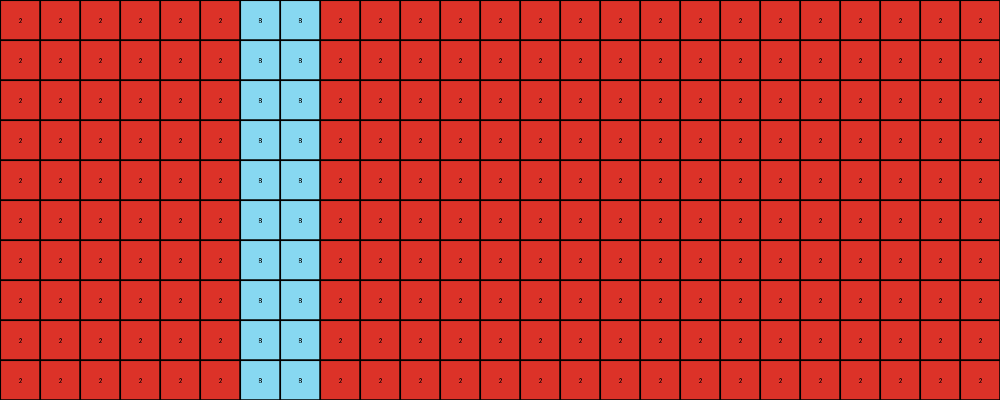
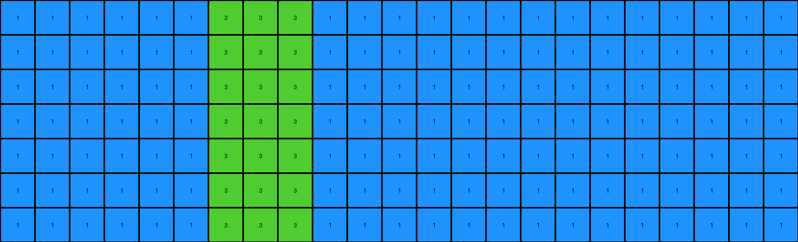
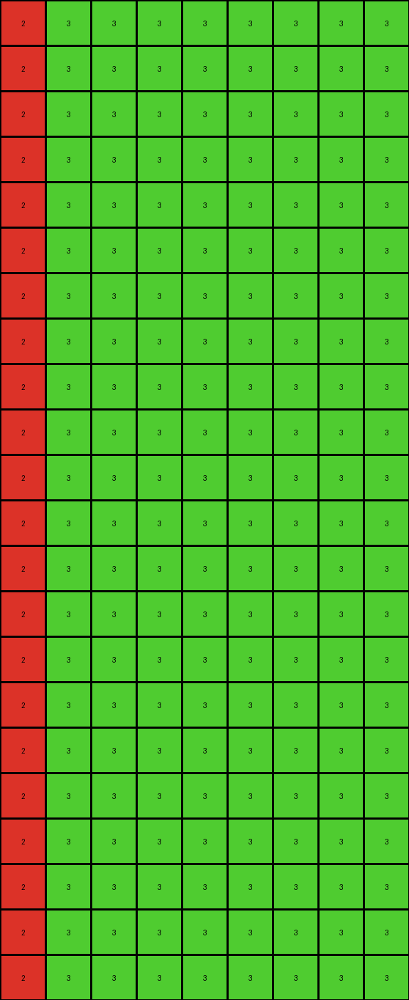
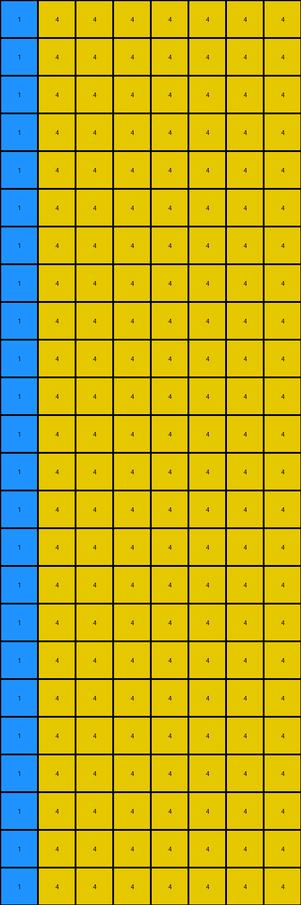

# 0a938d79 • 004 • refine_coder

---

Previous Code:
```python
"""
The original colored pixels act as "seeds". Each seed grows into a
vertical column of its color. The spaces between these columns are filled with
alternating columns of the seed colors, repeating the pattern until the grid is full.
"""

import numpy as np

def get_source_pixels(grid):
    """Finds and returns a list of non-white pixels and their coordinates."""
    source_pixels = []
    for y, row in enumerate(grid):
        for x, color in enumerate(row):
            if color != 0:
                source_pixels.append(((x, y), color))
    return source_pixels

def transform(input_grid):
    """Transforms the input grid according to the described rule."""
    input_grid = np.array(input_grid)
    output_grid = np.zeros_like(input_grid)
    source_pixels = get_source_pixels(input_grid)

    # Sort source pixels by their x-coordinate to maintain left-to-right order
    source_pixels.sort()

    # Keep track of the colors used to alternate correctly.
    colors_used = []
    last_x = -1 # keep track of where we are in filling up grid
    
    # 3. Columnar Expansion
    for (x, _), color in source_pixels:
        output_grid[:, x] = color  # Fill the entire column
        if color not in colors_used:
          colors_used.append(color)
        last_x = x

    # 4. Alternating fill between colored columns.
    if len(colors_used) > 0:  # Handle cases with no source colors
      current_color_index = 0

      for x in range(output_grid.shape[1]):
          if output_grid[0,x] == 0:
            output_grid[:,x] = colors_used[current_color_index % len(colors_used)]
          else:
            # find next color
            current_color_index = (colors_used.index(output_grid[0,x]) + 1) % len(colors_used)


    return output_grid.tolist()
```

Train Set Results:

## Example 1:**

Input:
```
0 0 0 0 0 2 0 0 0 0 0 0 0 0 0 0 0 0 0 0 0 0 0 0 0
0 0 0 0 0 0 0 0 0 0 0 0 0 0 0 0 0 0 0 0 0 0 0 0 0
0 0 0 0 0 0 0 0 0 0 0 0 0 0 0 0 0 0 0 0 0 0 0 0 0
0 0 0 0 0 0 0 0 0 0 0 0 0 0 0 0 0 0 0 0 0 0 0 0 0
0 0 0 0 0 0 0 0 0 0 0 0 0 0 0 0 0 0 0 0 0 0 0 0 0
0 0 0 0 0 0 0 0 0 0 0 0 0 0 0 0 0 0 0 0 0 0 0 0 0
0 0 0 0 0 0 0 0 0 0 0 0 0 0 0 0 0 0 0 0 0 0 0 0 0
0 0 0 0 0 0 0 0 0 0 0 0 0 0 0 0 0 0 0 0 0 0 0 0 0
0 0 0 0 0 0 0 0 0 0 0 0 0 0 0 0 0 0 0 0 0 0 0 0 0
0 0 0 0 0 0 0 8 0 0 0 0 0 0 0 0 0 0 0 0 0 0 0 0 0
```
Expected Output:
```
0 0 0 0 0 2 0 8 0 2 0 8 0 2 0 8 0 2 0 8 0 2 0 8 0
0 0 0 0 0 2 0 8 0 2 0 8 0 2 0 8 0 2 0 8 0 2 0 8 0
0 0 0 0 0 2 0 8 0 2 0 8 0 2 0 8 0 2 0 8 0 2 0 8 0
0 0 0 0 0 2 0 8 0 2 0 8 0 2 0 8 0 2 0 8 0 2 0 8 0
0 0 0 0 0 2 0 8 0 2 0 8 0 2 0 8 0 2 0 8 0 2 0 8 0
0 0 0 0 0 2 0 8 0 2 0 8 0 2 0 8 0 2 0 8 0 2 0 8 0
0 0 0 0 0 2 0 8 0 2 0 8 0 2 0 8 0 2 0 8 0 2 0 8 0
0 0 0 0 0 2 0 8 0 2 0 8 0 2 0 8 0 2 0 8 0 2 0 8 0
0 0 0 0 0 2 0 8 0 2 0 8 0 2 0 8 0 2 0 8 0 2 0 8 0
0 0 0 0 0 2 0 8 0 2 0 8 0 2 0 8 0 2 0 8 0 2 0 8 0
```
Transformed Output:
```
2 2 2 2 2 2 8 8 2 2 2 2 2 2 2 2 2 2 2 2 2 2 2 2 2
2 2 2 2 2 2 8 8 2 2 2 2 2 2 2 2 2 2 2 2 2 2 2 2 2
2 2 2 2 2 2 8 8 2 2 2 2 2 2 2 2 2 2 2 2 2 2 2 2 2
2 2 2 2 2 2 8 8 2 2 2 2 2 2 2 2 2 2 2 2 2 2 2 2 2
2 2 2 2 2 2 8 8 2 2 2 2 2 2 2 2 2 2 2 2 2 2 2 2 2
2 2 2 2 2 2 8 8 2 2 2 2 2 2 2 2 2 2 2 2 2 2 2 2 2
2 2 2 2 2 2 8 8 2 2 2 2 2 2 2 2 2 2 2 2 2 2 2 2 2
2 2 2 2 2 2 8 8 2 2 2 2 2 2 2 2 2 2 2 2 2 2 2 2 2
2 2 2 2 2 2 8 8 2 2 2 2 2 2 2 2 2 2 2 2 2 2 2 2 2
2 2 2 2 2 2 8 8 2 2 2 2 2 2 2 2 2 2 2 2 2 2 2 2 2
```

match: False
pixels_off: 190
size_correct: True
color_palette_correct: True
correct_pixel_counts: False

## Example 2:**

Input:
```
0 0 0 0 0 1 0 0 0 0 0 0 0 0 0 0 0 0 0 0 0 0 0
0 0 0 0 0 0 0 0 0 0 0 0 0 0 0 0 0 0 0 0 0 0 0
0 0 0 0 0 0 0 0 0 0 0 0 0 0 0 0 0 0 0 0 0 0 0
0 0 0 0 0 0 0 0 0 0 0 0 0 0 0 0 0 0 0 0 0 0 0
0 0 0 0 0 0 0 0 0 0 0 0 0 0 0 0 0 0 0 0 0 0 0
0 0 0 0 0 0 0 0 0 0 0 0 0 0 0 0 0 0 0 0 0 0 0
0 0 0 0 0 0 0 0 3 0 0 0 0 0 0 0 0 0 0 0 0 0 0
```
Expected Output:
```
0 0 0 0 0 1 0 0 3 0 0 1 0 0 3 0 0 1 0 0 3 0 0
0 0 0 0 0 1 0 0 3 0 0 1 0 0 3 0 0 1 0 0 3 0 0
0 0 0 0 0 1 0 0 3 0 0 1 0 0 3 0 0 1 0 0 3 0 0
0 0 0 0 0 1 0 0 3 0 0 1 0 0 3 0 0 1 0 0 3 0 0
0 0 0 0 0 1 0 0 3 0 0 1 0 0 3 0 0 1 0 0 3 0 0
0 0 0 0 0 1 0 0 3 0 0 1 0 0 3 0 0 1 0 0 3 0 0
0 0 0 0 0 1 0 0 3 0 0 1 0 0 3 0 0 1 0 0 3 0 0
```
Transformed Output:
```
1 1 1 1 1 1 3 3 3 1 1 1 1 1 1 1 1 1 1 1 1 1 1
1 1 1 1 1 1 3 3 3 1 1 1 1 1 1 1 1 1 1 1 1 1 1
1 1 1 1 1 1 3 3 3 1 1 1 1 1 1 1 1 1 1 1 1 1 1
1 1 1 1 1 1 3 3 3 1 1 1 1 1 1 1 1 1 1 1 1 1 1
1 1 1 1 1 1 3 3 3 1 1 1 1 1 1 1 1 1 1 1 1 1 1
1 1 1 1 1 1 3 3 3 1 1 1 1 1 1 1 1 1 1 1 1 1 1
1 1 1 1 1 1 3 3 3 1 1 1 1 1 1 1 1 1 1 1 1 1 1
```

match: False
pixels_off: 133
size_correct: True
color_palette_correct: True
correct_pixel_counts: False

## Example 3:**

Input:
```
0 0 0 0 0 0 0 0 0
0 0 0 0 0 0 0 0 0
0 0 0 0 0 0 0 0 0
0 0 0 0 0 0 0 0 0
0 0 0 0 0 0 0 0 0
2 0 0 0 0 0 0 0 0
0 0 0 0 0 0 0 0 0
0 0 0 0 0 0 0 0 3
0 0 0 0 0 0 0 0 0
0 0 0 0 0 0 0 0 0
0 0 0 0 0 0 0 0 0
0 0 0 0 0 0 0 0 0
0 0 0 0 0 0 0 0 0
0 0 0 0 0 0 0 0 0
0 0 0 0 0 0 0 0 0
0 0 0 0 0 0 0 0 0
0 0 0 0 0 0 0 0 0
0 0 0 0 0 0 0 0 0
0 0 0 0 0 0 0 0 0
0 0 0 0 0 0 0 0 0
0 0 0 0 0 0 0 0 0
0 0 0 0 0 0 0 0 0
```
Expected Output:
```
0 0 0 0 0 0 0 0 0
0 0 0 0 0 0 0 0 0
0 0 0 0 0 0 0 0 0
0 0 0 0 0 0 0 0 0
0 0 0 0 0 0 0 0 0
2 2 2 2 2 2 2 2 2
0 0 0 0 0 0 0 0 0
3 3 3 3 3 3 3 3 3
0 0 0 0 0 0 0 0 0
2 2 2 2 2 2 2 2 2
0 0 0 0 0 0 0 0 0
3 3 3 3 3 3 3 3 3
0 0 0 0 0 0 0 0 0
2 2 2 2 2 2 2 2 2
0 0 0 0 0 0 0 0 0
3 3 3 3 3 3 3 3 3
0 0 0 0 0 0 0 0 0
2 2 2 2 2 2 2 2 2
0 0 0 0 0 0 0 0 0
3 3 3 3 3 3 3 3 3
0 0 0 0 0 0 0 0 0
2 2 2 2 2 2 2 2 2
```
Transformed Output:
```
2 3 3 3 3 3 3 3 3
2 3 3 3 3 3 3 3 3
2 3 3 3 3 3 3 3 3
2 3 3 3 3 3 3 3 3
2 3 3 3 3 3 3 3 3
2 3 3 3 3 3 3 3 3
2 3 3 3 3 3 3 3 3
2 3 3 3 3 3 3 3 3
2 3 3 3 3 3 3 3 3
2 3 3 3 3 3 3 3 3
2 3 3 3 3 3 3 3 3
2 3 3 3 3 3 3 3 3
2 3 3 3 3 3 3 3 3
2 3 3 3 3 3 3 3 3
2 3 3 3 3 3 3 3 3
2 3 3 3 3 3 3 3 3
2 3 3 3 3 3 3 3 3
2 3 3 3 3 3 3 3 3
2 3 3 3 3 3 3 3 3
2 3 3 3 3 3 3 3 3
2 3 3 3 3 3 3 3 3
2 3 3 3 3 3 3 3 3
```

match: False
pixels_off: 161
size_correct: True
color_palette_correct: True
correct_pixel_counts: False

## Example 4:**

Input:
```
0 0 0 0 0 0 0 0
0 0 0 0 0 0 0 0
0 0 0 0 0 0 0 0
0 0 0 0 0 0 0 0
0 0 0 0 0 0 0 0
0 0 0 0 0 0 0 0
0 0 0 0 0 0 0 0
4 0 0 0 0 0 0 0
0 0 0 0 0 0 0 0
0 0 0 0 0 0 0 0
0 0 0 0 0 0 0 0
1 0 0 0 0 0 0 0
0 0 0 0 0 0 0 0
0 0 0 0 0 0 0 0
0 0 0 0 0 0 0 0
0 0 0 0 0 0 0 0
0 0 0 0 0 0 0 0
0 0 0 0 0 0 0 0
0 0 0 0 0 0 0 0
0 0 0 0 0 0 0 0
0 0 0 0 0 0 0 0
0 0 0 0 0 0 0 0
0 0 0 0 0 0 0 0
0 0 0 0 0 0 0 0
```
Expected Output:
```
0 0 0 0 0 0 0 0
0 0 0 0 0 0 0 0
0 0 0 0 0 0 0 0
0 0 0 0 0 0 0 0
0 0 0 0 0 0 0 0
0 0 0 0 0 0 0 0
0 0 0 0 0 0 0 0
4 4 4 4 4 4 4 4
0 0 0 0 0 0 0 0
0 0 0 0 0 0 0 0
0 0 0 0 0 0 0 0
1 1 1 1 1 1 1 1
0 0 0 0 0 0 0 0
0 0 0 0 0 0 0 0
0 0 0 0 0 0 0 0
4 4 4 4 4 4 4 4
0 0 0 0 0 0 0 0
0 0 0 0 0 0 0 0
0 0 0 0 0 0 0 0
1 1 1 1 1 1 1 1
0 0 0 0 0 0 0 0
0 0 0 0 0 0 0 0
0 0 0 0 0 0 0 0
4 4 4 4 4 4 4 4
```
Transformed Output:
```
1 4 4 4 4 4 4 4
1 4 4 4 4 4 4 4
1 4 4 4 4 4 4 4
1 4 4 4 4 4 4 4
1 4 4 4 4 4 4 4
1 4 4 4 4 4 4 4
1 4 4 4 4 4 4 4
1 4 4 4 4 4 4 4
1 4 4 4 4 4 4 4
1 4 4 4 4 4 4 4
1 4 4 4 4 4 4 4
1 4 4 4 4 4 4 4
1 4 4 4 4 4 4 4
1 4 4 4 4 4 4 4
1 4 4 4 4 4 4 4
1 4 4 4 4 4 4 4
1 4 4 4 4 4 4 4
1 4 4 4 4 4 4 4
1 4 4 4 4 4 4 4
1 4 4 4 4 4 4 4
1 4 4 4 4 4 4 4
1 4 4 4 4 4 4 4
1 4 4 4 4 4 4 4
1 4 4 4 4 4 4 4
```

match: False
pixels_off: 169
size_correct: True
color_palette_correct: True
correct_pixel_counts: False
Okay, here's an assessment of the situation and a plan to improve the natural language program and the code:

**General Assessment:**

The initial natural language program and corresponding code were too simplistic. While the idea of "seed" pixels and columnar expansion was partially correct, the filling logic between the columns was flawed. The initial approach assumed a simple alternation between *all* detected seed colors, which doesn't hold true across all examples.  Examples 3 and 4, in particular, highlight a different behavior: a repeating pattern of vertical stripes of source colors, but the pattern doesn't alternate, it extends the existing stripe, and it's based on the row not the entire grid.

The core issue is that the code doesn't correctly model the *local, row-based* repetition of the source colors. It tries to apply a global alternation pattern, which is incorrect. The transformed outputs consistently show vertical stripes, but the arrangement and repetition of colors within those stripes are wrong.

**Strategy for Resolving Errors:**

1.  **Refocus on Row-Based Logic:** The transformation rule needs to be explicitly row-centric.  The output at a given row depends *only* on the input pixels present in that same row.

2.  **Identify "Source Rows":** A "source row" is any row containing at least one non-white (non-zero) pixel.

3.  **Replicate Source Rows:** If a row is a "source row," replicate its pattern vertically downwards, creating stripes. This will correct examples 3 and 4. The existing stripes should grow, not alternate.

4.  **Handle Stacking Source Rows:** The pattern needs to handle multiple "source rows", as in example 3 and 4. We should stack the single-row source rows to the full height of the grid.

**Metrics and Observations (using the provided outputs):**

Here's a breakdown of each example, noting key observations and where the current code fails:

*   **Example 1:**
    *   **Input:** Two source pixels (2 at (5,0) and 8 at (7,9)).
    *   **Expected Output:** Alternating columns of 2 and 8, starting with 2 at the source pixel column.
    *   **Transformed Output:** Incorrect alternation. The code fills the entire column with `2` first and then `8` - ignoring the order.
    *   **Key Issue:** Incorrect global alternation, rather than localized, order-sensitive replication.

*   **Example 2:**
    *   **Input:** Two source pixels (1 at (5,0) and 3 at (8,6)).
    *   **Expected Output:** Alternating columns of 1 and 3, in the correct order.
    *   **Transformed Output:**  Similar to Example 1, incorrect global alternation.
    *   **Key Issue:**  Same as Example 1.

*   **Example 3:**
    *   **Input:** Two source rows, one with 2, and another with 3.
    *   **Expected Output:**  Rows with color 2 are all color 2, Rows with color 3, all color 3.
    *   **Transformed Output:** The transformed image tries to alternate colors 2 and 3 by column, rather than vertically stack the source rows.
    *   **Key Issue:** Incorrect alternation, and the code is unable to extend a row's source pixels across the entire row.

*   **Example 4:**
    *   **Input:** Two source rows, one with 4, one with 1.
    *   **Expected output:** rows with color 4 should be all color 4, rows with color 1 should be all color 1
    *   **Transformed Output:** Incorrect, tries to mix colors 1 and 4.
    *   **Key Issue:** Similar to Example 3, but now there is no attempt to alternate, instead filling the incorrect area with a single color.

**YAML Block (Facts):**

```yaml
objects:
  - type: grid
    properties:
      dimensions: variable  # Height and width can vary.
      cells: pixels
      colors: 0-9  # Representing different colors.
  - type: pixel
    properties:
      color: integer (0-9)
      coordinates: (x, y)  # (column, row)
  - type: source_row
    properties:
      row_index: integer
      source_pixels: list of pixels  # Pixels within the row that have non-zero color.
    behavior:  # Actions performed on the source_row
      replication: |
          The pattern of non-zero pixels in a source row is replicated
          across the entire row, and then vertically down the grid, creating stripes.
          Blank rows (all zero) will propagate the pattern from above until another source_row is found.
actions:
  - name: find_source_rows
    description: Identify rows containing at least one non-zero pixel.
  - name: replicate_row_pattern
    description:  Extend the pattern of non-zero pixels in a source row horizontally to fill the row.
  - name: stack_rows
    description: Stack the filled source rows vertically to fill the grid.
```

**Natural Language Program:**

1.  **Identify Source Rows:** Scan each row of the input grid. A row is a "source row" if it contains at least one non-zero (non-white) pixel.

2.  **Replicate Horizontally:** For each source row, replicate its pattern of non-zero pixels across the *entire* row. Any zero-value pixels between non-zero pixels in the source row should remain zero.  The output for this row will now have solid stripes of color corresponding to the non-zero pixels in the input.

3. **Stack Rows:** Create the output grid by stacking the source rows from top to bottom. If a row between two source rows does not contain any source colors, the row from above is copied down until a new source row is encountered.

4. **Handle Edge Cases** If a source row contains only `0` - all white - then it has no effect.

This revised natural language program emphasizes the row-by-row processing and the vertical stacking of source row patterns, which should address the issues observed in the test results. The key difference from the previous program is that it no longer assumes any global alternation or interaction *between* colors from different source rows. Each source row's influence is independent and extends vertically.

**INSTRUCTIONS**

- generate a Python module to represent the natural language program 
- follow the template below
- all common math and science libraries are available
- create docstring only at top - but comment the workflow in the function
- use helper functions for common operations like finding objects, counting,
  measuring, moving, etc. 

remember - we are working iteratively - so this code will inform your future
self as we converge on the solution

*template:*

```python
"""
{{ natural language description of the transformation rule }}
"""

{{ imports }}

def transform(input_grid):
    # initialize output_grid

    # change output pixels 

    return output_grid

```
