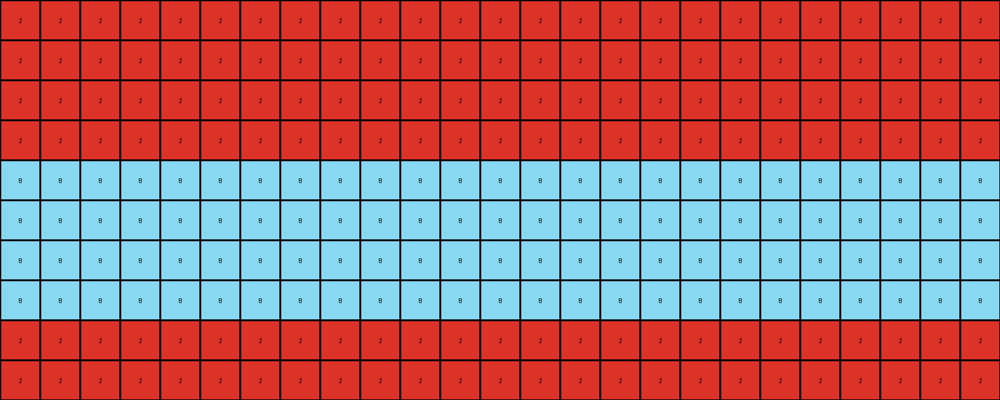
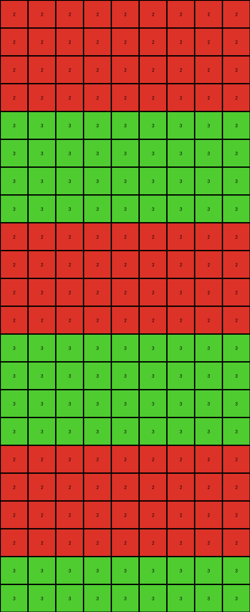

# 0a938d79 • 022 • refine_coder

---

Previous Code:
```python
"""
The transformation rule is as follows:
1. Identify rows that contain a non-zero value.
2. Replicate these rows a certain number of times (4 times in this case).
3. Stack them together to create the output grid.
"""

import numpy as np

def get_non_zero_rows(grid):
    # Find the indices of rows that contain non-zero values
    non_zero_rows = []
    for i, row in enumerate(grid):
        if any(row):  # Check if any element in the row is non-zero
            non_zero_rows.append(i)
    return non_zero_rows

def replicate_and_stack(grid, row_indices):
    # Create a list to hold the new rows
    new_rows = []
    num_replications = 4

    # For each row index, get the row, replicate it, and add to new_rows
    for row_index in row_indices:
      row = grid[row_index].copy() # get a copy of the row
      color = 0
      for c in row:
          if c != 0:
              color = c
              break
      
      row.fill(color)

      for _ in range(num_replications):
            new_rows.append(row.copy())
            
    return new_rows

def transform(input_grid):
    # Convert input grid to a NumPy array
    input_grid = np.array(input_grid)

    # initialize output grid as same size and all zeros
    output_grid = np.zeros_like(input_grid)

    # Find row indices of non zero rows
    non_zero_row_indices = get_non_zero_rows(input_grid)
    
    # replicate the non zero rows and make stacks
    replicated_rows = replicate_and_stack(input_grid, non_zero_row_indices)
    
    # fill the output grid with the replicated rows, repeat as necessary
    row_count = 0;
    for i in range(len(output_grid)):
        if (len(replicated_rows) > 0):
          output_grid[i] = replicated_rows[row_count % len(replicated_rows)]
          row_count += 1
    

    return output_grid
```

Train Set Results:

## Example 1:**

Input:
```
0 0 0 0 0 2 0 0 0 0 0 0 0 0 0 0 0 0 0 0 0 0 0 0 0
0 0 0 0 0 0 0 0 0 0 0 0 0 0 0 0 0 0 0 0 0 0 0 0 0
0 0 0 0 0 0 0 0 0 0 0 0 0 0 0 0 0 0 0 0 0 0 0 0 0
0 0 0 0 0 0 0 0 0 0 0 0 0 0 0 0 0 0 0 0 0 0 0 0 0
0 0 0 0 0 0 0 0 0 0 0 0 0 0 0 0 0 0 0 0 0 0 0 0 0
0 0 0 0 0 0 0 0 0 0 0 0 0 0 0 0 0 0 0 0 0 0 0 0 0
0 0 0 0 0 0 0 0 0 0 0 0 0 0 0 0 0 0 0 0 0 0 0 0 0
0 0 0 0 0 0 0 0 0 0 0 0 0 0 0 0 0 0 0 0 0 0 0 0 0
0 0 0 0 0 0 0 0 0 0 0 0 0 0 0 0 0 0 0 0 0 0 0 0 0
0 0 0 0 0 0 0 8 0 0 0 0 0 0 0 0 0 0 0 0 0 0 0 0 0
```
Expected Output:
```
0 0 0 0 0 2 0 8 0 2 0 8 0 2 0 8 0 2 0 8 0 2 0 8 0
0 0 0 0 0 2 0 8 0 2 0 8 0 2 0 8 0 2 0 8 0 2 0 8 0
0 0 0 0 0 2 0 8 0 2 0 8 0 2 0 8 0 2 0 8 0 2 0 8 0
0 0 0 0 0 2 0 8 0 2 0 8 0 2 0 8 0 2 0 8 0 2 0 8 0
0 0 0 0 0 2 0 8 0 2 0 8 0 2 0 8 0 2 0 8 0 2 0 8 0
0 0 0 0 0 2 0 8 0 2 0 8 0 2 0 8 0 2 0 8 0 2 0 8 0
0 0 0 0 0 2 0 8 0 2 0 8 0 2 0 8 0 2 0 8 0 2 0 8 0
0 0 0 0 0 2 0 8 0 2 0 8 0 2 0 8 0 2 0 8 0 2 0 8 0
0 0 0 0 0 2 0 8 0 2 0 8 0 2 0 8 0 2 0 8 0 2 0 8 0
0 0 0 0 0 2 0 8 0 2 0 8 0 2 0 8 0 2 0 8 0 2 0 8 0
```
Transformed Output:
```
2 2 2 2 2 2 2 2 2 2 2 2 2 2 2 2 2 2 2 2 2 2 2 2 2
2 2 2 2 2 2 2 2 2 2 2 2 2 2 2 2 2 2 2 2 2 2 2 2 2
2 2 2 2 2 2 2 2 2 2 2 2 2 2 2 2 2 2 2 2 2 2 2 2 2
2 2 2 2 2 2 2 2 2 2 2 2 2 2 2 2 2 2 2 2 2 2 2 2 2
8 8 8 8 8 8 8 8 8 8 8 8 8 8 8 8 8 8 8 8 8 8 8 8 8
8 8 8 8 8 8 8 8 8 8 8 8 8 8 8 8 8 8 8 8 8 8 8 8 8
8 8 8 8 8 8 8 8 8 8 8 8 8 8 8 8 8 8 8 8 8 8 8 8 8
8 8 8 8 8 8 8 8 8 8 8 8 8 8 8 8 8 8 8 8 8 8 8 8 8
2 2 2 2 2 2 2 2 2 2 2 2 2 2 2 2 2 2 2 2 2 2 2 2 2
2 2 2 2 2 2 2 2 2 2 2 2 2 2 2 2 2 2 2 2 2 2 2 2 2
```

match: False
pixels_off: 200
size_correct: True
color_palette_correct: True
correct_pixel_counts: False

## Example 2:**

Input:
```
0 0 0 0 0 1 0 0 0 0 0 0 0 0 0 0 0 0 0 0 0 0 0
0 0 0 0 0 0 0 0 0 0 0 0 0 0 0 0 0 0 0 0 0 0 0
0 0 0 0 0 0 0 0 0 0 0 0 0 0 0 0 0 0 0 0 0 0 0
0 0 0 0 0 0 0 0 0 0 0 0 0 0 0 0 0 0 0 0 0 0 0
0 0 0 0 0 0 0 0 0 0 0 0 0 0 0 0 0 0 0 0 0 0 0
0 0 0 0 0 0 0 0 0 0 0 0 0 0 0 0 0 0 0 0 0 0 0
0 0 0 0 0 0 0 0 3 0 0 0 0 0 0 0 0 0 0 0 0 0 0
```
Expected Output:
```
0 0 0 0 0 1 0 0 3 0 0 1 0 0 3 0 0 1 0 0 3 0 0
0 0 0 0 0 1 0 0 3 0 0 1 0 0 3 0 0 1 0 0 3 0 0
0 0 0 0 0 1 0 0 3 0 0 1 0 0 3 0 0 1 0 0 3 0 0
0 0 0 0 0 1 0 0 3 0 0 1 0 0 3 0 0 1 0 0 3 0 0
0 0 0 0 0 1 0 0 3 0 0 1 0 0 3 0 0 1 0 0 3 0 0
0 0 0 0 0 1 0 0 3 0 0 1 0 0 3 0 0 1 0 0 3 0 0
0 0 0 0 0 1 0 0 3 0 0 1 0 0 3 0 0 1 0 0 3 0 0
```
Transformed Output:
```
1 1 1 1 1 1 1 1 1 1 1 1 1 1 1 1 1 1 1 1 1 1 1
1 1 1 1 1 1 1 1 1 1 1 1 1 1 1 1 1 1 1 1 1 1 1
1 1 1 1 1 1 1 1 1 1 1 1 1 1 1 1 1 1 1 1 1 1 1
1 1 1 1 1 1 1 1 1 1 1 1 1 1 1 1 1 1 1 1 1 1 1
3 3 3 3 3 3 3 3 3 3 3 3 3 3 3 3 3 3 3 3 3 3 3
3 3 3 3 3 3 3 3 3 3 3 3 3 3 3 3 3 3 3 3 3 3 3
3 3 3 3 3 3 3 3 3 3 3 3 3 3 3 3 3 3 3 3 3 3 3
```

match: False
pixels_off: 140
size_correct: True
color_palette_correct: True
correct_pixel_counts: False

## Example 3:**

Input:
```
0 0 0 0 0 0 0 0 0
0 0 0 0 0 0 0 0 0
0 0 0 0 0 0 0 0 0
0 0 0 0 0 0 0 0 0
0 0 0 0 0 0 0 0 0
2 0 0 0 0 0 0 0 0
0 0 0 0 0 0 0 0 0
0 0 0 0 0 0 0 0 3
0 0 0 0 0 0 0 0 0
0 0 0 0 0 0 0 0 0
0 0 0 0 0 0 0 0 0
0 0 0 0 0 0 0 0 0
0 0 0 0 0 0 0 0 0
0 0 0 0 0 0 0 0 0
0 0 0 0 0 0 0 0 0
0 0 0 0 0 0 0 0 0
0 0 0 0 0 0 0 0 0
0 0 0 0 0 0 0 0 0
0 0 0 0 0 0 0 0 0
0 0 0 0 0 0 0 0 0
0 0 0 0 0 0 0 0 0
0 0 0 0 0 0 0 0 0
```
Expected Output:
```
0 0 0 0 0 0 0 0 0
0 0 0 0 0 0 0 0 0
0 0 0 0 0 0 0 0 0
0 0 0 0 0 0 0 0 0
0 0 0 0 0 0 0 0 0
2 2 2 2 2 2 2 2 2
0 0 0 0 0 0 0 0 0
3 3 3 3 3 3 3 3 3
0 0 0 0 0 0 0 0 0
2 2 2 2 2 2 2 2 2
0 0 0 0 0 0 0 0 0
3 3 3 3 3 3 3 3 3
0 0 0 0 0 0 0 0 0
2 2 2 2 2 2 2 2 2
0 0 0 0 0 0 0 0 0
3 3 3 3 3 3 3 3 3
0 0 0 0 0 0 0 0 0
2 2 2 2 2 2 2 2 2
0 0 0 0 0 0 0 0 0
3 3 3 3 3 3 3 3 3
0 0 0 0 0 0 0 0 0
2 2 2 2 2 2 2 2 2
```
Transformed Output:
```
2 2 2 2 2 2 2 2 2
2 2 2 2 2 2 2 2 2
2 2 2 2 2 2 2 2 2
2 2 2 2 2 2 2 2 2
3 3 3 3 3 3 3 3 3
3 3 3 3 3 3 3 3 3
3 3 3 3 3 3 3 3 3
3 3 3 3 3 3 3 3 3
2 2 2 2 2 2 2 2 2
2 2 2 2 2 2 2 2 2
2 2 2 2 2 2 2 2 2
2 2 2 2 2 2 2 2 2
3 3 3 3 3 3 3 3 3
3 3 3 3 3 3 3 3 3
3 3 3 3 3 3 3 3 3
3 3 3 3 3 3 3 3 3
2 2 2 2 2 2 2 2 2
2 2 2 2 2 2 2 2 2
2 2 2 2 2 2 2 2 2
2 2 2 2 2 2 2 2 2
3 3 3 3 3 3 3 3 3
3 3 3 3 3 3 3 3 3
```

match: False
pixels_off: 162
size_correct: True
color_palette_correct: True
correct_pixel_counts: False

## Example 4:**

Input:
```
0 0 0 0 0 0 0 0
0 0 0 0 0 0 0 0
0 0 0 0 0 0 0 0
0 0 0 0 0 0 0 0
0 0 0 0 0 0 0 0
0 0 0 0 0 0 0 0
0 0 0 0 0 0 0 0
4 0 0 0 0 0 0 0
0 0 0 0 0 0 0 0
0 0 0 0 0 0 0 0
0 0 0 0 0 0 0 0
1 0 0 0 0 0 0 0
0 0 0 0 0 0 0 0
0 0 0 0 0 0 0 0
0 0 0 0 0 0 0 0
0 0 0 0 0 0 0 0
0 0 0 0 0 0 0 0
0 0 0 0 0 0 0 0
0 0 0 0 0 0 0 0
0 0 0 0 0 0 0 0
0 0 0 0 0 0 0 0
0 0 0 0 0 0 0 0
0 0 0 0 0 0 0 0
0 0 0 0 0 0 0 0
```
Expected Output:
```
0 0 0 0 0 0 0 0
0 0 0 0 0 0 0 0
0 0 0 0 0 0 0 0
0 0 0 0 0 0 0 0
0 0 0 0 0 0 0 0
0 0 0 0 0 0 0 0
0 0 0 0 0 0 0 0
4 4 4 4 4 4 4 4
0 0 0 0 0 0 0 0
0 0 0 0 0 0 0 0
0 0 0 0 0 0 0 0
1 1 1 1 1 1 1 1
0 0 0 0 0 0 0 0
0 0 0 0 0 0 0 0
0 0 0 0 0 0 0 0
4 4 4 4 4 4 4 4
0 0 0 0 0 0 0 0
0 0 0 0 0 0 0 0
0 0 0 0 0 0 0 0
1 1 1 1 1 1 1 1
0 0 0 0 0 0 0 0
0 0 0 0 0 0 0 0
0 0 0 0 0 0 0 0
4 4 4 4 4 4 4 4
```
Transformed Output:
```
4 4 4 4 4 4 4 4
4 4 4 4 4 4 4 4
4 4 4 4 4 4 4 4
4 4 4 4 4 4 4 4
1 1 1 1 1 1 1 1
1 1 1 1 1 1 1 1
1 1 1 1 1 1 1 1
1 1 1 1 1 1 1 1
4 4 4 4 4 4 4 4
4 4 4 4 4 4 4 4
4 4 4 4 4 4 4 4
4 4 4 4 4 4 4 4
1 1 1 1 1 1 1 1
1 1 1 1 1 1 1 1
1 1 1 1 1 1 1 1
1 1 1 1 1 1 1 1
4 4 4 4 4 4 4 4
4 4 4 4 4 4 4 4
4 4 4 4 4 4 4 4
4 4 4 4 4 4 4 4
1 1 1 1 1 1 1 1
1 1 1 1 1 1 1 1
1 1 1 1 1 1 1 1
1 1 1 1 1 1 1 1
```

match: False
pixels_off: 192
size_correct: True
color_palette_correct: True
correct_pixel_counts: False
Okay, let's analyze the results and refine the natural language program.

**General Assessment:**

The initial program was too simplistic. It correctly identified the need to replicate rows with non-zero values, but it failed to capture the core logic of the transformation: combining colors and interleaving them. Instead of interleaving, it replicates blocks of solid colors. It doesn't consider combining different rows, and replication should interleave.

The primary strategy for improvement is to revise the program's logic to correctly replicate rows by interleaving the colors present and extend it to the size of the output. It must also repeat colors that are not adjacent.

**Metrics and Observations (per example):**

Here, instead of just saying they don't match, I am making specific observation about the errors, comparing expected with results, and gathering information about the input and output:

*   **Example 1:**
    *   Input: Two rows with colors 2 and 8, rest are black (0).
    *   Expected Output: Alternating columns of 2 and 8, repeated.
    *   Actual Output: Solid blocks of 2s, then 8s. Not interleaved. Incorrect arrangement.
    *    Metrics:
        *  `pixels_off` : 200
        *   The rows are all filled with the identified color, not interleaved.

*   **Example 2:**
    *   Input: Two rows with colors 1 and 3, rest are black.
    *   Expected Output: Alternating columns of 1 and 3, repeated.
    *   Actual Output: Solid blocks of 1, then 3s. Not interleaved. Incorrect arrangement.
    *   Metrics:
       *  `pixels_off` : 140
       *  The rows are all filled with the identified color, not interleaved.

*   **Example 3:**
    *   Input: Contains colors 2, 3, on rows 6 and 8, rest are all black.
    *   Expected output: Rows of solid 2, then solid 3, repeating and filling the grid.
    *    Actual Output: Blocks of 2s, then blocks of 3s. Not interleaved
    *    Metrics:
       *  `pixels_off` : 162
       *  Correct in replicating the rows, incorrect in interleaving

*   **Example 4:**
      * Input: Colors 4 and 1 in rows 8 and 12.
    *   Expected output: Rows of solid 4, then solid 1, repeating and filling the grid.
    *    Actual Output: Blocks of 4s, then blocks of 1s. Not interleaved
    *    Metrics:
       *  `pixels_off` : 192
       *  Correct in replicating the rows, incorrect in interleaving

**YAML Fact Block:**

```yaml
observations:
  - example_1:
      input_objects:
        - row_6: [color: 2]
        - row_10: [color: 8]
      output_objects:
        - description:  alternating columns using the input colors, replicated.
      transformation: replicate_and_interleave
  - example_2:
      input_objects:
        - row_1: [color: 1]
        - row_7: [color: 3]
      output_objects:
         - description:  alternating columns using the input colors, replicated.
      transformation: replicate_and_interleave
  - example_3:
     input_objects:
        - row_6: [color: 2]
        - row_8: [color: 3]
     output_objects:
        - description: repeating rows, interleaved
     transformation: replicate_and_interleave
  - example_4:
     input_objects:
        - row_8: [color: 4]
        - row_12: [color: 1]
     output_objects:
        - description: repeating rows, interleaved
     transformation: replicate_and_interleave
```

**Revised Natural Language Program:**

1.  **Identify Non-Zero Rows:** Find all rows in the input grid that contain at least one non-zero (non-black) pixel.
2.  **Extract Colors:** For each non-zero row identified, extract the non-zero value (color).
3.  **Create Interleaved Pattern:** Create a single output row by:

    *   Iterate through the columns.
    *   Iterate through the identified colors.
    *   Fill each successive cell using the colors in order.
4. **Replicate Interleaved Row and stack**: Repeat created output row, stack into output grid.

    *   Repeat the process for the height of the output
    *    Repeat the entire row created in step 3 multiple times to match the height and width of the input.

Key changes from the prior version:

-   Explicitly describes *interleaving* of colors, not making solid blocks of rows of colors.
- Corrects for rows that do not contain adjacent colors.

**INSTRUCTIONS**

- generate a Python module to represent the natural language program 
- follow the template below
- all common math and science libraries are available
- create docstring only at top - but comment the workflow in the function
- use helper functions for common operations like finding objects, counting,
  measuring, moving, etc. 

remember - we are working iteratively - so this code will inform your future
self as we converge on the solution

*template:*

```python
"""
{{ natural language description of the transformation rule }}
"""

{{ imports }}

def transform(input_grid):
    # initialize output_grid

    # change output pixels 

    return output_grid

```
