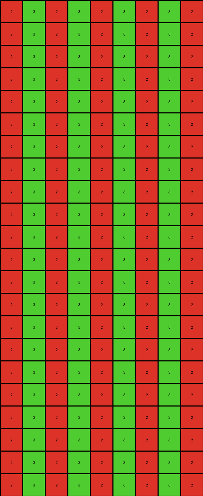

# 0a938d79 • 023 • refine_dreamer

---


Previous Code:
```python
"""
1.  **Identify Non-Zero Rows:** Find all rows in the input grid that contain at least one non-zero (non-black) pixel.
2.  **Extract Colors:** For each non-zero row identified, extract the non-zero value (color).
3.  **Create Interleaved Pattern:** Create a single output row by:
    *   Iterate through the columns.
    *   Iterate through the identified colors.
    *   Fill each successive cell using the colors in order.
4. **Replicate Interleaved Row and stack**: Repeat created output row, stack into output grid.
    *   Repeat the process for the height of the output
    *    Repeat the entire row created in step 3 multiple times to match the height and width of the input.
"""

import numpy as np

def get_non_zero_rows(grid):
    # Find the indices of rows that contain non-zero values
    non_zero_rows = []
    for i, row in enumerate(grid):
        if any(row):  # Check if any element in the row is non-zero
            non_zero_rows.append(i)
    return non_zero_rows

def extract_colors(grid, row_indices):
    # Extract the non-zero color values from the specified rows
    colors = []
    for row_index in row_indices:
        for pixel in grid[row_index]:
          if pixel != 0:
            colors.append(pixel)
            break # only get the first one
    return colors
    

def create_interleaved_row(width, colors):
    # Create a single row with interleaved colors
    row = np.zeros(width, dtype=int)
    color_index = 0
    for i in range(width):
        row[i] = colors[color_index % len(colors)]
        color_index += 1
    return row

def transform(input_grid):
    # initialize output_grid
    input_grid = np.array(input_grid)
    output_grid = np.zeros_like(input_grid)

    # Find row indices of non zero rows
    non_zero_row_indices = get_non_zero_rows(input_grid)

    # Extract colors from non-zero rows
    colors = extract_colors(input_grid, non_zero_row_indices)
    
    if (len(colors) == 0):
      return output_grid

    # Create the interleaved row pattern
    interleaved_row = create_interleaved_row(input_grid.shape[1], colors)

    # Replicate and stack the rows into output grid
    for i in range(output_grid.shape[0]):
        output_grid[i] = interleaved_row

    return output_grid
```

Train Set Results:

## Example 1:**

Input:
```
0 0 0 0 0 2 0 0 0 0 0 0 0 0 0 0 0 0 0 0 0 0 0 0 0
0 0 0 0 0 0 0 0 0 0 0 0 0 0 0 0 0 0 0 0 0 0 0 0 0
0 0 0 0 0 0 0 0 0 0 0 0 0 0 0 0 0 0 0 0 0 0 0 0 0
0 0 0 0 0 0 0 0 0 0 0 0 0 0 0 0 0 0 0 0 0 0 0 0 0
0 0 0 0 0 0 0 0 0 0 0 0 0 0 0 0 0 0 0 0 0 0 0 0 0
0 0 0 0 0 0 0 0 0 0 0 0 0 0 0 0 0 0 0 0 0 0 0 0 0
0 0 0 0 0 0 0 0 0 0 0 0 0 0 0 0 0 0 0 0 0 0 0 0 0
0 0 0 0 0 0 0 0 0 0 0 0 0 0 0 0 0 0 0 0 0 0 0 0 0
0 0 0 0 0 0 0 0 0 0 0 0 0 0 0 0 0 0 0 0 0 0 0 0 0
0 0 0 0 0 0 0 8 0 0 0 0 0 0 0 0 0 0 0 0 0 0 0 0 0
```
Expected Output:
```
0 0 0 0 0 2 0 8 0 2 0 8 0 2 0 8 0 2 0 8 0 2 0 8 0
0 0 0 0 0 2 0 8 0 2 0 8 0 2 0 8 0 2 0 8 0 2 0 8 0
0 0 0 0 0 2 0 8 0 2 0 8 0 2 0 8 0 2 0 8 0 2 0 8 0
0 0 0 0 0 2 0 8 0 2 0 8 0 2 0 8 0 2 0 8 0 2 0 8 0
0 0 0 0 0 2 0 8 0 2 0 8 0 2 0 8 0 2 0 8 0 2 0 8 0
0 0 0 0 0 2 0 8 0 2 0 8 0 2 0 8 0 2 0 8 0 2 0 8 0
0 0 0 0 0 2 0 8 0 2 0 8 0 2 0 8 0 2 0 8 0 2 0 8 0
0 0 0 0 0 2 0 8 0 2 0 8 0 2 0 8 0 2 0 8 0 2 0 8 0
0 0 0 0 0 2 0 8 0 2 0 8 0 2 0 8 0 2 0 8 0 2 0 8 0
0 0 0 0 0 2 0 8 0 2 0 8 0 2 0 8 0 2 0 8 0 2 0 8 0
```
Transformed Output:
```
2 8 2 8 2 8 2 8 2 8 2 8 2 8 2 8 2 8 2 8 2 8 2 8 2
2 8 2 8 2 8 2 8 2 8 2 8 2 8 2 8 2 8 2 8 2 8 2 8 2
2 8 2 8 2 8 2 8 2 8 2 8 2 8 2 8 2 8 2 8 2 8 2 8 2
2 8 2 8 2 8 2 8 2 8 2 8 2 8 2 8 2 8 2 8 2 8 2 8 2
2 8 2 8 2 8 2 8 2 8 2 8 2 8 2 8 2 8 2 8 2 8 2 8 2
2 8 2 8 2 8 2 8 2 8 2 8 2 8 2 8 2 8 2 8 2 8 2 8 2
2 8 2 8 2 8 2 8 2 8 2 8 2 8 2 8 2 8 2 8 2 8 2 8 2
2 8 2 8 2 8 2 8 2 8 2 8 2 8 2 8 2 8 2 8 2 8 2 8 2
2 8 2 8 2 8 2 8 2 8 2 8 2 8 2 8 2 8 2 8 2 8 2 8 2
2 8 2 8 2 8 2 8 2 8 2 8 2 8 2 8 2 8 2 8 2 8 2 8 2
```

match: False
pixels_off: 200
size_correct: True
color_palette_correct: True
correct_pixel_counts: False

## Example 2:**

Input:
```
0 0 0 0 0 1 0 0 0 0 0 0 0 0 0 0 0 0 0 0 0 0 0
0 0 0 0 0 0 0 0 0 0 0 0 0 0 0 0 0 0 0 0 0 0 0
0 0 0 0 0 0 0 0 0 0 0 0 0 0 0 0 0 0 0 0 0 0 0
0 0 0 0 0 0 0 0 0 0 0 0 0 0 0 0 0 0 0 0 0 0 0
0 0 0 0 0 0 0 0 0 0 0 0 0 0 0 0 0 0 0 0 0 0 0
0 0 0 0 0 0 0 0 0 0 0 0 0 0 0 0 0 0 0 0 0 0 0
0 0 0 0 0 0 0 0 3 0 0 0 0 0 0 0 0 0 0 0 0 0 0
```
Expected Output:
```
0 0 0 0 0 1 0 0 3 0 0 1 0 0 3 0 0 1 0 0 3 0 0
0 0 0 0 0 1 0 0 3 0 0 1 0 0 3 0 0 1 0 0 3 0 0
0 0 0 0 0 1 0 0 3 0 0 1 0 0 3 0 0 1 0 0 3 0 0
0 0 0 0 0 1 0 0 3 0 0 1 0 0 3 0 0 1 0 0 3 0 0
0 0 0 0 0 1 0 0 3 0 0 1 0 0 3 0 0 1 0 0 3 0 0
0 0 0 0 0 1 0 0 3 0 0 1 0 0 3 0 0 1 0 0 3 0 0
0 0 0 0 0 1 0 0 3 0 0 1 0 0 3 0 0 1 0 0 3 0 0
```
Transformed Output:
```
1 3 1 3 1 3 1 3 1 3 1 3 1 3 1 3 1 3 1 3 1 3 1
1 3 1 3 1 3 1 3 1 3 1 3 1 3 1 3 1 3 1 3 1 3 1
1 3 1 3 1 3 1 3 1 3 1 3 1 3 1 3 1 3 1 3 1 3 1
1 3 1 3 1 3 1 3 1 3 1 3 1 3 1 3 1 3 1 3 1 3 1
1 3 1 3 1 3 1 3 1 3 1 3 1 3 1 3 1 3 1 3 1 3 1
1 3 1 3 1 3 1 3 1 3 1 3 1 3 1 3 1 3 1 3 1 3 1
1 3 1 3 1 3 1 3 1 3 1 3 1 3 1 3 1 3 1 3 1 3 1
```

match: False
pixels_off: 161
size_correct: True
color_palette_correct: True
correct_pixel_counts: False

## Example 3:**

Input:
```
0 0 0 0 0 0 0 0 0
0 0 0 0 0 0 0 0 0
0 0 0 0 0 0 0 0 0
0 0 0 0 0 0 0 0 0
0 0 0 0 0 0 0 0 0
2 0 0 0 0 0 0 0 0
0 0 0 0 0 0 0 0 0
0 0 0 0 0 0 0 0 3
0 0 0 0 0 0 0 0 0
0 0 0 0 0 0 0 0 0
0 0 0 0 0 0 0 0 0
0 0 0 0 0 0 0 0 0
0 0 0 0 0 0 0 0 0
0 0 0 0 0 0 0 0 0
0 0 0 0 0 0 0 0 0
0 0 0 0 0 0 0 0 0
0 0 0 0 0 0 0 0 0
0 0 0 0 0 0 0 0 0
0 0 0 0 0 0 0 0 0
0 0 0 0 0 0 0 0 0
0 0 0 0 0 0 0 0 0
0 0 0 0 0 0 0 0 0
```
Expected Output:
```
0 0 0 0 0 0 0 0 0
0 0 0 0 0 0 0 0 0
0 0 0 0 0 0 0 0 0
0 0 0 0 0 0 0 0 0
0 0 0 0 0 0 0 0 0
2 2 2 2 2 2 2 2 2
0 0 0 0 0 0 0 0 0
3 3 3 3 3 3 3 3 3
0 0 0 0 0 0 0 0 0
2 2 2 2 2 2 2 2 2
0 0 0 0 0 0 0 0 0
3 3 3 3 3 3 3 3 3
0 0 0 0 0 0 0 0 0
2 2 2 2 2 2 2 2 2
0 0 0 0 0 0 0 0 0
3 3 3 3 3 3 3 3 3
0 0 0 0 0 0 0 0 0
2 2 2 2 2 2 2 2 2
0 0 0 0 0 0 0 0 0
3 3 3 3 3 3 3 3 3
0 0 0 0 0 0 0 0 0
2 2 2 2 2 2 2 2 2
```
Transformed Output:
```
2 3 2 3 2 3 2 3 2
2 3 2 3 2 3 2 3 2
2 3 2 3 2 3 2 3 2
2 3 2 3 2 3 2 3 2
2 3 2 3 2 3 2 3 2
2 3 2 3 2 3 2 3 2
2 3 2 3 2 3 2 3 2
2 3 2 3 2 3 2 3 2
2 3 2 3 2 3 2 3 2
2 3 2 3 2 3 2 3 2
2 3 2 3 2 3 2 3 2
2 3 2 3 2 3 2 3 2
2 3 2 3 2 3 2 3 2
2 3 2 3 2 3 2 3 2
2 3 2 3 2 3 2 3 2
2 3 2 3 2 3 2 3 2
2 3 2 3 2 3 2 3 2
2 3 2 3 2 3 2 3 2
2 3 2 3 2 3 2 3 2
2 3 2 3 2 3 2 3 2
2 3 2 3 2 3 2 3 2
2 3 2 3 2 3 2 3 2
```

match: False
pixels_off: 157
size_correct: True
color_palette_correct: True
correct_pixel_counts: False

## Example 4:**

Input:
```
0 0 0 0 0 0 0 0
0 0 0 0 0 0 0 0
0 0 0 0 0 0 0 0
0 0 0 0 0 0 0 0
0 0 0 0 0 0 0 0
0 0 0 0 0 0 0 0
0 0 0 0 0 0 0 0
4 0 0 0 0 0 0 0
0 0 0 0 0 0 0 0
0 0 0 0 0 0 0 0
0 0 0 0 0 0 0 0
1 0 0 0 0 0 0 0
0 0 0 0 0 0 0 0
0 0 0 0 0 0 0 0
0 0 0 0 0 0 0 0
0 0 0 0 0 0 0 0
0 0 0 0 0 0 0 0
0 0 0 0 0 0 0 0
0 0 0 0 0 0 0 0
0 0 0 0 0 0 0 0
0 0 0 0 0 0 0 0
0 0 0 0 0 0 0 0
0 0 0 0 0 0 0 0
0 0 0 0 0 0 0 0
```
Expected Output:
```
0 0 0 0 0 0 0 0
0 0 0 0 0 0 0 0
0 0 0 0 0 0 0 0
0 0 0 0 0 0 0 0
0 0 0 0 0 0 0 0
0 0 0 0 0 0 0 0
0 0 0 0 0 0 0 0
4 4 4 4 4 4 4 4
0 0 0 0 0 0 0 0
0 0 0 0 0 0 0 0
0 0 0 0 0 0 0 0
1 1 1 1 1 1 1 1
0 0 0 0 0 0 0 0
0 0 0 0 0 0 0 0
0 0 0 0 0 0 0 0
4 4 4 4 4 4 4 4
0 0 0 0 0 0 0 0
0 0 0 0 0 0 0 0
0 0 0 0 0 0 0 0
1 1 1 1 1 1 1 1
0 0 0 0 0 0 0 0
0 0 0 0 0 0 0 0
0 0 0 0 0 0 0 0
4 4 4 4 4 4 4 4
```
Transformed Output:
```
4 1 4 1 4 1 4 1
4 1 4 1 4 1 4 1
4 1 4 1 4 1 4 1
4 1 4 1 4 1 4 1
4 1 4 1 4 1 4 1
4 1 4 1 4 1 4 1
4 1 4 1 4 1 4 1
4 1 4 1 4 1 4 1
4 1 4 1 4 1 4 1
4 1 4 1 4 1 4 1
4 1 4 1 4 1 4 1
4 1 4 1 4 1 4 1
4 1 4 1 4 1 4 1
4 1 4 1 4 1 4 1
4 1 4 1 4 1 4 1
4 1 4 1 4 1 4 1
4 1 4 1 4 1 4 1
4 1 4 1 4 1 4 1
4 1 4 1 4 1 4 1
4 1 4 1 4 1 4 1
4 1 4 1 4 1 4 1
4 1 4 1 4 1 4 1
4 1 4 1 4 1 4 1
4 1 4 1 4 1 4 1
```

match: False
pixels_off: 172
size_correct: True
color_palette_correct: True
correct_pixel_counts: False

**INSTRUCTIONS**

The code above was generated based on observations from the first training
example

we have tested the transform function on each of the task example inputs and
compared with the expected output

review each of the examples provided and the results and consider how the
natural language program should be updated to accommodate this new knowledge

respond with the following deliverables:

- general assessment of the information provided and strategy for resolving the
  errors
- gather metrics about each of the examples and results - use code_execution to
  develop accurate reports on your assumptions
- a YAML block documenting facts - Focus on identifying objects, their properties, and the actions performed on them.
- a natural language program - Be as clear and concise as possible, providing a complete description of the transformation rule.


your responses should be considered as information in a report - not a
conversation
