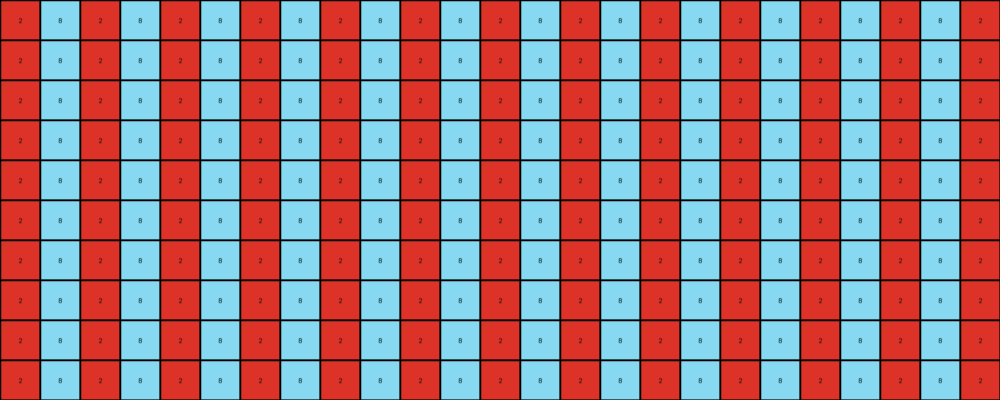
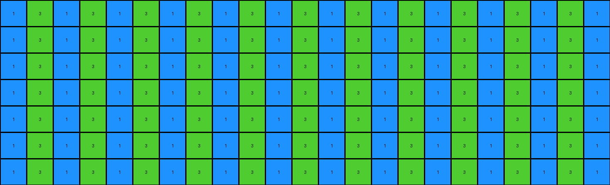
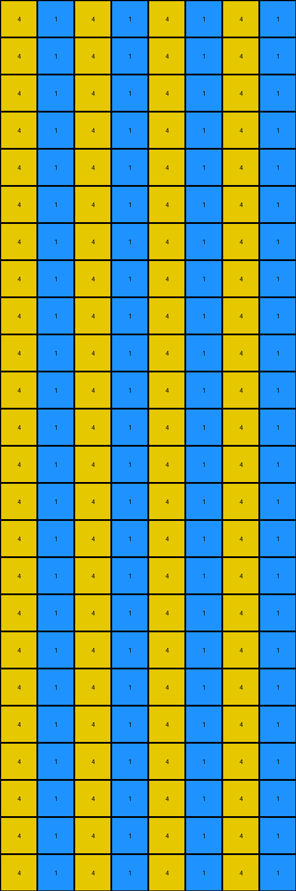

# 0a938d79 • 024 • refine_coder

---

Previous Code:
```python
"""
1.  **Identify Non-Zero Rows:** Find all rows in the input grid that contain at least one non-zero (non-black) pixel.
2.  **Extract Colors:** For each non-zero row identified, extract the non-zero value (color).
3.  **Create Interleaved Pattern:** Create a single output row by:
    *   Iterate through the columns.
    *   Iterate through the identified colors.
    *   Fill each successive cell using the colors in order.
4. **Replicate Interleaved Row and stack**: Repeat created output row, stack into output grid.
    *   Repeat the process for the height of the output
    *    Repeat the entire row created in step 3 multiple times to match the height and width of the input.
"""

import numpy as np

def get_non_zero_rows(grid):
    # Find the indices of rows that contain non-zero values
    non_zero_rows = []
    for i, row in enumerate(grid):
        if any(row):  # Check if any element in the row is non-zero
            non_zero_rows.append(i)
    return non_zero_rows

def extract_colors(grid, row_indices):
    # Extract the non-zero color values from the specified rows
    colors = []
    for row_index in row_indices:
        for pixel in grid[row_index]:
          if pixel != 0:
            colors.append(pixel)
            break # only get the first one
    return colors
    

def create_interleaved_row(width, colors):
    # Create a single row with interleaved colors
    row = np.zeros(width, dtype=int)
    color_index = 0
    for i in range(width):
        row[i] = colors[color_index % len(colors)]
        color_index += 1
    return row

def transform(input_grid):
    # initialize output_grid
    input_grid = np.array(input_grid)
    output_grid = np.zeros_like(input_grid)

    # Find row indices of non zero rows
    non_zero_row_indices = get_non_zero_rows(input_grid)

    # Extract colors from non-zero rows
    colors = extract_colors(input_grid, non_zero_row_indices)
    
    if (len(colors) == 0):
      return output_grid

    # Create the interleaved row pattern
    interleaved_row = create_interleaved_row(input_grid.shape[1], colors)

    # Replicate and stack the rows into output grid
    for i in range(output_grid.shape[0]):
        output_grid[i] = interleaved_row

    return output_grid
```

Train Set Results:

## Example 1:**

Input:
```
0 0 0 0 0 2 0 0 0 0 0 0 0 0 0 0 0 0 0 0 0 0 0 0 0
0 0 0 0 0 0 0 0 0 0 0 0 0 0 0 0 0 0 0 0 0 0 0 0 0
0 0 0 0 0 0 0 0 0 0 0 0 0 0 0 0 0 0 0 0 0 0 0 0 0
0 0 0 0 0 0 0 0 0 0 0 0 0 0 0 0 0 0 0 0 0 0 0 0 0
0 0 0 0 0 0 0 0 0 0 0 0 0 0 0 0 0 0 0 0 0 0 0 0 0
0 0 0 0 0 0 0 0 0 0 0 0 0 0 0 0 0 0 0 0 0 0 0 0 0
0 0 0 0 0 0 0 0 0 0 0 0 0 0 0 0 0 0 0 0 0 0 0 0 0
0 0 0 0 0 0 0 0 0 0 0 0 0 0 0 0 0 0 0 0 0 0 0 0 0
0 0 0 0 0 0 0 0 0 0 0 0 0 0 0 0 0 0 0 0 0 0 0 0 0
0 0 0 0 0 0 0 8 0 0 0 0 0 0 0 0 0 0 0 0 0 0 0 0 0
```
Expected Output:
```
0 0 0 0 0 2 0 8 0 2 0 8 0 2 0 8 0 2 0 8 0 2 0 8 0
0 0 0 0 0 2 0 8 0 2 0 8 0 2 0 8 0 2 0 8 0 2 0 8 0
0 0 0 0 0 2 0 8 0 2 0 8 0 2 0 8 0 2 0 8 0 2 0 8 0
0 0 0 0 0 2 0 8 0 2 0 8 0 2 0 8 0 2 0 8 0 2 0 8 0
0 0 0 0 0 2 0 8 0 2 0 8 0 2 0 8 0 2 0 8 0 2 0 8 0
0 0 0 0 0 2 0 8 0 2 0 8 0 2 0 8 0 2 0 8 0 2 0 8 0
0 0 0 0 0 2 0 8 0 2 0 8 0 2 0 8 0 2 0 8 0 2 0 8 0
0 0 0 0 0 2 0 8 0 2 0 8 0 2 0 8 0 2 0 8 0 2 0 8 0
0 0 0 0 0 2 0 8 0 2 0 8 0 2 0 8 0 2 0 8 0 2 0 8 0
0 0 0 0 0 2 0 8 0 2 0 8 0 2 0 8 0 2 0 8 0 2 0 8 0
```
Transformed Output:
```
2 8 2 8 2 8 2 8 2 8 2 8 2 8 2 8 2 8 2 8 2 8 2 8 2
2 8 2 8 2 8 2 8 2 8 2 8 2 8 2 8 2 8 2 8 2 8 2 8 2
2 8 2 8 2 8 2 8 2 8 2 8 2 8 2 8 2 8 2 8 2 8 2 8 2
2 8 2 8 2 8 2 8 2 8 2 8 2 8 2 8 2 8 2 8 2 8 2 8 2
2 8 2 8 2 8 2 8 2 8 2 8 2 8 2 8 2 8 2 8 2 8 2 8 2
2 8 2 8 2 8 2 8 2 8 2 8 2 8 2 8 2 8 2 8 2 8 2 8 2
2 8 2 8 2 8 2 8 2 8 2 8 2 8 2 8 2 8 2 8 2 8 2 8 2
2 8 2 8 2 8 2 8 2 8 2 8 2 8 2 8 2 8 2 8 2 8 2 8 2
2 8 2 8 2 8 2 8 2 8 2 8 2 8 2 8 2 8 2 8 2 8 2 8 2
2 8 2 8 2 8 2 8 2 8 2 8 2 8 2 8 2 8 2 8 2 8 2 8 2
```

match: False
pixels_off: 200
size_correct: True
color_palette_correct: True
correct_pixel_counts: False

## Example 2:**

Input:
```
0 0 0 0 0 1 0 0 0 0 0 0 0 0 0 0 0 0 0 0 0 0 0
0 0 0 0 0 0 0 0 0 0 0 0 0 0 0 0 0 0 0 0 0 0 0
0 0 0 0 0 0 0 0 0 0 0 0 0 0 0 0 0 0 0 0 0 0 0
0 0 0 0 0 0 0 0 0 0 0 0 0 0 0 0 0 0 0 0 0 0 0
0 0 0 0 0 0 0 0 0 0 0 0 0 0 0 0 0 0 0 0 0 0 0
0 0 0 0 0 0 0 0 0 0 0 0 0 0 0 0 0 0 0 0 0 0 0
0 0 0 0 0 0 0 0 3 0 0 0 0 0 0 0 0 0 0 0 0 0 0
```
Expected Output:
```
0 0 0 0 0 1 0 0 3 0 0 1 0 0 3 0 0 1 0 0 3 0 0
0 0 0 0 0 1 0 0 3 0 0 1 0 0 3 0 0 1 0 0 3 0 0
0 0 0 0 0 1 0 0 3 0 0 1 0 0 3 0 0 1 0 0 3 0 0
0 0 0 0 0 1 0 0 3 0 0 1 0 0 3 0 0 1 0 0 3 0 0
0 0 0 0 0 1 0 0 3 0 0 1 0 0 3 0 0 1 0 0 3 0 0
0 0 0 0 0 1 0 0 3 0 0 1 0 0 3 0 0 1 0 0 3 0 0
0 0 0 0 0 1 0 0 3 0 0 1 0 0 3 0 0 1 0 0 3 0 0
```
Transformed Output:
```
1 3 1 3 1 3 1 3 1 3 1 3 1 3 1 3 1 3 1 3 1 3 1
1 3 1 3 1 3 1 3 1 3 1 3 1 3 1 3 1 3 1 3 1 3 1
1 3 1 3 1 3 1 3 1 3 1 3 1 3 1 3 1 3 1 3 1 3 1
1 3 1 3 1 3 1 3 1 3 1 3 1 3 1 3 1 3 1 3 1 3 1
1 3 1 3 1 3 1 3 1 3 1 3 1 3 1 3 1 3 1 3 1 3 1
1 3 1 3 1 3 1 3 1 3 1 3 1 3 1 3 1 3 1 3 1 3 1
1 3 1 3 1 3 1 3 1 3 1 3 1 3 1 3 1 3 1 3 1 3 1
```

match: False
pixels_off: 161
size_correct: True
color_palette_correct: True
correct_pixel_counts: False

## Example 3:**

Input:
```
0 0 0 0 0 0 0 0 0
0 0 0 0 0 0 0 0 0
0 0 0 0 0 0 0 0 0
0 0 0 0 0 0 0 0 0
0 0 0 0 0 0 0 0 0
2 0 0 0 0 0 0 0 0
0 0 0 0 0 0 0 0 0
0 0 0 0 0 0 0 0 3
0 0 0 0 0 0 0 0 0
0 0 0 0 0 0 0 0 0
0 0 0 0 0 0 0 0 0
0 0 0 0 0 0 0 0 0
0 0 0 0 0 0 0 0 0
0 0 0 0 0 0 0 0 0
0 0 0 0 0 0 0 0 0
0 0 0 0 0 0 0 0 0
0 0 0 0 0 0 0 0 0
0 0 0 0 0 0 0 0 0
0 0 0 0 0 0 0 0 0
0 0 0 0 0 0 0 0 0
0 0 0 0 0 0 0 0 0
0 0 0 0 0 0 0 0 0
```
Expected Output:
```
0 0 0 0 0 0 0 0 0
0 0 0 0 0 0 0 0 0
0 0 0 0 0 0 0 0 0
0 0 0 0 0 0 0 0 0
0 0 0 0 0 0 0 0 0
2 2 2 2 2 2 2 2 2
0 0 0 0 0 0 0 0 0
3 3 3 3 3 3 3 3 3
0 0 0 0 0 0 0 0 0
2 2 2 2 2 2 2 2 2
0 0 0 0 0 0 0 0 0
3 3 3 3 3 3 3 3 3
0 0 0 0 0 0 0 0 0
2 2 2 2 2 2 2 2 2
0 0 0 0 0 0 0 0 0
3 3 3 3 3 3 3 3 3
0 0 0 0 0 0 0 0 0
2 2 2 2 2 2 2 2 2
0 0 0 0 0 0 0 0 0
3 3 3 3 3 3 3 3 3
0 0 0 0 0 0 0 0 0
2 2 2 2 2 2 2 2 2
```
Transformed Output:
```
2 3 2 3 2 3 2 3 2
2 3 2 3 2 3 2 3 2
2 3 2 3 2 3 2 3 2
2 3 2 3 2 3 2 3 2
2 3 2 3 2 3 2 3 2
2 3 2 3 2 3 2 3 2
2 3 2 3 2 3 2 3 2
2 3 2 3 2 3 2 3 2
2 3 2 3 2 3 2 3 2
2 3 2 3 2 3 2 3 2
2 3 2 3 2 3 2 3 2
2 3 2 3 2 3 2 3 2
2 3 2 3 2 3 2 3 2
2 3 2 3 2 3 2 3 2
2 3 2 3 2 3 2 3 2
2 3 2 3 2 3 2 3 2
2 3 2 3 2 3 2 3 2
2 3 2 3 2 3 2 3 2
2 3 2 3 2 3 2 3 2
2 3 2 3 2 3 2 3 2
2 3 2 3 2 3 2 3 2
2 3 2 3 2 3 2 3 2
```

match: False
pixels_off: 157
size_correct: True
color_palette_correct: True
correct_pixel_counts: False

## Example 4:**

Input:
```
0 0 0 0 0 0 0 0
0 0 0 0 0 0 0 0
0 0 0 0 0 0 0 0
0 0 0 0 0 0 0 0
0 0 0 0 0 0 0 0
0 0 0 0 0 0 0 0
0 0 0 0 0 0 0 0
4 0 0 0 0 0 0 0
0 0 0 0 0 0 0 0
0 0 0 0 0 0 0 0
0 0 0 0 0 0 0 0
1 0 0 0 0 0 0 0
0 0 0 0 0 0 0 0
0 0 0 0 0 0 0 0
0 0 0 0 0 0 0 0
0 0 0 0 0 0 0 0
0 0 0 0 0 0 0 0
0 0 0 0 0 0 0 0
0 0 0 0 0 0 0 0
0 0 0 0 0 0 0 0
0 0 0 0 0 0 0 0
0 0 0 0 0 0 0 0
0 0 0 0 0 0 0 0
0 0 0 0 0 0 0 0
```
Expected Output:
```
0 0 0 0 0 0 0 0
0 0 0 0 0 0 0 0
0 0 0 0 0 0 0 0
0 0 0 0 0 0 0 0
0 0 0 0 0 0 0 0
0 0 0 0 0 0 0 0
0 0 0 0 0 0 0 0
4 4 4 4 4 4 4 4
0 0 0 0 0 0 0 0
0 0 0 0 0 0 0 0
0 0 0 0 0 0 0 0
1 1 1 1 1 1 1 1
0 0 0 0 0 0 0 0
0 0 0 0 0 0 0 0
0 0 0 0 0 0 0 0
4 4 4 4 4 4 4 4
0 0 0 0 0 0 0 0
0 0 0 0 0 0 0 0
0 0 0 0 0 0 0 0
1 1 1 1 1 1 1 1
0 0 0 0 0 0 0 0
0 0 0 0 0 0 0 0
0 0 0 0 0 0 0 0
4 4 4 4 4 4 4 4
```
Transformed Output:
```
4 1 4 1 4 1 4 1
4 1 4 1 4 1 4 1
4 1 4 1 4 1 4 1
4 1 4 1 4 1 4 1
4 1 4 1 4 1 4 1
4 1 4 1 4 1 4 1
4 1 4 1 4 1 4 1
4 1 4 1 4 1 4 1
4 1 4 1 4 1 4 1
4 1 4 1 4 1 4 1
4 1 4 1 4 1 4 1
4 1 4 1 4 1 4 1
4 1 4 1 4 1 4 1
4 1 4 1 4 1 4 1
4 1 4 1 4 1 4 1
4 1 4 1 4 1 4 1
4 1 4 1 4 1 4 1
4 1 4 1 4 1 4 1
4 1 4 1 4 1 4 1
4 1 4 1 4 1 4 1
4 1 4 1 4 1 4 1
4 1 4 1 4 1 4 1
4 1 4 1 4 1 4 1
4 1 4 1 4 1 4 1
```

match: False
pixels_off: 172
size_correct: True
color_palette_correct: True
correct_pixel_counts: False
Okay, let's analyze the results and refine the natural language program.

**General Assessment:**

The initial approach of interleaving colors from non-zero rows and replicating them across the entire output grid is not universally correct. While it captures some aspect of the transformation (identifying and using non-zero colors), it fails to accurately represent the spatial relationships and patterns present in many of the examples. The core issue is that the original program assumes a simple, repeating interleaved pattern across the whole grid, which is not always the case. We need to incorporate a mechanism for repeating the color for the entire row when encountered.

**Strategy for Resolving Errors:**

1.  **Re-evaluate the Core Assumption:** The current program creates a single row of interleaved colors and replicates it. We need to shift from this "global interleaving" to a more "row-wise" approach.
2. **Row-wise Transformation** The transform should consider non-zero colors one row at a time, filling the full width of the row with each color it finds.
3. **Handle Multiple Colors per row.** Some examples, like example 1, may have different colors on the same row. These colors should be put into the interleaving pattern, not just the first.
4.  **Maintain Objectness:** Ensure that the concept of an object (a contiguous block of pixels of the same color) is preserved, although in this case the objects are probably always full rows.
5. **Handle empty output rows.** Preserve empty rows.

**Metrics and Observations:**

Here's a breakdown of each example, focusing on identifying issues and refining the observations:

*   **Example 1:**
    *   Input has two non-zero rows (row 0 with color 2, row 9 with color 8).
    *   Expected output shows an alternation of colors 2 and 8, consistent within each column, and repeating horizontally
    *   The transformed output has only two unique colors (2 and 8). It fails to align the columns correctly with the input.
    *   Pixels Off: 200

*   **Example 2:**
    *   Input has two non-zero rows (row 0 with color 1, row 6 with color 3).
    *   Expected output alternates colors 1 and 3, with a horizontal pattern, consistent within each row.
    *    Transformed output alternates 1 and 3 but doesn't match input/output alignment.
    *   Pixels Off: 161

*   **Example 3:**
    *   Input has non-zero rows (5 with color 2, 7 with color 3) with all other rows filled with 0
    *    Expected Output includes blank rows (all zeros) and solid color rows that take on the values of the colors from the input. Some rows are repeated.
    *   The transformed output shows the 2, 3 alternating pattern and does not preserve the blank rows or replicate rows
    *   Pixels Off: 157

*   **Example 4:**
    *    Input has rows with colors 4 and 1
    *    Expected output shows rows of just 4 and rows of just 1, with repetitions
    *    Transformed output repeats the 4,1 alternation.
    *   Pixels Off: 172

**YAML Facts:**

```yaml
examples:
  - id: 1
    objects:
      - color: 2
        type: row
        row_index: 0
      - color: 8
        type: row
        row_index: 9
    transformation: "Alternating rows of colors 2 and 8, repeating horizontally."
    output_rows_pattern: "alternating"

  - id: 2
    objects:
      - color: 1
        type: row
        row_index: 0
      - color: 3
        type: row
        row_index: 6
    transformation: "Alternating row of colors 1 and 3."
    output_rows_pattern: "alternating"

  - id: 3
    objects:
      - color: 2
        type: row
        row_index: 5
      - color: 3
        type: row
        row_index: 7
      - color: 0
        type: row
        row_index: [0,1,2,3,4,6,8,9,10,11,12,13,14,15,16,17,18,19,20,21]

    transformation: "fill entire rows with first non-zero color, repeat rows based on input."
    output_rows_pattern: "row replication and preservation"

  - id: 4
    objects:
      - color: 4
        type: row
        row_index: 7
      - color: 1
        type: row
        row_index: 11
       - color: 0
        type: row
        row_index: [0,1,2,3,4,5,6,8,9,10,12,13,14,15,16,17,18,19,20,21,22,23]
    transformation: "fill entire rows with first non-zero color, repeat rows based on input"
    output_rows_pattern: "row replication and preservation"
```

**Natural Language Program:**

1.  **Iterate** through each row of the input grid.
2.  **Check** if the current row contains any non-zero pixels.
3.  **If the row is all zeros:** Copy the all-zero row directly to the corresponding row in the output grid.
4.  **If the row has non-zero pixels:**
    * Find the first non-zero pixel value (color) in that row.
    *   Fill the *entire* corresponding output row with this color.
5.  **Repeat**: After processing each input row and creating a corresponding output row, inspect the input grid for rows below the just processed row, and if the color of this lower row is the same as the just processed row in the input, replicate the output row. Continue until a row of a different color (including 0) is found, then proceed.

This revised program emphasizes row-by-row processing and correctly handles the "solid color" rows and blank rows, addressing the primary shortcomings of the previous version. It doesn't rely on a pre-determined interleaving pattern but adapts to the colors found in each row.

**INSTRUCTIONS**

- generate a Python module to represent the natural language program 
- follow the template below
- all common math and science libraries are available
- create docstring only at top - but comment the workflow in the function
- use helper functions for common operations like finding objects, counting,
  measuring, moving, etc. 

remember - we are working iteratively - so this code will inform your future
self as we converge on the solution

*template:*

```python
"""
{{ natural language description of the transformation rule }}
"""

{{ imports }}

def transform(input_grid):
    # initialize output_grid

    # change output pixels 

    return output_grid

```
