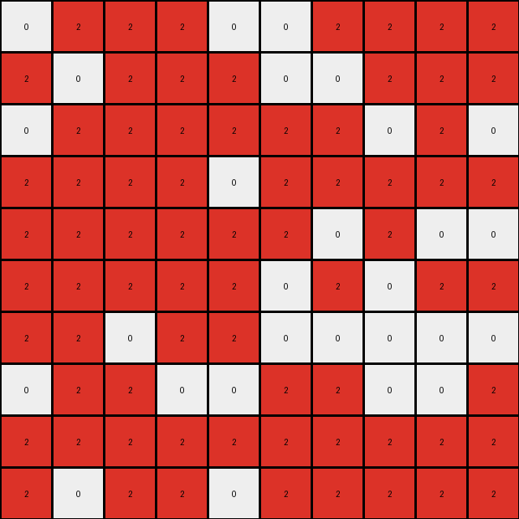
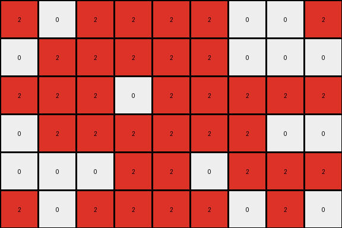

# 0b148d64 • 003 • refine_dreamer

---

Previous Code:
```python
"""
1.  **Identify the Target Region:** Locate the largest contiguous region of red (2) pixels in the input grid. Note its position relative to the edges of the grid (lower-left).

2.  **Crop:** Remove all rows and columns that contain only azure (8) pixels to isolate the large red area with some of the surrounding white area.

3.  **Filter:**  After the cropping operation, eliminate all azure (8) pixels that remains. The output contains only red (2) and white (0) pixels.

4.  **Output:** the transformed grid
"""

import numpy as np

def find_largest_object(grid, color):
    """Find the largest contiguous object of a specific color."""
    visited = np.zeros_like(grid, dtype=bool)
    max_size = 0
    max_object_coords = []

    def dfs(row, col, current_object_coords):
        """Depth-first search to find contiguous regions."""
        if (row < 0 or row >= grid.shape[0] or col < 0 or col >= grid.shape[1]
                or visited[row, col] or grid[row, col] != color):
            return 0
        visited[row, col] = True
        current_object_coords.append((row, col))
        size = 1
        size += dfs(row + 1, col, current_object_coords)
        size += dfs(row - 1, col, current_object_coords)
        size += dfs(row, col + 1, current_object_coords)
        size += dfs(row, col - 1, current_object_coords)
        return size

    for row in range(grid.shape[0]):
        for col in range(grid.shape[1]):
            if grid[row, col] == color and not visited[row, col]:
                current_object_coords = []
                size = dfs(row, col, current_object_coords)
                if size > max_size:
                    max_size = size
                    max_object_coords = current_object_coords

    return max_object_coords

def crop_grid(grid, coords):
    """Crops the grid to the bounding box defined by the coordinates."""
    min_row = min(r for r, _ in coords)
    max_row = max(r for r, _ in coords)
    min_col = min(c for _, c in coords)
    max_col = max(c for _, c in coords)

    return grid[min_row:max_row + 1, min_col:max_col + 1]

def transform(input_grid):
    # Find the largest red object
    red_object_coords = find_largest_object(input_grid, 2)

    # Crop the grid to the bounding box of the red object
    cropped_grid = crop_grid(input_grid, red_object_coords)
    
    output_grid = cropped_grid.copy()

    #remove azure
    for i in range(output_grid.shape[0]):
        for j in range(output_grid.shape[1]):
            if output_grid[i,j] == 8:
                output_grid[i,j] = 0

    return output_grid
```

Train Set Results:

## Example 1:**

Input:
```
8 8 8 8 8 0 8 8 8 8 0 0 0 0 8 8 8 8 0 8 8
8 0 0 8 0 8 0 8 8 8 0 0 0 0 8 8 8 0 0 0 8
8 8 8 0 0 0 8 8 8 8 0 0 0 0 8 8 0 8 8 8 8
8 8 0 8 8 8 8 0 8 8 0 0 0 0 8 8 0 0 0 8 8
8 8 8 8 0 8 8 0 8 8 0 0 0 0 8 8 8 0 8 8 8
0 0 0 8 8 0 8 0 0 8 0 0 0 0 8 0 0 0 8 0 0
8 8 8 8 0 0 8 0 8 0 0 0 0 0 8 8 8 0 8 8 8
8 0 0 8 0 0 8 8 0 8 0 0 0 0 8 0 8 8 8 8 8
8 8 8 8 8 8 0 8 0 0 0 0 0 0 8 8 8 8 8 0 0
0 0 0 0 0 0 0 0 0 0 0 0 0 0 0 0 0 0 0 0 0
0 0 0 0 0 0 0 0 0 0 0 0 0 0 0 0 0 0 0 0 0
0 2 2 2 0 0 2 2 2 2 0 0 0 0 8 8 0 8 8 0 8
2 0 2 2 2 0 0 2 2 2 0 0 0 0 8 8 8 8 0 8 0
0 2 2 2 2 2 2 0 2 0 0 0 0 0 8 8 8 0 0 0 8
2 2 2 2 0 2 2 2 2 2 0 0 0 0 8 8 0 8 8 8 0
2 2 2 2 2 2 0 2 0 0 0 0 0 0 8 8 8 8 8 0 0
2 2 2 2 2 0 2 0 2 2 0 0 0 0 8 0 8 0 8 8 8
2 2 0 2 2 0 0 0 0 0 0 0 0 0 8 8 0 8 0 0 8
0 2 2 0 0 2 2 0 0 2 0 0 0 0 8 0 0 0 8 8 0
2 2 2 2 2 2 2 2 2 2 0 0 0 0 0 8 8 0 0 8 8
2 0 2 2 0 2 2 2 2 2 0 0 0 0 8 8 8 0 8 8 8
```
Expected Output:
```
0 2 2 2 0 0 2 2 2 2
2 0 2 2 2 0 0 2 2 2
0 2 2 2 2 2 2 0 2 0
2 2 2 2 0 2 2 2 2 2
2 2 2 2 2 2 0 2 0 0
2 2 2 2 2 0 2 0 2 2
2 2 0 2 2 0 0 0 0 0
0 2 2 0 0 2 2 0 0 2
2 2 2 2 2 2 2 2 2 2
2 0 2 2 0 2 2 2 2 2
```
Transformed Output:
```
0 2 2 2 0 0 2 2 2 2
2 0 2 2 2 0 0 2 2 2
0 2 2 2 2 2 2 0 2 0
2 2 2 2 0 2 2 2 2 2
2 2 2 2 2 2 0 2 0 0
2 2 2 2 2 0 2 0 2 2
2 2 0 2 2 0 0 0 0 0
0 2 2 0 0 2 2 0 0 2
2 2 2 2 2 2 2 2 2 2
2 0 2 2 0 2 2 2 2 2
```

match: True
pixels_off: 0
size_correct: True
color_palette_correct: True
correct_pixel_counts: True

## Example 2:**

Input:
```
2 0 2 2 2 2 0 0 0 0 2 0 2 2 2 2 0 0 2
2 2 2 2 0 2 2 0 0 0 0 2 2 2 2 2 0 0 0
0 0 2 2 0 2 0 0 0 0 2 2 2 0 2 2 2 2 2
2 0 2 0 2 2 0 0 0 0 0 2 2 2 2 2 2 0 0
0 2 0 2 2 2 2 0 0 0 0 0 0 2 2 0 2 2 2
2 2 2 0 2 0 2 0 0 0 2 0 2 2 2 2 0 2 0
0 0 0 0 0 0 0 0 0 0 0 0 0 0 0 0 0 0 0
0 0 0 0 0 0 0 0 0 0 0 0 0 0 0 0 0 0 0
0 0 0 0 0 0 0 0 0 0 0 0 0 0 0 0 0 0 0
0 0 0 0 0 0 0 0 0 0 0 0 0 0 0 0 0 0 0
0 0 0 0 0 0 0 0 0 0 0 0 0 0 0 0 0 0 0
2 0 2 0 0 0 2 0 0 0 0 3 3 3 3 3 0 3 3
0 2 2 0 0 2 2 0 0 0 3 3 3 0 0 0 3 3 0
0 2 2 0 0 2 0 0 0 0 3 3 3 0 3 0 3 0 0
2 2 2 0 0 2 2 0 0 0 3 3 0 0 0 3 3 3 3
2 0 0 2 2 2 0 0 0 0 3 0 0 0 3 0 3 0 3
2 0 2 0 0 0 2 0 0 0 0 3 3 0 3 3 3 0 3
0 2 2 0 2 2 0 0 0 0 0 3 3 0 0 3 0 3 0
```
Expected Output:
```
0 3 3 3 3 3 0 3 3
3 3 3 0 0 0 3 3 0
3 3 3 0 3 0 3 0 0
3 3 0 0 0 3 3 3 3
3 0 0 0 3 0 3 0 3
0 3 3 0 3 3 3 0 3
0 3 3 0 0 3 0 3 0
```
Transformed Output:
```
2 0 2 2 2 2 0 0 2
0 2 2 2 2 2 0 0 0
2 2 2 0 2 2 2 2 2
0 2 2 2 2 2 2 0 0
0 0 0 2 2 0 2 2 2
2 0 2 2 2 2 0 2 0
```

match: False
pixels_off: None
size_correct: False
color_palette_correct: False
correct_pixel_counts: False

## Example 3:**

Input:
```
0 1 0 1 1 1 0 0 1 1 0 1 0 0 0 0 0
1 0 1 0 0 0 0 0 1 1 1 1 1 1 0 1 1
1 1 0 1 1 0 0 0 1 1 1 1 1 1 0 1 1
1 1 0 0 1 1 0 0 1 1 0 1 1 1 1 1 1
0 1 1 1 0 0 0 0 1 1 0 0 0 1 1 1 0
1 0 0 1 0 0 0 0 1 1 0 0 1 1 1 1 1
0 0 0 1 1 0 0 0 1 1 1 0 0 1 0 0 1
0 0 0 0 0 0 0 0 0 0 0 0 0 0 0 0 0
0 0 0 0 0 0 0 0 0 0 0 0 0 0 0 0 0
0 0 0 0 0 0 0 0 0 0 0 0 0 0 0 0 0
4 0 0 4 0 4 0 0 1 0 0 1 1 1 1 1 1
4 4 4 4 0 4 0 0 1 0 1 1 1 1 1 1 0
4 0 4 0 0 4 0 0 0 1 0 0 1 1 1 1 1
0 4 4 4 4 0 0 0 1 1 0 0 1 0 1 0 1
4 4 4 0 4 4 0 0 1 1 1 1 1 1 1 1 0
0 4 4 4 4 0 0 0 0 1 0 0 0 0 1 1 1
0 4 4 4 0 4 0 0 0 1 0 1 0 1 1 1 0
0 4 0 0 0 0 0 0 1 0 1 1 1 0 1 0 1
4 4 0 4 0 4 0 0 1 1 1 0 0 1 1 1 0
```
Expected Output:
```
4 0 0 4 0 4
4 4 4 4 0 4
4 0 4 0 0 4
0 4 4 4 4 0
4 4 4 0 4 4
0 4 4 4 4 0
0 4 4 4 0 4
0 4 0 0 0 0
4 4 0 4 0 4
```
match: ERROR: min() arg is an empty sequence
pixels_off: None
size_correct: None
color_palette_correct: None
correct_pixel_counts: None
**INSTRUCTIONS**

The code above was generated based on observations from the first training
example

we have tested the transform function on each of the task example inputs and
compared with the expected output

review each of the examples provided and the results and consider how the
natural language program should be updated to accommodate this new knowledge

respond with the following deliverables:

- general assessment of the information provided and strategy for resolving the
  errors
- gather metrics about each of the examples and results - use code_execution to
  develop accurate reports on your assumptions
- a YAML block documenting facts - Focus on identifying objects, their properties, and the actions performed on them.
- a natural language program - Be as clear and concise as possible, providing a complete description of the transformation rule.


your responses should be considered as information in a report - not a
conversation
