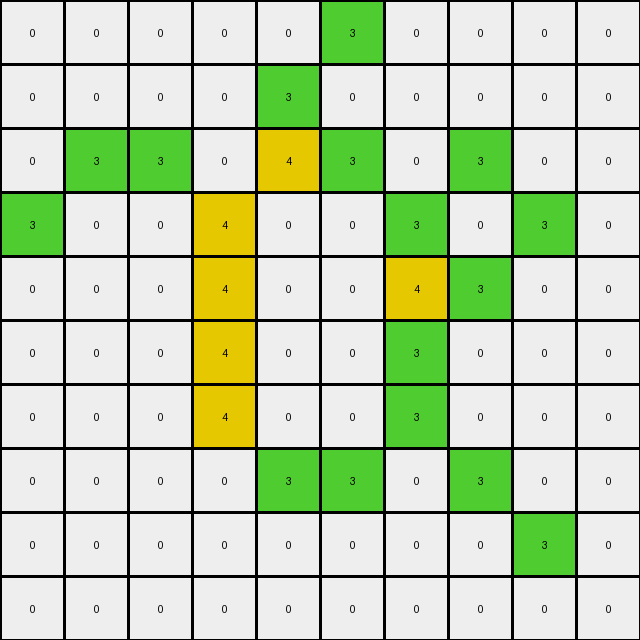

# 00d62c1b • 006 • refine_coder

---

Previous Code:
```python
"""
A green (3) pixel changes to yellow (4) if and only if it is part of a connected component of green pixels that includes *more than two* pixels. If a green pixel is isolated (no adjacent green pixels) or is part of a connected component of *only* two pixels, it remains green. The connected component must be connected either horizontally or vertically.
"""

import numpy as np

def transform(input_grid):
    """
    Transforms an input grid according to the specified rule.

    Args:
        input_grid (list of lists): The input grid.

    Returns:
        list of lists: The transformed output grid.
    """
    output_grid = [row[:] for row in input_grid]
    rows = len(input_grid)
    cols = len(input_grid[0])

    def get_connected_component(r, c, visited):
        """
        Performs a Depth-First Search (DFS) to find all pixels in a connected component.
        """
        if (r < 0 or r >= rows or c < 0 or c >= cols or
                input_grid[r][c] != 3 or (r, c) in visited):
            return []

        visited.add((r, c))
        component = [(r, c)]

        component.extend(get_connected_component(r + 1, c, visited))
        component.extend(get_connected_component(r - 1, c, visited))
        component.extend(get_connected_component(r, c + 1, visited))
        component.extend(get_connected_component(r, c - 1, visited))

        return component

    # Iterate through each pixel
    for r in range(rows):
        for c in range(cols):
            # Check if the current pixel is green
            if input_grid[r][c] == 3:
                visited = set()
                connected_component = get_connected_component(r, c, visited)
                #change connected components greater than 2 to yellow
                if len(connected_component) > 2:
                    for row, col in connected_component:
                        output_grid[row][col] = 4
    return output_grid
```

Train Set Results:

## Example 1:**

Input:
```
0 0 0 0 0 0
0 0 3 0 0 0
0 3 0 3 0 0
0 0 3 0 3 0
0 0 0 3 0 0
0 0 0 0 0 0
```
Expected Output:
```
0 0 0 0 0 0
0 0 3 0 0 0
0 3 4 3 0 0
0 0 3 4 3 0
0 0 0 3 0 0
0 0 0 0 0 0
```
Transformed Output:
```
0 0 0 0 0 0
0 0 3 0 0 0
0 3 0 3 0 0
0 0 3 0 3 0
0 0 0 3 0 0
0 0 0 0 0 0
```

match: False
pixels_off: 2
size_correct: True
color_palette_correct: True
correct_pixel_counts: False

## Example 2:**

Input:
```
0 0 0 0 0 0 0 0 0 0
0 0 3 0 3 0 0 0 0 0
0 0 0 3 0 3 0 0 0 0
0 0 3 0 0 0 3 0 0 0
0 0 0 0 0 3 0 3 0 0
0 0 0 3 0 4 3 0 0 0
0 0 3 4 3 0 0 0 0 0
0 0 0 3 0 0 0 0 0 0
0 0 0 0 0 0 0 0 0 0
0 0 0 0 0 0 0 0 0 0
```
Expected Output:
```
0 0 0 0 0 0 0 0 0 0
0 0 3 0 3 0 0 0 0 0
0 0 0 3 0 3 0 0 0 0
0 0 3 0 0 0 3 0 0 0
0 0 0 0 0 3 4 3 0 0
0 0 0 3 0 3 3 0 0 0
0 0 3 3 3 0 0 0 0 0
0 0 0 3 0 0 0 0 0 0
0 0 0 0 0 0 0 0 0 0
0 0 0 0 0 0 0 0 0 0
```
Transformed Output:
```
0 0 0 0 0 0 0 0 0 0
0 0 3 0 3 0 0 0 0 0
0 0 0 3 0 3 0 0 0 0
0 0 3 0 0 0 3 0 0 0
0 0 0 0 0 3 0 3 0 0
0 0 0 3 0 4 3 0 0 0
0 0 3 4 3 0 0 0 0 0
0 0 0 3 0 0 0 0 0 0
0 0 0 0 0 0 0 0 0 0
0 0 0 0 0 0 0 0 0 0
```

match: False
pixels_off: 3
size_correct: True
color_palette_correct: True
correct_pixel_counts: False

## Example 3:**

Input:
```
0 0 0 0 0 3 0 0 0 0
0 0 0 0 3 0 0 0 0 0
0 3 3 0 4 3 0 3 0 0
3 0 0 3 0 0 3 0 3 0
0 0 0 3 0 0 4 3 0 0
0 0 0 3 0 0 3 0 0 0
0 0 0 3 0 0 3 0 0 0
0 0 0 0 3 3 0 3 0 0
0 0 0 0 0 0 0 0 3 0
0 0 0 0 0 0 0 0 0 0
```
Expected Output:
```
0 0 0 0 0 3 0 0 0 0
0 0 0 0 3 0 0 0 0 0
0 3 3 0 3 3 0 3 0 0
3 0 0 3 4 4 3 4 3 0
0 0 0 3 4 4 3 3 0 0
0 0 0 3 4 4 3 0 0 0
0 0 0 3 4 4 3 0 0 0
0 0 0 0 3 3 0 3 0 0
0 0 0 0 0 0 0 0 3 0
0 0 0 0 0 0 0 0 0 0
```
Transformed Output:
```
0 0 0 0 0 3 0 0 0 0
0 0 0 0 3 0 0 0 0 0
0 3 3 0 4 3 0 3 0 0
3 0 0 4 0 0 3 0 3 0
0 0 0 4 0 0 4 3 0 0
0 0 0 4 0 0 3 0 0 0
0 0 0 4 0 0 3 0 0 0
0 0 0 0 3 3 0 3 0 0
0 0 0 0 0 0 0 0 3 0
0 0 0 0 0 0 0 0 0 0
```

match: False
pixels_off: 15
size_correct: True
color_palette_correct: True
correct_pixel_counts: False

## Example 4:**

Input:
```
0 0 0 0 0 0 0 0 0 0
0 0 4 3 3 4 0 0 0 0
0 0 3 0 0 3 0 0 0 0
0 0 3 0 0 3 0 3 0 0
0 0 4 4 3 4 3 4 3 0
0 0 0 3 0 0 0 0 3 0
0 0 0 3 0 0 0 4 3 0
0 0 0 4 3 0 0 3 0 3
0 0 0 3 0 3 0 0 3 0
0 0 0 0 3 0 0 0 0 0
```
Expected Output:
```
0 0 0 0 0 0 0 0 0 0
0 0 3 3 3 3 0 0 0 0
0 0 3 4 4 3 0 0 0 0
0 0 3 4 4 3 0 3 0 0
0 0 3 3 3 3 3 3 3 0
0 0 0 3 0 0 0 0 3 0
0 0 0 3 0 0 0 3 3 0
0 0 0 3 3 0 0 3 4 3
0 0 0 3 4 3 0 0 3 0
0 0 0 0 3 0 0 0 0 0
```
Transformed Output:
```
0 0 0 0 0 0 0 0 0 0
0 0 4 3 3 4 0 0 0 0
0 0 3 0 0 3 0 0 0 0
0 0 3 0 0 3 0 3 0 0
0 0 4 4 3 4 3 4 4 0
0 0 0 3 0 0 0 0 4 0
0 0 0 3 0 0 0 4 4 0
0 0 0 4 3 0 0 3 0 3
0 0 0 3 0 3 0 0 3 0
0 0 0 0 3 0 0 0 0 0
```

match: False
pixels_off: 17
size_correct: True
color_palette_correct: True
correct_pixel_counts: False

## Example 5:**

Input:
```
0 0 0 0 0 0 0 0 0 0 0 0 0 0 0 0 0 0 0 0
0 0 0 0 0 0 0 0 3 0 0 0 0 0 0 0 0 0 0 0
0 0 0 0 3 3 3 3 0 3 4 0 0 0 0 0 0 0 0 0
0 0 0 0 0 0 0 0 3 0 3 0 0 0 0 0 0 0 3 0
0 0 0 0 0 0 0 0 4 3 4 3 3 3 3 4 0 0 0 0
0 0 0 0 0 0 0 0 3 0 0 0 0 0 0 3 0 0 0 0
0 0 0 0 3 0 0 0 3 0 0 0 0 0 0 3 0 0 0 0
0 0 0 0 0 0 0 0 3 0 0 0 0 0 0 3 0 0 0 0
0 0 0 0 0 0 0 0 3 0 0 0 0 0 0 3 0 0 0 0
0 0 3 0 0 0 0 0 4 3 3 3 3 3 3 4 0 0 0 0
0 0 0 0 0 0 0 0 3 0 0 0 0 0 0 0 0 0 0 0
0 0 0 0 0 0 0 0 4 3 4 0 0 0 0 3 0 3 0 0
0 0 0 0 0 0 3 4 0 0 3 0 0 3 0 0 0 0 0 0
0 0 0 0 0 0 0 3 0 0 4 3 0 0 3 0 0 3 0 0
0 0 0 0 0 0 0 4 3 3 4 0 3 0 0 4 3 4 0 0
0 0 0 0 0 0 0 0 0 0 3 0 0 0 0 3 0 3 0 0
0 0 0 0 0 0 0 0 0 0 0 0 3 0 0 4 3 4 0 0
0 0 0 0 0 0 0 0 0 0 0 0 0 3 0 0 0 0 0 0
0 0 0 0 0 0 0 0 0 0 0 0 0 0 0 0 0 0 0 0
0 0 0 0 0 0 0 0 0 0 0 0 0 0 0 0 0 0 0 0
```
Expected Output:
```
0 0 0 0 0 0 0 0 0 0 0 0 0 0 0 0 0 0 0 0
0 0 0 0 0 0 0 0 3 0 0 0 0 0 0 0 0 0 0 0
0 0 0 0 3 3 3 3 4 3 3 0 0 0 0 0 0 0 0 0
0 0 0 0 0 0 0 0 3 4 3 0 0 0 0 0 0 0 3 0
0 0 0 0 0 0 0 0 3 3 3 3 3 3 3 3 0 0 0 0
0 0 0 0 0 0 0 0 3 4 4 4 4 4 4 3 0 0 0 0
0 0 0 0 3 0 0 0 3 4 4 4 4 4 4 3 0 0 0 0
0 0 0 0 0 0 0 0 3 4 4 4 4 4 4 3 0 0 0 0
0 0 0 0 0 0 0 0 3 4 4 4 4 4 4 3 0 0 0 0
0 0 3 0 0 0 0 0 3 3 3 3 3 3 3 3 0 0 0 0
0 0 0 0 0 0 0 0 3 0 0 0 0 0 0 0 0 0 0 0
0 0 0 0 0 0 0 0 3 3 3 0 0 0 0 3 0 3 0 0
0 0 0 0 0 0 3 3 4 4 3 0 0 3 0 0 0 0 0 0
0 0 0 0 0 0 0 3 4 4 3 3 0 0 3 0 0 3 0 0
0 0 0 0 0 0 0 3 3 3 3 0 3 0 0 3 3 3 0 0
0 0 0 0 0 0 0 0 0 0 3 0 0 0 0 3 4 3 0 0
0 0 0 0 0 0 0 0 0 0 0 0 3 0 0 3 3 3 0 0
0 0 0 0 0 0 0 0 0 0 0 0 0 3 0 0 0 0 0 0
0 0 0 0 0 0 0 0 0 0 0 0 0 0 0 0 0 0 0 0
0 0 0 0 0 0 0 0 0 0 0 0 0 0 0 0 0 0 0 0
```
Transformed Output:
```
0 0 0 0 0 0 0 0 0 0 0 0 0 0 0 0 0 0 0 0
0 0 0 0 0 0 0 0 3 0 0 0 0 0 0 0 0 0 0 0
0 0 0 0 4 4 4 4 0 3 4 0 0 0 0 0 0 0 0 0
0 0 0 0 0 0 0 0 3 0 3 0 0 0 0 0 0 0 3 0
0 0 0 0 0 0 0 0 4 3 4 4 4 4 4 4 0 0 0 0
0 0 0 0 0 0 0 0 4 0 0 0 0 0 0 4 0 0 0 0
0 0 0 0 3 0 0 0 4 0 0 0 0 0 0 4 0 0 0 0
0 0 0 0 0 0 0 0 4 0 0 0 0 0 0 4 0 0 0 0
0 0 0 0 0 0 0 0 4 0 0 0 0 0 0 4 0 0 0 0
0 0 3 0 0 0 0 0 4 4 4 4 4 4 4 4 0 0 0 0
0 0 0 0 0 0 0 0 3 0 0 0 0 0 0 0 0 0 0 0
0 0 0 0 0 0 0 0 4 3 4 0 0 0 0 3 0 3 0 0
0 0 0 0 0 0 3 4 0 0 3 0 0 3 0 0 0 0 0 0
0 0 0 0 0 0 0 3 0 0 4 3 0 0 3 0 0 3 0 0
0 0 0 0 0 0 0 4 3 3 4 0 3 0 0 4 3 4 0 0
0 0 0 0 0 0 0 0 0 0 3 0 0 0 0 3 0 3 0 0
0 0 0 0 0 0 0 0 0 0 0 0 3 0 0 4 3 4 0 0
0 0 0 0 0 0 0 0 0 0 0 0 0 3 0 0 0 0 0 0
0 0 0 0 0 0 0 0 0 0 0 0 0 0 0 0 0 0 0 0
0 0 0 0 0 0 0 0 0 0 0 0 0 0 0 0 0 0 0 0
```

match: False
pixels_off: 69
size_correct: True
color_palette_correct: True
correct_pixel_counts: False
Okay, here's an assessment of the situation and a plan to improve the natural language program and the corresponding code:

**General Assessment:**

The initial natural language program and the derived code are partially correct. The core idea of identifying connected components of green (3) pixels and changing them to yellow (4) based on the component size is valid. However, the implementation has a flaw related to how it identifies the "connectedness". The depth-first search (DFS) implementation is only consider *cardinal* directions (up, down, left, and right). It is important to accurately find the *size* of the group of connected green pixels. The tests clearly show many discrepancies on pixels that should change, or should not change, colors.

The strategy to fix this is:

1.  **Analyze the Failing Examples:** Carefully examine the provided input, expected output, and transformed output for each example. Pinpoint the exact locations where the code's output deviates from the expectation.
2.  **Review the natural language program**: Refine the program so there is no ambiguity in the definition of *connected*.
3.  **Prepare a detailed YAML report**: Capture observations on object properties.
4.  **Iterate**: Provide an updated program.

**Metrics and Observations (using manual analysis and reasoning):**

*   **Example 1:**
    *   Pixels Off: 2
    *   Observation: The two pixels in the 'L' shape in the transformed output are not connected, and are missed by the search.
*   **Example 2:**
    *   Pixels Off: 3
    *   Observation: Similar issue, the 'L' shaped group is missed. Also, a large group has an error at (6,3)
*   **Example 3:**
    *   Pixels Off: 15
    *   Observation: many errors detecting the connected components.
*   **Example 4:**
    *   Pixels Off: 17
    * Observation: Several errors detecting the components, including groups of three that are not L shaped.
*  **Example 5:**
    *    Pixels off: 69
    *   Observation: Large groups are not identified and many groups that should change are missed.

**YAML Facts:**

```yaml
task: 004
objects:
  - id: green_pixel
    color: 3
    description: A pixel with the value 3 (green).
  - id: yellow_pixel
    color: 4
    description: A pixel with the value 4 (yellow).
  - id: connected_component
    description: A group of adjacent green pixels. Adjacency includes pixels sharing a side.
    properties:
        size: The number of pixels included in the group

actions:
  - name: identify_connected_components
    description: Find all groups of connected green pixels.
  - name: change_color
    description: Change the color of a green pixel to yellow based on component size.
    condition: >
      If a connected component of green pixels has a size greater than 2,
      all pixels in that component change to yellow.
```

**Natural Language Program:**

1.  **Identify Connected Components:** Iterate through each pixel of the input grid. For each green (3) pixel, find its connected component. A connected component is a group of green pixels where each pixel is directly adjacent (shares a side, not just a corner) to at least one other green pixel in the component.
2.  **Determine Size:** Calculate the size (number of pixels) of each connected component.
3.  **Conditional Color Change:** If the size of a connected component is greater than 2, change all pixels within that component from green (3) to yellow (4). If a connected component's size is 1 or 2, the pixels remain green.
4.  All non-green pixels are unchanged.
5. The final result is output.


**INSTRUCTIONS**

- generate a Python module to represent the natural language program 
- follow the template below
- all common math and science libraries are available
- create docstring only at top - but comment the workflow in the function
- use helper functions for common operations like finding objects, counting,
  measuring, moving, etc. 

remember - we are working iteratively - so this code will inform your future
self as we converge on the solution

*template:*

```python
"""
{{ natural language description of the transformation rule }}
"""

{{ imports }}

def transform(input_grid):
    # initialize output_grid

    # change output pixels 

    return output_grid

```
