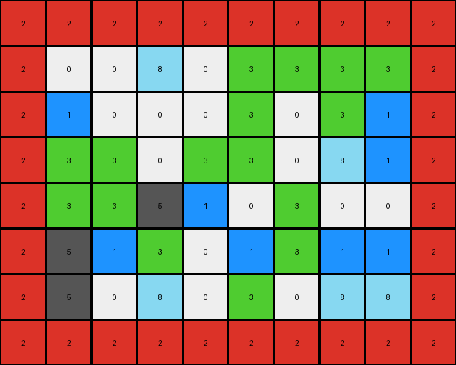

# 1c786137 • 003 • refine_dreamer

---


Previous Code:
```python
"""
1.  **Identify the Region of Interest:** Locate the rectangular region within the input grid. This rectangle is visually highlighted with a red interior and black border in the provided images.

2.  **Extract:** Create a new grid containing only the pixel values from within the rectangular region defined in the input grid.

3. **Reduce to Output:** the region of interest is the output.
"""

import numpy as np

def find_rectangle(grid, border_color=0, interior_color=2):
    """Finds the bounding box of a rectangle with a specific border and interior color."""
    rows, cols = grid.shape
    min_row, min_col = rows, cols
    max_row, max_col = -1, -1

    for r in range(rows):
        for c in range(cols):
            if grid[r, c] == interior_color:
                # Check for border
                is_bordered = False
                for dr in [-1, 0, 1]:
                    for dc in [-1, 0, 1]:
                        if (dr != 0 or dc != 0):  # Skip the center cell
                            nr, nc = r + dr, c + dc
                            if 0 <= nr < rows and 0 <= nc < cols:
                                if grid[nr, nc] == border_color:
                                    is_bordered = True
                                    break
                    if is_bordered:
                        break

                if is_bordered:
                    min_row = min(min_row, r)
                    max_row = max(max_row, r)
                    min_col = min(min_col, c)
                    max_col = max(max_col, c)

    return min_row, min_col, max_row, max_col


def transform(input_grid):
    """Transforms the input grid by extracting the region within a bordered rectangle."""
    # Find the bounding box of the rectangle.
    input_grid = np.array(input_grid)
    min_row, min_col, max_row, max_col = find_rectangle(input_grid)

    # Extract the region of interest.
    output_grid = input_grid[min_row:max_row+1, min_col:max_col+1]

    return output_grid.tolist()
```

Train Set Results:

## Example 1:**

Input:
```
3 8 8 0 3 8 8 0 8 0 3 1 1 1 8 8 0 3 8 3 8
3 3 0 0 5 3 0 3 8 0 3 3 8 1 1 8 1 3 1 8 3
1 5 1 3 1 1 8 3 0 0 3 8 3 0 1 0 8 8 5 5 0
5 3 0 8 2 2 2 2 2 2 2 2 2 2 1 1 0 3 0 0 3
0 1 3 3 2 0 0 8 0 3 3 3 3 2 0 0 8 0 3 3 1
8 0 0 8 2 1 0 0 0 3 0 3 1 2 0 0 0 8 0 1 0
1 1 5 0 2 3 3 0 3 3 0 8 1 2 1 0 8 3 1 0 0
0 0 8 8 2 3 3 5 1 0 3 0 0 2 1 0 5 0 3 0 1
0 1 0 0 2 5 1 3 0 1 3 1 1 2 8 8 0 5 0 3 8
8 3 3 3 2 5 0 8 0 3 0 8 8 2 3 3 0 0 3 3 8
1 1 1 5 2 2 2 2 2 2 2 2 2 2 0 0 8 1 3 0 0
3 3 3 0 8 8 0 8 3 0 8 8 3 0 3 0 8 1 0 1 0
8 0 0 3 3 0 8 3 0 3 3 0 1 3 3 1 8 0 0 3 8
5 1 5 1 8 3 5 0 8 3 3 8 1 8 0 0 0 3 0 0 5
1 3 1 0 1 3 1 0 5 0 3 3 8 0 8 3 8 8 8 0 0
5 3 3 3 3 8 8 0 1 1 0 8 5 1 3 0 0 8 3 1 0
3 1 3 3 8 0 3 8 0 3 1 8 3 1 8 1 1 3 8 1 0
0 3 8 3 3 0 1 3 0 3 8 5 3 0 3 1 0 3 0 0 8
3 8 3 0 1 3 8 0 1 3 8 1 0 1 1 8 5 8 3 1 1
1 5 1 3 3 1 5 3 3 1 1 3 5 0 8 8 1 1 8 0 8
1 3 0 1 3 3 1 0 0 1 5 8 3 5 3 8 0 3 8 3 8
3 1 3 0 8 0 8 0 0 1 3 1 1 0 8 8 5 1 0 1 8
3 3 1 0 3 1 8 8 0 0 5 1 8 8 1 3 3 5 3 5 8
```
Expected Output:
```
0 0 8 0 3 3 3 3
1 0 0 0 3 0 3 1
3 3 0 3 3 0 8 1
3 3 5 1 0 3 0 0
5 1 3 0 1 3 1 1
5 0 8 0 3 0 8 8
```
Transformed Output:
```
2 2 2 2 2 2 2 2 2 2
2 0 0 8 0 3 3 3 3 2
2 1 0 0 0 3 0 3 1 2
2 3 3 0 3 3 0 8 1 2
2 3 3 5 1 0 3 0 0 2
2 5 1 3 0 1 3 1 1 2
2 5 0 8 0 3 0 8 8 2
2 2 2 2 2 2 2 2 2 2
```

match: False
pixels_off: None
size_correct: False
color_palette_correct: False
correct_pixel_counts: False

## Example 2:**

Input:
```
0 6 9 6 6 0 6 3 6 9 6 6 6 9 9 0
9 9 0 6 6 0 0 9 3 6 6 6 9 9 0 6
6 0 9 0 0 6 0 6 6 0 3 0 0 6 0 0
9 6 6 9 9 9 6 3 6 9 9 6 6 3 6 6
6 6 0 0 6 6 9 0 0 3 0 0 0 0 0 9
9 9 6 0 0 9 0 0 3 9 3 0 0 0 9 0
3 6 4 4 4 4 4 6 0 0 0 9 0 0 0 9
9 0 4 3 3 0 4 0 0 6 0 0 9 6 9 3
9 0 4 9 3 9 4 9 0 0 3 9 0 0 9 3
6 9 4 6 6 0 4 3 9 6 0 6 0 9 3 0
3 3 4 9 0 0 4 9 0 6 0 0 0 6 0 0
0 0 4 6 3 9 4 6 0 9 0 9 0 0 0 0
9 9 4 4 4 4 4 9 9 0 9 9 0 0 0 6
```
Expected Output:
```
3 3 0
9 3 9
6 6 0
9 0 0
6 3 9
```
Transformed Output:
```

```

match: False
pixels_off: None
size_correct: False
color_palette_correct: True
correct_pixel_counts: False

## Example 3:**

Input:
```
2 5 0 0 3 0 0 2 0 0 0 0 0 0 3 5 3 5
2 0 0 2 0 2 2 2 2 2 2 5 3 0 3 2 0 5
0 5 5 8 8 8 8 8 8 8 8 8 8 8 8 5 0 0
2 0 2 8 0 0 5 3 3 3 2 2 5 0 8 2 5 5
5 0 3 8 3 0 0 5 5 5 5 2 0 5 8 3 3 3
0 5 5 8 3 5 0 2 0 3 0 5 3 0 8 0 2 5
5 2 2 8 3 2 5 5 0 5 3 0 5 0 8 0 0 0
0 0 0 8 5 2 5 2 5 0 2 2 2 2 8 2 0 5
5 0 5 8 0 5 2 5 0 0 0 0 3 3 8 0 0 5
3 0 0 8 2 3 2 3 0 0 5 0 5 0 8 3 2 0
3 5 0 8 3 2 5 0 5 0 0 0 5 5 8 0 0 2
3 3 0 8 8 8 8 8 8 8 8 8 8 8 8 0 2 0
5 0 0 3 0 3 3 5 2 5 0 0 0 0 0 5 0 0
2 5 2 5 2 2 0 0 0 5 2 0 2 0 3 0 3 0
0 2 2 2 2 0 0 2 0 2 3 3 2 0 2 5 2 5
3 0 0 0 0 5 3 0 0 0 2 2 5 0 2 3 2 0
0 0 2 5 0 5 0 3 0 0 0 0 2 3 3 5 2 3
```
Expected Output:
```
0 0 5 3 3 3 2 2 5 0
3 0 0 5 5 5 5 2 0 5
3 5 0 2 0 3 0 5 3 0
3 2 5 5 0 5 3 0 5 0
5 2 5 2 5 0 2 2 2 2
0 5 2 5 0 0 0 0 3 3
2 3 2 3 0 0 5 0 5 0
3 2 5 0 5 0 0 0 5 5
```
Transformed Output:
```
2 5 0 0 3 0 0 2 0 0 0 0 0 0 3 5 3 5
2 0 0 2 0 2 2 2 2 2 2 5 3 0 3 2 0 5
0 5 5 8 8 8 8 8 8 8 8 8 8 8 8 5 0 0
2 0 2 8 0 0 5 3 3 3 2 2 5 0 8 2 5 5
5 0 3 8 3 0 0 5 5 5 5 2 0 5 8 3 3 3
0 5 5 8 3 5 0 2 0 3 0 5 3 0 8 0 2 5
5 2 2 8 3 2 5 5 0 5 3 0 5 0 8 0 0 0
0 0 0 8 5 2 5 2 5 0 2 2 2 2 8 2 0 5
5 0 5 8 0 5 2 5 0 0 0 0 3 3 8 0 0 5
3 0 0 8 2 3 2 3 0 0 5 0 5 0 8 3 2 0
3 5 0 8 3 2 5 0 5 0 0 0 5 5 8 0 0 2
3 3 0 8 8 8 8 8 8 8 8 8 8 8 8 0 2 0
5 0 0 3 0 3 3 5 2 5 0 0 0 0 0 5 0 0
2 5 2 5 2 2 0 0 0 5 2 0 2 0 3 0 3 0
0 2 2 2 2 0 0 2 0 2 3 3 2 0 2 5 2 5
3 0 0 0 0 5 3 0 0 0 2 2 5 0 2 3 2 0
0 0 2 5 0 5 0 3 0 0 0 0 2 3 3 5 2 3
```

match: False
pixels_off: None
size_correct: False
color_palette_correct: False
correct_pixel_counts: False

**INSTRUCTIONS**

The code above was generated based on observations from the first training
example

we have tested the transform function on each of the task example inputs and
compared with the expected output

review each of the examples provided and the results and consider how the
natural language program should be updated to accommodate this new knowledge

respond with the following deliverables:

- general assessment of the information provided and strategy for resolving the
  errors
- gather metrics about each of the examples and results - use code_execution to
  develop accurate reports on your assumptions
- a YAML block documenting facts - Focus on identifying objects, their properties, and the actions performed on them.
- a natural language program - Be as clear and concise as possible, providing a complete description of the transformation rule.


your responses should be considered as information in a report - not a
conversation
