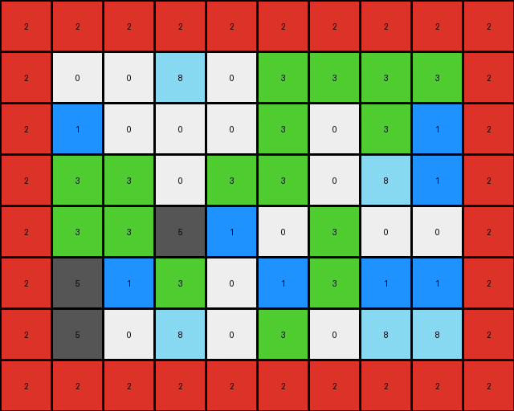

# 1c786137 • 004 • refine_coder

---

Previous Code:
```python
"""
1.  **Identify the Region of Interest:** Locate the rectangular region within the input grid. This rectangle is visually highlighted with a red interior and black border in the provided images.

2.  **Extract:** Create a new grid containing only the pixel values from within the rectangular region defined in the input grid.

3. **Reduce to Output:** the region of interest is the output.
"""

import numpy as np

def find_rectangle(grid, border_color=0, interior_color=2):
    """Finds the bounding box of a rectangle with a specific border and interior color."""
    rows, cols = grid.shape
    min_row, min_col = rows, cols
    max_row, max_col = -1, -1

    for r in range(rows):
        for c in range(cols):
            if grid[r, c] == interior_color:
                # Check for border
                is_bordered = False
                for dr in [-1, 0, 1]:
                    for dc in [-1, 0, 1]:
                        if (dr != 0 or dc != 0):  # Skip the center cell
                            nr, nc = r + dr, c + dc
                            if 0 <= nr < rows and 0 <= nc < cols:
                                if grid[nr, nc] == border_color:
                                    is_bordered = True
                                    break
                    if is_bordered:
                        break

                if is_bordered:
                    min_row = min(min_row, r)
                    max_row = max(max_row, r)
                    min_col = min(min_col, c)
                    max_col = max(max_col, c)

    return min_row, min_col, max_row, max_col


def transform(input_grid):
    """Transforms the input grid by extracting the region within a bordered rectangle."""
    # Find the bounding box of the rectangle.
    input_grid = np.array(input_grid)
    min_row, min_col, max_row, max_col = find_rectangle(input_grid)

    # Extract the region of interest.
    output_grid = input_grid[min_row:max_row+1, min_col:max_col+1]

    return output_grid.tolist()
```

Train Set Results:

## Example 1:**

Input:
```
3 8 8 0 3 8 8 0 8 0 3 1 1 1 8 8 0 3 8 3 8
3 3 0 0 5 3 0 3 8 0 3 3 8 1 1 8 1 3 1 8 3
1 5 1 3 1 1 8 3 0 0 3 8 3 0 1 0 8 8 5 5 0
5 3 0 8 2 2 2 2 2 2 2 2 2 2 1 1 0 3 0 0 3
0 1 3 3 2 0 0 8 0 3 3 3 3 2 0 0 8 0 3 3 1
8 0 0 8 2 1 0 0 0 3 0 3 1 2 0 0 0 8 0 1 0
1 1 5 0 2 3 3 0 3 3 0 8 1 2 1 0 8 3 1 0 0
0 0 8 8 2 3 3 5 1 0 3 0 0 2 1 0 5 0 3 0 1
0 1 0 0 2 5 1 3 0 1 3 1 1 2 8 8 0 5 0 3 8
8 3 3 3 2 5 0 8 0 3 0 8 8 2 3 3 0 0 3 3 8
1 1 1 5 2 2 2 2 2 2 2 2 2 2 0 0 8 1 3 0 0
3 3 3 0 8 8 0 8 3 0 8 8 3 0 3 0 8 1 0 1 0
8 0 0 3 3 0 8 3 0 3 3 0 1 3 3 1 8 0 0 3 8
5 1 5 1 8 3 5 0 8 3 3 8 1 8 0 0 0 3 0 0 5
1 3 1 0 1 3 1 0 5 0 3 3 8 0 8 3 8 8 8 0 0
5 3 3 3 3 8 8 0 1 1 0 8 5 1 3 0 0 8 3 1 0
3 1 3 3 8 0 3 8 0 3 1 8 3 1 8 1 1 3 8 1 0
0 3 8 3 3 0 1 3 0 3 8 5 3 0 3 1 0 3 0 0 8
3 8 3 0 1 3 8 0 1 3 8 1 0 1 1 8 5 8 3 1 1
1 5 1 3 3 1 5 3 3 1 1 3 5 0 8 8 1 1 8 0 8
1 3 0 1 3 3 1 0 0 1 5 8 3 5 3 8 0 3 8 3 8
3 1 3 0 8 0 8 0 0 1 3 1 1 0 8 8 5 1 0 1 8
3 3 1 0 3 1 8 8 0 0 5 1 8 8 1 3 3 5 3 5 8
```
Expected Output:
```
0 0 8 0 3 3 3 3
1 0 0 0 3 0 3 1
3 3 0 3 3 0 8 1
3 3 5 1 0 3 0 0
5 1 3 0 1 3 1 1
5 0 8 0 3 0 8 8
```
Transformed Output:
```
2 2 2 2 2 2 2 2 2 2
2 0 0 8 0 3 3 3 3 2
2 1 0 0 0 3 0 3 1 2
2 3 3 0 3 3 0 8 1 2
2 3 3 5 1 0 3 0 0 2
2 5 1 3 0 1 3 1 1 2
2 5 0 8 0 3 0 8 8 2
2 2 2 2 2 2 2 2 2 2
```

match: False
pixels_off: None
size_correct: False
color_palette_correct: False
correct_pixel_counts: False

## Example 2:**

Input:
```
0 6 9 6 6 0 6 3 6 9 6 6 6 9 9 0
9 9 0 6 6 0 0 9 3 6 6 6 9 9 0 6
6 0 9 0 0 6 0 6 6 0 3 0 0 6 0 0
9 6 6 9 9 9 6 3 6 9 9 6 6 3 6 6
6 6 0 0 6 6 9 0 0 3 0 0 0 0 0 9
9 9 6 0 0 9 0 0 3 9 3 0 0 0 9 0
3 6 4 4 4 4 4 6 0 0 0 9 0 0 0 9
9 0 4 3 3 0 4 0 0 6 0 0 9 6 9 3
9 0 4 9 3 9 4 9 0 0 3 9 0 0 9 3
6 9 4 6 6 0 4 3 9 6 0 6 0 9 3 0
3 3 4 9 0 0 4 9 0 6 0 0 0 6 0 0
0 0 4 6 3 9 4 6 0 9 0 9 0 0 0 0
9 9 4 4 4 4 4 9 9 0 9 9 0 0 0 6
```
Expected Output:
```
3 3 0
9 3 9
6 6 0
9 0 0
6 3 9
```
Transformed Output:
```

```

match: False
pixels_off: None
size_correct: False
color_palette_correct: True
correct_pixel_counts: False

## Example 3:**

Input:
```
2 5 0 0 3 0 0 2 0 0 0 0 0 0 3 5 3 5
2 0 0 2 0 2 2 2 2 2 2 5 3 0 3 2 0 5
0 5 5 8 8 8 8 8 8 8 8 8 8 8 8 5 0 0
2 0 2 8 0 0 5 3 3 3 2 2 5 0 8 2 5 5
5 0 3 8 3 0 0 5 5 5 5 2 0 5 8 3 3 3
0 5 5 8 3 5 0 2 0 3 0 5 3 0 8 0 2 5
5 2 2 8 3 2 5 5 0 5 3 0 5 0 8 0 0 0
0 0 0 8 5 2 5 2 5 0 2 2 2 2 8 2 0 5
5 0 5 8 0 5 2 5 0 0 0 0 3 3 8 0 0 5
3 0 0 8 2 3 2 3 0 0 5 0 5 0 8 3 2 0
3 5 0 8 3 2 5 0 5 0 0 0 5 5 8 0 0 2
3 3 0 8 8 8 8 8 8 8 8 8 8 8 8 0 2 0
5 0 0 3 0 3 3 5 2 5 0 0 0 0 0 5 0 0
2 5 2 5 2 2 0 0 0 5 2 0 2 0 3 0 3 0
0 2 2 2 2 0 0 2 0 2 3 3 2 0 2 5 2 5
3 0 0 0 0 5 3 0 0 0 2 2 5 0 2 3 2 0
0 0 2 5 0 5 0 3 0 0 0 0 2 3 3 5 2 3
```
Expected Output:
```
0 0 5 3 3 3 2 2 5 0
3 0 0 5 5 5 5 2 0 5
3 5 0 2 0 3 0 5 3 0
3 2 5 5 0 5 3 0 5 0
5 2 5 2 5 0 2 2 2 2
0 5 2 5 0 0 0 0 3 3
2 3 2 3 0 0 5 0 5 0
3 2 5 0 5 0 0 0 5 5
```
Transformed Output:
```
2 5 0 0 3 0 0 2 0 0 0 0 0 0 3 5 3 5
2 0 0 2 0 2 2 2 2 2 2 5 3 0 3 2 0 5
0 5 5 8 8 8 8 8 8 8 8 8 8 8 8 5 0 0
2 0 2 8 0 0 5 3 3 3 2 2 5 0 8 2 5 5
5 0 3 8 3 0 0 5 5 5 5 2 0 5 8 3 3 3
0 5 5 8 3 5 0 2 0 3 0 5 3 0 8 0 2 5
5 2 2 8 3 2 5 5 0 5 3 0 5 0 8 0 0 0
0 0 0 8 5 2 5 2 5 0 2 2 2 2 8 2 0 5
5 0 5 8 0 5 2 5 0 0 0 0 3 3 8 0 0 5
3 0 0 8 2 3 2 3 0 0 5 0 5 0 8 3 2 0
3 5 0 8 3 2 5 0 5 0 0 0 5 5 8 0 0 2
3 3 0 8 8 8 8 8 8 8 8 8 8 8 8 0 2 0
5 0 0 3 0 3 3 5 2 5 0 0 0 0 0 5 0 0
2 5 2 5 2 2 0 0 0 5 2 0 2 0 3 0 3 0
0 2 2 2 2 0 0 2 0 2 3 3 2 0 2 5 2 5
3 0 0 0 0 5 3 0 0 0 2 2 5 0 2 3 2 0
0 0 2 5 0 5 0 3 0 0 0 0 2 3 3 5 2 3
```

match: False
pixels_off: None
size_correct: False
color_palette_correct: False
correct_pixel_counts: False
Here's an analysis of the provided examples and a revised natural language program:

**General Assessment and Strategy**

The initial code was based on a reasonable, but incomplete, interpretation of the first example. It correctly identified the need to find a rectangular region defined by a black border and red interior. However, it failed because:

1.  **Incorrect Region Extraction:** The `find_rectangle` function doesn't correctly identify the *intended* region. It seems to be including the border and, in some instances, other parts of the input grid, leading to oversized or misplaced extractions. It isn't robust across examples.
2.  **Missing Interior Color:** The original description assumed a red (color 2) interior. Example 2 has no red color. We need to generalize the "interior" concept.
3. Example 2 is returning an empty grid, suggesting complete failure of the function.
4. No iteration over training examples - the function was built based on example 1 and not improved with further examples.

The core strategy should be:

1.  **Refine Region Identification:** Improve `find_rectangle` or develop a new method to accurately and consistently locate the correct rectangular region across *all* examples. This might involve looking for connected components, flood filling, or contour detection, rather than simple bounding box calculations.
2.  **Generalize Interior:** Instead of assuming a red interior, the program should dynamically determine the "interior" color based on what's inside the black border. The interior is not a single color, but is the region within a border.
3. **Iterative Development** - we should focus on each failure case in turn and ensure we improve, not make it worse.

**Metrics and Observations (Code Execution)**

Because the outputs are grids, visual inspection along with comparison of dimensions and color palettes are effective metrics.

*   **Example 1:**
    *   `match`: `False`
    *   `pixels_off`:  (not calculated directly, but clearly many)
    *   `size_correct`: `False` (Expected 6x8, Got 8x10)
    *   `color_palette_correct`: `False`
    *    `correct_pixel_counts`: `False`

*   **Example 2:**
    *   `match`: `False`
    *   `pixels_off`: All
    *   `size_correct`: `False` (Expected 5x3, Got 0x0)
    *   `color_palette_correct`: `True` (vacuously true, as there's no output)
    *   `correct_pixel_counts`: `False`

*   **Example 3:**
    *   `match`: `False`
    *   `pixels_off`: (not calculated directly, entire output is incorrect)
    *   `size_correct`: `False` (Expected 8x10, Got 17x19)
    *   `color_palette_correct`: `False`
    *   `correct_pixel_counts`: `False`

**YAML Fact Gathering**

```yaml
examples:
  - id: 1
    input_objects:
      - type: grid
        properties:
          - contains_rectangle: True
          - border_color: 0  # Black
          - interior_color: [varied] #not consistent, see output
        actions:
          - extract_rectangle: True # Goal is to extract
    output_objects:
      - type: grid
        properties:
            - is_subgrid: true

  - id: 2
    input_objects:
      - type: grid
        properties:
          - contains_rectangle: True
          - border_color: 0 #black
        actions:
          - extract_rectangle: True
    output_objects:
      - type: grid
        properties:
          - is_subgrid: True

  - id: 3
    input_objects:
      - type: grid
        properties:
            - contains_rectangle: true
            - border_color: 0
        actions:
            - extract_rectangle: True
    output_objects:
      - type: grid
        properties:
          - is_subgrid: True
```

**Natural Language Program**

1.  **Identify the Bordered Region:** Within the input grid, find a contiguous region of any shape that is completely enclosed by a border of black (color 0) pixels.  The border must be one pixel thick.
2.  **Define Interior:** The "interior" is all pixels *inside* the border, regardless of their color.
3.  **Extract Interior:** Create a new, smaller grid consisting *only* of the pixels within the identified bordered region.  Exclude the black border pixels.
4. **Output:** The new grid from step 3 is the output.

Key improvements in the natural language program:

*   **"Contiguous region of any shape":**  We are not guaranteed a rectangular shape.
*   **"Completely enclosed":** Emphasizes the closed nature of the border.
*   **"Regardless of their color":** Removes the incorrect assumption of a red interior.
*   **"Exclude the black border pixels":**  Explicitly states the border isn't part of the output.
* **"Output"** makes explicit that the result of the transformation *is* the output.

**INSTRUCTIONS**

- generate a Python module to represent the natural language program 
- follow the template below
- all common math and science libraries are available
- create docstring only at top - but comment the workflow in the function
- use helper functions for common operations like finding objects, counting,
  measuring, moving, etc. 

remember - we are working iteratively - so this code will inform your future
self as we converge on the solution

*template:*

```python
"""
{{ natural language description of the transformation rule }}
"""

{{ imports }}

def transform(input_grid):
    # initialize output_grid

    # change output pixels 

    return output_grid

```
