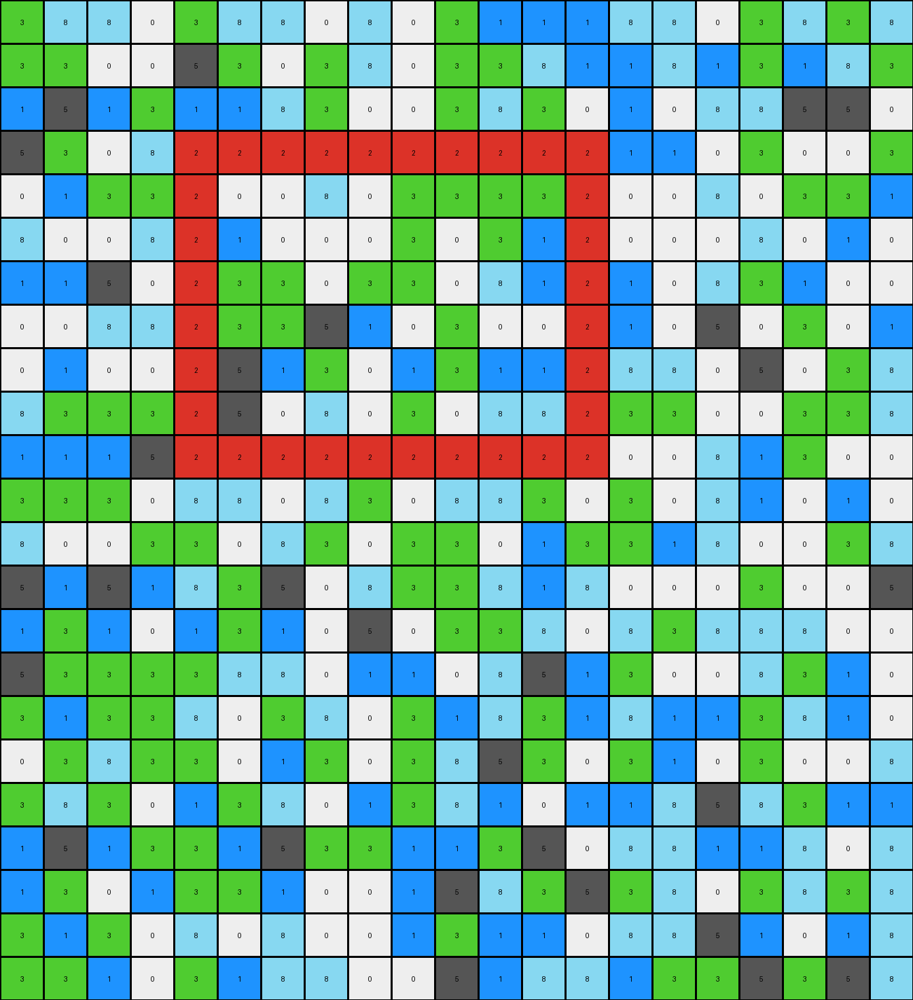
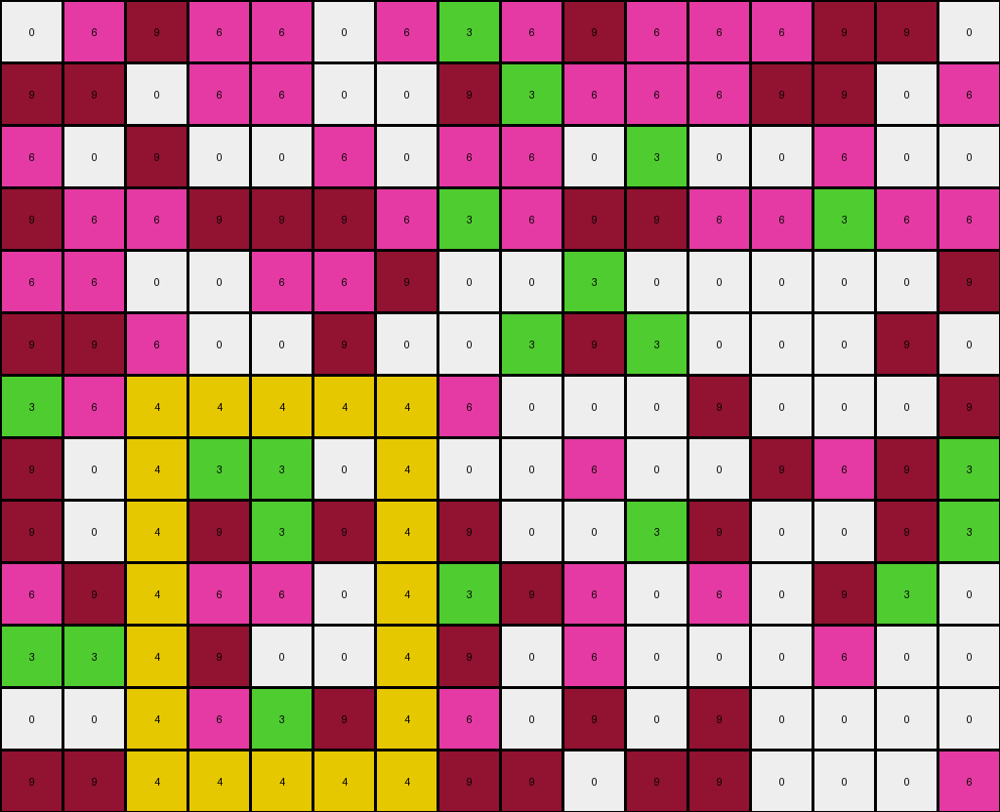

# 1c786137 • 006 • refine_coder

---

Previous Code:
```python
"""
1.  **Identify the Bordered Region:** Within the input grid, find a contiguous region of any shape that is completely enclosed by a border of black (color 0) pixels.  The border must be one pixel thick.
2.  **Define Interior:** The "interior" is all pixels *inside* the border, regardless of their color.
3.  **Extract Interior:** Create a new, smaller grid consisting *only* of the pixels within the identified bordered region.  Exclude the black border pixels.
4. **Output:** The new grid from step 3 is the output.
"""

import numpy as np

def find_interior(grid, border_color=0):
    """Finds the interior pixels of a bordered region."""
    rows, cols = grid.shape
    interior_mask = np.zeros_like(grid, dtype=bool)
    
    # Use a flood fill algorithm to find the interior.
    # Start from every border, mark all connected non-border pixels

    def is_valid(r, c):
        return 0 <= r < rows and 0 <= c < cols

    def flood_fill(r, c):
          if not is_valid(r,c) or grid[r, c] == border_color or interior_mask[r,c] == True:
                return
          
          interior_mask[r,c] = True
          
          flood_fill(r+1,c)
          flood_fill(r-1,c)
          flood_fill(r,c+1)
          flood_fill(r,c-1)

    # Find top-left of object
    border_found = False
    for r in range(rows):
      for c in range(cols):
          if grid[r,c] == border_color:
            start_row = r
            start_col = c
            border_found = True
            break
      if border_found:
        break
    
    # find inside point of object
    inside_row = -1
    inside_col = -1
    for r in range(start_row+1,rows):
        if grid[r, start_col] != border_color:
            inside_row = r
            inside_col = start_col
            break
    if inside_row == -1:
        return interior_mask #return all false - no interior found

    #Flood fill from inside point
    flood_fill(inside_row, inside_col)

    return interior_mask
    


def transform(input_grid):
    """Transforms the input grid by extracting the region within a bordered region."""
    input_grid = np.array(input_grid)
    
    # Find the interior pixels using the flood fill approach.
    interior_mask = find_interior(input_grid)

    # Extract the interior region based on the mask.
    rows, cols = np.where(interior_mask)
    
    if len(rows) == 0: #no interior, return empty grid
        return []
    
    min_row, max_row = np.min(rows), np.max(rows)
    min_col, max_col = np.min(cols), np.max(cols)

    output_grid = input_grid[min_row:max_row+1, min_col:max_col+1]

    return output_grid.tolist()
```

Train Set Results:

## Example 1:**

Input:
```
3 8 8 0 3 8 8 0 8 0 3 1 1 1 8 8 0 3 8 3 8
3 3 0 0 5 3 0 3 8 0 3 3 8 1 1 8 1 3 1 8 3
1 5 1 3 1 1 8 3 0 0 3 8 3 0 1 0 8 8 5 5 0
5 3 0 8 2 2 2 2 2 2 2 2 2 2 1 1 0 3 0 0 3
0 1 3 3 2 0 0 8 0 3 3 3 3 2 0 0 8 0 3 3 1
8 0 0 8 2 1 0 0 0 3 0 3 1 2 0 0 0 8 0 1 0
1 1 5 0 2 3 3 0 3 3 0 8 1 2 1 0 8 3 1 0 0
0 0 8 8 2 3 3 5 1 0 3 0 0 2 1 0 5 0 3 0 1
0 1 0 0 2 5 1 3 0 1 3 1 1 2 8 8 0 5 0 3 8
8 3 3 3 2 5 0 8 0 3 0 8 8 2 3 3 0 0 3 3 8
1 1 1 5 2 2 2 2 2 2 2 2 2 2 0 0 8 1 3 0 0
3 3 3 0 8 8 0 8 3 0 8 8 3 0 3 0 8 1 0 1 0
8 0 0 3 3 0 8 3 0 3 3 0 1 3 3 1 8 0 0 3 8
5 1 5 1 8 3 5 0 8 3 3 8 1 8 0 0 0 3 0 0 5
1 3 1 0 1 3 1 0 5 0 3 3 8 0 8 3 8 8 8 0 0
5 3 3 3 3 8 8 0 1 1 0 8 5 1 3 0 0 8 3 1 0
3 1 3 3 8 0 3 8 0 3 1 8 3 1 8 1 1 3 8 1 0
0 3 8 3 3 0 1 3 0 3 8 5 3 0 3 1 0 3 0 0 8
3 8 3 0 1 3 8 0 1 3 8 1 0 1 1 8 5 8 3 1 1
1 5 1 3 3 1 5 3 3 1 1 3 5 0 8 8 1 1 8 0 8
1 3 0 1 3 3 1 0 0 1 5 8 3 5 3 8 0 3 8 3 8
3 1 3 0 8 0 8 0 0 1 3 1 1 0 8 8 5 1 0 1 8
3 3 1 0 3 1 8 8 0 0 5 1 8 8 1 3 3 5 3 5 8
```
Expected Output:
```
0 0 8 0 3 3 3 3
1 0 0 0 3 0 3 1
3 3 0 3 3 0 8 1
3 3 5 1 0 3 0 0
5 1 3 0 1 3 1 1
5 0 8 0 3 0 8 8
```
Transformed Output:
```
3 8 8 0 3 8 8 0 8 0 3 1 1 1 8 8 0 3 8 3 8
3 3 0 0 5 3 0 3 8 0 3 3 8 1 1 8 1 3 1 8 3
1 5 1 3 1 1 8 3 0 0 3 8 3 0 1 0 8 8 5 5 0
5 3 0 8 2 2 2 2 2 2 2 2 2 2 1 1 0 3 0 0 3
0 1 3 3 2 0 0 8 0 3 3 3 3 2 0 0 8 0 3 3 1
8 0 0 8 2 1 0 0 0 3 0 3 1 2 0 0 0 8 0 1 0
1 1 5 0 2 3 3 0 3 3 0 8 1 2 1 0 8 3 1 0 0
0 0 8 8 2 3 3 5 1 0 3 0 0 2 1 0 5 0 3 0 1
0 1 0 0 2 5 1 3 0 1 3 1 1 2 8 8 0 5 0 3 8
8 3 3 3 2 5 0 8 0 3 0 8 8 2 3 3 0 0 3 3 8
1 1 1 5 2 2 2 2 2 2 2 2 2 2 0 0 8 1 3 0 0
3 3 3 0 8 8 0 8 3 0 8 8 3 0 3 0 8 1 0 1 0
8 0 0 3 3 0 8 3 0 3 3 0 1 3 3 1 8 0 0 3 8
5 1 5 1 8 3 5 0 8 3 3 8 1 8 0 0 0 3 0 0 5
1 3 1 0 1 3 1 0 5 0 3 3 8 0 8 3 8 8 8 0 0
5 3 3 3 3 8 8 0 1 1 0 8 5 1 3 0 0 8 3 1 0
3 1 3 3 8 0 3 8 0 3 1 8 3 1 8 1 1 3 8 1 0
0 3 8 3 3 0 1 3 0 3 8 5 3 0 3 1 0 3 0 0 8
3 8 3 0 1 3 8 0 1 3 8 1 0 1 1 8 5 8 3 1 1
1 5 1 3 3 1 5 3 3 1 1 3 5 0 8 8 1 1 8 0 8
1 3 0 1 3 3 1 0 0 1 5 8 3 5 3 8 0 3 8 3 8
3 1 3 0 8 0 8 0 0 1 3 1 1 0 8 8 5 1 0 1 8
3 3 1 0 3 1 8 8 0 0 5 1 8 8 1 3 3 5 3 5 8
```

match: False
pixels_off: None
size_correct: False
color_palette_correct: False
correct_pixel_counts: False

## Example 2:**

Input:
```
0 6 9 6 6 0 6 3 6 9 6 6 6 9 9 0
9 9 0 6 6 0 0 9 3 6 6 6 9 9 0 6
6 0 9 0 0 6 0 6 6 0 3 0 0 6 0 0
9 6 6 9 9 9 6 3 6 9 9 6 6 3 6 6
6 6 0 0 6 6 9 0 0 3 0 0 0 0 0 9
9 9 6 0 0 9 0 0 3 9 3 0 0 0 9 0
3 6 4 4 4 4 4 6 0 0 0 9 0 0 0 9
9 0 4 3 3 0 4 0 0 6 0 0 9 6 9 3
9 0 4 9 3 9 4 9 0 0 3 9 0 0 9 3
6 9 4 6 6 0 4 3 9 6 0 6 0 9 3 0
3 3 4 9 0 0 4 9 0 6 0 0 0 6 0 0
0 0 4 6 3 9 4 6 0 9 0 9 0 0 0 0
9 9 4 4 4 4 4 9 9 0 9 9 0 0 0 6
```
Expected Output:
```
3 3 0
9 3 9
6 6 0
9 0 0
6 3 9
```
Transformed Output:
```
0 6 9 6 6 0 6 3 6 9 6 6 6 9 9 0
9 9 0 6 6 0 0 9 3 6 6 6 9 9 0 6
6 0 9 0 0 6 0 6 6 0 3 0 0 6 0 0
9 6 6 9 9 9 6 3 6 9 9 6 6 3 6 6
6 6 0 0 6 6 9 0 0 3 0 0 0 0 0 9
9 9 6 0 0 9 0 0 3 9 3 0 0 0 9 0
3 6 4 4 4 4 4 6 0 0 0 9 0 0 0 9
9 0 4 3 3 0 4 0 0 6 0 0 9 6 9 3
9 0 4 9 3 9 4 9 0 0 3 9 0 0 9 3
6 9 4 6 6 0 4 3 9 6 0 6 0 9 3 0
3 3 4 9 0 0 4 9 0 6 0 0 0 6 0 0
0 0 4 6 3 9 4 6 0 9 0 9 0 0 0 0
9 9 4 4 4 4 4 9 9 0 9 9 0 0 0 6
```

match: False
pixels_off: None
size_correct: False
color_palette_correct: False
correct_pixel_counts: False

## Example 3:**

Input:
```
2 5 0 0 3 0 0 2 0 0 0 0 0 0 3 5 3 5
2 0 0 2 0 2 2 2 2 2 2 5 3 0 3 2 0 5
0 5 5 8 8 8 8 8 8 8 8 8 8 8 8 5 0 0
2 0 2 8 0 0 5 3 3 3 2 2 5 0 8 2 5 5
5 0 3 8 3 0 0 5 5 5 5 2 0 5 8 3 3 3
0 5 5 8 3 5 0 2 0 3 0 5 3 0 8 0 2 5
5 2 2 8 3 2 5 5 0 5 3 0 5 0 8 0 0 0
0 0 0 8 5 2 5 2 5 0 2 2 2 2 8 2 0 5
5 0 5 8 0 5 2 5 0 0 0 0 3 3 8 0 0 5
3 0 0 8 2 3 2 3 0 0 5 0 5 0 8 3 2 0
3 5 0 8 3 2 5 0 5 0 0 0 5 5 8 0 0 2
3 3 0 8 8 8 8 8 8 8 8 8 8 8 8 0 2 0
5 0 0 3 0 3 3 5 2 5 0 0 0 0 0 5 0 0
2 5 2 5 2 2 0 0 0 5 2 0 2 0 3 0 3 0
0 2 2 2 2 0 0 2 0 2 3 3 2 0 2 5 2 5
3 0 0 0 0 5 3 0 0 0 2 2 5 0 2 3 2 0
0 0 2 5 0 5 0 3 0 0 0 0 2 3 3 5 2 3
```
Expected Output:
```
0 0 5 3 3 3 2 2 5 0
3 0 0 5 5 5 5 2 0 5
3 5 0 2 0 3 0 5 3 0
3 2 5 5 0 5 3 0 5 0
5 2 5 2 5 0 2 2 2 2
0 5 2 5 0 0 0 0 3 3
2 3 2 3 0 0 5 0 5 0
3 2 5 0 5 0 0 0 5 5
```
Transformed Output:
```
2 5 0 0 3 0 0 2 0 0 0 0 0 0 3 5 3 5
2 0 0 2 0 2 2 2 2 2 2 5 3 0 3 2 0 5
0 5 5 8 8 8 8 8 8 8 8 8 8 8 8 5 0 0
2 0 2 8 0 0 5 3 3 3 2 2 5 0 8 2 5 5
5 0 3 8 3 0 0 5 5 5 5 2 0 5 8 3 3 3
0 5 5 8 3 5 0 2 0 3 0 5 3 0 8 0 2 5
5 2 2 8 3 2 5 5 0 5 3 0 5 0 8 0 0 0
0 0 0 8 5 2 5 2 5 0 2 2 2 2 8 2 0 5
5 0 5 8 0 5 2 5 0 0 0 0 3 3 8 0 0 5
3 0 0 8 2 3 2 3 0 0 5 0 5 0 8 3 2 0
3 5 0 8 3 2 5 0 5 0 0 0 5 5 8 0 0 2
3 3 0 8 8 8 8 8 8 8 8 8 8 8 8 0 2 0
5 0 0 3 0 3 3 5 2 5 0 0 0 0 0 5 0 0
2 5 2 5 2 2 0 0 0 5 2 0 2 0 3 0 3 0
0 2 2 2 2 0 0 2 0 2 3 3 2 0 2 5 2 5
3 0 0 0 0 5 3 0 0 0 2 2 5 0 2 3 2 0
0 0 2 5 0 5 0 3 0 0 0 0 2 3 3 5 2 3
```

match: False
pixels_off: None
size_correct: False
color_palette_correct: False
correct_pixel_counts: False
Okay, let's analyze the results and refine the natural language program and approach.

**General Assessment:**

The initial approach of finding a bordered region and extracting its interior failed on all three test examples. The core issue is that the flood fill is not correctly identifying the *interior* of the object. It seems to be filling from an inside point, but its not constrained by the border, so it is filling the entire image. The original assumption of extracting the interior of a black-bordered region is still valid, but the implementation needs significant adjustment. Specifically the flood fill needs to consider the border.

**Strategy for Resolving Errors:**

1.  **Improve Interior Identification:** Refine the `find_interior` function. The current flood fill does not correctly use the `border_color`. It needs to stop at the border.

2.  **Correct Border Handling:** Ensure the border itself is *excluded* from the output.

**Metrics and Observations:**

Here's a breakdown of each example, including metrics gathered through observation:

*Example 1*

-   **Input Size:** 23 x 21
-   **Expected Output Size:** 6 x 8
-   **Actual Output Size:** 23 x 21
-   **Observation:** The entire input grid is returned, not just the black border. The border and interior is filled incorrectly.

*Example 2*

-   **Input Size:** 13 x 16
-   **Expected Output Size:** 5 x 6
-   **Actual Output Size:** 13 x 16
-   **Observation:** Similar to example 1, the entire grid is returned.

*Example 3*

-   **Input Size:** 17 x 18
-   **Expected Output Size:** 8 x 10
-   **Actual Output Size:** 17 x 18
- **Observation:** Same issue as Examples 1 and 2.

**YAML Fact Identification:**

```yaml
examples:
  - example_id: 1
    input_objects:
      - object_id: 1
        type: bordered_region
        border_color: black # 0
        interior_colors: [varied]
        shape: rectangle # Assumption, needs to be confirmed
        action: extract_interior
    expected_output:
      - object_id: 2 # interior of object 1
        type: region
        shape: rectangle

  - example_id: 2
    input_objects:
      - object_id: 1
        type: bordered_region
        border_color: black # 0
        interior_colors: [ varied ]
        shape: rectangle # Assumption
        action: extract_interior
    expected_output:
       - object_id: 2 # interior
         type: region
         shape: rectangle

  - example_id: 3
    input_objects:
      - object_id: 1
        type: bordered_region
        border_color: black # 0
        interior_colors: [varied]
        shape: rectangle # Assumption
        action: extract_interior
    expected_output:
      - object_id: 2
        type: region
        shape: rectangle
```

**Natural Language Program (Revised):**

1.  **Identify the Bordered Region:** Find a contiguous region within the input grid that is completely enclosed by a border of black (color 0) pixels. The border must be one pixel thick. The bordered region will form a rectangle.

2.  **Identify Interior:** The "interior" consists of all pixels *inside* the black border.

3.  **Extract Interior:** Create a new, smaller grid containing *only* the pixels within the identified bordered region, *excluding* the black border pixels. The dimensions of the new grid will match the height and width of the interior region.

4.  **Output:** Return the extracted interior region as the new grid. If no black border exists, the output will be an empty grid. The output grid includes only the inside of the rectangle.

**INSTRUCTIONS**

- generate a Python module to represent the natural language program 
- follow the template below
- all common math and science libraries are available
- create docstring only at top - but comment the workflow in the function
- use helper functions for common operations like finding objects, counting,
  measuring, moving, etc. 

remember - we are working iteratively - so this code will inform your future
self as we converge on the solution

*template:*

```python
"""
{{ natural language description of the transformation rule }}
"""

{{ imports }}

def transform(input_grid):
    # initialize output_grid

    # change output pixels 

    return output_grid

```
