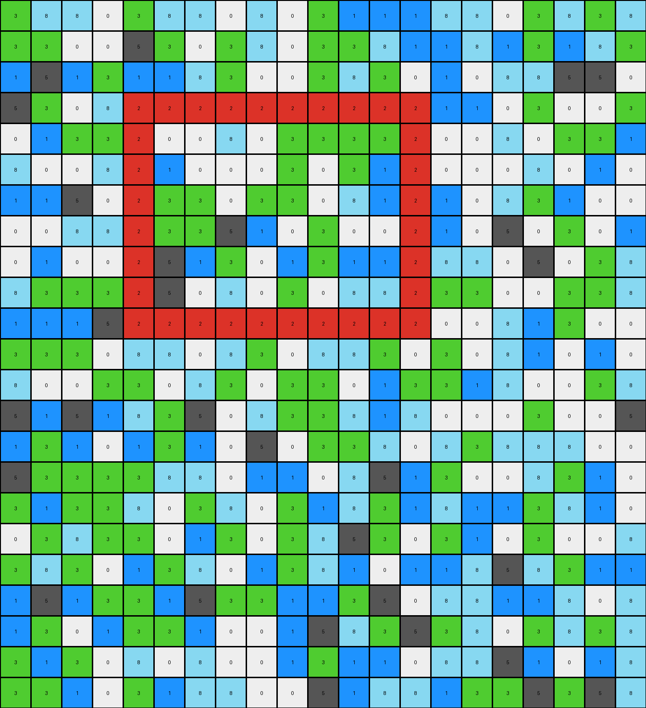

# 1c786137 • 015 • refine_dreamer

---

Previous Code:
```python
"""
1.  **Identify Objects:** Treat contiguous blocks of the same color within the input grid as individual objects.
2.  **Filter Objects:** Remove the largest object, which takes more than 25% of the image (the large azure '8' region in this example).
3.  **Create a Bounding Box:** For the remaining pixels, find a bounding box.
4. **Output the Bounding box** Construct the output grid from the bounding box.
"""

import numpy as np

def find_objects(grid):
    """
    Identifies contiguous objects in a grid.
    """
    objects = []
    visited = np.zeros_like(grid, dtype=bool)

    def dfs(r, c, color, current_object):
        if (r < 0 or r >= grid.shape[0] or c < 0 or c >= grid.shape[1] or
                visited[r, c] or grid[r, c] != color):
            return
        visited[r, c] = True
        current_object.append((r, c))
        dfs(r + 1, c, color, current_object)
        dfs(r - 1, c, color, current_object)
        dfs(r, c + 1, color, current_object)
        dfs(r, c - 1, color, current_object)

    for r in range(grid.shape[0]):
        for c in range(grid.shape[1]):
            if not visited[r, c]:
                current_object = []
                dfs(r, c, grid[r, c], current_object)
                if current_object:
                    objects.append(current_object)
    return objects

def bounding_box(points):
    """
    Finds the bounding box of a set of points.
    """
    if not points:
        return (0, 0, 0, 0)
    min_r, min_c = float('inf'), float('inf')
    max_r, max_c = float('-inf'), float('-inf')
    for r, c in points:
        min_r = min(min_r, r)
        min_c = min(min_c, c)
        max_r = max(max_r, r)
        max_c = max(max_c, c)
    return (min_r, min_c, max_r, max_c)

def transform(input_grid):
    # Identify Objects
    objects = find_objects(input_grid)

    # Filter Objects (remove largest object)
    total_pixels = input_grid.size
    largest_object = max(objects, key=len, default=[])
    if len(largest_object) / total_pixels > 0.25:
      objects.remove(largest_object)

    # Get all remaining points
    remaining_points = []
    for obj in objects:
      remaining_points.extend(obj)

    # Create Bounding Box
    min_r, min_c, max_r, max_c = bounding_box(remaining_points)


    # Initialize the output grid
    output_grid = np.zeros((max_r-min_r+1, max_c-min_c+1), dtype=int)

    # Fill output grid
    for r, c in remaining_points:
      output_grid[r-min_r, c-min_c] = input_grid[r,c]

    return output_grid
```

Train Set Results:

## Example 1:**

Input:
```
3 8 8 0 3 8 8 0 8 0 3 1 1 1 8 8 0 3 8 3 8
3 3 0 0 5 3 0 3 8 0 3 3 8 1 1 8 1 3 1 8 3
1 5 1 3 1 1 8 3 0 0 3 8 3 0 1 0 8 8 5 5 0
5 3 0 8 2 2 2 2 2 2 2 2 2 2 1 1 0 3 0 0 3
0 1 3 3 2 0 0 8 0 3 3 3 3 2 0 0 8 0 3 3 1
8 0 0 8 2 1 0 0 0 3 0 3 1 2 0 0 0 8 0 1 0
1 1 5 0 2 3 3 0 3 3 0 8 1 2 1 0 8 3 1 0 0
0 0 8 8 2 3 3 5 1 0 3 0 0 2 1 0 5 0 3 0 1
0 1 0 0 2 5 1 3 0 1 3 1 1 2 8 8 0 5 0 3 8
8 3 3 3 2 5 0 8 0 3 0 8 8 2 3 3 0 0 3 3 8
1 1 1 5 2 2 2 2 2 2 2 2 2 2 0 0 8 1 3 0 0
3 3 3 0 8 8 0 8 3 0 8 8 3 0 3 0 8 1 0 1 0
8 0 0 3 3 0 8 3 0 3 3 0 1 3 3 1 8 0 0 3 8
5 1 5 1 8 3 5 0 8 3 3 8 1 8 0 0 0 3 0 0 5
1 3 1 0 1 3 1 0 5 0 3 3 8 0 8 3 8 8 8 0 0
5 3 3 3 3 8 8 0 1 1 0 8 5 1 3 0 0 8 3 1 0
3 1 3 3 8 0 3 8 0 3 1 8 3 1 8 1 1 3 8 1 0
0 3 8 3 3 0 1 3 0 3 8 5 3 0 3 1 0 3 0 0 8
3 8 3 0 1 3 8 0 1 3 8 1 0 1 1 8 5 8 3 1 1
1 5 1 3 3 1 5 3 3 1 1 3 5 0 8 8 1 1 8 0 8
1 3 0 1 3 3 1 0 0 1 5 8 3 5 3 8 0 3 8 3 8
3 1 3 0 8 0 8 0 0 1 3 1 1 0 8 8 5 1 0 1 8
3 3 1 0 3 1 8 8 0 0 5 1 8 8 1 3 3 5 3 5 8
```
Expected Output:
```
0 0 8 0 3 3 3 3
1 0 0 0 3 0 3 1
3 3 0 3 3 0 8 1
3 3 5 1 0 3 0 0
5 1 3 0 1 3 1 1
5 0 8 0 3 0 8 8
```
Transformed Output:
```
3 8 8 0 3 8 8 0 8 0 3 1 1 1 8 8 0 3 8 3 8
3 3 0 0 5 3 0 3 8 0 3 3 8 1 1 8 1 3 1 8 3
1 5 1 3 1 1 8 3 0 0 3 8 3 0 1 0 8 8 5 5 0
5 3 0 8 2 2 2 2 2 2 2 2 2 2 1 1 0 3 0 0 3
0 1 3 3 2 0 0 8 0 3 3 3 3 2 0 0 8 0 3 3 1
8 0 0 8 2 1 0 0 0 3 0 3 1 2 0 0 0 8 0 1 0
1 1 5 0 2 3 3 0 3 3 0 8 1 2 1 0 8 3 1 0 0
0 0 8 8 2 3 3 5 1 0 3 0 0 2 1 0 5 0 3 0 1
0 1 0 0 2 5 1 3 0 1 3 1 1 2 8 8 0 5 0 3 8
8 3 3 3 2 5 0 8 0 3 0 8 8 2 3 3 0 0 3 3 8
1 1 1 5 2 2 2 2 2 2 2 2 2 2 0 0 8 1 3 0 0
3 3 3 0 8 8 0 8 3 0 8 8 3 0 3 0 8 1 0 1 0
8 0 0 3 3 0 8 3 0 3 3 0 1 3 3 1 8 0 0 3 8
5 1 5 1 8 3 5 0 8 3 3 8 1 8 0 0 0 3 0 0 5
1 3 1 0 1 3 1 0 5 0 3 3 8 0 8 3 8 8 8 0 0
5 3 3 3 3 8 8 0 1 1 0 8 5 1 3 0 0 8 3 1 0
3 1 3 3 8 0 3 8 0 3 1 8 3 1 8 1 1 3 8 1 0
0 3 8 3 3 0 1 3 0 3 8 5 3 0 3 1 0 3 0 0 8
3 8 3 0 1 3 8 0 1 3 8 1 0 1 1 8 5 8 3 1 1
1 5 1 3 3 1 5 3 3 1 1 3 5 0 8 8 1 1 8 0 8
1 3 0 1 3 3 1 0 0 1 5 8 3 5 3 8 0 3 8 3 8
3 1 3 0 8 0 8 0 0 1 3 1 1 0 8 8 5 1 0 1 8
3 3 1 0 3 1 8 8 0 0 5 1 8 8 1 3 3 5 3 5 8
```

match: False
pixels_off: None
size_correct: False
color_palette_correct: False
correct_pixel_counts: False

## Example 2:**

Input:
```
0 6 9 6 6 0 6 3 6 9 6 6 6 9 9 0
9 9 0 6 6 0 0 9 3 6 6 6 9 9 0 6
6 0 9 0 0 6 0 6 6 0 3 0 0 6 0 0
9 6 6 9 9 9 6 3 6 9 9 6 6 3 6 6
6 6 0 0 6 6 9 0 0 3 0 0 0 0 0 9
9 9 6 0 0 9 0 0 3 9 3 0 0 0 9 0
3 6 4 4 4 4 4 6 0 0 0 9 0 0 0 9
9 0 4 3 3 0 4 0 0 6 0 0 9 6 9 3
9 0 4 9 3 9 4 9 0 0 3 9 0 0 9 3
6 9 4 6 6 0 4 3 9 6 0 6 0 9 3 0
3 3 4 9 0 0 4 9 0 6 0 0 0 6 0 0
0 0 4 6 3 9 4 6 0 9 0 9 0 0 0 0
9 9 4 4 4 4 4 9 9 0 9 9 0 0 0 6
```
Expected Output:
```
3 3 0
9 3 9
6 6 0
9 0 0
6 3 9
```
Transformed Output:
```
0 6 9 6 6 0 6 3 6 9 6 6 6 9 9 0
9 9 0 6 6 0 0 9 3 6 6 6 9 9 0 6
6 0 9 0 0 6 0 6 6 0 3 0 0 6 0 0
9 6 6 9 9 9 6 3 6 9 9 6 6 3 6 6
6 6 0 0 6 6 9 0 0 3 0 0 0 0 0 9
9 9 6 0 0 9 0 0 3 9 3 0 0 0 9 0
3 6 4 4 4 4 4 6 0 0 0 9 0 0 0 9
9 0 4 3 3 0 4 0 0 6 0 0 9 6 9 3
9 0 4 9 3 9 4 9 0 0 3 9 0 0 9 3
6 9 4 6 6 0 4 3 9 6 0 6 0 9 3 0
3 3 4 9 0 0 4 9 0 6 0 0 0 6 0 0
0 0 4 6 3 9 4 6 0 9 0 9 0 0 0 0
9 9 4 4 4 4 4 9 9 0 9 9 0 0 0 6
```

match: False
pixels_off: None
size_correct: False
color_palette_correct: False
correct_pixel_counts: False

## Example 3:**

Input:
```
2 5 0 0 3 0 0 2 0 0 0 0 0 0 3 5 3 5
2 0 0 2 0 2 2 2 2 2 2 5 3 0 3 2 0 5
0 5 5 8 8 8 8 8 8 8 8 8 8 8 8 5 0 0
2 0 2 8 0 0 5 3 3 3 2 2 5 0 8 2 5 5
5 0 3 8 3 0 0 5 5 5 5 2 0 5 8 3 3 3
0 5 5 8 3 5 0 2 0 3 0 5 3 0 8 0 2 5
5 2 2 8 3 2 5 5 0 5 3 0 5 0 8 0 0 0
0 0 0 8 5 2 5 2 5 0 2 2 2 2 8 2 0 5
5 0 5 8 0 5 2 5 0 0 0 0 3 3 8 0 0 5
3 0 0 8 2 3 2 3 0 0 5 0 5 0 8 3 2 0
3 5 0 8 3 2 5 0 5 0 0 0 5 5 8 0 0 2
3 3 0 8 8 8 8 8 8 8 8 8 8 8 8 0 2 0
5 0 0 3 0 3 3 5 2 5 0 0 0 0 0 5 0 0
2 5 2 5 2 2 0 0 0 5 2 0 2 0 3 0 3 0
0 2 2 2 2 0 0 2 0 2 3 3 2 0 2 5 2 5
3 0 0 0 0 5 3 0 0 0 2 2 5 0 2 3 2 0
0 0 2 5 0 5 0 3 0 0 0 0 2 3 3 5 2 3
```
Expected Output:
```
0 0 5 3 3 3 2 2 5 0
3 0 0 5 5 5 5 2 0 5
3 5 0 2 0 3 0 5 3 0
3 2 5 5 0 5 3 0 5 0
5 2 5 2 5 0 2 2 2 2
0 5 2 5 0 0 0 0 3 3
2 3 2 3 0 0 5 0 5 0
3 2 5 0 5 0 0 0 5 5
```
Transformed Output:
```
2 5 0 0 3 0 0 2 0 0 0 0 0 0 3 5 3 5
2 0 0 2 0 2 2 2 2 2 2 5 3 0 3 2 0 5
0 5 5 8 8 8 8 8 8 8 8 8 8 8 8 5 0 0
2 0 2 8 0 0 5 3 3 3 2 2 5 0 8 2 5 5
5 0 3 8 3 0 0 5 5 5 5 2 0 5 8 3 3 3
0 5 5 8 3 5 0 2 0 3 0 5 3 0 8 0 2 5
5 2 2 8 3 2 5 5 0 5 3 0 5 0 8 0 0 0
0 0 0 8 5 2 5 2 5 0 2 2 2 2 8 2 0 5
5 0 5 8 0 5 2 5 0 0 0 0 3 3 8 0 0 5
3 0 0 8 2 3 2 3 0 0 5 0 5 0 8 3 2 0
3 5 0 8 3 2 5 0 5 0 0 0 5 5 8 0 0 2
3 3 0 8 8 8 8 8 8 8 8 8 8 8 8 0 2 0
5 0 0 3 0 3 3 5 2 5 0 0 0 0 0 5 0 0
2 5 2 5 2 2 0 0 0 5 2 0 2 0 3 0 3 0
0 2 2 2 2 0 0 2 0 2 3 3 2 0 2 5 2 5
3 0 0 0 0 5 3 0 0 0 2 2 5 0 2 3 2 0
0 0 2 5 0 5 0 3 0 0 0 0 2 3 3 5 2 3
```

match: False
pixels_off: None
size_correct: False
color_palette_correct: False
correct_pixel_counts: False
**INSTRUCTIONS**

The code above was generated based on observations from the first training
example

we have tested the transform function on each of the task example inputs and
compared with the expected output

review each of the examples provided and the results and consider how the
natural language program should be updated to accommodate this new knowledge

respond with the following deliverables:

- general assessment of the information provided and strategy for resolving the
  errors
- gather metrics about each of the examples and results - use code_execution to
  develop accurate reports on your assumptions
- a YAML block documenting facts - Focus on identifying objects, their properties, and the actions performed on them.
- a natural language program - Be as clear and concise as possible, providing a complete description of the transformation rule.


your responses should be considered as information in a report - not a
conversation
