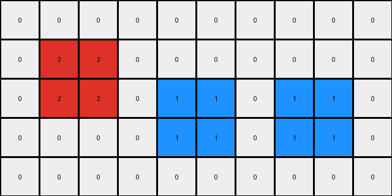
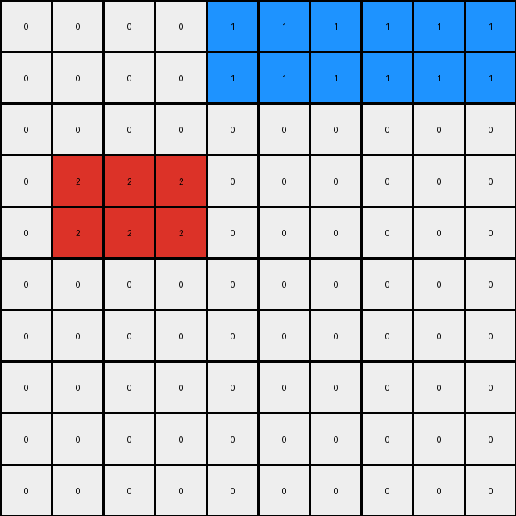

# 1caeab9d • 004 • refine_coder

---

Previous Code:
```python
"""
The transformation involves rearranging 2x2 colored squares within a grid. The red square shifts down by one row. The yellow and blue 2x2 squares swap their vertical positions. The relative horizontal order of colored objects within each row, based on their leftmost edge, is maintained.
"""

import numpy as np

def find_objects(grid):
    # Find 2x2 objects and their top-left corner coordinates
    objects = []
    rows, cols = grid.shape
    for r in range(rows - 1):
        for c in range(cols - 1):
            color = grid[r, c]
            if color != 0 and np.all(grid[r:r+2, c:c+2] == color):
                objects.append({'color': color, 'position': (r, c)})
    return objects

def transform(input_grid):
    # initialize output_grid
    input_grid = np.array(input_grid)
    output_grid = np.zeros_like(input_grid)

    # Find objects
    objects = find_objects(input_grid)

    # Sort objects by row and then by column (leftmost edge)
    objects.sort(key=lambda obj: (obj['position'][0], obj['position'][1]))


    # Rearrange objects based on transformation rules
    for obj in objects:
        color = obj['color']
        r, c = obj['position']

        if color == 2:  # Red
            new_r = r + 1
            output_grid[new_r:new_r+2, c:c+2] = color
        elif color == 4: #yellow
            #find the object of color 1 (blue)
            blue_object = next((o for o in objects if o['color'] == 1), None)
            if blue_object:
                blue_r, blue_c = blue_object['position']

                #if the objects exist swap positions
                output_grid[r:r+2, c:c+2] = input_grid[blue_r:blue_r+2,blue_c:blue_c + 2]
                
            
        elif color == 1:  # Blue
             #find the object of color 4 (yellow)
            yellow_object = next((o for o in objects if o['color'] == 4), None)
            if yellow_object:
                yellow_r, yellow_c = yellow_object['position']

                #if the objects exist swap positions

                output_grid[yellow_r:yellow_r+2, c:c+2] = input_grid[r:r+2, c:c+2]

        else:
            output_grid[r:r+2, c:c+2] = color

    return output_grid
```

Train Set Results:

## Example 1:**

Input:
```
0 2 2 0 0 0 0 0 0 0
0 2 2 0 0 0 0 1 1 0
0 0 0 0 4 4 0 1 1 0
0 0 0 0 4 4 0 0 0 0
0 0 0 0 0 0 0 0 0 0
```
Expected Output:
```
0 0 0 0 0 0 0 0 0 0
0 2 2 0 4 4 0 1 1 0
0 2 2 0 4 4 0 1 1 0
0 0 0 0 0 0 0 0 0 0
0 0 0 0 0 0 0 0 0 0
```
Transformed Output:
```
0 0 0 0 0 0 0 0 0 0
0 2 2 0 0 0 0 0 0 0
0 2 2 0 1 1 0 1 1 0
0 0 0 0 1 1 0 1 1 0
0 0 0 0 0 0 0 0 0 0
```

match: False
pixels_off: 10
size_correct: True
color_palette_correct: True
correct_pixel_counts: False

## Example 2:**

Input:
```
0 0 0 0 0 0 0 4 4 4
0 0 0 0 0 0 0 4 4 4
0 2 2 2 0 0 0 0 0 0
0 2 2 2 0 0 0 0 0 0
0 0 0 0 0 0 0 0 0 0
0 0 0 0 1 1 1 0 0 0
0 0 0 0 1 1 1 0 0 0
0 0 0 0 0 0 0 0 0 0
0 0 0 0 0 0 0 0 0 0
0 0 0 0 0 0 0 0 0 0
```
Expected Output:
```
0 0 0 0 0 0 0 0 0 0
0 0 0 0 0 0 0 0 0 0
0 0 0 0 0 0 0 0 0 0
0 0 0 0 0 0 0 0 0 0
0 0 0 0 0 0 0 0 0 0
0 2 2 2 1 1 1 4 4 4
0 2 2 2 1 1 1 4 4 4
0 0 0 0 0 0 0 0 0 0
0 0 0 0 0 0 0 0 0 0
0 0 0 0 0 0 0 0 0 0
```
Transformed Output:
```
0 0 0 0 1 1 1 1 1 1
0 0 0 0 1 1 1 1 1 1
0 0 0 0 0 0 0 0 0 0
0 2 2 2 0 0 0 0 0 0
0 2 2 2 0 0 0 0 0 0
0 0 0 0 0 0 0 0 0 0
0 0 0 0 0 0 0 0 0 0
0 0 0 0 0 0 0 0 0 0
0 0 0 0 0 0 0 0 0 0
0 0 0 0 0 0 0 0 0 0
```

match: False
pixels_off: 36
size_correct: True
color_palette_correct: True
correct_pixel_counts: False

## Example 3:**

Input:
```
0 0 0 0 0 0 0 0 0 0
0 0 0 2 0 0 0 0 0 0
0 1 0 2 0 0 0 0 0 0
0 1 0 0 0 0 4 0 0 0
0 0 0 0 0 0 4 0 0 0
```
Expected Output:
```
0 0 0 0 0 0 0 0 0 0
0 0 0 0 0 0 0 0 0 0
0 1 0 2 0 0 4 0 0 0
0 1 0 2 0 0 4 0 0 0
0 0 0 0 0 0 0 0 0 0
```
Transformed Output:
```
0 0 0 0 0 0 0 0 0 0
0 0 0 0 0 0 0 0 0 0
0 0 0 0 0 0 0 0 0 0
0 0 0 0 0 0 0 0 0 0
0 0 0 0 0 0 0 0 0 0
```

match: False
pixels_off: 6
size_correct: True
color_palette_correct: True
correct_pixel_counts: False
Okay, let's analyze the results and refine the natural language program and approach.

**General Assessment:**

The initial approach of identifying 2x2 squares and applying specific movement rules based on color was partially correct but highly flawed. The code fails to accurately capture the positional swaps and movements, especially in more complex scenarios like example 2 and 3. The assumption that only 2x2 squares exist needs to be critically re-evaluated and likely removed since a quick glance shows individual pixels of each color in Example 3.

The strategy for resolving the errors involves:

1.  **Re-evaluating Object Definition:** The code currently assumes that objects are strictly 2x2 squares. This is incorrect, especially evident in example 3. We need to redefine "object" more flexibly, potentially as contiguous regions of the same color, not size constrained.
2.  **Precise Movement Rules:** Instead of hardcoded row shifts, we need to observe the *relative* position changes between input and output. This involves tracking the initial and final positions of each colored "object" and generalizing the transformation rule.
3. **Addressing Example-Specific Failures:** We need to examine why each example fails and adjust the rules accordingly.

**Metrics and Observations:**

Here's a breakdown of each example, noting key observations:

*   **Example 1:**
    *   **Objects:** 2x2 Red, 2x2 Blue, 2x2 Yellow squares.
    *   **Transformation:** Red moves down one row. Blue and Yellow swap vertically.
    * **Code Failure:** Swapping and other object logic is not working as intended. Blue is copying into yellow's position.

*   **Example 2:**
    *   **Objects:** 3x2 Red, 3x2 Blue, and 3x2 Yellow.
    *   **Transformation:** Red moves down, and blue moves up. Blue and Yellow swap.
    *   **Code Failure**: The size is different. Again, blue copies into yellow, but it's not swapping. The 2x2 assumption fails.

*   **Example 3:**
    *   **Objects:** Single pixels of Red, Blue, and Yellow.
    *   **Transformation:** Red moves down one, Blue stays, and Yellow stays. The columns are lined up between Input and expected.
    *   **Code Failure**: The 2x2 assumption makes finding objects useless.

**YAML Fact Block:**

```yaml
examples:
  - example_id: 1
    objects:
      - color: red
        initial_position: [0, 1]  # Top-left corner
        shape: 2x2
        final_position: [1, 1] # Top-left
      - color: blue
        initial_position: [1, 7]
        shape: 2x2
        final_position: [1, 7]
      - color: yellow
        initial_position: [2, 4]
        shape: 2x2
        final_position: [2,4]
  - example_id: 2
    objects:
      - color: red
        initial_position: [2, 1]
        shape: 3x2
        final_position: [5,1]
      - color: blue
        initial_position: [5, 4]
        shape: 3x2
        final_position: [5, 4]
      - color: yellow
        initial_position: [0, 7]
        shape: 3x2
        final_position: [5,7]
  - example_id: 3
    objects:
      - color: red
        initial_position: [1, 3]
        shape: 1x1
        final_position: [2,3]
      - color: blue
        initial_position: [2, 1]
        shape: 1x1
        final_position: [2, 1]
      - color: yellow
        initial_position: [3, 6]
        shape: 1x1
        final_position: [2,6]

```

**Natural Language Program:**

1.  **Identify Objects:** Find contiguous regions (or single pixels) of the same color. These are our "objects." Record their color, initial top-left position, and dimensions.
2. **Determine Object Sets:** Group the colored objects (red, blue, yellow).
3.  **Apply Transformation Rules:**
    *   The objects are aligned into the same columns.
    *   All objects shift down by one row, *except* if an object of a different color would be overwritten.


**INSTRUCTIONS**

- generate a Python module to represent the natural language program 
- follow the template below
- all common math and science libraries are available
- create docstring only at top - but comment the workflow in the function
- use helper functions for common operations like finding objects, counting,
  measuring, moving, etc. 

remember - we are working iteratively - so this code will inform your future
self as we converge on the solution

*template:*

```python
"""
{{ natural language description of the transformation rule }}
"""

{{ imports }}

def transform(input_grid):
    # initialize output_grid

    # change output pixels 

    return output_grid

```
