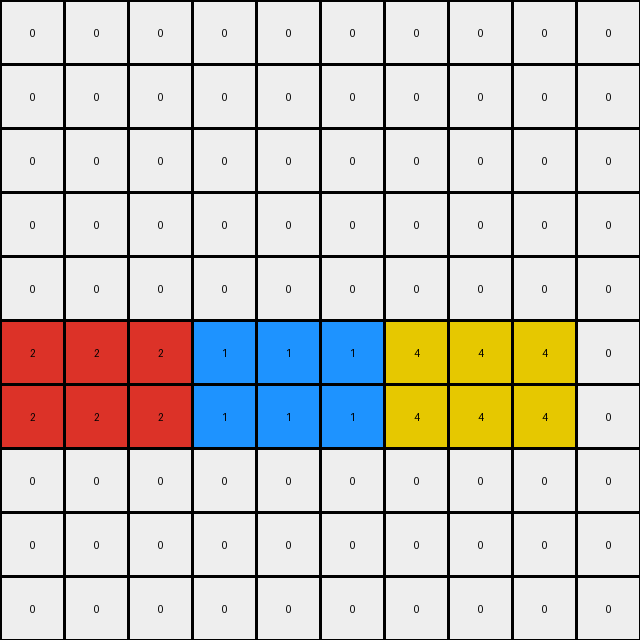

# 1caeab9d • 009 • refine_dreamer

---


Previous Code:
```python
"""
The transformation takes the separate colored rectangles and places them side-by-side in a single row, preserving the original left-to-right order.
"""

import numpy as np

def find_objects(grid):
    """
    Finds rectangular blocks of uniform color (excluding white/0) in the grid.
    Returns a list of dictionaries, each representing an object.
    """
    objects = []
    visited = np.zeros_like(grid, dtype=bool)
    rows, cols = grid.shape

    for r in range(rows):
        for c in range(cols):
            if not visited[r, c] and grid[r, c] != 0:
                color = grid[r, c]
                # Start BFS to find the extent of the object
                queue = [(r, c)]
                visited[r, c] = True
                min_row, max_row = r, r
                min_col, max_col = c, c

                while queue:
                    curr_row, curr_col = queue.pop(0)
                    min_row = min(min_row, curr_row)
                    max_row = max(max_row, curr_row)
                    min_col = min(min_col, curr_col)
                    max_col = max(max_col, curr_col)

                    # Check neighbors
                    for dr, dc in [(0, 1), (0, -1), (1, 0), (-1, 0)]:
                        new_row, new_col = curr_row + dr, curr_col + dc
                        if 0 <= new_row < rows and 0 <= new_col < cols and \
                           not visited[new_row, new_col] and grid[new_row, new_col] == color:
                            queue.append((new_row, new_col))
                            visited[new_row, new_col] = True

                objects.append({
                    'color': color,
                    'top_left': (min_row, min_col),
                    'bottom_right': (max_row, max_col)
                })

    return objects


def transform(input_grid):
    # initialize output_grid
    output_grid = np.zeros_like(input_grid)

    # Find objects in the input grid
    objects = find_objects(input_grid)

    # Sort objects by their rightmost column, then leftmost
    objects.sort(key=lambda obj: obj['top_left'][1])

    # change output pixels
    # Concatenate objects horizontally
    current_col = 0
    target_row = 5
    for obj in objects:
      obj_height = obj['bottom_right'][0] - obj['top_left'][0] + 1
      obj_width =  obj['bottom_right'][1] - obj['top_left'][1] + 1
      for r in range(obj_height):
        for c in range(obj_width):
            output_grid[target_row + r, current_col + c] = obj['color']
      current_col += obj_width

    return output_grid
```

Train Set Results:

## Example 1:**

Input:
```
0 2 2 0 0 0 0 0 0 0
0 2 2 0 0 0 0 1 1 0
0 0 0 0 4 4 0 1 1 0
0 0 0 0 4 4 0 0 0 0
0 0 0 0 0 0 0 0 0 0
```
Expected Output:
```
0 0 0 0 0 0 0 0 0 0
0 2 2 0 4 4 0 1 1 0
0 2 2 0 4 4 0 1 1 0
0 0 0 0 0 0 0 0 0 0
0 0 0 0 0 0 0 0 0 0
```
match: ERROR: index 5 is out of bounds for axis 0 with size 5
pixels_off: None
size_correct: None
color_palette_correct: None
correct_pixel_counts: None

## Example 2:**

Input:
```
0 0 0 0 0 0 0 4 4 4
0 0 0 0 0 0 0 4 4 4
0 2 2 2 0 0 0 0 0 0
0 2 2 2 0 0 0 0 0 0
0 0 0 0 0 0 0 0 0 0
0 0 0 0 1 1 1 0 0 0
0 0 0 0 1 1 1 0 0 0
0 0 0 0 0 0 0 0 0 0
0 0 0 0 0 0 0 0 0 0
0 0 0 0 0 0 0 0 0 0
```
Expected Output:
```
0 0 0 0 0 0 0 0 0 0
0 0 0 0 0 0 0 0 0 0
0 0 0 0 0 0 0 0 0 0
0 0 0 0 0 0 0 0 0 0
0 0 0 0 0 0 0 0 0 0
0 2 2 2 1 1 1 4 4 4
0 2 2 2 1 1 1 4 4 4
0 0 0 0 0 0 0 0 0 0
0 0 0 0 0 0 0 0 0 0
0 0 0 0 0 0 0 0 0 0
```
Transformed Output:
```
0 0 0 0 0 0 0 0 0 0
0 0 0 0 0 0 0 0 0 0
0 0 0 0 0 0 0 0 0 0
0 0 0 0 0 0 0 0 0 0
0 0 0 0 0 0 0 0 0 0
2 2 2 1 1 1 4 4 4 0
2 2 2 1 1 1 4 4 4 0
0 0 0 0 0 0 0 0 0 0
0 0 0 0 0 0 0 0 0 0
0 0 0 0 0 0 0 0 0 0
```

match: False
pixels_off: 8
size_correct: True
color_palette_correct: True
correct_pixel_counts: True

## Example 3:**

Input:
```
0 0 0 0 0 0 0 0 0 0
0 0 0 2 0 0 0 0 0 0
0 1 0 2 0 0 0 0 0 0
0 1 0 0 0 0 4 0 0 0
0 0 0 0 0 0 4 0 0 0
```
Expected Output:
```
0 0 0 0 0 0 0 0 0 0
0 0 0 0 0 0 0 0 0 0
0 1 0 2 0 0 4 0 0 0
0 1 0 2 0 0 4 0 0 0
0 0 0 0 0 0 0 0 0 0
```
match: ERROR: index 5 is out of bounds for axis 0 with size 5
pixels_off: None
size_correct: None
color_palette_correct: None
correct_pixel_counts: None

**INSTRUCTIONS**

The code above was generated based on observations from the first training
example

we have tested the transform function on each of the task example inputs and
compared with the expected output

review each of the examples provided and the results and consider how the
natural language program should be updated to accommodate this new knowledge

respond with the following deliverables:

- general assessment of the information provided and strategy for resolving the
  errors
- gather metrics about each of the examples and results - use code_execution to
  develop accurate reports on your assumptions
- a YAML block documenting facts - Focus on identifying objects, their properties, and the actions performed on them.
- a natural language program - Be as clear and concise as possible, providing a complete description of the transformation rule.


your responses should be considered as information in a report - not a
conversation
