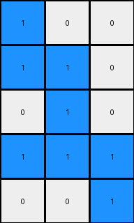

# 1cf80156 • 009 • refine_dreamer

---

Previous Code:
```python
"""
1.  **Isolate the Shape:** Identify the single connected component of blue (1) pixels within the input grid. This constitutes the "shape".
2.  **Bounding Box:** Determine the smallest rectangular bounding box that completely encloses the shape.
3.  **Crop:** Extract the portion of the grid within the bounding box, removing all surrounding rows and columns containing only white (0) pixels.
4.  **Orientation?**: a transformation is performed, best described as selecting a minimal set of rows and columns that fully enclose the extracted shape.
"""

import numpy as np

def get_bounding_box(grid, color):
    rows, cols = np.where(grid == color)
    if len(rows) == 0:  # Handle the case where the color is not found
        return None
    min_row, max_row = np.min(rows), np.max(rows)
    min_col, max_col = np.min(cols), np.max(cols)
    return min_row, max_row, min_col, max_col

def transform(input_grid):
    # Convert input to numpy array
    input_grid = np.array(input_grid)

    # 1. Isolate the Shape (blue pixels = 1)
    shape_pixels = (input_grid == 1)

    # 2. Bounding Box
    bounding_box = get_bounding_box(input_grid, 1)
    if bounding_box is None:
       return [] # Return empty output in case of no shape

    min_row, max_row, min_col, max_col = bounding_box

    # 3. Crop
    cropped_shape = input_grid[min_row:max_row+1, min_col:max_col+1]

    # 4. Orientation (find minimal rows and cols)
    rows_with_shape = np.any(cropped_shape == 1, axis=1)
    cols_with_shape = np.any(cropped_shape == 1, axis=0)

    output_grid = cropped_shape[rows_with_shape, :]
    output_grid = output_grid[:, cols_with_shape]
    

    return output_grid.tolist()
```

Train Set Results:

## Example 1:**

Input:
```
0 0 0 0 0 0 0 0 0 0 0 0
0 0 0 0 0 0 0 0 0 0 0 0
0 0 0 0 2 2 2 0 0 0 0 0
0 0 0 0 0 2 0 0 0 0 0 0
0 0 0 2 2 2 0 0 0 0 0 0
0 0 0 2 0 2 0 0 0 0 0 0
0 0 0 0 0 0 0 0 0 0 0 0
0 0 0 0 0 0 0 0 0 0 0 0
0 0 0 0 0 0 0 0 0 0 0 0
0 0 0 0 0 0 0 0 0 0 0 0
```
Expected Output:
```
0 2 2 2
0 0 2 0
2 2 2 0
2 0 2 0
```
Transformed Output:
```

```

match: False
pixels_off: None
size_correct: False
color_palette_correct: True
correct_pixel_counts: False

## Example 2:**

Input:
```
0 0 0 0 0 0 0 0 0 0 0 0
0 0 1 0 0 0 0 0 0 0 0 0
0 0 1 1 0 0 0 0 0 0 0 0
0 0 0 1 0 0 0 0 0 0 0 0
0 0 1 1 1 0 0 0 0 0 0 0
0 0 0 0 1 0 0 0 0 0 0 0
0 0 0 0 0 0 0 0 0 0 0 0
0 0 0 0 0 0 0 0 0 0 0 0
0 0 0 0 0 0 0 0 0 0 0 0
0 0 0 0 0 0 0 0 0 0 0 0
0 0 0 0 0 0 0 0 0 0 0 0
```
Expected Output:
```
1 0 0
1 1 0
0 1 0
1 1 1
0 0 1
```
Transformed Output:
```
1 0 0
1 1 0
0 1 0
1 1 1
0 0 1
```

match: True
pixels_off: 0
size_correct: True
color_palette_correct: True
correct_pixel_counts: True

## Example 3:**

Input:
```
0 0 0 0 0 0 0 0 0 0 0 0
0 0 0 0 0 0 0 0 0 0 0 0
0 0 0 0 0 0 0 0 0 0 0 0
0 0 0 0 8 0 8 0 0 0 0 0
0 0 0 8 8 8 8 0 0 0 0 0
0 0 0 0 0 0 8 8 0 0 0 0
0 0 0 0 0 0 0 0 0 0 0 0
0 0 0 0 0 0 0 0 0 0 0 0
0 0 0 0 0 0 0 0 0 0 0 0
0 0 0 0 0 0 0 0 0 0 0 0
0 0 0 0 0 0 0 0 0 0 0 0
0 0 0 0 0 0 0 0 0 0 0 0
```
Expected Output:
```
0 8 0 8 0
8 8 8 8 0
0 0 0 8 8
```
Transformed Output:
```

```

match: False
pixels_off: None
size_correct: False
color_palette_correct: True
correct_pixel_counts: False
**INSTRUCTIONS**

The code above was generated based on observations from the first training
example

we have tested the transform function on each of the task example inputs and
compared with the expected output

review each of the examples provided and the results and consider how the
natural language program should be updated to accommodate this new knowledge

respond with the following deliverables:

- general assessment of the information provided and strategy for resolving the
  errors
- gather metrics about each of the examples and results - use code_execution to
  develop accurate reports on your assumptions
- a YAML block documenting facts - Focus on identifying objects, their properties, and the actions performed on them.
- a natural language program - Be as clear and concise as possible, providing a complete description of the transformation rule.


your responses should be considered as information in a report - not a
conversation
