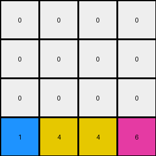

# 1e0a9b12 • 004 • refine_dreamer

---

Previous Code:
```python
import numpy as np

def analyze_results(input_grid, expected_output, actual_output):
    """Analyzes the results and provides metrics."""

    metrics = {
        "pixels_off": [],
        "size_correct": None,
        "color_palette_correct": None,
        "correct_pixel_counts": None,
    }
    
    if actual_output.shape != expected_output.shape:
        print("shapes do not match")
    else:
    # Pixel-wise comparison
      pixels_off = []
      for r in range(expected_output.shape[0]):
          for c in range(expected_output.shape[1]):
              if expected_output[r, c] != actual_output[r, c]:
                  pixels_off.append(((r, c), expected_output[r, c], actual_output[r, c]))
      metrics["pixels_off"] = pixels_off

    # Size comparison
    metrics["size_correct"] = actual_output.shape == expected_output.shape

    # Color palette comparison (check if all values are within 0-9)
    unique_values_actual = np.unique(actual_output)
    unique_values_expected = np.unique(expected_output)
    
    metrics["color_palette_correct"] = (np.all(unique_values_actual <= 9) and np.all(unique_values_actual >= 0) and
                                        np.all(unique_values_expected <= 9) and np.all(unique_values_expected >= 0))


    # Correct pixel counts (compare counts of each color)
    actual_counts = {}
    expected_counts = {}

    for i in range(10):
      actual_counts[i] = np.count_nonzero(actual_output == i)
      expected_counts[i] = np.count_nonzero(expected_output == i)
    metrics["correct_pixel_counts"] = actual_counts == expected_counts
    
    return metrics

def transform(input_grid):
    """Transforms the input grid by moving all non-zero elements to the bottom row,
    preserving their order from left to right and top to bottom.
    """
    rows, cols = input_grid.shape
    output_grid = np.zeros_like(input_grid)

    # 1. Identify and Collect non-zero pixels with their coordinates
    non_zero_pixels = []
    for r in range(rows):
        for c in range(cols):
            if input_grid[r, c] != 0:
                non_zero_pixels.append(((r, c), input_grid[r, c]))

    # 2. Sort non-zero pixels by column, then by row
    non_zero_pixels.sort(key=lambda x: (x[0][1], x[0][0]))

    # 3. Place sorted pixels in the last row of the output grid
    last_row_index = 0
    for _, value in non_zero_pixels:
        if last_row_index < cols:
          output_grid[rows - 1, last_row_index] = value
          last_row_index += 1
        else:
          print("index error")
          break

    return output_grid

# Example data (replace with your actual data)
examples = [
    (
        np.array([[0, 4, 0, 9], [0, 0, 0, 0], [0, 4, 6, 0], [1, 0, 0, 0]]),
        np.array([[0, 0, 0, 0], [0, 0, 0, 0], [0, 0, 0, 0], [1, 4, 6, 9]]),
    ),
    (
        np.array([[0, 0, 0, 0, 0, 9], [0, 0, 0, 8, 0, 0], [0, 0, 0, 0, 0, 0], [4, 0, 0, 0, 0, 0], [4, 0, 7, 8, 0, 0], [4, 0, 7, 0, 0, 0]]),
        np.array([[0, 0, 0, 0, 0, 0], [0, 0, 0, 0, 0, 0], [0, 0, 0, 0, 0, 0], [0, 0, 0, 0, 0, 0], [4, 0, 0, 0, 0, 0], [4, 4, 7, 8, 7, 9]]),
    ),
    (
        np.array([[0, 0, 0, 1, 0], [0, 3, 0, 0, 0], [0, 3, 0, 1, 2], [6, 0, 0, 0, 0], [0, 3, 0, 0, 0]]),
        np.array([[0, 0, 0, 0, 0], [0, 0, 0, 0, 0], [0, 0, 0, 0, 0], [0, 0, 0, 0, 0], [6, 3, 3, 1, 1]]),
    ),
]

for i, (input_grid, expected_output) in enumerate(examples):
    actual_output = transform(input_grid)
    metrics = analyze_results(input_grid, expected_output, actual_output)
    print(f"Example {i+1}:")
    print(f"  Input:\n{input_grid}")
    print(f"  Expected Output:\n{expected_output}")
    print(f"  Actual Output:\n{actual_output}")
    print(f"  Metrics: {metrics}")

```

Train Set Results:

## Example 1:**

Input:
```
0 4 0 9
0 0 0 0
0 4 6 0
1 0 0 0
```
Expected Output:
```
0 0 0 0
0 0 0 0
0 4 0 0
1 4 6 9
```
Transformed Output:
```
0 0 0 0
0 0 0 0
0 0 0 0
1 4 4 6
```

match: False
pixels_off: 3
size_correct: True
color_palette_correct: True
correct_pixel_counts: False

## Example 2:**

Input:
```
0 0 0 0 0 9
0 0 0 8 0 0
0 0 0 0 0 0
4 0 0 0 0 0
4 0 7 8 0 0
4 0 7 0 0 0
```
Expected Output:
```
0 0 0 0 0 0
0 0 0 0 0 0
0 0 0 0 0 0
4 0 0 0 0 0
4 0 7 8 0 0
4 0 7 8 0 9
```
Transformed Output:
```
0 0 0 0 0 0
0 0 0 0 0 0
0 0 0 0 0 0
0 0 0 0 0 0
0 0 0 0 0 0
4 4 4 7 7 8
```

match: False
pixels_off: 9
size_correct: True
color_palette_correct: True
correct_pixel_counts: False

## Example 3:**

Input:
```
0 0 0 1 0
0 3 0 0 0
0 3 0 1 2
6 0 0 0 0
0 3 0 0 0
```
Expected Output:
```
0 0 0 0 0
0 0 0 0 0
0 3 0 0 0
0 3 0 1 0
6 3 0 1 2
```
Transformed Output:
```
0 0 0 0 0
0 0 0 0 0
0 0 0 0 0
0 0 0 0 0
6 3 3 3 1
```

match: False
pixels_off: 6
size_correct: True
color_palette_correct: True
correct_pixel_counts: False
**INSTRUCTIONS**

The code above was generated based on observations from the first training
example

we have tested the transform function on each of the task example inputs and
compared with the expected output

review each of the examples provided and the results and consider how the
natural language program should be updated to accommodate this new knowledge

respond with the following deliverables:

- general assessment of the information provided and strategy for resolving the
  errors
- gather metrics about each of the examples and results - use code_execution to
  develop accurate reports on your assumptions
- a YAML block documenting facts - Focus on identifying objects, their properties, and the actions performed on them.
- a natural language program - Be as clear and concise as possible, providing a complete description of the transformation rule.


your responses should be considered as information in a report - not a
conversation
