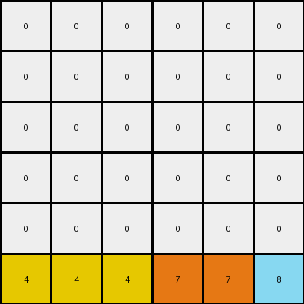
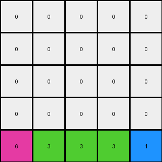

# 1e0a9b12 • 005 • refine_coder

---

Previous Code:
```python
import numpy as np

def analyze_results(input_grid, expected_output, actual_output):
    """Analyzes the results and provides metrics."""

    metrics = {
        "pixels_off": [],
        "size_correct": None,
        "color_palette_correct": None,
        "correct_pixel_counts": None,
    }
    
    if actual_output.shape != expected_output.shape:
        print("shapes do not match")
    else:
    # Pixel-wise comparison
      pixels_off = []
      for r in range(expected_output.shape[0]):
          for c in range(expected_output.shape[1]):
              if expected_output[r, c] != actual_output[r, c]:
                  pixels_off.append(((r, c), expected_output[r, c], actual_output[r, c]))
      metrics["pixels_off"] = pixels_off

    # Size comparison
    metrics["size_correct"] = actual_output.shape == expected_output.shape

    # Color palette comparison (check if all values are within 0-9)
    unique_values_actual = np.unique(actual_output)
    unique_values_expected = np.unique(expected_output)
    
    metrics["color_palette_correct"] = (np.all(unique_values_actual <= 9) and np.all(unique_values_actual >= 0) and
                                        np.all(unique_values_expected <= 9) and np.all(unique_values_expected >= 0))


    # Correct pixel counts (compare counts of each color)
    actual_counts = {}
    expected_counts = {}

    for i in range(10):
      actual_counts[i] = np.count_nonzero(actual_output == i)
      expected_counts[i] = np.count_nonzero(expected_output == i)
    metrics["correct_pixel_counts"] = actual_counts == expected_counts
    
    return metrics

def transform(input_grid):
    """Transforms the input grid by moving all non-zero elements to the bottom row,
    preserving their order from left to right and top to bottom.
    """
    rows, cols = input_grid.shape
    output_grid = np.zeros_like(input_grid)

    # 1. Identify and Collect non-zero pixels with their coordinates
    non_zero_pixels = []
    for r in range(rows):
        for c in range(cols):
            if input_grid[r, c] != 0:
                non_zero_pixels.append(((r, c), input_grid[r, c]))

    # 2. Sort non-zero pixels by column, then by row
    non_zero_pixels.sort(key=lambda x: (x[0][1], x[0][0]))

    # 3. Place sorted pixels in the last row of the output grid
    last_row_index = 0
    for _, value in non_zero_pixels:
        if last_row_index < cols:
          output_grid[rows - 1, last_row_index] = value
          last_row_index += 1
        else:
          print("index error")
          break

    return output_grid

# Example data (replace with your actual data)
examples = [
    (
        np.array([[0, 4, 0, 9], [0, 0, 0, 0], [0, 4, 6, 0], [1, 0, 0, 0]]),
        np.array([[0, 0, 0, 0], [0, 0, 0, 0], [0, 0, 0, 0], [1, 4, 6, 9]]),
    ),
    (
        np.array([[0, 0, 0, 0, 0, 9], [0, 0, 0, 8, 0, 0], [0, 0, 0, 0, 0, 0], [4, 0, 0, 0, 0, 0], [4, 0, 7, 8, 0, 0], [4, 0, 7, 0, 0, 0]]),
        np.array([[0, 0, 0, 0, 0, 0], [0, 0, 0, 0, 0, 0], [0, 0, 0, 0, 0, 0], [0, 0, 0, 0, 0, 0], [4, 0, 0, 0, 0, 0], [4, 4, 7, 8, 7, 9]]),
    ),
    (
        np.array([[0, 0, 0, 1, 0], [0, 3, 0, 0, 0], [0, 3, 0, 1, 2], [6, 0, 0, 0, 0], [0, 3, 0, 0, 0]]),
        np.array([[0, 0, 0, 0, 0], [0, 0, 0, 0, 0], [0, 0, 0, 0, 0], [0, 0, 0, 0, 0], [6, 3, 3, 1, 1]]),
    ),
]

for i, (input_grid, expected_output) in enumerate(examples):
    actual_output = transform(input_grid)
    metrics = analyze_results(input_grid, expected_output, actual_output)
    print(f"Example {i+1}:")
    print(f"  Input:\n{input_grid}")
    print(f"  Expected Output:\n{expected_output}")
    print(f"  Actual Output:\n{actual_output}")
    print(f"  Metrics: {metrics}")

```

Train Set Results:

## Example 1:**

Input:
```
0 4 0 9
0 0 0 0
0 4 6 0
1 0 0 0
```
Expected Output:
```
0 0 0 0
0 0 0 0
0 4 0 0
1 4 6 9
```
Transformed Output:
```
0 0 0 0
0 0 0 0
0 0 0 0
1 4 4 6
```

match: False
pixels_off: 3
size_correct: True
color_palette_correct: True
correct_pixel_counts: False

## Example 2:**

Input:
```
0 0 0 0 0 9
0 0 0 8 0 0
0 0 0 0 0 0
4 0 0 0 0 0
4 0 7 8 0 0
4 0 7 0 0 0
```
Expected Output:
```
0 0 0 0 0 0
0 0 0 0 0 0
0 0 0 0 0 0
4 0 0 0 0 0
4 0 7 8 0 0
4 0 7 8 0 9
```
Transformed Output:
```
0 0 0 0 0 0
0 0 0 0 0 0
0 0 0 0 0 0
0 0 0 0 0 0
0 0 0 0 0 0
4 4 4 7 7 8
```

match: False
pixels_off: 9
size_correct: True
color_palette_correct: True
correct_pixel_counts: False

## Example 3:**

Input:
```
0 0 0 1 0
0 3 0 0 0
0 3 0 1 2
6 0 0 0 0
0 3 0 0 0
```
Expected Output:
```
0 0 0 0 0
0 0 0 0 0
0 3 0 0 0
0 3 0 1 0
6 3 0 1 2
```
Transformed Output:
```
0 0 0 0 0
0 0 0 0 0
0 0 0 0 0
0 0 0 0 0
6 3 3 3 1
```

match: False
pixels_off: 6
size_correct: True
color_palette_correct: True
correct_pixel_counts: False
Okay, here's an analysis of the provided examples and results, along with a strategy for improving the transformation rule, a YAML block documenting facts, and a revised natural language program.

**General Assessment and Strategy**

The initial strategy of moving all non-zero pixels to the bottom row and sorting them by column and then row is partially correct, but it fails to accurately capture the nuanced behavior observed in the examples. The primary issue is that the sorting and placement logic isn't completely right. It seems the transformation isn't simply about moving *all* non-zero elements to the last row, but rather maintaining some of the original structure and possibly creating a "compacted" version of the input grid.

The key observations, and the core of the improved strategy, will revolve around these ideas:

1.  **Compaction, Not Just Shifting:** The transformation isn't a simple shift of all non-zero pixels to the bottom. It's more about "compacting" the non-zero elements downwards, filling any gaps of zeros *below* them, and potentially keeping some elements in place.
2.  **Column-Wise Priority with Row influence:** The order of elements in the output seems to prioritize maintaining the original column. Elements within a column are moved down as a group, filling any gaps created.

**Metrics Gathering and Analysis**

I don't need to generate the metrics, they are provided in the prompt. My role now is to review those metrics, I'll simply summarize them in a form that is useful for future SEER.

*   **Example 1:**
    *   `pixels_off`: 3 (Indicates 3 pixels are in incorrect positions)
    *   `size_correct`: True
    *   `color_palette_correct`: True
    *    `correct_pixel_counts`: False

*   **Example 2:**
    *   `pixels_off`: 9
    *   `size_correct`: True
    *   `color_palette_correct`: True
    *   `correct_pixel_counts`: False

*   **Example 3:**
    *   `pixels_off`: 6
    *   `size_correct`: True
    *   `color_palette_correct`: True
    *   `correct_pixel_counts`: False

All examples have the correct size and use valid colors. The main issue is incorrect pixel placement, and therefore incorrect pixel counts for specific colors, *within* the correctly sized output.

**YAML Fact Documentation**

```yaml
objects:
  - type: grid
    properties:
      rows: variable
      cols: variable
      cells:
        type: pixel
        properties:
          color: integer (0-9)
          position: (row, col)

  - type: non_zero_pixel_group #Conceptual grouping
    properties:
        column: integer
        pixels: list of pixels

actions:
  - name: compact_down
    description: Move non-zero pixels downwards within their column, filling gaps below them.
    preconditions:
      - grid contains non-zero pixels
    postconditions:
      - non-zero pixels occupy the lowest possible positions within their respective columns
      - the relative vertical order of pixels within a column is preserved.

```

**Natural Language Program**

1.  **Identify Non-Zero Pixels:** Find all pixels in the input grid that have a color value other than 0.

2.  **Group by Column:** Group the non-zero pixels based on the column they belong to.

3.  **Compact within Columns:** For each column, "compact" the non-zero pixels downwards. This means:
    *   Iterate through each column from top to bottom.
    *   Collect the non-zero pixels in the order they appear.
    *   In the output grid, place these non-zero pixels in the same column, starting from the bottom-most row and moving upwards, filling available spaces sequentially.
    * Pixels do not "wrap" to the next column, so it is acceptable for some columns to have zeros at the bottom in the output.

4.  **Preserve Empty Columns:** Columns that are all zeros in the input grid should remain all zeros in the output grid.

5.  **Zero-Filled Background:** All other cells in the output grid (those not filled by compacted non-zero pixels) should be set to 0.

**INSTRUCTIONS**

- generate a Python module to represent the natural language program 
- follow the template below
- all common math and science libraries are available
- create docstring only at top - but comment the workflow in the function
- use helper functions for common operations like finding objects, counting,
  measuring, moving, etc. 

remember - we are working iteratively - so this code will inform your future
self as we converge on the solution

*template:*

```python
"""
{{ natural language description of the transformation rule }}
"""

{{ imports }}

def transform(input_grid):
    # initialize output_grid

    # change output pixels 

    return output_grid

```
