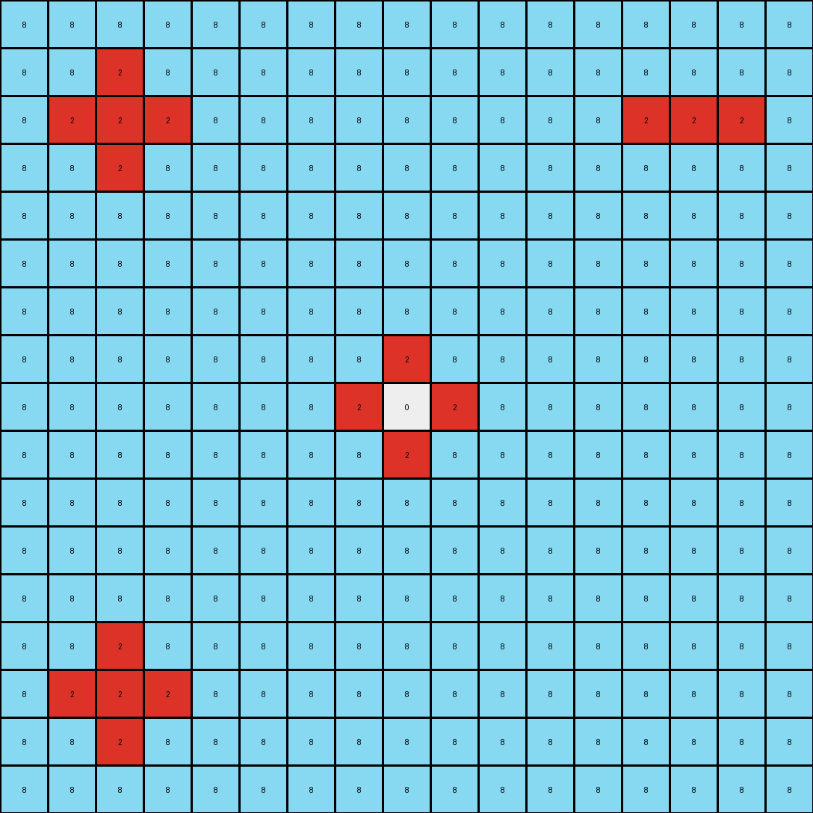
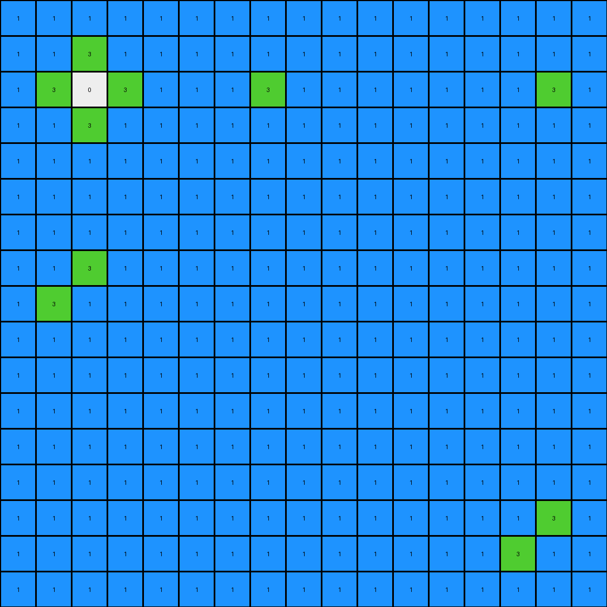

# 1e32b0e9 • 005 • refine_dreamer

---


Previous Code:
```python
"""
1.  **Identify the Seed Color:** Determine the color of the initial lines or shapes in the input grid. We can call this color the "seed color."
2.  **Iterative Expansion:** For each pixel matching the seed color, change the adjacent pixels (up, down, left, and right) to the seed color.
3. **Repeat Expansion** Repeat the iterative expansion until the pixels stop changing.
"""

import numpy as np

def get_seed_color(grid):
    # Find the most frequent color other than white (0)
    unique_colors, counts = np.unique(grid, return_counts=True)
    color_counts = dict(zip(unique_colors, counts))
    
    # Remove white (0) from consideration
    if 0 in color_counts:
        del color_counts[0]
    
    if not color_counts:  # Handle the case where the grid is all white
        return 0  

    seed_color = max(color_counts, key=color_counts.get)
    return seed_color

def expand_color(grid, seed_color):
    """Expands the seed color to adjacent white pixels."""
    new_grid = grid.copy()
    rows, cols = grid.shape
    changed = False
    for r in range(rows):
        for c in range(cols):
            if grid[r, c] == seed_color:
                # Check adjacent cells
                if r > 0 and grid[r-1, c] == 0:
                    new_grid[r-1, c] = seed_color
                    changed = True
                if r < rows - 1 and grid[r+1, c] == 0:
                    new_grid[r+1, c] = seed_color
                    changed = True
                if c > 0 and grid[r, c-1] == 0:
                    new_grid[r, c-1] = seed_color
                    changed = True
                if c < cols - 1 and grid[r, c+1] == 0:
                    new_grid[r, c+1] = seed_color
                    changed = True
    return new_grid, changed

def transform(input_grid):
    # initialize output_grid
    output_grid = np.copy(input_grid)

    # Identify Seed Color
    seed_color = get_seed_color(output_grid)
    
    if seed_color == 0: # if all white return
        return output_grid

    # Iteratively expand color until no change
    changed = True
    while changed:
       output_grid, changed = expand_color(output_grid, seed_color)
       

    return output_grid
```

Train Set Results:

## Example 1:**

Input:
```
0 0 0 0 0 8 0 0 0 0 0 8 0 0 0 0 0
0 0 2 0 0 8 0 0 0 0 0 8 0 0 0 0 0
0 2 2 2 0 8 0 0 0 0 0 8 0 2 2 2 0
0 0 2 0 0 8 0 0 0 0 0 8 0 0 0 0 0
0 0 0 0 0 8 0 0 0 0 0 8 0 0 0 0 0
8 8 8 8 8 8 8 8 8 8 8 8 8 8 8 8 8
0 0 0 0 0 8 0 0 0 0 0 8 0 0 0 0 0
0 0 0 0 0 8 0 0 2 0 0 8 0 0 0 0 0
0 0 0 0 0 8 0 2 0 2 0 8 0 0 0 0 0
0 0 0 0 0 8 0 0 2 0 0 8 0 0 0 0 0
0 0 0 0 0 8 0 0 0 0 0 8 0 0 0 0 0
8 8 8 8 8 8 8 8 8 8 8 8 8 8 8 8 8
0 0 0 0 0 8 0 0 0 0 0 8 0 0 0 0 0
0 0 2 0 0 8 0 0 0 0 0 8 0 0 0 0 0
0 2 2 2 0 8 0 0 0 0 0 8 0 0 0 0 0
0 0 2 0 0 8 0 0 0 0 0 8 0 0 0 0 0
0 0 0 0 0 8 0 0 0 0 0 8 0 0 0 0 0
```
Expected Output:
```
0 0 0 0 0 8 0 0 0 0 0 8 0 0 0 0 0
0 0 2 0 0 8 0 0 8 0 0 8 0 0 8 0 0
0 2 2 2 0 8 0 8 8 8 0 8 0 2 2 2 0
0 0 2 0 0 8 0 0 8 0 0 8 0 0 8 0 0
0 0 0 0 0 8 0 0 0 0 0 8 0 0 0 0 0
8 8 8 8 8 8 8 8 8 8 8 8 8 8 8 8 8
0 0 0 0 0 8 0 0 0 0 0 8 0 0 0 0 0
0 0 8 0 0 8 0 0 2 0 0 8 0 0 8 0 0
0 8 8 8 0 8 0 2 8 2 0 8 0 8 8 8 0
0 0 8 0 0 8 0 0 2 0 0 8 0 0 8 0 0
0 0 0 0 0 8 0 0 0 0 0 8 0 0 0 0 0
8 8 8 8 8 8 8 8 8 8 8 8 8 8 8 8 8
0 0 0 0 0 8 0 0 0 0 0 8 0 0 0 0 0
0 0 2 0 0 8 0 0 8 0 0 8 0 0 8 0 0
0 2 2 2 0 8 0 8 8 8 0 8 0 8 8 8 0
0 0 2 0 0 8 0 0 8 0 0 8 0 0 8 0 0
0 0 0 0 0 8 0 0 0 0 0 8 0 0 0 0 0
```
Transformed Output:
```
8 8 8 8 8 8 8 8 8 8 8 8 8 8 8 8 8
8 8 2 8 8 8 8 8 8 8 8 8 8 8 8 8 8
8 2 2 2 8 8 8 8 8 8 8 8 8 2 2 2 8
8 8 2 8 8 8 8 8 8 8 8 8 8 8 8 8 8
8 8 8 8 8 8 8 8 8 8 8 8 8 8 8 8 8
8 8 8 8 8 8 8 8 8 8 8 8 8 8 8 8 8
8 8 8 8 8 8 8 8 8 8 8 8 8 8 8 8 8
8 8 8 8 8 8 8 8 2 8 8 8 8 8 8 8 8
8 8 8 8 8 8 8 2 0 2 8 8 8 8 8 8 8
8 8 8 8 8 8 8 8 2 8 8 8 8 8 8 8 8
8 8 8 8 8 8 8 8 8 8 8 8 8 8 8 8 8
8 8 8 8 8 8 8 8 8 8 8 8 8 8 8 8 8
8 8 8 8 8 8 8 8 8 8 8 8 8 8 8 8 8
8 8 2 8 8 8 8 8 8 8 8 8 8 8 8 8 8
8 2 2 2 8 8 8 8 8 8 8 8 8 8 8 8 8
8 8 2 8 8 8 8 8 8 8 8 8 8 8 8 8 8
8 8 8 8 8 8 8 8 8 8 8 8 8 8 8 8 8
```

match: False
pixels_off: 181
size_correct: True
color_palette_correct: True
correct_pixel_counts: False

## Example 2:**

Input:
```
0 0 0 0 0 2 0 0 0 0 0 2 0 0 0 0 0
0 1 1 1 0 2 0 0 0 0 0 2 0 0 1 1 0
0 1 1 1 0 2 0 1 1 0 0 2 0 0 0 0 0
0 1 1 1 0 2 0 0 0 0 0 2 0 0 0 0 0
0 0 0 0 0 2 0 0 0 0 0 2 0 0 0 0 0
2 2 2 2 2 2 2 2 2 2 2 2 2 2 2 2 2
0 0 0 0 0 2 0 0 0 0 0 2 0 0 0 0 0
0 0 0 0 0 2 0 0 0 0 0 2 0 0 0 0 0
0 0 0 0 0 2 0 0 0 0 0 2 0 0 1 0 0
0 0 0 0 0 2 0 0 0 0 0 2 0 0 0 0 0
0 0 0 0 0 2 0 0 0 0 0 2 0 0 0 0 0
2 2 2 2 2 2 2 2 2 2 2 2 2 2 2 2 2
0 0 0 0 0 2 0 0 0 0 0 2 0 0 0 0 0
0 0 0 0 0 2 0 0 1 0 0 2 0 0 0 0 0
0 0 0 0 0 2 0 1 0 1 0 2 0 0 0 0 0
0 0 0 0 0 2 0 0 1 0 0 2 0 0 0 0 0
0 0 0 0 0 2 0 0 0 0 0 2 0 0 0 0 0
```
Expected Output:
```
0 0 0 0 0 2 0 0 0 0 0 2 0 0 0 0 0
0 1 1 1 0 2 0 2 2 2 0 2 0 2 1 1 0
0 1 1 1 0 2 0 1 1 2 0 2 0 2 2 2 0
0 1 1 1 0 2 0 2 2 2 0 2 0 2 2 2 0
0 0 0 0 0 2 0 0 0 0 0 2 0 0 0 0 0
2 2 2 2 2 2 2 2 2 2 2 2 2 2 2 2 2
0 0 0 0 0 2 0 0 0 0 0 2 0 0 0 0 0
0 2 2 2 0 2 0 2 2 2 0 2 0 2 2 2 0
0 2 2 2 0 2 0 2 2 2 0 2 0 2 1 2 0
0 2 2 2 0 2 0 2 2 2 0 2 0 2 2 2 0
0 0 0 0 0 2 0 0 0 0 0 2 0 0 0 0 0
2 2 2 2 2 2 2 2 2 2 2 2 2 2 2 2 2
0 0 0 0 0 2 0 0 0 0 0 2 0 0 0 0 0
0 2 2 2 0 2 0 2 1 2 0 2 0 2 2 2 0
0 2 2 2 0 2 0 1 2 1 0 2 0 2 2 2 0
0 2 2 2 0 2 0 2 1 2 0 2 0 2 2 2 0
0 0 0 0 0 2 0 0 0 0 0 2 0 0 0 0 0
```
Transformed Output:
```
2 2 2 2 2 2 2 2 2 2 2 2 2 2 2 2 2
2 1 1 1 2 2 2 2 2 2 2 2 2 2 1 1 2
2 1 1 1 2 2 2 1 1 2 2 2 2 2 2 2 2
2 1 1 1 2 2 2 2 2 2 2 2 2 2 2 2 2
2 2 2 2 2 2 2 2 2 2 2 2 2 2 2 2 2
2 2 2 2 2 2 2 2 2 2 2 2 2 2 2 2 2
2 2 2 2 2 2 2 2 2 2 2 2 2 2 2 2 2
2 2 2 2 2 2 2 2 2 2 2 2 2 2 2 2 2
2 2 2 2 2 2 2 2 2 2 2 2 2 2 1 2 2
2 2 2 2 2 2 2 2 2 2 2 2 2 2 2 2 2
2 2 2 2 2 2 2 2 2 2 2 2 2 2 2 2 2
2 2 2 2 2 2 2 2 2 2 2 2 2 2 2 2 2
2 2 2 2 2 2 2 2 2 2 2 2 2 2 2 2 2
2 2 2 2 2 2 2 2 1 2 2 2 2 2 2 2 2
2 2 2 2 2 2 2 1 0 1 2 2 2 2 2 2 2
2 2 2 2 2 2 2 2 1 2 2 2 2 2 2 2 2
2 2 2 2 2 2 2 2 2 2 2 2 2 2 2 2 2
```

match: False
pixels_off: 145
size_correct: True
color_palette_correct: True
correct_pixel_counts: False

## Example 3:**

Input:
```
0 0 0 0 0 1 0 0 0 0 0 1 0 0 0 0 0
0 0 3 0 0 1 0 0 0 0 0 1 0 0 0 0 0
0 3 0 3 0 1 0 3 0 0 0 1 0 0 0 3 0
0 0 3 0 0 1 0 0 0 0 0 1 0 0 0 0 0
0 0 0 0 0 1 0 0 0 0 0 1 0 0 0 0 0
1 1 1 1 1 1 1 1 1 1 1 1 1 1 1 1 1
0 0 0 0 0 1 0 0 0 0 0 1 0 0 0 0 0
0 0 3 0 0 1 0 0 0 0 0 1 0 0 0 0 0
0 3 0 0 0 1 0 0 0 0 0 1 0 0 0 0 0
0 0 0 0 0 1 0 0 0 0 0 1 0 0 0 0 0
0 0 0 0 0 1 0 0 0 0 0 1 0 0 0 0 0
1 1 1 1 1 1 1 1 1 1 1 1 1 1 1 1 1
0 0 0 0 0 1 0 0 0 0 0 1 0 0 0 0 0
0 0 0 0 0 1 0 0 0 0 0 1 0 0 0 0 0
0 0 0 0 0 1 0 0 0 0 0 1 0 0 0 3 0
0 0 0 0 0 1 0 0 0 0 0 1 0 0 3 0 0
0 0 0 0 0 1 0 0 0 0 0 1 0 0 0 0 0
```
Expected Output:
```
0 0 0 0 0 1 0 0 0 0 0 1 0 0 0 0 0
0 0 3 0 0 1 0 0 1 0 0 1 0 0 1 0 0
0 3 0 3 0 1 0 3 0 1 0 1 0 1 0 3 0
0 0 3 0 0 1 0 0 1 0 0 1 0 0 1 0 0
0 0 0 0 0 1 0 0 0 0 0 1 0 0 0 0 0
1 1 1 1 1 1 1 1 1 1 1 1 1 1 1 1 1
0 0 0 0 0 1 0 0 0 0 0 1 0 0 0 0 0
0 0 3 0 0 1 0 0 1 0 0 1 0 0 1 0 0
0 3 0 1 0 1 0 1 0 1 0 1 0 1 0 1 0
0 0 1 0 0 1 0 0 1 0 0 1 0 0 1 0 0
0 0 0 0 0 1 0 0 0 0 0 1 0 0 0 0 0
1 1 1 1 1 1 1 1 1 1 1 1 1 1 1 1 1
0 0 0 0 0 1 0 0 0 0 0 1 0 0 0 0 0
0 0 1 0 0 1 0 0 1 0 0 1 0 0 1 0 0
0 1 0 1 0 1 0 1 0 1 0 1 0 1 0 3 0
0 0 1 0 0 1 0 0 1 0 0 1 0 0 3 0 0
0 0 0 0 0 1 0 0 0 0 0 1 0 0 0 0 0
```
Transformed Output:
```
1 1 1 1 1 1 1 1 1 1 1 1 1 1 1 1 1
1 1 3 1 1 1 1 1 1 1 1 1 1 1 1 1 1
1 3 0 3 1 1 1 3 1 1 1 1 1 1 1 3 1
1 1 3 1 1 1 1 1 1 1 1 1 1 1 1 1 1
1 1 1 1 1 1 1 1 1 1 1 1 1 1 1 1 1
1 1 1 1 1 1 1 1 1 1 1 1 1 1 1 1 1
1 1 1 1 1 1 1 1 1 1 1 1 1 1 1 1 1
1 1 3 1 1 1 1 1 1 1 1 1 1 1 1 1 1
1 3 1 1 1 1 1 1 1 1 1 1 1 1 1 1 1
1 1 1 1 1 1 1 1 1 1 1 1 1 1 1 1 1
1 1 1 1 1 1 1 1 1 1 1 1 1 1 1 1 1
1 1 1 1 1 1 1 1 1 1 1 1 1 1 1 1 1
1 1 1 1 1 1 1 1 1 1 1 1 1 1 1 1 1
1 1 1 1 1 1 1 1 1 1 1 1 1 1 1 1 1
1 1 1 1 1 1 1 1 1 1 1 1 1 1 1 3 1
1 1 1 1 1 1 1 1 1 1 1 1 1 1 3 1 1
1 1 1 1 1 1 1 1 1 1 1 1 1 1 1 1 1
```

match: False
pixels_off: 188
size_correct: True
color_palette_correct: True
correct_pixel_counts: False

**INSTRUCTIONS**

The code above was generated based on observations from the first training
example

we have tested the transform function on each of the task example inputs and
compared with the expected output

review each of the examples provided and the results and consider how the
natural language program should be updated to accommodate this new knowledge

respond with the following deliverables:

- general assessment of the information provided and strategy for resolving the
  errors
- gather metrics about each of the examples and results - use code_execution to
  develop accurate reports on your assumptions
- a YAML block documenting facts - Focus on identifying objects, their properties, and the actions performed on them.
- a natural language program - Be as clear and concise as possible, providing a complete description of the transformation rule.


your responses should be considered as information in a report - not a
conversation
