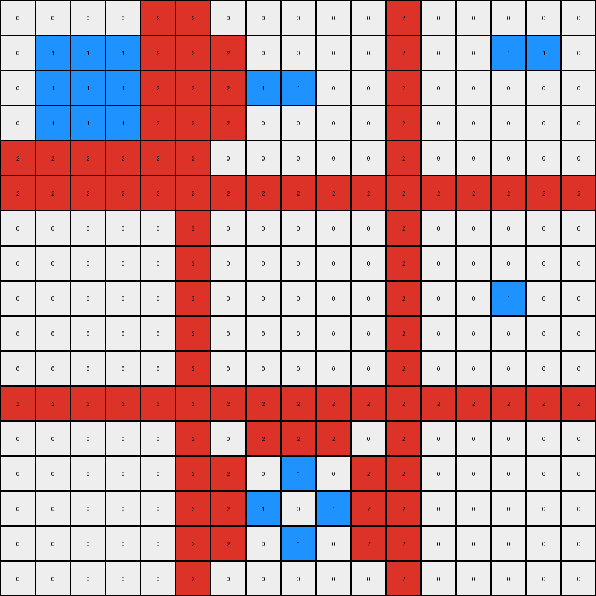
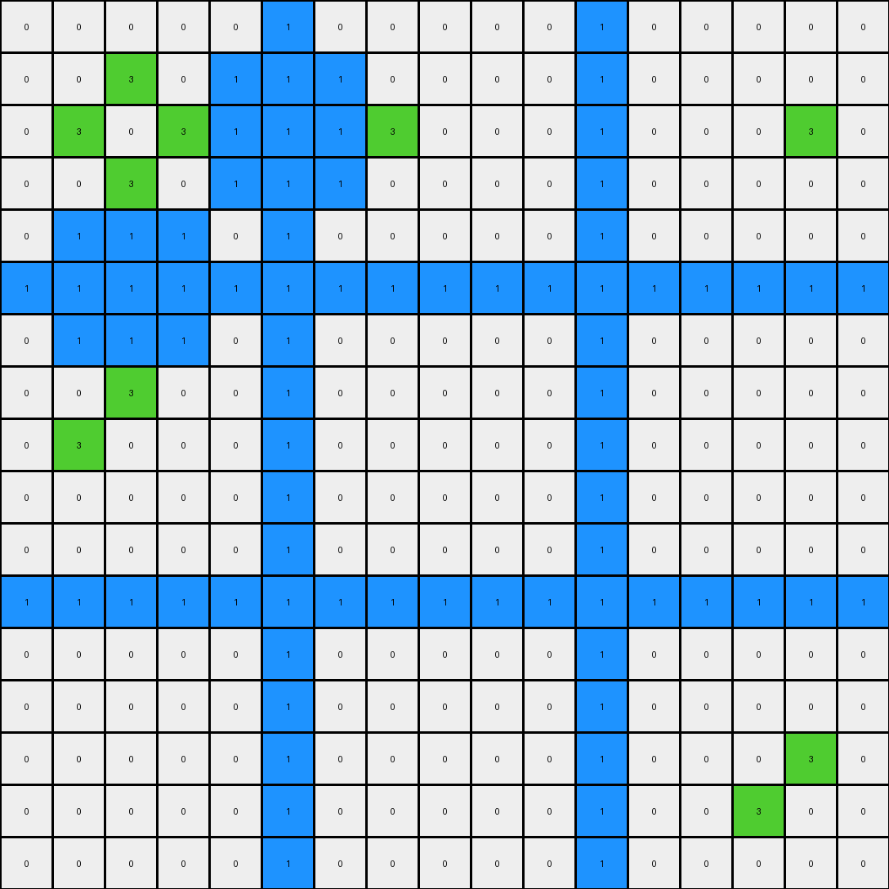

# 1e32b0e9 • 011 • refine_dreamer

---


Previous Code:
```python
"""
1.  **Identify the Main Shape:** Find the largest contiguous block of pixels of a single color (call this `shape_1` and its color `color_1`). The color should be determined dynamically.

2.  **Identify Inside Shapes:** Identify separate contiguous regions of a different color (call these `shape_2`, color is `color_2`) that exist and are adjacent to the color_1 pixels.

3. **Identify Inside White Pixels:** Find the white (0) pixels that are inside or adjacent to `shape_1`.

4.  **Conditional Fill:** Iterate through the identified white pixels. If a white pixel is directly adjacent (up, down, left, right, or diagonal) to any pixel of `color_2`, change the white pixel's color to `color_1`.
"""

import numpy as np
from collections import Counter

def find_largest_object(grid):
    # Find the largest contiguous block of pixels of the same color
    visited = set()
    max_size = 0
    shape_color = -1

    def dfs(r, c, color, count):
        if (r, c) in visited or not (0 <= r < len(grid) and 0 <= c < len(grid[0])) or grid[r][c] != color:
            return count
        visited.add((r, c))
        count += 1
        count = dfs(r + 1, c, color, count)
        count = dfs(r - 1, c, color, count)
        count = dfs(r, c + 1, color, count)
        count = dfs(r, c - 1, color, count)
        count = dfs(r + 1, c + 1, color, count)
        count = dfs(r - 1, c - 1, color, count)
        count = dfs(r + 1, c - 1, color, count)
        count = dfs(r - 1, c + 1, color, count)

        return count

    for r in range(len(grid)):
        for c in range(len(grid[0])):
            if (r, c) not in visited:
                color = grid[r][c]
                size = dfs(r, c, color, 0)
                if size > max_size:
                    max_size = size
                    shape_color = color
    return shape_color

def find_object_coords(grid, color):
    # Find coordinates of objects with the given color
    coords = []
    for r in range(len(grid)):
        for c in range(len(grid[0])):
            if grid[r][c] == color:
                coords.append((r,c))
    return coords

def is_adjacent(coord1, coord2):
    # Check if two coordinates are adjacent (including diagonals)
    r1, c1 = coord1
    r2, c2 = coord2
    return abs(r1 - r2) <= 1 and abs(c1 - c2) <= 1

def get_adjacent_pixels(grid, coord):
     # returns adjacent pixels, including diagonals
    r, c = coord
    adjacent = []
    for i in range(max(0, r - 1), min(len(grid), r + 2)):
        for j in range(max(0, c - 1), min(len(grid[0]), c + 2)):
            if (i,j) != (r,c):
                adjacent.append((i,j))
    return adjacent
    

def transform(input_grid):
    # initialize output_grid
    output_grid = np.copy(input_grid)

    # find shape_1 color (largest object)
    color_1 = find_largest_object(input_grid)
    
    # find shape_2 color
    color_counts = Counter()
    for r in range(len(input_grid)):
        for c in range(len(input_grid[0])):
            color = input_grid[r][c]
            if color != color_1 and color != 0:
                color_counts[color] += 1
    
    color_2 = color_counts.most_common(1)[0][0] if color_counts else -1 # handle case where there is no shape_2

    if color_2 == -1:
       return output_grid

    # get shape_2 coordinates
    shape_2_coords = find_object_coords(input_grid, color_2)
    
    # Find white pixels adjacent to shape_1
    white_coords = find_object_coords(input_grid, 0)

    # fill by condition
    for r, c in white_coords:
        adjacent_to_shape_1 = False
        for ar, ac in get_adjacent_pixels(input_grid, (r,c)):
            if input_grid[ar,ac] == color_1:
               adjacent_to_shape_1 = True
               break
        
        if adjacent_to_shape_1:
            for shape_2_coord in shape_2_coords:
                if is_adjacent((r, c), shape_2_coord):
                    output_grid[r, c] = color_1
                    break  # Move to the next white pixel after filling

    return output_grid
```

Train Set Results:

## Example 1:**

Input:
```
0 0 0 0 0 8 0 0 0 0 0 8 0 0 0 0 0
0 0 2 0 0 8 0 0 0 0 0 8 0 0 0 0 0
0 2 2 2 0 8 0 0 0 0 0 8 0 2 2 2 0
0 0 2 0 0 8 0 0 0 0 0 8 0 0 0 0 0
0 0 0 0 0 8 0 0 0 0 0 8 0 0 0 0 0
8 8 8 8 8 8 8 8 8 8 8 8 8 8 8 8 8
0 0 0 0 0 8 0 0 0 0 0 8 0 0 0 0 0
0 0 0 0 0 8 0 0 2 0 0 8 0 0 0 0 0
0 0 0 0 0 8 0 2 0 2 0 8 0 0 0 0 0
0 0 0 0 0 8 0 0 2 0 0 8 0 0 0 0 0
0 0 0 0 0 8 0 0 0 0 0 8 0 0 0 0 0
8 8 8 8 8 8 8 8 8 8 8 8 8 8 8 8 8
0 0 0 0 0 8 0 0 0 0 0 8 0 0 0 0 0
0 0 2 0 0 8 0 0 0 0 0 8 0 0 0 0 0
0 2 2 2 0 8 0 0 0 0 0 8 0 0 0 0 0
0 0 2 0 0 8 0 0 0 0 0 8 0 0 0 0 0
0 0 0 0 0 8 0 0 0 0 0 8 0 0 0 0 0
```
Expected Output:
```
0 0 0 0 0 8 0 0 0 0 0 8 0 0 0 0 0
0 0 2 0 0 8 0 0 8 0 0 8 0 0 8 0 0
0 2 2 2 0 8 0 8 8 8 0 8 0 2 2 2 0
0 0 2 0 0 8 0 0 8 0 0 8 0 0 8 0 0
0 0 0 0 0 8 0 0 0 0 0 8 0 0 0 0 0
8 8 8 8 8 8 8 8 8 8 8 8 8 8 8 8 8
0 0 0 0 0 8 0 0 0 0 0 8 0 0 0 0 0
0 0 8 0 0 8 0 0 2 0 0 8 0 0 8 0 0
0 8 8 8 0 8 0 2 8 2 0 8 0 8 8 8 0
0 0 8 0 0 8 0 0 2 0 0 8 0 0 8 0 0
0 0 0 0 0 8 0 0 0 0 0 8 0 0 0 0 0
8 8 8 8 8 8 8 8 8 8 8 8 8 8 8 8 8
0 0 0 0 0 8 0 0 0 0 0 8 0 0 0 0 0
0 0 2 0 0 8 0 0 8 0 0 8 0 0 8 0 0
0 2 2 2 0 8 0 8 8 8 0 8 0 8 8 8 0
0 0 2 0 0 8 0 0 8 0 0 8 0 0 8 0 0
0 0 0 0 0 8 0 0 0 0 0 8 0 0 0 0 0
```
Transformed Output:
```
0 0 0 0 0 8 0 0 0 0 0 8 0 0 0 0 0
0 0 2 0 8 8 0 0 0 0 0 8 8 0 0 0 0
0 2 2 2 8 8 0 0 0 0 0 8 8 2 2 2 0
0 0 2 0 8 8 0 0 0 0 0 8 8 0 0 0 0
0 8 8 8 0 8 0 0 0 0 0 8 0 0 0 0 0
8 8 8 8 8 8 8 8 8 8 8 8 8 8 8 8 8
0 0 0 0 0 8 0 8 8 8 0 8 0 0 0 0 0
0 0 0 0 0 8 8 0 2 0 8 8 0 0 0 0 0
0 0 0 0 0 8 8 2 0 2 8 8 0 0 0 0 0
0 0 0 0 0 8 8 0 2 0 8 8 0 0 0 0 0
0 0 0 0 0 8 0 8 8 8 0 8 0 0 0 0 0
8 8 8 8 8 8 8 8 8 8 8 8 8 8 8 8 8
0 8 8 8 0 8 0 0 0 0 0 8 0 0 0 0 0
0 0 2 0 8 8 0 0 0 0 0 8 0 0 0 0 0
0 2 2 2 8 8 0 0 0 0 0 8 0 0 0 0 0
0 0 2 0 8 8 0 0 0 0 0 8 0 0 0 0 0
0 0 0 0 0 8 0 0 0 0 0 8 0 0 0 0 0
```

match: False
pixels_off: 55
size_correct: True
color_palette_correct: True
correct_pixel_counts: False

## Example 2:**

Input:
```
0 0 0 0 0 2 0 0 0 0 0 2 0 0 0 0 0
0 1 1 1 0 2 0 0 0 0 0 2 0 0 1 1 0
0 1 1 1 0 2 0 1 1 0 0 2 0 0 0 0 0
0 1 1 1 0 2 0 0 0 0 0 2 0 0 0 0 0
0 0 0 0 0 2 0 0 0 0 0 2 0 0 0 0 0
2 2 2 2 2 2 2 2 2 2 2 2 2 2 2 2 2
0 0 0 0 0 2 0 0 0 0 0 2 0 0 0 0 0
0 0 0 0 0 2 0 0 0 0 0 2 0 0 0 0 0
0 0 0 0 0 2 0 0 0 0 0 2 0 0 1 0 0
0 0 0 0 0 2 0 0 0 0 0 2 0 0 0 0 0
0 0 0 0 0 2 0 0 0 0 0 2 0 0 0 0 0
2 2 2 2 2 2 2 2 2 2 2 2 2 2 2 2 2
0 0 0 0 0 2 0 0 0 0 0 2 0 0 0 0 0
0 0 0 0 0 2 0 0 1 0 0 2 0 0 0 0 0
0 0 0 0 0 2 0 1 0 1 0 2 0 0 0 0 0
0 0 0 0 0 2 0 0 1 0 0 2 0 0 0 0 0
0 0 0 0 0 2 0 0 0 0 0 2 0 0 0 0 0
```
Expected Output:
```
0 0 0 0 0 2 0 0 0 0 0 2 0 0 0 0 0
0 1 1 1 0 2 0 2 2 2 0 2 0 2 1 1 0
0 1 1 1 0 2 0 1 1 2 0 2 0 2 2 2 0
0 1 1 1 0 2 0 2 2 2 0 2 0 2 2 2 0
0 0 0 0 0 2 0 0 0 0 0 2 0 0 0 0 0
2 2 2 2 2 2 2 2 2 2 2 2 2 2 2 2 2
0 0 0 0 0 2 0 0 0 0 0 2 0 0 0 0 0
0 2 2 2 0 2 0 2 2 2 0 2 0 2 2 2 0
0 2 2 2 0 2 0 2 2 2 0 2 0 2 1 2 0
0 2 2 2 0 2 0 2 2 2 0 2 0 2 2 2 0
0 0 0 0 0 2 0 0 0 0 0 2 0 0 0 0 0
2 2 2 2 2 2 2 2 2 2 2 2 2 2 2 2 2
0 0 0 0 0 2 0 0 0 0 0 2 0 0 0 0 0
0 2 2 2 0 2 0 2 1 2 0 2 0 2 2 2 0
0 2 2 2 0 2 0 1 2 1 0 2 0 2 2 2 0
0 2 2 2 0 2 0 2 1 2 0 2 0 2 2 2 0
0 0 0 0 0 2 0 0 0 0 0 2 0 0 0 0 0
```
Transformed Output:
```
0 0 0 0 2 2 0 0 0 0 0 2 0 0 0 0 0
0 1 1 1 2 2 2 0 0 0 0 2 0 0 1 1 0
0 1 1 1 2 2 2 1 1 0 0 2 0 0 0 0 0
0 1 1 1 2 2 2 0 0 0 0 2 0 0 0 0 0
2 2 2 2 2 2 0 0 0 0 0 2 0 0 0 0 0
2 2 2 2 2 2 2 2 2 2 2 2 2 2 2 2 2
0 0 0 0 0 2 0 0 0 0 0 2 0 0 0 0 0
0 0 0 0 0 2 0 0 0 0 0 2 0 0 0 0 0
0 0 0 0 0 2 0 0 0 0 0 2 0 0 1 0 0
0 0 0 0 0 2 0 0 0 0 0 2 0 0 0 0 0
0 0 0 0 0 2 0 0 0 0 0 2 0 0 0 0 0
2 2 2 2 2 2 2 2 2 2 2 2 2 2 2 2 2
0 0 0 0 0 2 0 2 2 2 0 2 0 0 0 0 0
0 0 0 0 0 2 2 0 1 0 2 2 0 0 0 0 0
0 0 0 0 0 2 2 1 0 1 2 2 0 0 0 0 0
0 0 0 0 0 2 2 0 1 0 2 2 0 0 0 0 0
0 0 0 0 0 2 0 0 0 0 0 2 0 0 0 0 0
```

match: False
pixels_off: 84
size_correct: True
color_palette_correct: True
correct_pixel_counts: False

## Example 3:**

Input:
```
0 0 0 0 0 1 0 0 0 0 0 1 0 0 0 0 0
0 0 3 0 0 1 0 0 0 0 0 1 0 0 0 0 0
0 3 0 3 0 1 0 3 0 0 0 1 0 0 0 3 0
0 0 3 0 0 1 0 0 0 0 0 1 0 0 0 0 0
0 0 0 0 0 1 0 0 0 0 0 1 0 0 0 0 0
1 1 1 1 1 1 1 1 1 1 1 1 1 1 1 1 1
0 0 0 0 0 1 0 0 0 0 0 1 0 0 0 0 0
0 0 3 0 0 1 0 0 0 0 0 1 0 0 0 0 0
0 3 0 0 0 1 0 0 0 0 0 1 0 0 0 0 0
0 0 0 0 0 1 0 0 0 0 0 1 0 0 0 0 0
0 0 0 0 0 1 0 0 0 0 0 1 0 0 0 0 0
1 1 1 1 1 1 1 1 1 1 1 1 1 1 1 1 1
0 0 0 0 0 1 0 0 0 0 0 1 0 0 0 0 0
0 0 0 0 0 1 0 0 0 0 0 1 0 0 0 0 0
0 0 0 0 0 1 0 0 0 0 0 1 0 0 0 3 0
0 0 0 0 0 1 0 0 0 0 0 1 0 0 3 0 0
0 0 0 0 0 1 0 0 0 0 0 1 0 0 0 0 0
```
Expected Output:
```
0 0 0 0 0 1 0 0 0 0 0 1 0 0 0 0 0
0 0 3 0 0 1 0 0 1 0 0 1 0 0 1 0 0
0 3 0 3 0 1 0 3 0 1 0 1 0 1 0 3 0
0 0 3 0 0 1 0 0 1 0 0 1 0 0 1 0 0
0 0 0 0 0 1 0 0 0 0 0 1 0 0 0 0 0
1 1 1 1 1 1 1 1 1 1 1 1 1 1 1 1 1
0 0 0 0 0 1 0 0 0 0 0 1 0 0 0 0 0
0 0 3 0 0 1 0 0 1 0 0 1 0 0 1 0 0
0 3 0 1 0 1 0 1 0 1 0 1 0 1 0 1 0
0 0 1 0 0 1 0 0 1 0 0 1 0 0 1 0 0
0 0 0 0 0 1 0 0 0 0 0 1 0 0 0 0 0
1 1 1 1 1 1 1 1 1 1 1 1 1 1 1 1 1
0 0 0 0 0 1 0 0 0 0 0 1 0 0 0 0 0
0 0 1 0 0 1 0 0 1 0 0 1 0 0 1 0 0
0 1 0 1 0 1 0 1 0 1 0 1 0 1 0 3 0
0 0 1 0 0 1 0 0 1 0 0 1 0 0 3 0 0
0 0 0 0 0 1 0 0 0 0 0 1 0 0 0 0 0
```
Transformed Output:
```
0 0 0 0 0 1 0 0 0 0 0 1 0 0 0 0 0
0 0 3 0 1 1 1 0 0 0 0 1 0 0 0 0 0
0 3 0 3 1 1 1 3 0 0 0 1 0 0 0 3 0
0 0 3 0 1 1 1 0 0 0 0 1 0 0 0 0 0
0 1 1 1 0 1 0 0 0 0 0 1 0 0 0 0 0
1 1 1 1 1 1 1 1 1 1 1 1 1 1 1 1 1
0 1 1 1 0 1 0 0 0 0 0 1 0 0 0 0 0
0 0 3 0 0 1 0 0 0 0 0 1 0 0 0 0 0
0 3 0 0 0 1 0 0 0 0 0 1 0 0 0 0 0
0 0 0 0 0 1 0 0 0 0 0 1 0 0 0 0 0
0 0 0 0 0 1 0 0 0 0 0 1 0 0 0 0 0
1 1 1 1 1 1 1 1 1 1 1 1 1 1 1 1 1
0 0 0 0 0 1 0 0 0 0 0 1 0 0 0 0 0
0 0 0 0 0 1 0 0 0 0 0 1 0 0 0 0 0
0 0 0 0 0 1 0 0 0 0 0 1 0 0 0 3 0
0 0 0 0 0 1 0 0 0 0 0 1 0 0 3 0 0
0 0 0 0 0 1 0 0 0 0 0 1 0 0 0 0 0
```

match: False
pixels_off: 38
size_correct: True
color_palette_correct: True
correct_pixel_counts: False

**INSTRUCTIONS**

The code above was generated based on observations from the first training
example

we have tested the transform function on each of the task example inputs and
compared with the expected output

review each of the examples provided and the results and consider how the
natural language program should be updated to accommodate this new knowledge

respond with the following deliverables:

- general assessment of the information provided and strategy for resolving the
  errors
- gather metrics about each of the examples and results - use code_execution to
  develop accurate reports on your assumptions
- a YAML block documenting facts - Focus on identifying objects, their properties, and the actions performed on them.
- a natural language program - Be as clear and concise as possible, providing a complete description of the transformation rule.


your responses should be considered as information in a report - not a
conversation
