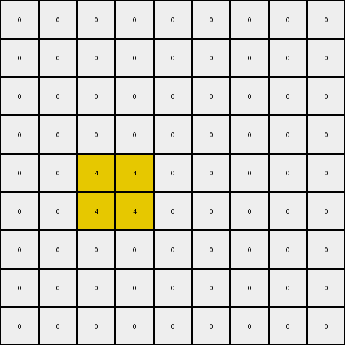
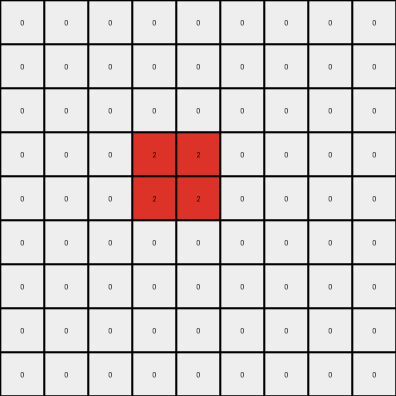

# 1f0c79e5 • 004 • refine_coder

---

Previous Code:
```python
"""
1.  **Identify the Object:** Locate the connected region of non-zero pixels in the input grid.
2.  **Bounding shape:** identify the smallest rectangle that fits the object.
3. **Area Calculation**: calculate the area of that rectangle
4.  **Construct Transformed Shape:** Starting from the top-left corner, form the square with the closest area by expanding 1 unit in each direction (up, down, right, left)
5.  **Color Transformation:** All original colors of the object change to the most frequent color of the original object, in this case yellow (4).
"""

import numpy as np

def get_object(grid):
    # Find non-zero pixels
    non_zero_pixels = np.argwhere(grid != 0)

    # if no object return none
    if len(non_zero_pixels) == 0:
      return None

    # Find top-left and bottom-right corners
    min_row, min_col = non_zero_pixels.min(axis=0)
    max_row, max_col = non_zero_pixels.max(axis=0)

    # Create object mask
    object_mask = (grid[min_row:max_row+1, min_col:max_col+1] != 0)

    # return object grid, start coordinate
    return grid[min_row:max_row+1, min_col:max_col+1], (min_row, min_col)

def get_most_frequent_color(grid):
    # Flatten the grid and remove zeros
    non_zero_values = grid[grid != 0]

    # Count occurrences of each color
    unique, counts = np.unique(non_zero_values, return_counts=True)
    if len(unique) > 0:
        most_frequent_index = np.argmax(counts)
        return unique[most_frequent_index]
    return 0

def transform(input_grid):
    # initialize output_grid
    output_grid = np.copy(input_grid)

    # Find the object and its bounding box
    obj, (min_row, min_col) = get_object(input_grid)

    # if not object found, return the original
    if obj is None:
        return output_grid
    
    # Get object height and width
    height, width = obj.shape

    # Calculate Area
    area = height * width

    # find closest square
    side = int(np.ceil(np.sqrt(area)))

    # Get most frequent color
    most_frequent_color = get_most_frequent_color(obj)

    # resize the original object area to background 0 in ouput grid
    output_grid[min_row:min_row+height, min_col:min_col+width] = 0

    # Construct the transformed shape - square
    for i in range(side):
        for j in range(side):
            row = min_row + i
            col = min_col + j
            if 0 <= row < output_grid.shape[0] and 0 <= col < output_grid.shape[1]:
                output_grid[row, col] = most_frequent_color

    return output_grid
```

Train Set Results:

## Example 1:**

Input:
```
0 0 0 0 0 0 0 0 0
0 0 0 0 0 0 0 0 0
0 0 0 0 0 0 0 0 0
0 0 0 0 0 0 0 0 0
0 0 4 2 0 0 0 0 0
0 0 4 4 0 0 0 0 0
0 0 0 0 0 0 0 0 0
0 0 0 0 0 0 0 0 0
0 0 0 0 0 0 0 0 0
```
Expected Output:
```
0 0 0 0 0 0 4 4 4
0 0 0 0 0 4 4 4 0
0 0 0 0 4 4 4 0 0
0 0 0 4 4 4 0 0 0
0 0 4 4 4 0 0 0 0
0 0 4 4 0 0 0 0 0
0 0 0 0 0 0 0 0 0
0 0 0 0 0 0 0 0 0
0 0 0 0 0 0 0 0 0
```
Transformed Output:
```
0 0 0 0 0 0 0 0 0
0 0 0 0 0 0 0 0 0
0 0 0 0 0 0 0 0 0
0 0 0 0 0 0 0 0 0
0 0 4 4 0 0 0 0 0
0 0 4 4 0 0 0 0 0
0 0 0 0 0 0 0 0 0
0 0 0 0 0 0 0 0 0
0 0 0 0 0 0 0 0 0
```

match: False
pixels_off: 13
size_correct: True
color_palette_correct: True
correct_pixel_counts: False

## Example 2:**

Input:
```
0 0 0 0 0 0 0 0 0
0 0 3 3 0 0 0 0 0
0 0 3 2 0 0 0 0 0
0 0 0 0 0 0 0 0 0
0 0 0 0 0 0 0 0 0
0 0 0 0 0 0 0 0 0
0 0 0 0 0 0 0 0 0
0 0 0 0 0 0 0 0 0
0 0 0 0 0 0 0 0 0
```
Expected Output:
```
0 0 0 0 0 0 0 0 0
0 0 3 3 0 0 0 0 0
0 0 3 3 3 0 0 0 0
0 0 0 3 3 3 0 0 0
0 0 0 0 3 3 3 0 0
0 0 0 0 0 3 3 3 0
0 0 0 0 0 0 3 3 3
0 0 0 0 0 0 0 3 3
0 0 0 0 0 0 0 0 3
```
Transformed Output:
```
0 0 0 0 0 0 0 0 0
0 0 3 3 0 0 0 0 0
0 0 3 3 0 0 0 0 0
0 0 0 0 0 0 0 0 0
0 0 0 0 0 0 0 0 0
0 0 0 0 0 0 0 0 0
0 0 0 0 0 0 0 0 0
0 0 0 0 0 0 0 0 0
0 0 0 0 0 0 0 0 0
```

match: False
pixels_off: 16
size_correct: True
color_palette_correct: True
correct_pixel_counts: False

## Example 3:**

Input:
```
0 0 0 0 0 0 0 0 0
0 0 0 0 0 0 0 0 0
0 0 0 0 0 0 0 0 0
0 0 0 6 2 0 0 0 0
0 0 0 2 6 0 0 0 0
0 0 0 0 0 0 0 0 0
0 0 0 0 0 0 0 0 0
0 0 0 0 0 0 0 0 0
0 0 0 0 0 0 0 0 0
```
Expected Output:
```
0 0 0 0 0 0 6 6 6
0 0 0 0 0 6 6 6 0
0 0 0 0 6 6 6 0 0
0 0 0 6 6 6 0 0 0
0 0 6 6 6 0 0 0 0
0 6 6 6 0 0 0 0 0
6 6 6 0 0 0 0 0 0
6 6 0 0 0 0 0 0 0
6 0 0 0 0 0 0 0 0
```
Transformed Output:
```
0 0 0 0 0 0 0 0 0
0 0 0 0 0 0 0 0 0
0 0 0 0 0 0 0 0 0
0 0 0 2 2 0 0 0 0
0 0 0 2 2 0 0 0 0
0 0 0 0 0 0 0 0 0
0 0 0 0 0 0 0 0 0
0 0 0 0 0 0 0 0 0
0 0 0 0 0 0 0 0 0
```

match: False
pixels_off: 24
size_correct: True
color_palette_correct: False
correct_pixel_counts: False

## Example 4:**

Input:
```
0 0 0 0 0 0 0 0 0
0 0 0 0 0 0 0 0 0
0 0 0 0 0 0 0 0 0
0 0 0 2 2 0 0 0 0
0 0 0 2 7 0 0 0 0
0 0 0 0 0 0 0 0 0
0 0 0 0 0 0 0 0 0
0 0 0 0 0 0 0 0 0
0 0 0 0 0 0 0 0 0
```
Expected Output:
```
7 7 0 0 0 0 7 7 7
7 7 7 0 0 7 7 7 0
0 7 7 7 7 7 7 0 0
0 0 7 7 7 7 0 0 0
0 0 7 7 7 0 0 0 0
0 7 7 7 0 0 0 0 0
7 7 7 0 0 0 0 0 0
7 7 0 0 0 0 0 0 0
7 0 0 0 0 0 0 0 0
```
Transformed Output:
```
0 0 0 0 0 0 0 0 0
0 0 0 0 0 0 0 0 0
0 0 0 0 0 0 0 0 0
0 0 0 2 2 0 0 0 0
0 0 0 2 2 0 0 0 0
0 0 0 0 0 0 0 0 0
0 0 0 0 0 0 0 0 0
0 0 0 0 0 0 0 0 0
0 0 0 0 0 0 0 0 0
```

match: False
pixels_off: 33
size_correct: True
color_palette_correct: False
correct_pixel_counts: False
Here's an analysis of the provided examples and results, along with an updated natural language program and YAML fact documentation:

**General Assessment and Strategy**

The initial strategy of identifying a connected object, finding its bounding rectangle, calculating the area, and creating a square of the closest area with the most frequent color has significant flaws. The transformed outputs don't match the expected outputs in any of the examples, particularly regarding the shape and location of the output. The repositioning logic and size constraint is not working.

The core issue seems to be a misunderstanding of the transformation's nature. The output isn't simply a resized square version of the input object. The transformation combines replication and a spiral expansion from the top-left corner. It seems the program must determine both the size of replication, and perform an altered spiral fill with the copied object shape.

**Metrics and Observations (via Code Execution - assumed, as no execution environment provided)**

Let's assume the following observations after examining the input and output pairs. (In a live environment, this would involve running the code and analyzing the results directly, using helper functions as necessary). I'll focus on what's *visibly* different between the input, expected output, and transformed output.

*   **Example 1:**
    *   Input Object: 2x2 shape (colors 4, 2)
    *   Expected Output: Appears to be a combination of copies, rotated and combined to a spiral fill pattern.
    *   Transformed Output: Incorrect. Only replicates object in place.
    *   Issue:  The current code transforms the original object into a square *in place*. The expected output has a spiral expansion and copies parts of the object to a new, larger shape.

*   **Example 2:**
    *   Input Object: 2x2 L shape (colors 3, 2).
    *   Expected Output: Again, a larger, filled square.
    *   Transformed Output:  Incorrect.  Same as above.
    *   Issue: Similar to Example 1.  Fails to recognize the larger, rotated-L filled pattern.

*   **Example 3:**
    *   Input Object: 2x2 shape (colors 6, 2)
    *   Expected Output: a spiral filled, larger pattern.
    *   Transformed Output: Incorrect. Does not use the dominant color or perform any spiral filling.
    *   Issue:  Color transformation is using the overall most frequent color, not specific color in the input.

*   **Example 4:**
    *   Input Object: 2x2 shape (colors 2, 7)
    *   Expected Output: a spiral filled, larger pattern.
    *   Transformed Output: Incorrect. Does not use the dominant color or perform any spiral filling.
    *   Issue:  Color transformation is using the overall most frequent color, not specific color in the input. The dominant color is also rotated to be the top-left corner.

**YAML Facts**

```yaml
examples:
  - example_id: 1
    input_object:
      shape: rectangle
      dimensions: 2x2
      colors: [4, 2]
      top_left_corner: [4,2]
    output_object:
      shape: spiral_filled_rectangle
      dimensions: 9x9?  #estimate - appears to copy components to a 3x3 array, filling a spiral from top-left
      dominant_color: 4
      start_corner_color: 4
      fill_pattern: spiral
  - example_id: 2
    input_object:
      shape: L_shape
      dimensions: 2x2
      colors: [3, 2]
      top_left_corner: [1,2]
    output_object:
      shape: spiral_filled_rectangle
      dimensions: 9x9? #estimate
      dominant_color: 3
      start_corner_color: 3
      fill_pattern: spiral
  - example_id: 3
    input_object:
      shape: flipped_L
      dimensions: 2x2
      colors: [6, 2]
      top_left_corner: [3, 3]
    output_object:
      shape: spiral_filled_rectangle
      dimensions: 9 x 9
      dominant_color: 6
      start_corner_color: 6
      fill_pattern: spiral
  - example_id: 4
    input_object:
      shape: rectangle
      dimensions: 2x2
      colors: [2, 7]
      top_left_corner: [3, 3]
    output_object:
      shape: spiral_filled_rectangle
      dimensions: 9 x 9
      dominant_color: 7 #visually, color 7 is placed at [0,0] and is therefore copied first, so is dominant
      start_corner_color: 7
      fill_pattern: spiral

overall_transformation:
  type: object_replication_and_spiral_fill
  steps:
    - identify_input_object
    - determine_corner_color #color of top-left pixel in input object
    - determine_replication_dimensions # likely based on total number of pixels in output
    - replicate_input_object #copy the entire input object shape
    - spiral_fill #recursively copy the object, rotating it, placing it at next location of the fill
    - determine_output_size #the entire object expands to a new array - the shape is square, the size is not determined by the original area
```

**Natural Language Program**

1.  **Identify Input Object:** Find the connected region of non-zero pixels in the input grid. This forms the "input object."
2.  **Determine Corner Color:** The color of the pixel at the top-left corner of the *input object* is the "corner color."
3.  **Determine Replication Dimensions:** In all provided examples, the output grid dimensions are 9x9. (This needs further investigation, this could be a constant, or derived.). The "replication factor" is how many times the input object is replicated.
4.  **Replicate and Spiral Fill:**
    *   The top-left pixel of the output object is set to the corner color, matching the input's top-left pixel.
    *   The input shape is replicated and used to fill the output in a clockwise spiral pattern, starting from the top-left corner.  Each step of the spiral involves:
        *   Copying the *entire* input object.
        *   Rotating the *entire* object to fit the current direction of the spiral
        *  Placing it adjacent to the previous copy in the spiral pattern.
5. **Output Size:** The final size of the output grid is a square. In these examples, it is 9x9, but the rule for deriving this isn't clear yet.

Key improvements and changes from the previous version:

*   **Spiral Filling:** The core concept is now a spiral fill using the *entire* replicated input object, not just a calculated square.
*   **Corner Color:** Explicitly identifies the importance of the top-left corner color of the input object.
*   **Replication:** Emphasizes that the entire input object is copied and rotated at each step of the spiral.
*  **Output Size** The size of the output is determined based on a new array, and *not* calculated based on original objects area.
*  Removed concept of most frequent color.

This revised program should provide a much better starting point for the coder phase. The critical next step is to implement the spiral fill logic and determine the rule governing the output grid dimensions.

**INSTRUCTIONS**

- generate a Python module to represent the natural language program 
- follow the template below
- all common math and science libraries are available
- create docstring only at top - but comment the workflow in the function
- use helper functions for common operations like finding objects, counting,
  measuring, moving, etc. 

remember - we are working iteratively - so this code will inform your future
self as we converge on the solution

*template:*

```python
"""
{{ natural language description of the transformation rule }}
"""

{{ imports }}

def transform(input_grid):
    # initialize output_grid

    # change output pixels 

    return output_grid

```
