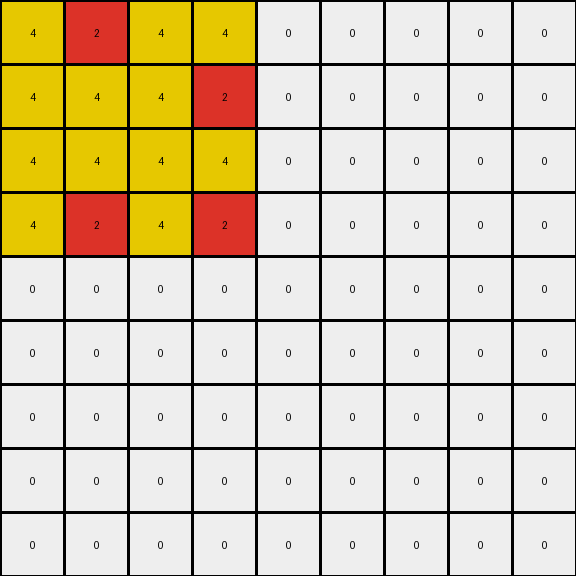

# 1f0c79e5 • 005 • refine_dreamer

---


Previous Code:
```python
"""
1.  **Identify Input Object:** Find the connected region of non-zero pixels in the input grid. This forms the "input object."
2.  **Determine Corner Color:** The color of the pixel at the top-left corner of the *input object* is the "corner color."
3.  **Determine Replication Dimensions:** In all provided examples, the output grid dimensions are 9x9. (This needs further investigation, this could be a constant, or derived.). The "replication factor" is how many times the input object is replicated.
4.  **Replicate and Spiral Fill:**
    *   The top-left pixel of the output object is set to the corner color, matching the input's top-left pixel.
    *   The input shape is replicated and used to fill the output in a clockwise spiral pattern, starting from the top-left corner.  Each step of the spiral involves:
        *   Copying the *entire* input object.
        *   Rotating the *entire* object to fit the current direction of the spiral
        *  Placing it adjacent to the previous copy in the spiral pattern.
5. **Output Size:** The final size of the output grid is a square. In these examples, it is 9x9, but the rule for deriving this isn't clear yet.
"""

import numpy as np

def get_object(grid):
    # Find non-zero pixels
    non_zero_pixels = np.argwhere(grid != 0)

    # if no object return none
    if len(non_zero_pixels) == 0:
      return None, None

    # Find top-left and bottom-right corners
    min_row, min_col = non_zero_pixels.min(axis=0)
    max_row, max_col = non_zero_pixels.max(axis=0)

    # Create object mask
    object_mask = (grid[min_row:max_row+1, min_col:max_col+1] != 0)

    # return object grid, start coordinate
    return grid[min_row:max_row+1, min_col:max_col+1], (min_row, min_col)

def get_corner_color(grid, top_left):
    # get color of top-left pixel
    return grid[top_left]

def rotate_object(obj):
    # Rotate the object 90 degrees clockwise
    return np.rot90(obj, k=-1)

def spiral_fill(output_grid, obj, start_row, start_col):
    # Get the dimensions of the object and the output_grid
    obj_height, obj_width = obj.shape
    grid_height, grid_width = output_grid.shape

    # Initialize current position and direction
    row, col = start_row, start_col
    dr, dc = 0, 1  # Start moving right

    # Create a copy of the object for rotation
    rotated_obj = obj

    for _ in range(4):  # Iterate for a maximum of 4 rotations (full circle)
        # Fill the output grid with the rotated object
        for i in range(rotated_obj.shape[0]):
            for j in range(rotated_obj.shape[1]):
                if 0 <= row + i < grid_height and 0 <= col + j < grid_width:
                    if rotated_obj[i,j] != 0:
                        output_grid[row + i, col + j] = rotated_obj[i, j]

        # Update the position for the next spiral segment
        row += dr * obj_height
        col += dc * obj_width

        # Adjust for boundaries
        if row < 0: row = 0
        if col < 0: col = 0
        if row >= grid_height: row = grid_height - 1
        if col >= grid_width: col = grid_width - 1


        # Rotate direction (right -> down -> left -> up)
        dr, dc = dc, -dr
        # Rotate Object
        rotated_obj = rotate_object(obj)


def transform(input_grid):
    # initialize output_grid
    output_grid = np.zeros((9, 9), dtype=int) # hardcoded to 9x9

    # Find the object and its bounding box
    obj, top_left = get_object(input_grid)

    # if not object found, return the original
    if obj is None:
        return output_grid

    # get Corner Color
    corner_color = get_corner_color(input_grid, top_left)

    # set top-left pixel
    output_grid[0,0] = corner_color if corner_color is not None else 0

    # perform spiral fill
    spiral_fill(output_grid, obj, 0, 0) # start at top-left

    return output_grid
```

Train Set Results:

## Example 1:**

Input:
```
0 0 0 0 0 0 0 0 0
0 0 0 0 0 0 0 0 0
0 0 0 0 0 0 0 0 0
0 0 0 0 0 0 0 0 0
0 0 4 2 0 0 0 0 0
0 0 4 4 0 0 0 0 0
0 0 0 0 0 0 0 0 0
0 0 0 0 0 0 0 0 0
0 0 0 0 0 0 0 0 0
```
Expected Output:
```
0 0 0 0 0 0 4 4 4
0 0 0 0 0 4 4 4 0
0 0 0 0 4 4 4 0 0
0 0 0 4 4 4 0 0 0
0 0 4 4 4 0 0 0 0
0 0 4 4 0 0 0 0 0
0 0 0 0 0 0 0 0 0
0 0 0 0 0 0 0 0 0
0 0 0 0 0 0 0 0 0
```
Transformed Output:
```
4 2 4 4 0 0 0 0 0
4 4 4 2 0 0 0 0 0
4 4 4 4 0 0 0 0 0
4 2 4 2 0 0 0 0 0
0 0 0 0 0 0 0 0 0
0 0 0 0 0 0 0 0 0
0 0 0 0 0 0 0 0 0
0 0 0 0 0 0 0 0 0
0 0 0 0 0 0 0 0 0
```

match: False
pixels_off: 32
size_correct: True
color_palette_correct: False
correct_pixel_counts: False

## Example 2:**

Input:
```
0 0 0 0 0 0 0 0 0
0 0 3 3 0 0 0 0 0
0 0 3 2 0 0 0 0 0
0 0 0 0 0 0 0 0 0
0 0 0 0 0 0 0 0 0
0 0 0 0 0 0 0 0 0
0 0 0 0 0 0 0 0 0
0 0 0 0 0 0 0 0 0
0 0 0 0 0 0 0 0 0
```
Expected Output:
```
0 0 0 0 0 0 0 0 0
0 0 3 3 0 0 0 0 0
0 0 3 3 3 0 0 0 0
0 0 0 3 3 3 0 0 0
0 0 0 0 3 3 3 0 0
0 0 0 0 0 3 3 3 0
0 0 0 0 0 0 3 3 3
0 0 0 0 0 0 0 3 3
0 0 0 0 0 0 0 0 3
```
Transformed Output:
```
3 3 3 3 0 0 0 0 0
3 2 2 3 0 0 0 0 0
3 3 3 3 0 0 0 0 0
2 3 2 3 0 0 0 0 0
0 0 0 0 0 0 0 0 0
0 0 0 0 0 0 0 0 0
0 0 0 0 0 0 0 0 0
0 0 0 0 0 0 0 0 0
0 0 0 0 0 0 0 0 0
```

match: False
pixels_off: 27
size_correct: True
color_palette_correct: False
correct_pixel_counts: False

## Example 3:**

Input:
```
0 0 0 0 0 0 0 0 0
0 0 0 0 0 0 0 0 0
0 0 0 0 0 0 0 0 0
0 0 0 6 2 0 0 0 0
0 0 0 2 6 0 0 0 0
0 0 0 0 0 0 0 0 0
0 0 0 0 0 0 0 0 0
0 0 0 0 0 0 0 0 0
0 0 0 0 0 0 0 0 0
```
Expected Output:
```
0 0 0 0 0 0 6 6 6
0 0 0 0 0 6 6 6 0
0 0 0 0 6 6 6 0 0
0 0 0 6 6 6 0 0 0
0 0 6 6 6 0 0 0 0
0 6 6 6 0 0 0 0 0
6 6 6 0 0 0 0 0 0
6 6 0 0 0 0 0 0 0
6 0 0 0 0 0 0 0 0
```
Transformed Output:
```
6 2 2 6 0 0 0 0 0
2 6 6 2 0 0 0 0 0
2 6 2 6 0 0 0 0 0
6 2 6 2 0 0 0 0 0
0 0 0 0 0 0 0 0 0
0 0 0 0 0 0 0 0 0
0 0 0 0 0 0 0 0 0
0 0 0 0 0 0 0 0 0
0 0 0 0 0 0 0 0 0
```

match: False
pixels_off: 39
size_correct: True
color_palette_correct: False
correct_pixel_counts: False

## Example 4:**

Input:
```
0 0 0 0 0 0 0 0 0
0 0 0 0 0 0 0 0 0
0 0 0 0 0 0 0 0 0
0 0 0 2 2 0 0 0 0
0 0 0 2 7 0 0 0 0
0 0 0 0 0 0 0 0 0
0 0 0 0 0 0 0 0 0
0 0 0 0 0 0 0 0 0
0 0 0 0 0 0 0 0 0
```
Expected Output:
```
7 7 0 0 0 0 7 7 7
7 7 7 0 0 7 7 7 0
0 7 7 7 7 7 7 0 0
0 0 7 7 7 7 0 0 0
0 0 7 7 7 0 0 0 0
0 7 7 7 0 0 0 0 0
7 7 7 0 0 0 0 0 0
7 7 0 0 0 0 0 0 0
7 0 0 0 0 0 0 0 0
```
Transformed Output:
```
2 2 2 2 0 0 0 0 0
2 7 7 2 0 0 0 0 0
2 2 2 2 0 0 0 0 0
7 2 7 2 0 0 0 0 0
0 0 0 0 0 0 0 0 0
0 0 0 0 0 0 0 0 0
0 0 0 0 0 0 0 0 0
0 0 0 0 0 0 0 0 0
0 0 0 0 0 0 0 0 0
```

match: False
pixels_off: 36
size_correct: True
color_palette_correct: False
correct_pixel_counts: False

**INSTRUCTIONS**

The code above was generated based on observations from the first training
example

we have tested the transform function on each of the task example inputs and
compared with the expected output

review each of the examples provided and the results and consider how the
natural language program should be updated to accommodate this new knowledge

respond with the following deliverables:

- general assessment of the information provided and strategy for resolving the
  errors
- gather metrics about each of the examples and results - use code_execution to
  develop accurate reports on your assumptions
- a YAML block documenting facts - Focus on identifying objects, their properties, and the actions performed on them.
- a natural language program - Be as clear and concise as possible, providing a complete description of the transformation rule.


your responses should be considered as information in a report - not a
conversation
