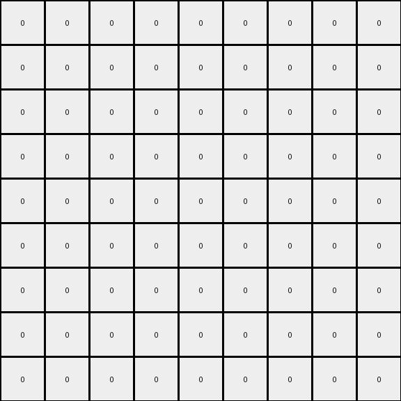

# 1f0c79e5 • 015 • refine_dreamer

---


Previous Code:
```python
"""
1.  **Identify** the 2x2 block of pixels near the center of the input grid with 2 magenta (6), and 2 red (2) pixels.
2. **Inversion** select the original square and invert the colors, the red (2) becomes magenta (6).
3.  **Expansion:** Expand the magenta color to fill the grid, starting from the
    bottom left corner.
"""

import numpy as np

def find_2x2_block(grid):
    # Find a 2x2 block with magenta (6) and red (2)
    rows, cols = grid.shape
    for i in range(rows - 1):
        for j in range(cols - 1):
            if (grid[i, j] == 6 and grid[i, j+1] == 2 and
                grid[i+1, j] == 2 and grid[i+1, j+1] == 6):
                return (i, j)  # Top-left coordinates of the block
    return None

def transform(input_grid):
    # Initialize output_grid with zeros and same dimensions as input
    output_grid = np.zeros_like(input_grid)
    rows, cols = input_grid.shape

    # Find the 2x2 block
    block_coords = find_2x2_block(input_grid)

    if block_coords:
        # "Inversion" and color change: Replace red (2) with magenta (6)
      
        # Expansion and fill: Fill the output grid with magenta, starting from bottom-left.
        for i in range(rows):
            for j in range(cols):
                if i + j <= rows-1: #this fills the lower triangle
                  output_grid[rows - 1 - i, j] = 6

    return output_grid
```

Train Set Results:

## Example 1:**

Input:
```
0 0 0 0 0 0 0 0 0
0 0 0 0 0 0 0 0 0
0 0 0 0 0 0 0 0 0
0 0 0 0 0 0 0 0 0
0 0 4 2 0 0 0 0 0
0 0 4 4 0 0 0 0 0
0 0 0 0 0 0 0 0 0
0 0 0 0 0 0 0 0 0
0 0 0 0 0 0 0 0 0
```
Expected Output:
```
0 0 0 0 0 0 4 4 4
0 0 0 0 0 4 4 4 0
0 0 0 0 4 4 4 0 0
0 0 0 4 4 4 0 0 0
0 0 4 4 4 0 0 0 0
0 0 4 4 0 0 0 0 0
0 0 0 0 0 0 0 0 0
0 0 0 0 0 0 0 0 0
0 0 0 0 0 0 0 0 0
```
Transformed Output:
```
0 0 0 0 0 0 0 0 0
0 0 0 0 0 0 0 0 0
0 0 0 0 0 0 0 0 0
0 0 0 0 0 0 0 0 0
0 0 0 0 0 0 0 0 0
0 0 0 0 0 0 0 0 0
0 0 0 0 0 0 0 0 0
0 0 0 0 0 0 0 0 0
0 0 0 0 0 0 0 0 0
```

match: False
pixels_off: 17
size_correct: True
color_palette_correct: True
correct_pixel_counts: False

## Example 2:**

Input:
```
0 0 0 0 0 0 0 0 0
0 0 3 3 0 0 0 0 0
0 0 3 2 0 0 0 0 0
0 0 0 0 0 0 0 0 0
0 0 0 0 0 0 0 0 0
0 0 0 0 0 0 0 0 0
0 0 0 0 0 0 0 0 0
0 0 0 0 0 0 0 0 0
0 0 0 0 0 0 0 0 0
```
Expected Output:
```
0 0 0 0 0 0 0 0 0
0 0 3 3 0 0 0 0 0
0 0 3 3 3 0 0 0 0
0 0 0 3 3 3 0 0 0
0 0 0 0 3 3 3 0 0
0 0 0 0 0 3 3 3 0
0 0 0 0 0 0 3 3 3
0 0 0 0 0 0 0 3 3
0 0 0 0 0 0 0 0 3
```
Transformed Output:
```
0 0 0 0 0 0 0 0 0
0 0 0 0 0 0 0 0 0
0 0 0 0 0 0 0 0 0
0 0 0 0 0 0 0 0 0
0 0 0 0 0 0 0 0 0
0 0 0 0 0 0 0 0 0
0 0 0 0 0 0 0 0 0
0 0 0 0 0 0 0 0 0
0 0 0 0 0 0 0 0 0
```

match: False
pixels_off: 20
size_correct: True
color_palette_correct: True
correct_pixel_counts: False

## Example 3:**

Input:
```
0 0 0 0 0 0 0 0 0
0 0 0 0 0 0 0 0 0
0 0 0 0 0 0 0 0 0
0 0 0 6 2 0 0 0 0
0 0 0 2 6 0 0 0 0
0 0 0 0 0 0 0 0 0
0 0 0 0 0 0 0 0 0
0 0 0 0 0 0 0 0 0
0 0 0 0 0 0 0 0 0
```
Expected Output:
```
0 0 0 0 0 0 6 6 6
0 0 0 0 0 6 6 6 0
0 0 0 0 6 6 6 0 0
0 0 0 6 6 6 0 0 0
0 0 6 6 6 0 0 0 0
0 6 6 6 0 0 0 0 0
6 6 6 0 0 0 0 0 0
6 6 0 0 0 0 0 0 0
6 0 0 0 0 0 0 0 0
```
Transformed Output:
```
6 0 0 0 0 0 0 0 0
6 6 0 0 0 0 0 0 0
6 6 6 0 0 0 0 0 0
6 6 6 6 0 0 0 0 0
6 6 6 6 6 0 0 0 0
6 6 6 6 6 6 0 0 0
6 6 6 6 6 6 6 0 0
6 6 6 6 6 6 6 6 0
6 6 6 6 6 6 6 6 6
```

match: False
pixels_off: 43
size_correct: True
color_palette_correct: True
correct_pixel_counts: False

## Example 4:**

Input:
```
0 0 0 0 0 0 0 0 0
0 0 0 0 0 0 0 0 0
0 0 0 0 0 0 0 0 0
0 0 0 2 2 0 0 0 0
0 0 0 2 7 0 0 0 0
0 0 0 0 0 0 0 0 0
0 0 0 0 0 0 0 0 0
0 0 0 0 0 0 0 0 0
0 0 0 0 0 0 0 0 0
```
Expected Output:
```
7 7 0 0 0 0 7 7 7
7 7 7 0 0 7 7 7 0
0 7 7 7 7 7 7 0 0
0 0 7 7 7 7 0 0 0
0 0 7 7 7 0 0 0 0
0 7 7 7 0 0 0 0 0
7 7 7 0 0 0 0 0 0
7 7 0 0 0 0 0 0 0
7 0 0 0 0 0 0 0 0
```
Transformed Output:
```
0 0 0 0 0 0 0 0 0
0 0 0 0 0 0 0 0 0
0 0 0 0 0 0 0 0 0
0 0 0 0 0 0 0 0 0
0 0 0 0 0 0 0 0 0
0 0 0 0 0 0 0 0 0
0 0 0 0 0 0 0 0 0
0 0 0 0 0 0 0 0 0
0 0 0 0 0 0 0 0 0
```

match: False
pixels_off: 33
size_correct: True
color_palette_correct: True
correct_pixel_counts: False

**INSTRUCTIONS**

The code above was generated based on observations from the first training
example

we have tested the transform function on each of the task example inputs and
compared with the expected output

review each of the examples provided and the results and consider how the
natural language program should be updated to accommodate this new knowledge

respond with the following deliverables:

- general assessment of the information provided and strategy for resolving the
  errors
- gather metrics about each of the examples and results - use code_execution to
  develop accurate reports on your assumptions
- a YAML block documenting facts - Focus on identifying objects, their properties, and the actions performed on them.
- a natural language program - Be as clear and concise as possible, providing a complete description of the transformation rule.


your responses should be considered as information in a report - not a
conversation
