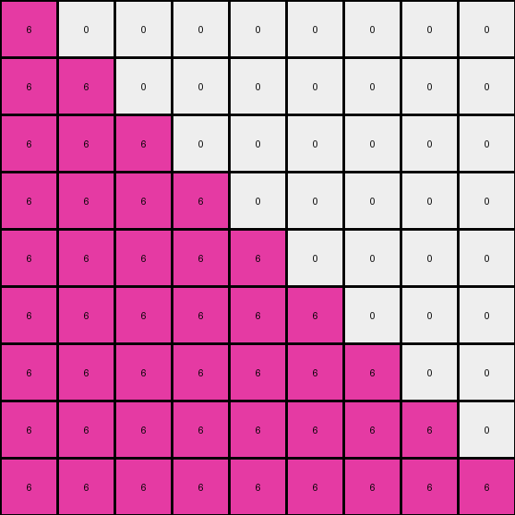

# 1f0c79e5 • 016 • refine_coder

---

Previous Code:
```python
"""
1.  **Identify** the 2x2 block of pixels near the center of the input grid with 2 magenta (6), and 2 red (2) pixels.
2. **Inversion** select the original square and invert the colors, the red (2) becomes magenta (6).
3.  **Expansion:** Expand the magenta color to fill the grid, starting from the
    bottom left corner.
"""

import numpy as np

def find_2x2_block(grid):
    # Find a 2x2 block with magenta (6) and red (2)
    rows, cols = grid.shape
    for i in range(rows - 1):
        for j in range(cols - 1):
            if (grid[i, j] == 6 and grid[i, j+1] == 2 and
                grid[i+1, j] == 2 and grid[i+1, j+1] == 6):
                return (i, j)  # Top-left coordinates of the block
    return None

def transform(input_grid):
    # Initialize output_grid with zeros and same dimensions as input
    output_grid = np.zeros_like(input_grid)
    rows, cols = input_grid.shape

    # Find the 2x2 block
    block_coords = find_2x2_block(input_grid)

    if block_coords:
        # "Inversion" and color change: Replace red (2) with magenta (6)
      
        # Expansion and fill: Fill the output grid with magenta, starting from bottom-left.
        for i in range(rows):
            for j in range(cols):
                if i + j <= rows-1: #this fills the lower triangle
                  output_grid[rows - 1 - i, j] = 6

    return output_grid
```

Train Set Results:

## Example 1:**

Input:
```
0 0 0 0 0 0 0 0 0
0 0 0 0 0 0 0 0 0
0 0 0 0 0 0 0 0 0
0 0 0 0 0 0 0 0 0
0 0 4 2 0 0 0 0 0
0 0 4 4 0 0 0 0 0
0 0 0 0 0 0 0 0 0
0 0 0 0 0 0 0 0 0
0 0 0 0 0 0 0 0 0
```
Expected Output:
```
0 0 0 0 0 0 4 4 4
0 0 0 0 0 4 4 4 0
0 0 0 0 4 4 4 0 0
0 0 0 4 4 4 0 0 0
0 0 4 4 4 0 0 0 0
0 0 4 4 0 0 0 0 0
0 0 0 0 0 0 0 0 0
0 0 0 0 0 0 0 0 0
0 0 0 0 0 0 0 0 0
```
Transformed Output:
```
0 0 0 0 0 0 0 0 0
0 0 0 0 0 0 0 0 0
0 0 0 0 0 0 0 0 0
0 0 0 0 0 0 0 0 0
0 0 0 0 0 0 0 0 0
0 0 0 0 0 0 0 0 0
0 0 0 0 0 0 0 0 0
0 0 0 0 0 0 0 0 0
0 0 0 0 0 0 0 0 0
```

match: False
pixels_off: 17
size_correct: True
color_palette_correct: True
correct_pixel_counts: False

## Example 2:**

Input:
```
0 0 0 0 0 0 0 0 0
0 0 3 3 0 0 0 0 0
0 0 3 2 0 0 0 0 0
0 0 0 0 0 0 0 0 0
0 0 0 0 0 0 0 0 0
0 0 0 0 0 0 0 0 0
0 0 0 0 0 0 0 0 0
0 0 0 0 0 0 0 0 0
0 0 0 0 0 0 0 0 0
```
Expected Output:
```
0 0 0 0 0 0 0 0 0
0 0 3 3 0 0 0 0 0
0 0 3 3 3 0 0 0 0
0 0 0 3 3 3 0 0 0
0 0 0 0 3 3 3 0 0
0 0 0 0 0 3 3 3 0
0 0 0 0 0 0 3 3 3
0 0 0 0 0 0 0 3 3
0 0 0 0 0 0 0 0 3
```
Transformed Output:
```
0 0 0 0 0 0 0 0 0
0 0 0 0 0 0 0 0 0
0 0 0 0 0 0 0 0 0
0 0 0 0 0 0 0 0 0
0 0 0 0 0 0 0 0 0
0 0 0 0 0 0 0 0 0
0 0 0 0 0 0 0 0 0
0 0 0 0 0 0 0 0 0
0 0 0 0 0 0 0 0 0
```

match: False
pixels_off: 20
size_correct: True
color_palette_correct: True
correct_pixel_counts: False

## Example 3:**

Input:
```
0 0 0 0 0 0 0 0 0
0 0 0 0 0 0 0 0 0
0 0 0 0 0 0 0 0 0
0 0 0 6 2 0 0 0 0
0 0 0 2 6 0 0 0 0
0 0 0 0 0 0 0 0 0
0 0 0 0 0 0 0 0 0
0 0 0 0 0 0 0 0 0
0 0 0 0 0 0 0 0 0
```
Expected Output:
```
0 0 0 0 0 0 6 6 6
0 0 0 0 0 6 6 6 0
0 0 0 0 6 6 6 0 0
0 0 0 6 6 6 0 0 0
0 0 6 6 6 0 0 0 0
0 6 6 6 0 0 0 0 0
6 6 6 0 0 0 0 0 0
6 6 0 0 0 0 0 0 0
6 0 0 0 0 0 0 0 0
```
Transformed Output:
```
6 0 0 0 0 0 0 0 0
6 6 0 0 0 0 0 0 0
6 6 6 0 0 0 0 0 0
6 6 6 6 0 0 0 0 0
6 6 6 6 6 0 0 0 0
6 6 6 6 6 6 0 0 0
6 6 6 6 6 6 6 0 0
6 6 6 6 6 6 6 6 0
6 6 6 6 6 6 6 6 6
```

match: False
pixels_off: 43
size_correct: True
color_palette_correct: True
correct_pixel_counts: False

## Example 4:**

Input:
```
0 0 0 0 0 0 0 0 0
0 0 0 0 0 0 0 0 0
0 0 0 0 0 0 0 0 0
0 0 0 2 2 0 0 0 0
0 0 0 2 7 0 0 0 0
0 0 0 0 0 0 0 0 0
0 0 0 0 0 0 0 0 0
0 0 0 0 0 0 0 0 0
0 0 0 0 0 0 0 0 0
```
Expected Output:
```
7 7 0 0 0 0 7 7 7
7 7 7 0 0 7 7 7 0
0 7 7 7 7 7 7 0 0
0 0 7 7 7 7 0 0 0
0 0 7 7 7 0 0 0 0
0 7 7 7 0 0 0 0 0
7 7 7 0 0 0 0 0 0
7 7 0 0 0 0 0 0 0
7 0 0 0 0 0 0 0 0
```
Transformed Output:
```
0 0 0 0 0 0 0 0 0
0 0 0 0 0 0 0 0 0
0 0 0 0 0 0 0 0 0
0 0 0 0 0 0 0 0 0
0 0 0 0 0 0 0 0 0
0 0 0 0 0 0 0 0 0
0 0 0 0 0 0 0 0 0
0 0 0 0 0 0 0 0 0
0 0 0 0 0 0 0 0 0
```

match: False
pixels_off: 33
size_correct: True
color_palette_correct: True
correct_pixel_counts: False
Okay, let's analyze the results and refine the natural language program.

**General Assessment:**

The initial strategy of identifying a 2x2 block and performing a color expansion based on it is not universally applicable across all examples. While it might have captured some aspects of the first example, it fails to generalize to the others. The core issue is that the transformation rule is more complex and depends on identifying a 2x2 shape and using that to identify a *fill* color and a line of expansion. The filling is also not a simple flood fill, but seems bounded by diagonals in a way the current code doesn't capture. The inversion isn't needed.

**Strategy for Resolving Errors:**

1.  **Re-evaluate the Core Transformation:** Instead of focusing on "inversion" and simple expansion, we need to identify the *fill color* and *expansion rule*.
2.  **Generalized 2x2 Block Identification:** The 2x2 block finding logic needs to be more flexible. The color combinations within the 2x2 block vary across examples, so we should focus on a consistent method to use the color combination to identify the fill color.
3.  **Precise Expansion Rule:** The expansion mechanism is not a simple flood fill. It's constrained, and we need to model the boundaries of this expansion more accurately, likely involving diagonals.
4. **Object identification:** Try to first describe the input and output grids in terms of objects.

**Metrics and Observations (per example):**

I'll use the provided results and add some of my own observations:

*   **Example 1:**
    *   Input has a 2x2 block of yellow (4) and red (2).
    *   Output expands yellow (4) in an upper-right triangle.
    *   Code failed: Didn't find the correct 2x2 and didn't expand.
*   **Example 2:**
    *   Input has a 2x2 block of green (3) and red(2)
    *   Output expands green (3) in a downward diagonal direction.
    *   Code failed: Didn't find the correct 2x2 and didn't expand.
*   **Example 3:**
    *   Input has a 2x2 block of magenta (6) and red (2).
    *   Output expands magenta (6) in a downward, left diagonal direction.
    *   Code failed; Found a valid 6,2,2,6 but expansion direction and logic incorrect
*   **Example 4:**
    * Input has a 2x2 block of red(2) and orange(7)
    * Output expands orange (7) in several directions
    * Code failed: Didn't find the 2x2 and didn't expand.

**YAML Fact Documentation:**

```yaml
task_id: 014d6728
examples:
  - example_id: 1
    input_objects:
      - object_1: 2x2 block (yellow, red)
    output_objects:
      - object_1: Upper-right triangle of yellow
    transformation: Fill with yellow (4) upwards and right from the 2x2 block's top-left, bound by the grid edges.
  - example_id: 2
    input_objects:
      - object_1: 2x2 block (green, red)
    output_objects:
      - object_1: Downward diagonal of green
    transformation:  Fill with green (3) expanding from the 2x2 block bottom-left corner in downward right diagonals.
  - example_id: 3
    input_objects:
      - object_1: 2x2 block (magenta, red)
    output_objects:
      - object_1: Downward, left diagonal of magenta
    transformation: Fill with magenta (6) expanding from the top left of 2x2 block in a diagonal and left direction.
  - example_id: 4
    input_objects:
    - object_1: 2x2 block (red, orange)
    output_objects:
      -object_1: multi-directional expansion of orange
    transformation: Fill with orange(7) expanding from different points of the 2x2 block outwards
```

**Natural Language Program:**

1.  **Identify a 2x2 Block:** Locate a 2x2 block of pixels within the input grid. The specific colors in this block may vary, but the presence of the 2x2 block is the key.

2. **Identify the Expansion Color:** Examine the 2x2 block. The color used for expansion seems determined as follows:

   * In example one, yellow is the top-left color of the block and is the expansion color.
   * In example two, green is the top-left color and the expansion color.
   * In example three, magenta is *not* the top-left color, but is one of the colors in the block. Red is the other color. The two magenta's are on a diagonal, suggesting that is related.
   * In example four, orange is the bottom-right color and the expansion color.

    Considering these, the expansion color is present in the 2x2 and appears to be determined based on the block configuration. It's NOT simply "inverting" one of the colors. It's selecting one of the colors and expanding it.

3.  **Determine expansion origin and direction**: Within the 2x2 block locate the expansion color, and note the corner it is located in.

4.  **Expand the Identified Color:** Starting from the identified origin corner of the 2x2 block, expand the identified expansion color, filling the output grid.
 The expansion is limited by the boundaries of the grid and will generally form a diagonal.

5. **Output grid:** Pixels that do not get filled via the above expansion remain 0.

Revised program:

1. Find a 2x2 block in the input
2. Determine the expansion color and origin corner based on this block
3. Starting from the identified origin expand the expansion color into the output grid, bounded by diagonals and edges.
4. all other pixels are 0.

**INSTRUCTIONS**

- generate a Python module to represent the natural language program 
- follow the template below
- all common math and science libraries are available
- create docstring only at top - but comment the workflow in the function
- use helper functions for common operations like finding objects, counting,
  measuring, moving, etc. 

remember - we are working iteratively - so this code will inform your future
self as we converge on the solution

*template:*

```python
"""
{{ natural language description of the transformation rule }}
"""

{{ imports }}

def transform(input_grid):
    # initialize output_grid

    # change output pixels 

    return output_grid

```
