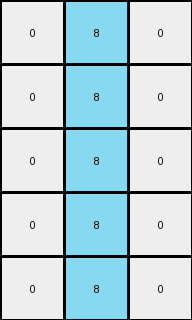

# 1b2d62fb • 003 • refine_dreamer

---

Previous Code:
```python
"""
1.  **Identify Region of Interest:** Locate the vertical line of '1's (blue pixels) in the input grid.
2.  **Define Subgrid:** Define bounds of the output grid. The height is the same as the number of rows of 1s in the input grid. The width appears to be fixed to 3 columns centered on the original line.
3.  **Extract Subgrid:** Extract the subgrid defined by the bounds in the previous step.
4.  **Replace Values:**
    *   Replace all '1' values within the subgrid with '8' (azure).
    *   Replace all other values in the subgrid with '0' (white).
5.   Return extracted and transformed subgrid.
"""

import numpy as np

def find_vertical_line(grid, value):
    """Finds the longest vertical line of a specific value in a grid."""
    rows, cols = grid.shape
    max_len = 0
    start_row = -1
    col_index = -1

    for j in range(cols):
        current_len = 0
        current_start_row = -1
        for i in range(rows):
            if grid[i, j] == value:
                if current_len == 0:
                    current_start_row = i
                current_len += 1
            else:
                if current_len > max_len:
                    max_len = current_len
                    start_row = current_start_row
                    col_index = j
                current_len = 0
                current_start_row = -1
        # Check for line at the end of the column
        if current_len > max_len:
            max_len = current_len
            start_row = current_start_row
            col_index = j

    return start_row, col_index, max_len

def transform(input_grid):
    # Convert input to numpy array
    input_grid = np.array(input_grid)
    
    # Find the vertical line of '1's
    start_row, col_index, length = find_vertical_line(input_grid, 1)

    # Define subgrid bounds
    top = start_row
    bottom = start_row + length
    left = max(0, col_index - 1)  # Ensure within bounds
    right = min(input_grid.shape[1], col_index + 2) # Ensure within bounds and includes the column

    # Initialize output grid with zeros, size 3 x length
    output_grid = np.zeros((length, 3), dtype=int)

    # Extract relevant section and map to the output grid
    for i in range(top,bottom):
        for j in range(left, right):
          row_in_output = i - top
          col_in_output = j - left
          if input_grid[i,j] == 1:
              output_grid[row_in_output, col_in_output] = 8
          else:
              output_grid[row_in_output, col_in_output] = 0

    return output_grid.tolist()
```

Train Set Results:

## Example 1:**

Input:
```
0 9 9 1 9 9 9
0 0 9 1 9 9 0
9 0 9 1 9 9 0
0 0 0 1 9 0 0
0 9 9 1 9 9 9
```
Expected Output:
```
0 0 0
0 0 0
0 0 0
0 8 8
0 0 0
```
Transformed Output:
```
0 8 0
0 8 0
0 8 0
0 8 0
0 8 0
```

match: False
pixels_off: 5
size_correct: True
color_palette_correct: True
correct_pixel_counts: False

## Example 2:**

Input:
```
0 0 0 1 9 0 0
9 0 9 1 9 9 9
0 9 9 1 9 9 9
0 0 0 1 9 9 9
0 9 9 1 9 9 9
```
Expected Output:
```
0 8 8
0 0 0
0 0 0
0 0 0
0 0 0
```
Transformed Output:
```
0 8 0
0 8 0
0 8 0
0 8 0
0 8 0
```

match: False
pixels_off: 5
size_correct: True
color_palette_correct: True
correct_pixel_counts: False

## Example 3:**

Input:
```
9 0 0 1 9 0 9
9 0 0 1 0 9 0
9 0 0 1 9 0 0
0 9 9 1 0 9 9
0 0 9 1 0 9 0
```
Expected Output:
```
0 8 0
0 0 8
0 8 8
8 0 0
8 0 0
```
Transformed Output:
```
0 8 0
0 8 0
0 8 0
0 8 0
0 8 0
```

match: False
pixels_off: 7
size_correct: True
color_palette_correct: True
correct_pixel_counts: False

## Example 4:**

Input:
```
0 9 9 1 9 0 9
9 0 0 1 9 0 0
9 9 9 1 9 9 9
0 9 0 1 0 0 0
9 0 0 1 9 0 0
```
Expected Output:
```
0 0 0
0 8 8
0 0 0
8 0 8
0 8 8
```
Transformed Output:
```
0 8 0
0 8 0
0 8 0
0 8 0
0 8 0
```

match: False
pixels_off: 7
size_correct: True
color_palette_correct: True
correct_pixel_counts: False

## Example 5:**

Input:
```
0 9 9 1 9 0 9
9 0 9 1 9 9 9
9 9 9 1 0 0 9
9 0 0 1 9 0 0
9 9 9 1 0 0 9
```
Expected Output:
```
0 0 0
0 0 0
0 0 0
0 8 8
0 0 0
```
Transformed Output:
```
0 8 0
0 8 0
0 8 0
0 8 0
0 8 0
```

match: False
pixels_off: 5
size_correct: True
color_palette_correct: True
correct_pixel_counts: False
**INSTRUCTIONS**

The code above was generated based on observations from the first training
example

we have tested the transform function on each of the task example inputs and
compared with the expected output

review each of the examples provided and the results and consider how the
natural language program should be updated to accommodate this new knowledge

respond with the following deliverables:

- general assessment of the information provided and strategy for resolving the
  errors
- gather metrics about each of the examples and results - use code_execution to
  develop accurate reports on your assumptions
- a YAML block documenting facts - Focus on identifying objects, their properties, and the actions performed on them.
- a natural language program - Be as clear and concise as possible, providing a complete description of the transformation rule.


your responses should be considered as information in a report - not a
conversation
