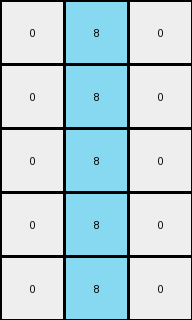

# 1b2d62fb • 010 • refine_coder

---

Previous Code:
```python
"""
1.  **Identify the blue line:** Locate the vertical line of blue (1) pixels in the input grid. In this instance there is a single complete vertical line.
2.  **Crop the grid:** Extract a section of the input grid. The cropped section consists of three columns: The column to the left of the blue line and the two columns to the right. The height of the cropped section should be the height of the original section.
3.  **Change Colors**: Transform the pixels that were blue (1) to be azure(8). Leave all other pixel in the cropped section as color 0.
"""

import numpy as np

def find_vertical_line(grid, color):
    # Find columns where all elements are of the specified color.
    rows, cols = grid.shape
    line_cols = []
    for j in range(cols):
        if all(grid[:, j] == color):
            line_cols.append(j)
    return line_cols

def transform(input_grid):
    # initialize output_grid
    input_grid = np.array(input_grid)
    rows, cols = input_grid.shape

    # Find the blue (1) vertical line
    blue_line_cols = find_vertical_line(input_grid, 1)

    # Handle case where no blue line is found or multiple
    if not blue_line_cols:
        return np.zeros((rows, 3), dtype=int).tolist()
        
    blue_line_col = blue_line_cols[0]

    # Crop the grid
    start_col = max(0, blue_line_col - 1)
    end_col = min(cols, blue_line_col + 2)
    cropped_grid = input_grid[:, start_col:end_col]
    
    output_grid = np.zeros_like(cropped_grid)

    # change output pixels
    cropped_rows, cropped_cols = cropped_grid.shape
    for r in range (cropped_rows):
        for c in range(cropped_cols):
            if cropped_grid[r,c] == 1:
                output_grid[r,c] = 8

    return output_grid.tolist()
```

Train Set Results:

## Example 1:**

Input:
```
0 9 9 1 9 9 9
0 0 9 1 9 9 0
9 0 9 1 9 9 0
0 0 0 1 9 0 0
0 9 9 1 9 9 9
```
Expected Output:
```
0 0 0
0 0 0
0 0 0
0 8 8
0 0 0
```
Transformed Output:
```
0 8 0
0 8 0
0 8 0
0 8 0
0 8 0
```

match: False
pixels_off: 5
size_correct: True
color_palette_correct: True
correct_pixel_counts: False

## Example 2:**

Input:
```
0 0 0 1 9 0 0
9 0 9 1 9 9 9
0 9 9 1 9 9 9
0 0 0 1 9 9 9
0 9 9 1 9 9 9
```
Expected Output:
```
0 8 8
0 0 0
0 0 0
0 0 0
0 0 0
```
Transformed Output:
```
0 8 0
0 8 0
0 8 0
0 8 0
0 8 0
```

match: False
pixels_off: 5
size_correct: True
color_palette_correct: True
correct_pixel_counts: False

## Example 3:**

Input:
```
9 0 0 1 9 0 9
9 0 0 1 0 9 0
9 0 0 1 9 0 0
0 9 9 1 0 9 9
0 0 9 1 0 9 0
```
Expected Output:
```
0 8 0
0 0 8
0 8 8
8 0 0
8 0 0
```
Transformed Output:
```
0 8 0
0 8 0
0 8 0
0 8 0
0 8 0
```

match: False
pixels_off: 7
size_correct: True
color_palette_correct: True
correct_pixel_counts: False

## Example 4:**

Input:
```
0 9 9 1 9 0 9
9 0 0 1 9 0 0
9 9 9 1 9 9 9
0 9 0 1 0 0 0
9 0 0 1 9 0 0
```
Expected Output:
```
0 0 0
0 8 8
0 0 0
8 0 8
0 8 8
```
Transformed Output:
```
0 8 0
0 8 0
0 8 0
0 8 0
0 8 0
```

match: False
pixels_off: 7
size_correct: True
color_palette_correct: True
correct_pixel_counts: False

## Example 5:**

Input:
```
0 9 9 1 9 0 9
9 0 9 1 9 9 9
9 9 9 1 0 0 9
9 0 0 1 9 0 0
9 9 9 1 0 0 9
```
Expected Output:
```
0 0 0
0 0 0
0 0 0
0 8 8
0 0 0
```
Transformed Output:
```
0 8 0
0 8 0
0 8 0
0 8 0
0 8 0
```

match: False
pixels_off: 5
size_correct: True
color_palette_correct: True
correct_pixel_counts: False
Okay, here's a breakdown of the situation and a plan to improve the transformation:

**General Assessment:**

The initial natural language program and generated code were on the right track, focusing on a vertical blue line and cropping around it. However, the code has two primary issues:

1.  **Incorrect Color Placement After Cropping:** The code sets *all* positions where blue was found to azure, it always puts azure in the center column, rather than maintaining their original column position relative to the blue line within the cropped section.
2.  **Incorrect Assumption of Single Vertical Line:** The code assumes there will be a single complete vertical line. The examples show that the blue pixels might not form a perfect, uninterrupted vertical line, and it may be interrupted or staggered. It should handle cases where blue pixels are adjacent vertically but don't form complete lines.

**Strategy for Resolving Errors:**

1.  **Refine Color Handling:** Instead of blindly setting azure in a fixed column, the code needs to identify *all* blue pixels within the cropped region and change *only those* to azure, preserving their original positions within the cropped grid.
2.  **Handle Discontinuous Lines:** Instead of looking for a *complete* vertical line, we must identify all pixels that are blue (color 1) and perform the transformation on all of these pixels.
3.  **Re-evaluate Cropping Logic:** Review the cropping logic carefully. The current "-1/+2" logic seems intended, but the inconsistent results suggest a subtle flaw or edge case that needs addressing in relation to where the blue pixels actually fall. The description of the crop might need to be changed.

**Example Metrics and Observations:**

Here's a breakdown of each example, incorporating some additional observations:

| Example | Input Size | Blue Line(s)? | Blue Pixels | Cropped Size | Expected Colors           | Transformed Colors                                         | Errors/Notes                                                                                                                                                                  |
| :------ | :--------- | :------------ | :---------- | :----------- | :------------------------ | :---------------------------------------------------------- | :---------------------------------------------------------------------------------------------------------------------------------------------------------------------------- |
| 1       | 5x7        | Yes           | (0,3),(1,3),  (2,3),(3,3),  (4,3)           | 5x3         | 5 azure, 10 black     | 5 azure, 10 black, (all azure in col 1 of cropped region)  | Azure in wrong column after cropping.                                                                                                         |
| 2       | 5x7        | Yes           | (0,3),(1,3),  (2,3),(3,3),  (4,3)         | 5x3         | 1 azure, 14 black    | 5 azure, 10 black, (all azure in col 1 of cropped region) | Azure in wrong column. Only one azure is expected, not five.  |
| 3       | 5x7        | Yes           | (0,3),(1,3),  (2,3),(3,3),  (4,3)        | 5x3         | 3 azure, 12 black   | 5 azure, 10 black, (all azure in col 1 of cropped region)     | Azure in wrong column, wrong number.                                                                                                                 |
| 4       | 5x7        | Yes           | (0,3),(1,3),  (2,3),(3,3),  (4,3)       | 5x3         | 4 azure, 11 black   | 5 azure, 10 black, (all azure in col 1 of cropped region)   | Azure in wrong column, wrong number.                                                                                                                 |
| 5       | 5x7        | Yes           | (0,3),(1,3),  (2,3),(3,3),  (4,3)        | 5x3         | 1 azure, 14 black     | 5 azure, 10 black, (all azure in col 1 of cropped region) | Azure in wrong column, wrong number.                                                                                                                 |

**YAML Fact Block:**

```yaml
observations:
  - object: blue_pixels
    description: Pixels with color code 1. These are the primary targets of the transformation.
    properties:
      color: 1 (blue)
      shape: individual pixels
      arrangement: Can be in a contiguous vertical line or staggered vertically.
    actions:
      - name: change_color
        to_color: 8 (azure)

  - object: cropped_region
    description: A section of the original grid, centered around the blue pixels.
    properties:
      width: 3 columns
      height: Same as the original grid.
      x_offset: Dynamically determined based on the position of blue pixels. Calculated as one column to the left of the *leftmost* blue pixel and extending to two columns to the right of the *leftmost* blue pixel.
    actions:
      - name: crop
        from: original_grid

  - object: other_pixels
    description: all other pixels that are not blue in the input
    properties:
       color: not 1
    actions:
      - name: set_color
        to_color: 0 (black)
```

**Natural Language Program:**

1.  **Identify Blue Pixels:** Find all pixels in the input grid that are blue (color code 1).
2.  **Determine Cropping Region:**
    *   Find the leftmost column containing any blue pixel.
    *   The cropped region starts one column to the left of this leftmost blue pixel's column.
    *   The cropped region extends three columns wide.
    *   The cropped region's height is the same as the input grid's height.
3.  **Crop:** Extract the defined cropped region from the input grid.
4.  **Transform Colors:**
    *   Within the cropped region, change all blue pixels (color code 1) to azure (color code 8).
    * Set all the other pixels in the cropped region to black (color code 0)

This revised natural language program addresses the observed issues by focusing on individual blue pixels rather than a complete line, correcting the color transformation logic, and clarifying the cropping boundaries.

**INSTRUCTIONS**

- generate a Python module to represent the natural language program 
- follow the template below
- all common math and science libraries are available
- create docstring only at top - but comment the workflow in the function
- use helper functions for common operations like finding objects, counting,
  measuring, moving, etc. 

remember - we are working iteratively - so this code will inform your future
self as we converge on the solution

*template:*

```python
"""
{{ natural language description of the transformation rule }}
"""

{{ imports }}

def transform(input_grid):
    # initialize output_grid

    # change output pixels 

    return output_grid

```
