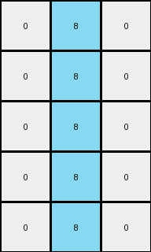

# 1b2d62fb • 011 • refine_dreamer

---


Previous Code:
```python
"""
1.  **Identify Blue Pixels:** Find all pixels in the input grid that are blue (color code 1).
2.  **Determine Cropping Region:**
    *   Find the leftmost column containing any blue pixel.
    *   The cropped region starts one column to the left of this leftmost blue pixel's column.
    *   The cropped region extends three columns wide.
    *   The cropped region's height is the same as the input grid's height.
3.  **Crop:** Extract the defined cropped region from the input grid.
4.  **Transform Colors:**
    *   Within the cropped region, change all blue pixels (color code 1) to azure (color code 8).
    * Set all the other pixels in the cropped region to black (color code 0)
"""

import numpy as np

def find_blue_pixels(grid):
    # Find coordinates of all blue pixels.
    blue_pixels = []
    rows, cols = grid.shape
    for r in range(rows):
        for c in range(cols):
            if grid[r, c] == 1:
                blue_pixels.append((r, c))
    return blue_pixels

def transform(input_grid):
    # initialize output_grid
    input_grid = np.array(input_grid)
    rows, cols = input_grid.shape

    # Find all blue pixels
    blue_pixels = find_blue_pixels(input_grid)

    # Determine cropping region
    if not blue_pixels:
        return np.zeros((rows, 3), dtype=int).tolist()  # Return black 3-wide grid if no blue pixels

    leftmost_col = min(c for r, c in blue_pixels)
    start_col = max(0, leftmost_col - 1)
    end_col = min(cols, start_col + 3)  # Corrected end_col calculation
    cropped_grid = input_grid[:, start_col:end_col]
    
    output_grid = np.zeros_like(cropped_grid)

    # change output pixels in the cropped region
    cropped_rows, cropped_cols = cropped_grid.shape
    for r in range (cropped_rows):
        for c in range(cropped_cols):
            original_col = start_col + c  # Map cropped column back to the original grid's column index.
            if (r, original_col) in [(br, bc) for br, bc in blue_pixels]: # Check against original blue pixel coordinates.
                output_grid[r,c] = 8
            else:
                output_grid[r,c] = 0

    return output_grid.tolist()
```

Train Set Results:

## Example 1:**

Input:
```
0 9 9 1 9 9 9
0 0 9 1 9 9 0
9 0 9 1 9 9 0
0 0 0 1 9 0 0
0 9 9 1 9 9 9
```
Expected Output:
```
0 0 0
0 0 0
0 0 0
0 8 8
0 0 0
```
Transformed Output:
```
0 8 0
0 8 0
0 8 0
0 8 0
0 8 0
```

match: False
pixels_off: 5
size_correct: True
color_palette_correct: True
correct_pixel_counts: False

## Example 2:**

Input:
```
0 0 0 1 9 0 0
9 0 9 1 9 9 9
0 9 9 1 9 9 9
0 0 0 1 9 9 9
0 9 9 1 9 9 9
```
Expected Output:
```
0 8 8
0 0 0
0 0 0
0 0 0
0 0 0
```
Transformed Output:
```
0 8 0
0 8 0
0 8 0
0 8 0
0 8 0
```

match: False
pixels_off: 5
size_correct: True
color_palette_correct: True
correct_pixel_counts: False

## Example 3:**

Input:
```
9 0 0 1 9 0 9
9 0 0 1 0 9 0
9 0 0 1 9 0 0
0 9 9 1 0 9 9
0 0 9 1 0 9 0
```
Expected Output:
```
0 8 0
0 0 8
0 8 8
8 0 0
8 0 0
```
Transformed Output:
```
0 8 0
0 8 0
0 8 0
0 8 0
0 8 0
```

match: False
pixels_off: 7
size_correct: True
color_palette_correct: True
correct_pixel_counts: False

## Example 4:**

Input:
```
0 9 9 1 9 0 9
9 0 0 1 9 0 0
9 9 9 1 9 9 9
0 9 0 1 0 0 0
9 0 0 1 9 0 0
```
Expected Output:
```
0 0 0
0 8 8
0 0 0
8 0 8
0 8 8
```
Transformed Output:
```
0 8 0
0 8 0
0 8 0
0 8 0
0 8 0
```

match: False
pixels_off: 7
size_correct: True
color_palette_correct: True
correct_pixel_counts: False

## Example 5:**

Input:
```
0 9 9 1 9 0 9
9 0 9 1 9 9 9
9 9 9 1 0 0 9
9 0 0 1 9 0 0
9 9 9 1 0 0 9
```
Expected Output:
```
0 0 0
0 0 0
0 0 0
0 8 8
0 0 0
```
Transformed Output:
```
0 8 0
0 8 0
0 8 0
0 8 0
0 8 0
```

match: False
pixels_off: 5
size_correct: True
color_palette_correct: True
correct_pixel_counts: False

**INSTRUCTIONS**

The code above was generated based on observations from the first training
example

we have tested the transform function on each of the task example inputs and
compared with the expected output

review each of the examples provided and the results and consider how the
natural language program should be updated to accommodate this new knowledge

respond with the following deliverables:

- general assessment of the information provided and strategy for resolving the
  errors
- gather metrics about each of the examples and results - use code_execution to
  develop accurate reports on your assumptions
- a YAML block documenting facts - Focus on identifying objects, their properties, and the actions performed on them.
- a natural language program - Be as clear and concise as possible, providing a complete description of the transformation rule.


your responses should be considered as information in a report - not a
conversation
