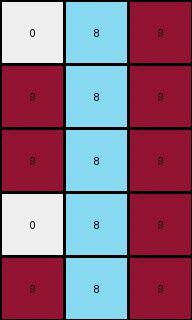
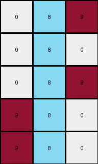

# 1b2d62fb • 015 • refine_dreamer

---

Previous Code:
```python
"""
1.  **Locate Center:** Identify the central vertical column in the input grid. In this case, it's the column at index 3 (the fourth column).
2.  **Extract Subgrid:** Extract a 5x3 subgrid centered on the identified column. This means take the central column, and one column to the left and one column to the right, preserving all rows.
3.  **Recolor:** In the extracted subgrid, change all pixels in the center column that have a value of 1 (blue) to 8 (azure). Keep the values of all other surrounding columns the same.
4.  **Output:** The resulting 5x3 subgrid is the output.
"""

import numpy as np

def get_central_column_index(grid):
    """Helper function to find the index of the central column."""
    return grid.shape[1] // 2

def extract_subgrid(grid, center_col_index, width):
    """Helper function to extract a subgrid of specified width centered on a column."""
    start_col = max(0, center_col_index - width // 2)
    end_col = min(grid.shape[1], center_col_index + width // 2 + 1)
    return grid[:, start_col:end_col]

def transform(input_grid):
    # Convert input to numpy array
    input_grid = np.array(input_grid)

    # 1. Locate Center
    center_col_index = get_central_column_index(input_grid)

    # 2. Extract Subgrid
    subgrid = extract_subgrid(input_grid, center_col_index, 3)
    output_grid = subgrid.copy()

    # 3. Recolor
    for i in range(output_grid.shape[0]):
      if output_grid[i, output_grid.shape[1]//2] == 1:
        output_grid[i, output_grid.shape[1]//2] = 8

    # 4. Output
    return output_grid.tolist()
```

Train Set Results:

## Example 1:**

Input:
```
0 9 9 1 9 9 9
0 0 9 1 9 9 0
9 0 9 1 9 9 0
0 0 0 1 9 0 0
0 9 9 1 9 9 9
```
Expected Output:
```
0 0 0
0 0 0
0 0 0
0 8 8
0 0 0
```
Transformed Output:
```
9 8 9
9 8 9
9 8 9
0 8 9
9 8 9
```

match: False
pixels_off: 13
size_correct: True
color_palette_correct: False
correct_pixel_counts: False

## Example 2:**

Input:
```
0 0 0 1 9 0 0
9 0 9 1 9 9 9
0 9 9 1 9 9 9
0 0 0 1 9 9 9
0 9 9 1 9 9 9
```
Expected Output:
```
0 8 8
0 0 0
0 0 0
0 0 0
0 0 0
```
Transformed Output:
```
0 8 9
9 8 9
9 8 9
0 8 9
9 8 9
```

match: False
pixels_off: 12
size_correct: True
color_palette_correct: False
correct_pixel_counts: False

## Example 3:**

Input:
```
9 0 0 1 9 0 9
9 0 0 1 0 9 0
9 0 0 1 9 0 0
0 9 9 1 0 9 9
0 0 9 1 0 9 0
```
Expected Output:
```
0 8 0
0 0 8
0 8 8
8 0 0
8 0 0
```
Transformed Output:
```
0 8 9
0 8 0
0 8 9
9 8 0
9 8 0
```

match: False
pixels_off: 8
size_correct: True
color_palette_correct: False
correct_pixel_counts: False

## Example 4:**

Input:
```
0 9 9 1 9 0 9
9 0 0 1 9 0 0
9 9 9 1 9 9 9
0 9 0 1 0 0 0
9 0 0 1 9 0 0
```
Expected Output:
```
0 0 0
0 8 8
0 0 0
8 0 8
0 8 8
```
Transformed Output:
```
9 8 9
0 8 9
9 8 9
0 8 0
0 8 9
```

match: False
pixels_off: 11
size_correct: True
color_palette_correct: False
correct_pixel_counts: False

## Example 5:**

Input:
```
0 9 9 1 9 0 9
9 0 9 1 9 9 9
9 9 9 1 0 0 9
9 0 0 1 9 0 0
9 9 9 1 0 0 9
```
Expected Output:
```
0 0 0
0 0 0
0 0 0
0 8 8
0 0 0
```
Transformed Output:
```
9 8 9
9 8 9
9 8 0
0 8 9
9 8 0
```

match: False
pixels_off: 11
size_correct: True
color_palette_correct: False
correct_pixel_counts: False
**INSTRUCTIONS**

The code above was generated based on observations from the first training
example

we have tested the transform function on each of the task example inputs and
compared with the expected output

review each of the examples provided and the results and consider how the
natural language program should be updated to accommodate this new knowledge

respond with the following deliverables:

- general assessment of the information provided and strategy for resolving the
  errors
- gather metrics about each of the examples and results - use code_execution to
  develop accurate reports on your assumptions
- a YAML block documenting facts - Focus on identifying objects, their properties, and the actions performed on them.
- a natural language program - Be as clear and concise as possible, providing a complete description of the transformation rule.


your responses should be considered as information in a report - not a
conversation
