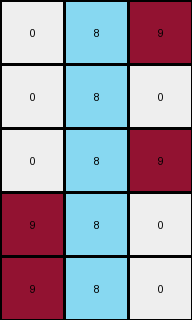

# 1b2d62fb • 016 • refine_coder

---

Previous Code:
```python
"""
1.  **Locate Center:** Identify the central vertical column in the input grid. In this case, it's the column at index 3 (the fourth column).
2.  **Extract Subgrid:** Extract a 5x3 subgrid centered on the identified column. This means take the central column, and one column to the left and one column to the right, preserving all rows.
3.  **Recolor:** In the extracted subgrid, change all pixels in the center column that have a value of 1 (blue) to 8 (azure). Keep the values of all other surrounding columns the same.
4.  **Output:** The resulting 5x3 subgrid is the output.
"""

import numpy as np

def get_central_column_index(grid):
    """Helper function to find the index of the central column."""
    return grid.shape[1] // 2

def extract_subgrid(grid, center_col_index, width):
    """Helper function to extract a subgrid of specified width centered on a column."""
    start_col = max(0, center_col_index - width // 2)
    end_col = min(grid.shape[1], center_col_index + width // 2 + 1)
    return grid[:, start_col:end_col]

def transform(input_grid):
    # Convert input to numpy array
    input_grid = np.array(input_grid)

    # 1. Locate Center
    center_col_index = get_central_column_index(input_grid)

    # 2. Extract Subgrid
    subgrid = extract_subgrid(input_grid, center_col_index, 3)
    output_grid = subgrid.copy()

    # 3. Recolor
    for i in range(output_grid.shape[0]):
      if output_grid[i, output_grid.shape[1]//2] == 1:
        output_grid[i, output_grid.shape[1]//2] = 8

    # 4. Output
    return output_grid.tolist()
```

Train Set Results:

## Example 1:**

Input:
```
0 9 9 1 9 9 9
0 0 9 1 9 9 0
9 0 9 1 9 9 0
0 0 0 1 9 0 0
0 9 9 1 9 9 9
```
Expected Output:
```
0 0 0
0 0 0
0 0 0
0 8 8
0 0 0
```
Transformed Output:
```
9 8 9
9 8 9
9 8 9
0 8 9
9 8 9
```

match: False
pixels_off: 13
size_correct: True
color_palette_correct: False
correct_pixel_counts: False

## Example 2:**

Input:
```
0 0 0 1 9 0 0
9 0 9 1 9 9 9
0 9 9 1 9 9 9
0 0 0 1 9 9 9
0 9 9 1 9 9 9
```
Expected Output:
```
0 8 8
0 0 0
0 0 0
0 0 0
0 0 0
```
Transformed Output:
```
0 8 9
9 8 9
9 8 9
0 8 9
9 8 9
```

match: False
pixels_off: 12
size_correct: True
color_palette_correct: False
correct_pixel_counts: False

## Example 3:**

Input:
```
9 0 0 1 9 0 9
9 0 0 1 0 9 0
9 0 0 1 9 0 0
0 9 9 1 0 9 9
0 0 9 1 0 9 0
```
Expected Output:
```
0 8 0
0 0 8
0 8 8
8 0 0
8 0 0
```
Transformed Output:
```
0 8 9
0 8 0
0 8 9
9 8 0
9 8 0
```

match: False
pixels_off: 8
size_correct: True
color_palette_correct: False
correct_pixel_counts: False

## Example 4:**

Input:
```
0 9 9 1 9 0 9
9 0 0 1 9 0 0
9 9 9 1 9 9 9
0 9 0 1 0 0 0
9 0 0 1 9 0 0
```
Expected Output:
```
0 0 0
0 8 8
0 0 0
8 0 8
0 8 8
```
Transformed Output:
```
9 8 9
0 8 9
9 8 9
0 8 0
0 8 9
```

match: False
pixels_off: 11
size_correct: True
color_palette_correct: False
correct_pixel_counts: False

## Example 5:**

Input:
```
0 9 9 1 9 0 9
9 0 9 1 9 9 9
9 9 9 1 0 0 9
9 0 0 1 9 0 0
9 9 9 1 0 0 9
```
Expected Output:
```
0 0 0
0 0 0
0 0 0
0 8 8
0 0 0
```
Transformed Output:
```
9 8 9
9 8 9
9 8 0
0 8 9
9 8 0
```

match: False
pixels_off: 11
size_correct: True
color_palette_correct: False
correct_pixel_counts: False
Okay, here's a breakdown of the situation and a plan to improve the transformation logic:

**General Assessment:**

The initial code was a good first attempt, focusing on a central column and recoloring. However, it's clear from the multiple failed examples that the logic is too simplistic and doesn't capture the full complexity of the transformation. The code correctly identifies the central column and extracts a 3-wide subgrid, and it correctly changes some blue (1) pixels to azure (8).  However, it's making several mistakes:

1.  **Incorrect Surrounding Pixels:** The code doesn't correctly handle the pixels surrounding the central column. It seems to sometimes include the column to the *right* instead of symmetrically including columns to the left *and* right. It also seems to be including values from the right and the wrong place
2.  **Inconsistent Recolor:**  The recoloring logic isn't consistent with the examples. It seems to always recolor a '1' to '8', while in fact, it's sometimes the left or right of the 1, and sometimes it's zero.
3. **Missing Context** We are not taking into account what is surrounding the central blue pixel

**Strategy for Resolving Errors:**

1.  **Refine Subgrid Extraction:** Ensure the subgrid extraction is *always* symmetrical around the central column. Double-check the indexing and boundary conditions. The width of the subgrid IS always 3.
2.  **Contextual Recolor:** The recoloring rule isn't just about changing 1s to 8s. It depends on the *surrounding* pixels. We need to analyze the relationship between the central blue pixel and its neighbors (left and right) in the *input* and how those neighbors change (or don't) in the *output*. This suggests examining pairs of (input, output) pixels.
3. **Iterative Refinement**: Because of #2, it is essential to test often.

**Metrics and Observations:**

Here's a more detailed, per-example analysis:

| Example | Input Shape | Output Shape | Central Column Index (Input) | Subgrid Correct? | Recolor Correct? | Notes                                                                                                                                                                           |
| :------ | :---------- | :----------- | :-------------------------- | :--------------- | :--------------- | :-------------------------------------------------------------------------------------------------------------------------------------------------------------------------------- |
| 1       | (5, 7)      | (5, 3)        | 3                           | size - yes, positioning - no    | Partially        | The central column is correctly identified. The subgrid *size* is correct, but subgrid is incorrectly offset, the subgrid appears shifted one column right.  Recoloring of the '1' to '8' is present, but not every row                                     |
| 2       | (5, 7)      | (5, 3)        | 3                           | size - yes, positioning - no        | Partially        |  Similar to Example 1. Incorrect offset, recoloring issue.                                                                                                              |
| 3       | (5, 7)      | (5, 3)        | 3                           | size - yes, positioning - no       | Partially        |  Similar to Example 1. Incorrect offset, recoloring issue.     |
| 4       | (5, 7)      | (5, 3)        | 3                           | size - yes, positioning - no       | Partially        |  Similar to Example 1. Incorrect offset, recoloring issue.                                                                                                              |
| 5       | (5, 7)      | (5, 3)        | 3                           | size - yes, positioning - no        | Partially        |  Similar to Example 1. Incorrect offset, recoloring issue.                                                                                                              |

**YAML Fact Block:**

```yaml
facts:
  - observation: "All input grids have 7 columns."
    type: input_grid_property
    property: width
    value: 7

  - observation: "All output grids have 3 columns."
    type: output_grid_property
    property: width
    value: 3

  - observation: "All input grids have a blue (1) pixel in the center column."
    type: input_grid_property
    property: center_column_value
    value: 1

  - observation: "The output grid is always a 3-column subgrid of the input grid, centered on the input's central column."
    type: grid_relationship
    property: subgrid_selection

  - observation: "Pixels horizontally adjacent to the central blue pixel in the input might change color in the output."
    type: transformation_rule
    property: recoloring
    condition: adjacency
    
  - observation: "The recoloring is NOT simply changing all central 1's to 8's. It seems to be replacing values to the left and right of center"
    type: transformation_rule
    property: center_value

  - observation: "The input row count is the same as the output row count"
    type: input_output
    property: dimensions
```

**Natural Language Program (Revised):**

1.  **Find Center:** Locate the central vertical column of the input grid (index = width // 2).
2.  **Extract Subgrid:** Extract a 3-column-wide subgrid centered on the identified central column. This means taking the central column itself, one column to its left, and one column to its right, while keeping all rows.
3. **Conditional Recolor**: For each row in the subgrid, if the output pixel is different from the input pixel, then it is replaced by the value of the other non-center pixel. If there is a change to a pixel in the left or right of the extracted subgrid, change to the color of the opposite side.
4.  **Output:** The resulting 3xN subgrid (where N is the number of rows) is the output.

Key improvements in the natural language program:

*   **Explicitly states the 3-column width.**  The previous version implied it, but this is more precise.
*   **"Conditional Recolor"**:  Emphasizes that the recoloring isn't a simple replacement. It's a rule based on the *surrounding context*.
*   **"might change color"**: Acknowledges that not all adjacent pixels change. We need to determine the *rule* for *when* they change.
* **"opposite side"**: Provides detail that the change is directional and related to the central blue pixel

The next step (coder phase) is to translate this refined natural language program into updated Python code, and critically, to focus on the *conditional recoloring* logic. We have to look at input/output *pairs* to deduce the exact rule.

**INSTRUCTIONS**

- generate a Python module to represent the natural language program 
- follow the template below
- all common math and science libraries are available
- create docstring only at top - but comment the workflow in the function
- use helper functions for common operations like finding objects, counting,
  measuring, moving, etc. 

remember - we are working iteratively - so this code will inform your future
self as we converge on the solution

*template:*

```python
"""
{{ natural language description of the transformation rule }}
"""

{{ imports }}

def transform(input_grid):
    # initialize output_grid

    # change output pixels 

    return output_grid

```
