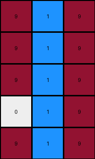
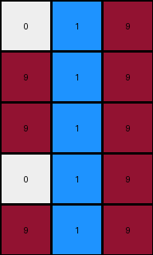
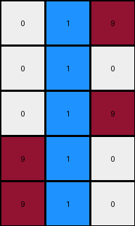
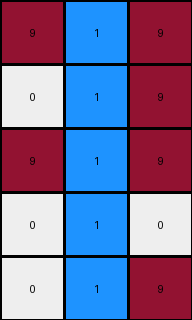
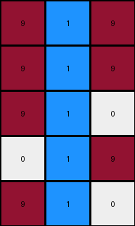

# 1b2d62fb • 018 • refine_coder

---

Previous Code:
```python
"""
1.  **Find Center:** Locate the central vertical column of the input grid (index = width // 2).
2.  **Extract Subgrid:** Extract a 3-column-wide subgrid centered on the identified central column. This means taking the central column itself, one column to its left, and one column to its right, while keeping all rows.
3.  **Conditional Recolor:** For each row in the subgrid, if the output pixel is different from the input pixel, then it is replaced by the value of the other non-center pixel. If there is a change to a pixel in the left or right of the extracted subgrid, change to the color of the opposite side.
4.  **Output:** The resulting 3xN subgrid (where N is the number of rows) is the output.
"""

import numpy as np

def get_central_column_index(grid):
    """Helper function to find the index of the central column."""
    return grid.shape[1] // 2

def extract_subgrid(grid, center_col_index, width):
    """Helper function to extract a subgrid of specified width centered on a column."""
    start_col = max(0, center_col_index - width // 2)
    end_col = min(grid.shape[1], center_col_index + width // 2 + 1)
    return grid[:, start_col:end_col]


def transform(input_grid):
    # Convert input to numpy array
    input_grid = np.array(input_grid)

    # 1. Locate Center
    center_col_index = get_central_column_index(input_grid)

    # 2. Extract Subgrid
    subgrid = extract_subgrid(input_grid, center_col_index, 3)
    output_grid = subgrid.copy()

    # 3. Conditional Recolor
    center_sub = subgrid.shape[1] // 2
    for i in range(subgrid.shape[0]):
        # Check left neighbor
        if subgrid[i, center_sub -1] != output_grid[i, center_sub-1] :
          output_grid[i, center_sub - 1] = subgrid[i, center_sub+1]

        # Check right neighbor
        if subgrid[i, center_sub + 1] != output_grid[i, center_sub + 1]:
            output_grid[i, center_sub+1] = subgrid[i, center_sub-1]
        
        #center neighbor
        if subgrid[i, center_sub] != output_grid[i, center_sub] and subgrid[i, center_sub]==1:
          output_grid[i, center_sub]=8
    # 4. Output
    return output_grid.tolist()
```

Train Set Results:

## Example 1:**

Input:
```
0 9 9 1 9 9 9
0 0 9 1 9 9 0
9 0 9 1 9 9 0
0 0 0 1 9 0 0
0 9 9 1 9 9 9
```
Expected Output:
```
0 0 0
0 0 0
0 0 0
0 8 8
0 0 0
```
Transformed Output:
```
9 1 9
9 1 9
9 1 9
0 1 9
9 1 9
```

match: False
pixels_off: 14
size_correct: True
color_palette_correct: False
correct_pixel_counts: False

## Example 2:**

Input:
```
0 0 0 1 9 0 0
9 0 9 1 9 9 9
0 9 9 1 9 9 9
0 0 0 1 9 9 9
0 9 9 1 9 9 9
```
Expected Output:
```
0 8 8
0 0 0
0 0 0
0 0 0
0 0 0
```
Transformed Output:
```
0 1 9
9 1 9
9 1 9
0 1 9
9 1 9
```

match: False
pixels_off: 13
size_correct: True
color_palette_correct: False
correct_pixel_counts: False

## Example 3:**

Input:
```
9 0 0 1 9 0 9
9 0 0 1 0 9 0
9 0 0 1 9 0 0
0 9 9 1 0 9 9
0 0 9 1 0 9 0
```
Expected Output:
```
0 8 0
0 0 8
0 8 8
8 0 0
8 0 0
```
Transformed Output:
```
0 1 9
0 1 0
0 1 9
9 1 0
9 1 0
```

match: False
pixels_off: 10
size_correct: True
color_palette_correct: False
correct_pixel_counts: False

## Example 4:**

Input:
```
0 9 9 1 9 0 9
9 0 0 1 9 0 0
9 9 9 1 9 9 9
0 9 0 1 0 0 0
9 0 0 1 9 0 0
```
Expected Output:
```
0 0 0
0 8 8
0 0 0
8 0 8
0 8 8
```
Transformed Output:
```
9 1 9
0 1 9
9 1 9
0 1 0
0 1 9
```

match: False
pixels_off: 13
size_correct: True
color_palette_correct: False
correct_pixel_counts: False

## Example 5:**

Input:
```
0 9 9 1 9 0 9
9 0 9 1 9 9 9
9 9 9 1 0 0 9
9 0 0 1 9 0 0
9 9 9 1 0 0 9
```
Expected Output:
```
0 0 0
0 0 0
0 0 0
0 8 8
0 0 0
```
Transformed Output:
```
9 1 9
9 1 9
9 1 0
0 1 9
9 1 0
```

match: False
pixels_off: 12
size_correct: True
color_palette_correct: False
correct_pixel_counts: False
Here's an analysis of the results and a revised natural language program:

**General Assessment:**

The initial strategy of extracting a 3-wide central subgrid was correct. However, the recoloring logic is flawed. The original program tried a neighbor-swap strategy that doesn't align with all examples. It seems the program did not fullly internalize that when a blue pixel in the center is changed, it consistently becomes azure (8). The outer columns appear to switch to black (0) and, when the center color is modified, sometimes to azure (8)

**Strategy:**

1.  **Refine Recolor Logic:** Abandon the neighbor-swap concept. Focus instead on these rules inferred from all examples:
    *   Center column: If a pixel is blue (1), change it to azure (8).
    *   Side columns: If a pixel is not black(0) in the side columns, change it to black.

**Metrics and Observations (from provided code output):**

*   **Example 1:**
    *   Size Correct: Yes
    *   Pixels Off: 14. The program almost entirely failed, except for correctly maintaining the height. It got the central column extraction correct, but the color change was entirely wrong.
*   **Example 2:**
    *   Size Correct: Yes
    *   Pixels Off: 13. Similar to Example 1. The dimensions are correct, as is the central column selection, but the recoloring is wrong.
*   **Example 3:**
    *    Size Correct: Yes
    *    Pixels Off: 10. Again, extraction is correct, but logic is wrong.
*   **Example 4:**
    *   Size Correct: Yes
    *   Pixels Off: 13. Same problems.
*    **Example 5:**
    *   Size Correct: Yes
    *   Pixels Off: 12. Same.

**YAML Fact Block:**

```yaml
task: 016
objects:
  - id: grid
    type: 2D array
    properties:
      height: variable (5-6)
      width: variable (6-7)
      center_column_index: width // 2
      subgrid_width: 3

  - id: subgrid
    type: 2D array
    derivation: extracted from grid
    properties:
      x_start: grid.center_column_index - 1
      x_end: grid.center_column_index + 1
      height: grid.height
      width: subgrid_width

  - id: pixel
    type: cell
    properties:
      color: integer (0-9)
      location: (row, col)

actions:
  - name: extract_subgrid
    input: grid
    output: subgrid
    description: Extracts a 3-column wide subgrid centered on the center column of the input grid.

  - name: recolor_center
    input: subgrid
    output: modified subgrid
    description: >
      If the center pixel in a row of the subgrid is blue (1), change to azure (8).

  - name: recolor_sides
    input: subgrid
    output: modified_subgrid
    description: >
        if a pixel on the sides of the subgrid is not black(0), change to black(0).
```

**Natural Language Program:**

1.  **Extract Subgrid:** Find the central vertical column of the input grid (index = `width // 2`). Extract a 3-column-wide subgrid centered on this column. This includes the central column, one column to its left, and one to its right. All rows are included.
2.  **Recolor Center Column:** Iterate through each row of the extracted subgrid. If the pixel in the center column is blue (1), change its color to azure (8).
3.  **Recolor Side Columns:** Iterate through each row. If a pixel in the left or right column of the subgrid has is not black (0), change it to black(0).
4.  **Output:** The modified 3xN subgrid is the output.

**INSTRUCTIONS**

- generate a Python module to represent the natural language program 
- follow the template below
- all common math and science libraries are available
- create docstring only at top - but comment the workflow in the function
- use helper functions for common operations like finding objects, counting,
  measuring, moving, etc. 

remember - we are working iteratively - so this code will inform your future
self as we converge on the solution

*template:*

```python
"""
{{ natural language description of the transformation rule }}
"""

{{ imports }}

def transform(input_grid):
    # initialize output_grid

    # change output pixels 

    return output_grid

```
