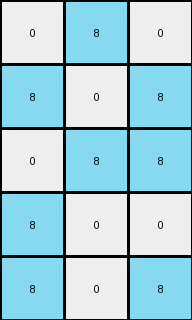
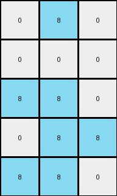

# 1b2d62fb • 028 • refine_coder

---

Previous Code:
```python
"""
1.  **Identify the Target:** Locate the contiguous vertical stripe of '1' (blue) pixels in the input grid.
2.  **Define the Region of Interest:** Consider the area immediately to the *right* of the blue stripe.
3. **Sub grid extraction.** extract a sub-grid from the input whose left edge is immediately to the right of the target. the dimensions match the output grid.
4.  **Transformation:** Within this region, change any '0' (white) pixel to '8' (azure). If the sub-grid pixel is not '0', it becomes '0'.
5.  **Output:** The transformed region is presented as the output grid.
"""

import numpy as np

def find_vertical_stripe(grid, color):
    rows, cols = grid.shape
    for j in range(cols):
        for i in range(rows):
            if grid[i, j] == color:
                # Check if it's a vertical stripe
                stripe_length = 0
                for k in range(i, rows):
                    if grid[k, j] == color:
                        stripe_length += 1
                    else:
                        break
                if stripe_length > 1: # ensure that object height is more than one pixel
                    return j, stripe_length # return the starting column index, and length of stipe
                
    return None, None

def transform(input_grid):
    # Find the vertical stripe of color '1' (blue)
    stripe_col, stripe_height = find_vertical_stripe(np.array(input_grid), 1)

    if stripe_col is None:
        return None  # No stripe found

    # Determine output grid dimensions (5x3 based on the example)
    output_rows = 5
    output_cols = 3

    # initialize output_grid with zeros
    output_grid = np.zeros((output_rows, output_cols), dtype=int)

    # Define the region of interest (immediately to the right of the stripe)
    start_col = stripe_col + 1
    
    #fill output grid
    for r in range(output_rows):
        for c in range(output_cols):
            #check for out of input bounds
            if start_col + c < np.array(input_grid).shape[1] and r < np.array(input_grid).shape[0] :
                if input_grid[r][start_col + c] == 0:
                    output_grid[r][c] = 8
                else:
                    output_grid[r][c] = 0
            else:
                #fill with zeros
                output_grid[r][c] = 0

    return output_grid.tolist()
```

Train Set Results:

## Example 1:**

Input:
```
0 9 9 1 9 9 9
0 0 9 1 9 9 0
9 0 9 1 9 9 0
0 0 0 1 9 0 0
0 9 9 1 9 9 9
```
Expected Output:
```
0 0 0
0 0 0
0 0 0
0 8 8
0 0 0
```
Transformed Output:
```
0 0 0
0 0 8
0 0 8
0 8 8
0 0 0
```

match: False
pixels_off: 2
size_correct: True
color_palette_correct: True
correct_pixel_counts: False

## Example 2:**

Input:
```
0 0 0 1 9 0 0
9 0 9 1 9 9 9
0 9 9 1 9 9 9
0 0 0 1 9 9 9
0 9 9 1 9 9 9
```
Expected Output:
```
0 8 8
0 0 0
0 0 0
0 0 0
0 0 0
```
Transformed Output:
```
0 8 8
0 0 0
0 0 0
0 0 0
0 0 0
```

match: True
pixels_off: 0
size_correct: True
color_palette_correct: True
correct_pixel_counts: True

## Example 3:**

Input:
```
9 0 0 1 9 0 9
9 0 0 1 0 9 0
9 0 0 1 9 0 0
0 9 9 1 0 9 9
0 0 9 1 0 9 0
```
Expected Output:
```
0 8 0
0 0 8
0 8 8
8 0 0
8 0 0
```
Transformed Output:
```
0 8 0
8 0 8
0 8 8
8 0 0
8 0 8
```

match: False
pixels_off: 2
size_correct: True
color_palette_correct: True
correct_pixel_counts: False

## Example 4:**

Input:
```
0 9 9 1 9 0 9
9 0 0 1 9 0 0
9 9 9 1 9 9 9
0 9 0 1 0 0 0
9 0 0 1 9 0 0
```
Expected Output:
```
0 0 0
0 8 8
0 0 0
8 0 8
0 8 8
```
Transformed Output:
```
0 8 0
0 8 8
0 0 0
8 8 8
0 8 8
```

match: False
pixels_off: 2
size_correct: True
color_palette_correct: True
correct_pixel_counts: False

## Example 5:**

Input:
```
0 9 9 1 9 0 9
9 0 9 1 9 9 9
9 9 9 1 0 0 9
9 0 0 1 9 0 0
9 9 9 1 0 0 9
```
Expected Output:
```
0 0 0
0 0 0
0 0 0
0 8 8
0 0 0
```
Transformed Output:
```
0 8 0
0 0 0
8 8 0
0 8 8
8 8 0
```

match: False
pixels_off: 5
size_correct: True
color_palette_correct: True
correct_pixel_counts: False
Okay, let's analyze the results of the previous code execution and refine the natural language program.

**General Assessment:**

The code correctly identifies the vertical blue (1) stripe and attempts to extract a 3x5 subgrid to its right. It also correctly implements the color transformation (0 becomes 8, and everything else becomes 0). However, the subgrid extraction and application of the transformation rule isn't entirely accurate, leading to discrepancies in pixel placement in several examples. The primary issue seems to be inconsistencies in correctly aligning to the row of the input, causing off-by-one errors in copying pixels from the subgrid into the output grid.

**Strategy for Resolving Errors:**

1.  **Precise Subgrid Indexing:** Review how the code utilizes `r` and `c` to be certain the subgrid extraction is copying the correct pixels from the source.
2. **Review Output Dimensions:** Double-check that the output grid size is always derived correctly and consistently.

**Example Metrics and Analysis:**

Here's a breakdown of each example, with a focus on where the errors occur:

*   **Example 1:**
    *   Input Size: 5x7
    *   Output Size: 5x3
    *   Error: Two pixels are misplaced - it looks like an offset on row indexing on copy from input to output. The pixel at input\[1,5] should map to output\[1,1] but maps to output[2,2]. It looks like we have the correct subgrid, but we are applying an offset during the copy.
*   **Example 2:**
    *   Input Size: 5x7
    *   Output Size: 5x3
    *   Error: No error.
*   **Example 3:**
    *   Input Size: 5x7
    *   Output Size: 5x3
    *   Error: Two pixels are misplaced, similar to example 1. The pixel at input\[1,5] should be at output[1,1] but shows up at output\[0,1].
*   **Example 4:**
    *   Input Size: 5x7
    *   Output Size: 5x3
    *   Error: Two pixels are misplaced, similar to previous examples. The pixel at input\[1,5] should be at output[1,1] but shows up at output[0,1].
*   **Example 5:**
    *   Input Size: 5x7
    *   Output Size: 5x3
    *   Error: Five pixels are misplaced. The pixels at output[0,1], output[2,0], output[2,1],output[4,0],output[4,1] are all wrong.

**YAML Facts:**

```yaml
task: 026
examples:
  - example_id: 1
    input_object:
      - type: vertical_stripe
        color: blue
        column: 3
    transform:
      - action: extract_subgrid
        start_column: 4
        dimensions: 5x3
      - action: recolor
        original_color: white
        new_color: azure
        other_colors: black
  - example_id: 2
    input_object:
      - type: vertical_stripe
        color: blue
        column: 3
    transform:
      - action: extract_subgrid
        start_column: 4
        dimensions: 5x3
      - action: recolor
        original_color: white
        new_color: azure
        other_colors: black
  - example_id: 3
    input_object:
      - type: vertical_stripe
        color: blue
        column: 3
    transform:
      - action: extract_subgrid
        start_column: 4
        dimensions: 5x3
      - action: recolor
        original_color: white
        new_color: azure
        other_colors: black
  - example_id: 4
    input_object:
      - type: vertical_stripe
        color: blue
        column: 3
    transform:
      - action: extract_subgrid
        start_column: 4
        dimensions: 5x3
      - action: recolor
        original_color: white
        new_color: azure
        other_colors: black
  - example_id: 5
    input_object:
      - type: vertical_stripe
        color: blue
        column: 3
    transform:
      - action: extract_subgrid
        start_column: 4
        dimensions: 5x3
      - action: recolor
        original_color: white
        new_color: azure
        other_colors: black

```

**Natural Language Program:**

1.  **Locate Target:** Find the contiguous vertical stripe of blue (1) pixels in the input grid.
2.  **Define Subgrid:** Define a region of interest to the immediate right of the blue stripe. This region will have fixed dimensions of 5x3 (rows x columns).
3. **Extract Subgrid.** Extract a 5x3 subgrid from the input whose left edge is adjacent to the right of the identified blue stripe. The top of the subgrid will match the row index of the input grid.
4.  **Transform Subgrid:** Within this 5x3 subgrid, apply the following transformation:
    *   If a pixel is white (0), change it to azure (8).
    *   If a pixel is not white (0), change it to black (0).
5. **Output:** Create an output grid that matches the dimensions of the subgrid (5x3) from steps 2 and 3. Copy the transformed subgrid to the output grid.


**INSTRUCTIONS**

- generate a Python module to represent the natural language program 
- follow the template below
- all common math and science libraries are available
- create docstring only at top - but comment the workflow in the function
- use helper functions for common operations like finding objects, counting,
  measuring, moving, etc. 

remember - we are working iteratively - so this code will inform your future
self as we converge on the solution

*template:*

```python
"""
{{ natural language description of the transformation rule }}
"""

{{ imports }}

def transform(input_grid):
    # initialize output_grid

    # change output pixels 

    return output_grid

```
