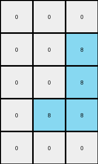
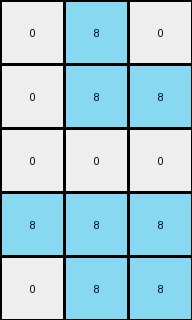
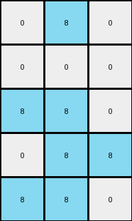

# 1b2d62fb • 029 • refine_dreamer

---


Previous Code:
```python
"""
1.  **Locate Target:** Find the contiguous vertical stripe of blue (1) pixels in the input grid.
2.  **Define Subgrid:** Define a region of interest to the immediate right of the blue stripe. This region will have fixed dimensions of 5x3 (rows x columns).
3. **Extract Subgrid.** Extract a 5x3 subgrid from the input whose left edge is adjacent to the right of the identified blue stripe. The top of the subgrid will match the row index of the input grid.
4.  **Transform Subgrid:** Within this 5x3 subgrid, apply the following transformation:
    *   If a pixel is white (0), change it to azure (8).
    *   If a pixel is not white (0), change it to black (0).
5. **Output:** Create an output grid that matches the dimensions of the subgrid (5x3) from steps 2 and 3. Copy the transformed subgrid to the output grid.
"""

import numpy as np

def find_vertical_stripe(grid, color):
    rows, cols = grid.shape
    for j in range(cols):
        for i in range(rows):
            if grid[i, j] == color:
                # Check if it's a vertical stripe
                stripe_length = 0
                for k in range(i, rows):
                    if grid[k, j] == color:
                        stripe_length += 1
                    else:
                        break
                if stripe_length > 1: # ensure that object height is more than one pixel
                    return j, i, stripe_length # return the starting column index, row index and length of stipe
                
    return None, None, None

def transform(input_grid):
    # Find the vertical stripe of color '1' (blue)
    stripe_col, stripe_row, stripe_height = find_vertical_stripe(np.array(input_grid), 1)

    if stripe_col is None:
        return None  # No stripe found

    # Determine output grid dimensions (5x3 based on the example)
    output_rows = 5
    output_cols = 3

    # initialize output_grid with zeros
    output_grid = np.zeros((output_rows, output_cols), dtype=int)

    # Define the region of interest (immediately to the right of the stripe)
    start_col = stripe_col + 1
    
    #fill output grid
    for r in range(output_rows):
        for c in range(output_cols):
            #check for out of input bounds
            if start_col + c < np.array(input_grid).shape[1] and stripe_row + r < np.array(input_grid).shape[0] :
                if input_grid[stripe_row + r][start_col + c] == 0:
                    output_grid[r][c] = 8
                else:
                    output_grid[r][c] = 0
            else:
                #fill with zeros
                output_grid[r][c] = 0

    return output_grid.tolist()
```

Train Set Results:

## Example 1:**

Input:
```
0 9 9 1 9 9 9
0 0 9 1 9 9 0
9 0 9 1 9 9 0
0 0 0 1 9 0 0
0 9 9 1 9 9 9
```
Expected Output:
```
0 0 0
0 0 0
0 0 0
0 8 8
0 0 0
```
Transformed Output:
```
0 0 0
0 0 8
0 0 8
0 8 8
0 0 0
```

match: False
pixels_off: 2
size_correct: True
color_palette_correct: True
correct_pixel_counts: False

## Example 2:**

Input:
```
0 0 0 1 9 0 0
9 0 9 1 9 9 9
0 9 9 1 9 9 9
0 0 0 1 9 9 9
0 9 9 1 9 9 9
```
Expected Output:
```
0 8 8
0 0 0
0 0 0
0 0 0
0 0 0
```
Transformed Output:
```
0 8 8
0 0 0
0 0 0
0 0 0
0 0 0
```

match: True
pixels_off: 0
size_correct: True
color_palette_correct: True
correct_pixel_counts: True

## Example 3:**

Input:
```
9 0 0 1 9 0 9
9 0 0 1 0 9 0
9 0 0 1 9 0 0
0 9 9 1 0 9 9
0 0 9 1 0 9 0
```
Expected Output:
```
0 8 0
0 0 8
0 8 8
8 0 0
8 0 0
```
Transformed Output:
```
0 8 0
8 0 8
0 8 8
8 0 0
8 0 8
```

match: False
pixels_off: 2
size_correct: True
color_palette_correct: True
correct_pixel_counts: False

## Example 4:**

Input:
```
0 9 9 1 9 0 9
9 0 0 1 9 0 0
9 9 9 1 9 9 9
0 9 0 1 0 0 0
9 0 0 1 9 0 0
```
Expected Output:
```
0 0 0
0 8 8
0 0 0
8 0 8
0 8 8
```
Transformed Output:
```
0 8 0
0 8 8
0 0 0
8 8 8
0 8 8
```

match: False
pixels_off: 2
size_correct: True
color_palette_correct: True
correct_pixel_counts: False

## Example 5:**

Input:
```
0 9 9 1 9 0 9
9 0 9 1 9 9 9
9 9 9 1 0 0 9
9 0 0 1 9 0 0
9 9 9 1 0 0 9
```
Expected Output:
```
0 0 0
0 0 0
0 0 0
0 8 8
0 0 0
```
Transformed Output:
```
0 8 0
0 0 0
8 8 0
0 8 8
8 8 0
```

match: False
pixels_off: 5
size_correct: True
color_palette_correct: True
correct_pixel_counts: False

**INSTRUCTIONS**

The code above was generated based on observations from the first training
example

we have tested the transform function on each of the task example inputs and
compared with the expected output

review each of the examples provided and the results and consider how the
natural language program should be updated to accommodate this new knowledge

respond with the following deliverables:

- general assessment of the information provided and strategy for resolving the
  errors
- gather metrics about each of the examples and results - use code_execution to
  develop accurate reports on your assumptions
- a YAML block documenting facts - Focus on identifying objects, their properties, and the actions performed on them.
- a natural language program - Be as clear and concise as possible, providing a complete description of the transformation rule.


your responses should be considered as information in a report - not a
conversation
