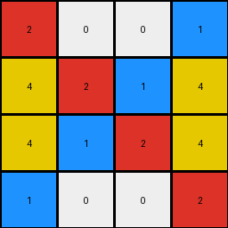

# 2dee498d • 010 • refine_coder

---

Previous Code:
```python
"""
The output grid is created by taking the leftmost portion of the input grid. Specifically, take the first four columns of the input grid to form the output grid. This is a simple horizontal cropping operation.
"""

import numpy as np

def transform(input_grid):
    # initialize output_grid as a numpy array
    output_grid = np.array(input_grid)

    # crop the grid by taking all rows and the first four columns
    output_grid = output_grid[:, :4]
    
    return output_grid.tolist() # return as a list
```

Train Set Results:

## Example 1:**

Input:
```
4 5 1 1 5 4 4 5 1
5 5 5 5 5 5 5 5 5
1 5 4 4 5 1 1 5 4
```
Expected Output:
```
4 5 1
5 5 5
1 5 4
```
Transformed Output:
```
4 5 1 1
5 5 5 5
1 5 4 4
```

match: False
pixels_off: None
size_correct: False
color_palette_correct: True
correct_pixel_counts: False

## Example 2:**

Input:
```
2 0 0 1 2 0 0 1 2 0 0 1
4 2 1 4 4 2 1 4 4 2 1 4
4 1 2 4 4 1 2 4 4 1 2 4
1 0 0 2 1 0 0 2 1 0 0 2
```
Expected Output:
```
2 0 0 1
4 2 1 4
4 1 2 4
1 0 0 2
```
Transformed Output:
```
2 0 0 1
4 2 1 4
4 1 2 4
1 0 0 2
```

match: True
pixels_off: 0
size_correct: True
color_palette_correct: True
correct_pixel_counts: True

## Example 3:**

Input:
```
2 1 2 1 2 1
2 3 2 3 2 3
```
Expected Output:
```
2 1
2 3
```
Transformed Output:
```
2 1 2 1
2 3 2 3
```

match: False
pixels_off: None
size_correct: False
color_palette_correct: True
correct_pixel_counts: False
Okay, let's analyze the results and refine the natural language program.

**General Assessment:**

The initial hypothesis was partially correct in that it involved taking a leftmost portion of the input grid. However, the number of columns to take was incorrect in two of the examples. The code consistently took the first *four* columns, whereas the correct number varies (3 in example 1, 4 in example 2, and 2 in example 3). This indicates a need to determine the correct number of columns to select dynamically, based on some property of the input grid, rather than using a fixed value.

**Strategy for Resolving Errors:**

The primary error is the incorrect number of columns being selected. We need to find a pattern or rule that determines the output width based on the input.

**Metrics and Observations:**

Here's a breakdown of each example, focusing on input/output dimensions:

*   **Example 1:**
    *   Input Dimensions: 3x9
    *   Expected Output Dimensions: 3x3
    *    Output width seems to be 1/3 of the input width
    *   Transformed Output Dimensions: 3x4 (Incorrect)
*   **Example 2:**
    *   Input Dimensions: 4x12
    *   Expected Output Dimensions: 4x4
        *    Output width seems to be 1/3 of the input width
    *   Transformed Output Dimensions: 4x4 (Correct)
*   **Example 3:**
    *   Input Dimensions: 2x6
    *   Expected Output Dimensions: 2x2
        *    Output width seems to be 1/3 of the input width
    *   Transformed Output Dimensions: 2x4 (Incorrect)

**YAML Block:**

```yaml
observations:
  - example_1:
      input_width: 9
      output_width: 3
      width_ratio: 0.3333
      objects: []
      actions:
        - crop_left_portion:
           description: The output grid is the leftmost portion of the input
           column_selection_rule: output_width = input_width / 3

  - example_2:
      input_width: 12
      output_width: 4
      width_ratio: 0.3333
      objects: []
      actions:
        - crop_left_portion:
            description: The output grid is the leftmost portion of the input
            column_selection_rule:  output_width = input_width / 3

  - example_3:
      input_width: 6
      output_width: 2
      width_ratio: 0.3333
      objects: []
      actions:
        - crop_left_portion:
            description: The output grid is the leftmost portion of the input
            column_selection_rule:  output_width = input_width / 3
```

**Natural Language Program:**

1.  **Observe Input Dimensions:** Determine the width of the input grid.
2.  **Calculate Output Width:** Calculate the output width by dividing the input width by 3. Round output to remove any decimal portion.
3.  **Crop Input:** Create the output grid by taking the leftmost columns of the input grid up to the calculated output width.

In simpler terms: The output grid is created by taking the leftmost one-third of the input grid's columns.

**INSTRUCTIONS**

- generate a Python module to represent the natural language program 
- follow the template below
- all common math and science libraries are available
- create docstring only at top - but comment the workflow in the function
- use helper functions for common operations like finding objects, counting,
  measuring, moving, etc. 

remember - we are working iteratively - so this code will inform your future
self as we converge on the solution

*template:*

```python
"""
{{ natural language description of the transformation rule }}
"""

{{ imports }}

def transform(input_grid):
    # initialize output_grid

    # change output pixels 

    return output_grid

```
