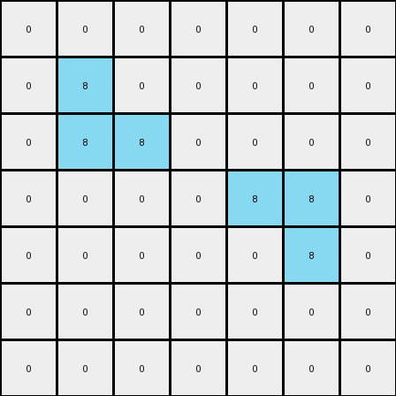

# 3aa6fb7a • 011 • refine_dreamer

---


Previous Code:
```python
"""
Identifies contiguous regions of azure (8) pixels in the input grid. 
Within each azure region, it changes the color of internal azure pixels 
(those that are part of a 2x2 block of azure pixels) to blue (1). 
All other pixels remain unchanged.
"""

import numpy as np

def get_neighbors(grid, row, col):
    """Gets the valid cardinal neighbors of a cell."""
    rows, cols = grid.shape
    neighbors = []
    if row > 0:
        neighbors.append((row - 1, col))  # Up
    if row < rows - 1:
        neighbors.append((row + 1, col))  # Down
    if col > 0:
        neighbors.append((row, col - 1))  # Left
    if col < cols - 1:
        neighbors.append((row, col + 1))  # Right
    return neighbors

def is_part_of_2x2_azure(grid, row, col):
    """Checks if an azure pixel is part of a 2x2 azure block."""
    if grid[row, col] != 8:
        return False

    neighbors = get_neighbors(grid, row, col)
    # Check if any three neighbors combine with it into 2x2
    for r1, c1 in neighbors:
      if grid[r1,c1] == 8:
        # check for shared neighbor
        neighbors2 = get_neighbors(grid, r1, c1)
        for r2, c2 in neighbors2:
          if (r2,c2) != (row, col) and grid[r2,c2] == 8:
            # found 3, look for 4th
            neighbors3 = get_neighbors(grid, r2,c2)
            for r3,c3 in neighbors3:
                if (r3,c3) != (r1,c1) and grid[r3,c3] == 8:
                    # found a 2x2!
                    return True
    return False

def transform(input_grid):
    """Transforms the input grid according to the described rule."""
    output_grid = np.copy(input_grid)  # Initialize output_grid as a copy of input_grid

    rows, cols = input_grid.shape

    # Iterate through each cell in the grid
    for row in range(rows):
        for col in range(cols):
            # Check if the cell is part of a 2x2 azure block
            if is_part_of_2x2_azure(input_grid, row, col):
                # Change the color to blue (1)
                output_grid[row, col] = 1

    return output_grid
```

Train Set Results:

## Example 1:**

Input:
```
0 0 0 0 0 0 0
0 8 0 0 0 0 0
0 8 8 0 0 0 0
0 0 0 0 8 8 0
0 0 0 0 0 8 0
0 0 0 0 0 0 0
0 0 0 0 0 0 0
```
Expected Output:
```
0 0 0 0 0 0 0
0 8 1 0 0 0 0
0 8 8 0 0 0 0
0 0 0 0 8 8 0
0 0 0 0 1 8 0
0 0 0 0 0 0 0
0 0 0 0 0 0 0
```
Transformed Output:
```
0 0 0 0 0 0 0
0 8 0 0 0 0 0
0 8 8 0 0 0 0
0 0 0 0 8 8 0
0 0 0 0 0 8 0
0 0 0 0 0 0 0
0 0 0 0 0 0 0
```

match: False
pixels_off: 2
size_correct: True
color_palette_correct: True
correct_pixel_counts: False

## Example 2:**

Input:
```
0 0 0 0 8 8 0
0 0 0 0 0 8 0
0 0 8 0 0 0 0
0 0 8 8 0 0 0
0 0 0 0 0 0 0
0 0 0 0 8 0 0
0 0 0 8 8 0 0
```
Expected Output:
```
0 0 0 0 8 8 0
0 0 0 0 1 8 0
0 0 8 1 0 0 0
0 0 8 8 0 0 0
0 0 0 0 0 0 0
0 0 0 1 8 0 0
0 0 0 8 8 0 0
```
Transformed Output:
```
0 0 0 0 8 8 0
0 0 0 0 0 8 0
0 0 8 0 0 0 0
0 0 8 8 0 0 0
0 0 0 0 0 0 0
0 0 0 0 8 0 0
0 0 0 8 8 0 0
```

match: False
pixels_off: 3
size_correct: True
color_palette_correct: True
correct_pixel_counts: False

**INSTRUCTIONS**

The code above was generated based on observations from the first training
example

we have tested the transform function on each of the task example inputs and
compared with the expected output

review each of the examples provided and the results and consider how the
natural language program should be updated to accommodate this new knowledge

respond with the following deliverables:

- general assessment of the information provided and strategy for resolving the
  errors
- gather metrics about each of the examples and results - use code_execution to
  develop accurate reports on your assumptions
- a YAML block documenting facts - Focus on identifying objects, their properties, and the actions performed on them.
- a natural language program - Be as clear and concise as possible, providing a complete description of the transformation rule.


your responses should be considered as information in a report - not a
conversation
