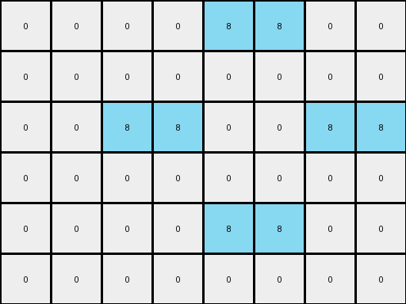

# 3af2c5a8 • 003 • refine_dreamer

---


Previous Code:
```python
"""
The transformation rule is as follows:

1. **Expand the Grid:** Double the dimensions of the input grid. The number of rows in the output grid is twice the number of rows in the input grid. The number of columns in the output grid is twice the number of columns in the input grid.

2. **Replicate and shift the azure pixels:** For each azure (8) pixel in the input, create a copy and a new cell to the right.

3. Fill with 0: all other locations are now filled with a 0.
"""

import numpy as np

def transform(input_grid):
    # initialize output_grid
    input_rows, input_cols = input_grid.shape
    output_rows = input_rows * 2
    output_cols = input_cols * 2
    output_grid = np.zeros((output_rows, output_cols), dtype=int)

    # change output pixels 
    for row in range(input_rows):
        for col in range(input_cols):
            if input_grid[row, col] == 8:
                output_grid[row * 2, col * 2] = 8
                output_grid[row*2, col*2 + 1] = 8
    
    return output_grid
```

Train Set Results:

## Example 1:**

Input:
```
0 0 8 0
0 8 0 8
0 0 8 0
```
Expected Output:
```
0 0 8 0 0 8 0 0
0 8 0 8 8 0 8 0
0 0 8 0 0 8 0 0
0 0 8 0 0 8 0 0
0 8 0 8 8 0 8 0
0 0 8 0 0 8 0 0
```
Transformed Output:
```
0 0 0 0 8 8 0 0
0 0 0 0 0 0 0 0
0 0 8 8 0 0 8 8
0 0 0 0 0 0 0 0
0 0 0 0 8 8 0 0
0 0 0 0 0 0 0 0
```

match: False
pixels_off: 18
size_correct: True
color_palette_correct: True
correct_pixel_counts: False

## Example 2:**

Input:
```
0 0 3 3
0 3 0 3
3 3 3 0
```
Expected Output:
```
0 0 3 3 3 3 0 0
0 3 0 3 3 0 3 0
3 3 3 0 0 3 3 3
3 3 3 0 0 3 3 3
0 3 0 3 3 0 3 0
0 0 3 3 3 3 0 0
```
Transformed Output:
```
0 0 0 0 0 0 0 0
0 0 0 0 0 0 0 0
0 0 0 0 0 0 0 0
0 0 0 0 0 0 0 0
0 0 0 0 0 0 0 0
0 0 0 0 0 0 0 0
```

match: False
pixels_off: 28
size_correct: True
color_palette_correct: True
correct_pixel_counts: False

## Example 3:**

Input:
```
3 3 3 3
3 0 0 0
3 0 0 0
```
Expected Output:
```
3 3 3 3 3 3 3 3
3 0 0 0 0 0 0 3
3 0 0 0 0 0 0 3
3 0 0 0 0 0 0 3
3 0 0 0 0 0 0 3
3 3 3 3 3 3 3 3
```
Transformed Output:
```
0 0 0 0 0 0 0 0
0 0 0 0 0 0 0 0
0 0 0 0 0 0 0 0
0 0 0 0 0 0 0 0
0 0 0 0 0 0 0 0
0 0 0 0 0 0 0 0
```

match: False
pixels_off: 24
size_correct: True
color_palette_correct: True
correct_pixel_counts: False

**INSTRUCTIONS**

The code above was generated based on observations from the first training
example

we have tested the transform function on each of the task example inputs and
compared with the expected output

review each of the examples provided and the results and consider how the
natural language program should be updated to accommodate this new knowledge

respond with the following deliverables:

- general assessment of the information provided and strategy for resolving the
  errors
- gather metrics about each of the examples and results - use code_execution to
  develop accurate reports on your assumptions
- a YAML block documenting facts - Focus on identifying objects, their properties, and the actions performed on them.
- a natural language program - Be as clear and concise as possible, providing a complete description of the transformation rule.


your responses should be considered as information in a report - not a
conversation
